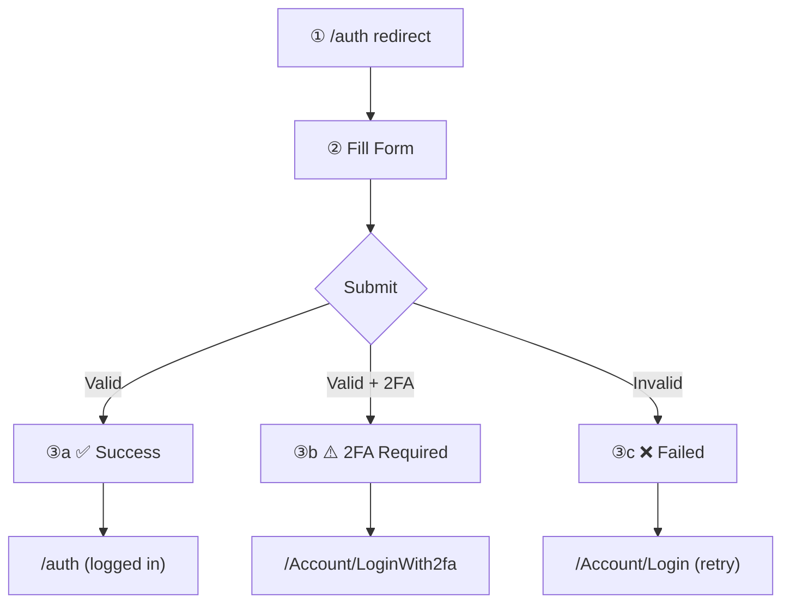

# 107 — CTO Brief: Comic Strip Storyboard Variations

> **Document ID:** 107  
> **Category:** CTO Brief  
> **Purpose:** 5 variations on Option 8 (Comic Strip) expanded for site-wide navigation potential  
> **Date:** 2025-12-31  
> **Related Docs:** `106_cto-brief_screenshot-gallery-v2.md` (Option 8 selected)  
> **Resolution:** ⏳ Awaiting CTO decision

---

## CTO Selection

From 106 review:
- **Selected:** Option 8 — Comic Strip / Storyboard
- **Why:** Clean separation of visuals and narrative, numbered badges, expandable to site navigation
- **Request:** Expand on this concept with 5 variations

---

## Vision: Beyond Auth Flows

The comic strip format can scale beyond just auth flows to become a **visual site map** where users can:
- See every page at a glance
- Understand user journeys through the app
- Click screenshots to navigate to that section
- Track flows across multiple pages

---

## 5 Storyboard Variations

---

### Variation 8A: Classic Comic Strip (Current)

The base Option 8 design. Good for single flows like auth.

```
┌─────────────────────────────────────────────────────────────────────────┐
│ VARIATION 8A: CLASSIC COMIC STRIP                                       │
├─────────────────────────────────────────────────────────────────────────┤
│                                                                         │
│  ### 🔐 `/auth` — Login Flow                                            │
│                                                                         │
│  ┌──────────────────────────────────────────────────────────────────┐  │
│  │                                                                   │  │
│  │   ①                      ②                      ③                │  │
│  │  ┌─────────┐            ┌─────────┐            ┌─────────┐       │  │
│  │  │         │            │ ▓▓▓▓▓▓▓ │            │  ⚠️     │       │  │
│  │  │  Login  │  ───────►  │ ▓▓▓▓▓▓▓ │  ───────►  │ Error!  │       │  │
│  │  │  Form   │            │ ▓▓▓▓▓▓▓ │            │         │       │  │
│  │  └─────────┘            └─────────┘            └─────────┘       │  │
│  │                                                                   │  │
│  │  ─────────────────────────────────────────────────────────────── │  │
│  │  ① Redirected to /Account/Login                                  │  │
│  │  ② Entered credentials: admin@test.com                           │  │
│  │  ③ Login failed: Invalid credentials                             │  │
│  └──────────────────────────────────────────────────────────────────┘  │
│                                                                         │
│  ✅ Simple, focused on single flow                                      │
│  ✅ Legend provides context                                             │
│  ⚠️ Doesn't scale to multiple flows                                    │
│                                                                         │
└─────────────────────────────────────────────────────────────────────────┘

MARKDOWN:

#### 🔐 `/auth` — Login Flow

| ① | → | ② | → | ③ |
|:---:|:---:|:---:|:---:|:---:|
|  | |  | |  |

| Step | What Happened |
|:----:|---------------|
| ① | Redirected to `/Account/Login` |
| ② | Entered credentials: `admin@test.com` |
| ③ | Login failed: Invalid credentials |
```

---

### Variation 8B: Storyboard with Scene Headers

Each step gets a "scene" header like a movie storyboard. Better for complex flows.

```
┌─────────────────────────────────────────────────────────────────────────┐
│ VARIATION 8B: STORYBOARD WITH SCENE HEADERS                             │
├─────────────────────────────────────────────────────────────────────────┤
│                                                                         │
│  ### 🔐 `/auth` — Login Flow                                            │
│                                                                         │
│  ┌─────────────────────┐ ┌─────────────────────┐ ┌─────────────────────┐│
│  │ SCENE 1: REDIRECT   │ │ SCENE 2: INPUT      │ │ SCENE 3: RESULT     ││
│  │ ┌─────────────────┐ │ │ ┌─────────────────┐ │ │ ┌─────────────────┐ ││
│  │ │                 │ │ │ │    ▓▓▓▓▓▓▓      │ │ │ │      ⚠️        │ ││
│  │ │    [image]      │─┼─┼─│    ▓▓▓▓▓▓▓      │─┼─┼─│    Error!      │ ││
│  │ │                 │ │ │ │    ▓▓▓▓▓▓▓      │ │ │ │                │ ││
│  │ └─────────────────┘ │ │ └─────────────────┘ │ │ └─────────────────┘ ││
│  │                     │ │                     │ │                     ││
│  │ User hits /auth     │ │ Fills login form    │ │ Submission fails    ││
│  │ Gets redirected     │ │ admin@test.com      │ │ Invalid creds       ││
│  └─────────────────────┘ └─────────────────────┘ └─────────────────────┘│
│                                                                         │
│  ✅ Scene headers add professional polish                               │
│  ✅ Self-contained panels with full context                             │
│  ✅ Each panel tells its own story                                      │
│  ⚠️ Takes more horizontal space                                        │
│                                                                         │
└─────────────────────────────────────────────────────────────────────────┘

MARKDOWN:

#### 🔐 `/auth` — Login Flow

<table>
<tr>
<th>Scene 1: Redirect</th>
<th></th>
<th>Scene 2: Input</th>
<th></th>
<th>Scene 3: Result</th>
</tr>
<tr>
<td align="center">
<br/>
<em>User hits /auth</em><br/>
<em>Gets redirected</em>
</td>
<td>→</td>
<td align="center">
<br/>
<em>Fills login form</em><br/>
<code>admin@test.com</code>
</td>
<td>→</td>
<td align="center">
<br/>
<em>Submission fails</em><br/>
<strong>❌ Invalid creds</strong>
</td>
</tr>
</table>
```

---

### Variation 8C: Journey Map (Multi-Flow Navigation)

Shows how different user journeys connect. Each flow is a "chapter" that can link to others.

```
┌─────────────────────────────────────────────────────────────────────────┐
│ VARIATION 8C: JOURNEY MAP (EXPANDABLE CHAPTERS)                         │
├─────────────────────────────────────────────────────────────────────────┤
│                                                                         │
│  ## 🗺️ User Journey Map                                                 │
│                                                                         │
│  ┌──────────────────────────────────────────────────────────────────┐  │
│  │ CHAPTER 1: Anonymous User                                         │  │
│  │ ──────────────────────────────────────────────────────────────── │  │
│  │                                                                   │  │
│  │  [/] ──► [/counter] ──► [/weather]                               │  │
│  │   │                                                               │  │
│  │   └──► [/auth] ──► CHAPTER 2                                     │  │
│  │                                                                   │  │
│  └──────────────────────────────────────────────────────────────────┘  │
│                              │                                          │
│                              ▼                                          │
│  ┌──────────────────────────────────────────────────────────────────┐  │
│  │ CHAPTER 2: Login Flow                                             │  │
│  │ ──────────────────────────────────────────────────────────────── │  │
│  │                                                                   │  │
│  │   ①              ②              ③                                │  │
│  │  [Login] ─────► [Fill] ─────► [Result]                           │  │
│  │                                   │                               │  │
│  │                    ┌──────────────┴──────────────┐               │  │
│  │                    ▼                              ▼               │  │
│  │               ✅ Success                     ❌ Failure           │  │
│  │               CHAPTER 3                      Stay here            │  │
│  │                                                                   │  │
│  └──────────────────────────────────────────────────────────────────┘  │
│                              │                                          │
│                              ▼                                          │
│  ┌──────────────────────────────────────────────────────────────────┐  │
│  │ CHAPTER 3: Authenticated User                                     │  │
│  │ ──────────────────────────────────────────────────────────────── │  │
│  │                                                                   │  │
│  │  [/auth] ──► [/Account/Manage] ──► [/Account/Manage/Email]       │  │
│  │                      │                                            │  │
│  │                      └──► [/Account/Manage/Password]              │  │
│  │                                                                   │  │
│  └──────────────────────────────────────────────────────────────────┘  │
│                                                                         │
│  ✅ Shows entire site navigation structure                              │
│  ✅ Chapters group related flows                                        │
│  ✅ Branching shows success/failure paths                               │
│  ✅ Click any screenshot to jump to that section                        │
│  ⚠️ More complex to implement                                          │
│                                                                         │
└─────────────────────────────────────────────────────────────────────────┘

MARKDOWN:

## 🗺️ User Journey Map

### Chapter 1: Anonymous User

| Home | → | Counter | → | Weather |
|:----:|:-:|:-------:|:-:|:-------:|
| <a href="#home"></a> | | <a href="#counter"></a> | | <a href="#weather"></a> |

↓ *User clicks protected route*

### Chapter 2: Login Flow (🔐 /auth)

| ① Login | → | ② Fill | → | ③ Result |
|:-------:|:-:|:------:|:-:|:--------:|
|  | |  | |  |

| Outcome | Next |
|---------|------|
| ✅ Success | → Chapter 3 |
| ❌ Failure | → Stay here |

### Chapter 3: Authenticated User

| Profile | → | Email | → | Password |
|:-------:|:-:|:-----:|:-:|:--------:|
| <a href="#manage"></a> | | <a href="#email"></a> | | <a href="#password"></a> |
```

---

### Variation 8D: Interactive Storyboard Grid

All pages displayed in a grid with flow arrows overlaid. Click any cell to see details.

```
┌─────────────────────────────────────────────────────────────────────────┐
│ VARIATION 8D: INTERACTIVE STORYBOARD GRID                               │
├─────────────────────────────────────────────────────────────────────────┤
│                                                                         │
│  ## 📸 Site Storyboard                                                  │
│                                                                         │
│  ### Public Pages                                                       │
│  ┌─────────┬─────────┬─────────┬─────────┬─────────┐                   │
│  │    /    │/counter │/weather │ /login  │/register│                   │
│  │  [img]  │  [img]  │  [img]  │  [img]  │  [img]  │                   │
│  │   ①    │   ②    │   ③    │   ④    │   ⑤    │                   │
│  └────┬────┴────┬────┴─────────┴────┬────┴────┬────┘                   │
│       │         │                   │         │                         │
│       └─────────┴───────┬───────────┴─────────┘                         │
│                         │                                               │
│                         ▼                                               │
│  ### Auth Flow                                                          │
│  ┌─────────────────────────────────────────────────┐                   │
│  │  ⑥ /auth                                        │                   │
│  │  ┌───────┐ ──► ┌───────┐ ──► ┌───────┐         │                   │
│  │  │  6a   │     │  6b   │     │  6c   │         │                   │
│  │  └───────┘     └───────┘     └───────┘         │                   │
│  └─────────────────────────────────────────────────┘                   │
│                         │                                               │
│                         ▼                                               │
│  ### Authenticated Pages                                                │
│  ┌─────────┬─────────┬─────────┬─────────┬─────────┐                   │
│  │/Manage  │ /Email  │/Password│/Passkeys│ /2FA    │                   │
│  │  [img]  │  [img]  │  [img]  │  [img]  │  [img]  │                   │
│  │   ⑦    │   ⑧    │   ⑨    │   ⑩    │   ⑪    │                   │
│  └─────────┴─────────┴─────────┴─────────┴─────────┘                   │
│                                                                         │
│  ─────────────────────────────────────────────────────────────────     │
│                                                                         │
│  LEGEND:                                                                │
│  ① Home page - Hello, world!                                           │
│  ② Counter - Interactive counter demo                                  │
│  ③ Weather - Weather forecast data                                     │
│  ...                                                                    │
│  ⑥ Auth flow: (a) redirect → (b) fill → (c) result                    │
│                                                                         │
│  ✅ Complete site overview in one view                                  │
│  ✅ Flow arrows show navigation paths                                   │
│  ✅ Numbered legend for all pages                                       │
│  ✅ Auth flow shown as sub-sequence                                     │
│  ⚠️ Complex for large sites (50+ pages)                                │
│                                                                         │
└─────────────────────────────────────────────────────────────────────────┘

MARKDOWN:

## 📸 Site Storyboard

### 🔓 Public Pages

| ① | ② | ③ | ④ | ⑤ |
|:---:|:---:|:---:|:---:|:---:|
|  |  |  |  |  |
| `/` | `/counter` | `/weather` | `/login` | `/register` |

⬇️ *Protected route accessed*

### 🔐 Auth Flow: `/auth`

| ⑥a | → | ⑥b | → | ⑥c |
|:---:|:---:|:---:|:---:|:---:|
|  | |  | |  |
| *Redirect* | | *Fill form* | | *Result* |

⬇️ *Login successful*

### 🔒 Authenticated Pages

| ⑦ | ⑧ | ⑨ | ⑩ | ⑪ |
|:---:|:---:|:---:|:---:|:---:|
|  |  |  |  |  |
| `/Manage` | `/Email` | `/Password` | `/Passkeys` | `/2FA` |

---

### Legend

| # | Page | Description |
|:-:|------|-------------|
| ① | `/` | Home page - Hello, world! |
| ② | `/counter` | Interactive counter demo |
| ③ | `/weather` | Weather forecast data |
| ④ | `/login` | User login form |
| ⑤ | `/register` | New user registration |
| ⑥ | `/auth` | Protected page (triggers login flow) |
| ⑦ | `/Manage` | Account management dashboard |
| ... | ... | ... |
```

---

### Variation 8E: Filmstrip with Expandable Panels

Compact filmstrip by default, click to expand any "frame" for details.

```
┌─────────────────────────────────────────────────────────────────────────┐
│ VARIATION 8E: FILMSTRIP WITH EXPANDABLE PANELS                          │
├─────────────────────────────────────────────────────────────────────────┤
│                                                                         │
│  ## 📸 Screenshot Gallery                                               │
│                                                                         │
│  ### 🔐 `/auth` — Login Flow                                            │
│                                                                         │
│  COLLAPSED VIEW (default):                                              │
│  ┌─────────────────────────────────────────────────────────────────┐   │
│  │  ┌─────┐    ┌─────┐    ┌─────┐                                  │   │
│  │  │  ①  │ ─► │  ②  │ ─► │  ③  │    Click any frame to expand    │   │
│  │  └─────┘    └─────┘    └─────┘                                  │   │
│  └─────────────────────────────────────────────────────────────────┘   │
│                                                                         │
│  EXPANDED VIEW (after clicking ②):                                     │
│  ┌─────────────────────────────────────────────────────────────────┐   │
│  │  ┌─────┐    ┌─────────────────────────────┐    ┌─────┐          │   │
│  │  │  ①  │    │  ②  CREDENTIALS ENTERED     │    │  ③  │          │   │
│  │  └─────┘    │  ┌─────────────────────┐    │    └─────┘          │   │
│  │      │      │  │                     │    │         │           │   │
│  │      │      │  │                     │    │         │           │   │
│  │      └─────►│  │    [LARGE IMAGE]    │    │◄────────┘           │   │
│  │             │  │                     │    │                     │   │
│  │             │  │                     │    │                     │   │
│  │             │  └─────────────────────┘    │                     │   │
│  │             │                             │                     │   │
│  │             │  Email: admin@test.com      │                     │   │
│  │             │  Password: ••••••••         │                     │   │
│  │             │  [Prev] [Next] [Close]      │                     │   │
│  │             └─────────────────────────────┘                     │   │
│  └─────────────────────────────────────────────────────────────────┘   │
│                                                                         │
│  ✅ Compact by default                                                  │
│  ✅ Full detail on demand                                               │
│  ✅ Navigate between frames easily                                      │
│  ✅ Works with GitHub's <details> tag                                   │
│  ⚠️ Requires multiple clicks to see all details                        │
│                                                                         │
└─────────────────────────────────────────────────────────────────────────┘

MARKDOWN:

#### 🔐 `/auth` — Login Flow

| ① | → | ② | → | ③ |
|:---:|:---:|:---:|:---:|:---:|
|  | |  | |  |

<details>
<summary>🔍 <strong>① Redirect to Login</strong></summary>

| | |
|:---:|:---|
|  | **What happened:**<br/>User navigated to `/auth`<br/>Server returned 302 redirect<br/>Landed on `/Account/Login` |

</details>

<details>
<summary>🔍 <strong>② Credentials Entered</strong></summary>

| | |
|:---:|:---|
|  | **What happened:**<br/>Email: `admin@test.com`<br/>Password: `••••••••`<br/>Ready to submit |

</details>

<details>
<summary>🔍 <strong>③ Login Result</strong></summary>

| | |
|:---:|:---|
|  | **What happened:**<br/>❌ Login failed<br/>Error: Invalid credentials<br/>User remains on login page |

</details>
```

---

### Variation 8F: Branching Storyboard (Choose Your Adventure)

Shows different outcomes branching from decision points. Perfect for login success/failure paths.

```
┌─────────────────────────────────────────────────────────────────────────┐
│ VARIATION 8F: BRANCHING STORYBOARD                                      │
├─────────────────────────────────────────────────────────────────────────┤
│                                                                         │
│  ### 🔐 `/auth` — Login Flow                                            │
│                                                                         │
│                        ┌─────────┐                                      │
│                        │    ①    │                                      │
│                        │ /auth   │                                      │
│                        │redirect │                                      │
│                        └────┬────┘                                      │
│                             │                                           │
│                             ▼                                           │
│                        ┌─────────┐                                      │
│                        │    ②    │                                      │
│                        │  Fill   │                                      │
│                        │  Form   │                                      │
│                        └────┬────┘                                      │
│                             │                                           │
│                             ▼                                           │
│                        ┌─────────┐                                      │
│                        │ Submit  │                                      │
│                        └────┬────┘                                      │
│                             │                                           │
│              ┌──────────────┼──────────────┐                            │
│              │              │              │                            │
│              ▼              ▼              ▼                            │
│        ┌─────────┐    ┌─────────┐    ┌─────────┐                       │
│        │   ③a   │    │   ③b   │    │   ③c   │                       │
│        │   ✅    │    │   ⚠️    │    │   ❌    │                       │
│        │Success! │    │  2FA    │    │ Failed  │                       │
│        └────┬────┘    └────┬────┘    └────┬────┘                       │
│             │              │              │                             │
│             ▼              ▼              ▼                             │
│        ┌─────────┐    ┌─────────┐    ┌─────────┐                       │
│        │ /auth   │    │ /2fa    │    │ /login  │                       │
│        │(logged) │    │ verify  │    │ (retry) │                       │
│        └─────────┘    └─────────┘    └─────────┘                       │
│                                                                         │
│  ─────────────────────────────────────────────────────────────────     │
│                                                                         │
│  LEGEND:                                                                │
│  ① User accesses protected /auth route                                 │
│  ② Fills login form with credentials                                   │
│  ③a Valid credentials → logged in, sees protected content              │
│  ③b Valid + 2FA enabled → redirect to 2FA verification                 │
│  ③c Invalid credentials → error message, stays on login                │
│                                                                         │
│  ✅ Shows all possible outcomes                                         │
│  ✅ Decision tree is intuitive                                          │
│  ✅ Great for documenting edge cases                                    │
│  ⚠️ Requires capturing multiple outcome screenshots                    │
│                                                                         │
└─────────────────────────────────────────────────────────────────────────┘

MARKDOWN:

#### 🔐 `/auth` — Login Flow



| Outcome | Screenshot | Description |
|:-------:|:----------:|-------------|
| ✅ Success |  | User sees protected content |
| ⚠️ 2FA |  | Redirected to 2FA verification |
| ❌ Failed |  | Error: Invalid credentials |
```

---

## Side-by-Side Comparison

```
┌─────────────────────────────────────────────────────────────────────────┐
│                        QUICK COMPARISON                                 │
├─────────────────────────────────────────────────────────────────────────┤
│                                                                         │
│  8A: CLASSIC COMIC STRIP                                                │
│  ┌─────┐ → ┌─────┐ → ┌─────┐                                           │
│  │ ①  │   │ ②  │   │ ③  │     Simple row + legend                    │
│  └─────┘   └─────┘   └─────┘                                           │
│  ─────────────────────────────────────────────────────────────────     │
│                                                                         │
│  8B: SCENE HEADERS                                                      │
│  ┌─────────────┐ ┌─────────────┐ ┌─────────────┐                       │
│  │ SCENE 1     │ │ SCENE 2     │ │ SCENE 3     │  Headers + captions   │
│  │ [img]       │ │ [img]       │ │ [img]       │                       │
│  │ description │ │ description │ │ description │                       │
│  └─────────────┘ └─────────────┘ └─────────────┘                       │
│  ─────────────────────────────────────────────────────────────────     │
│                                                                         │
│  8C: JOURNEY MAP                                                        │
│  ┌──────────────────┐                                                   │
│  │ CHAPTER 1: Anon  │───► ┌──────────────────┐                         │
│  │ [pages]          │     │ CHAPTER 2: Auth  │───► CHAPTER 3           │
│  └──────────────────┘     └──────────────────┘     Multi-flow chapters │
│  ─────────────────────────────────────────────────────────────────     │
│                                                                         │
│  8D: STORYBOARD GRID                                                    │
│  ┌─────┬─────┬─────┐                                                   │
│  │ ① │ ② │ ③ │     All pages in grid                               │
│  ├─────┼─────┼─────┤     with flow arrows                              │
│  │ ④ │ ⑤ │ ⑥ │                                                       │
│  └─────┴─────┴─────┘                                                   │
│  ─────────────────────────────────────────────────────────────────     │
│                                                                         │
│  8E: EXPANDABLE FILMSTRIP                                               │
│  [①][②][③] ◄─ Click to expand ─►                                     │
│  ┌─────────────────────────────┐                                       │
│  │ ② EXPANDED                  │  Compact default,                     │
│  │ [large image]               │  expand on click                      │
│  │ detailed description        │                                       │
│  └─────────────────────────────┘                                       │
│  ─────────────────────────────────────────────────────────────────     │
│                                                                         │
│  8F: BRANCHING STORYBOARD                                               │
│              [①]                                                        │
│               │                                                         │
│              [②]                  Decision tree showing                │
│               │                   all possible outcomes                 │
│        ┌──────┼──────┐                                                  │
│       [✅]   [⚠️]   [❌]                                                │
│                                                                         │
└─────────────────────────────────────────────────────────────────────────┘
```

---

## Ratings

| Variation | Navigation | Clarity | Compact | Scalable | GitHub MD | Rating |
|-----------|:----------:|:-------:|:-------:|:--------:|:---------:|:------:|
| 8A. Classic | ⚠️ | ✅ | ✅ | ⚠️ | ✅ | ⭐⭐⭐⭐ |
| **8B. Scene Headers** | ⚠️ | ✅✅ | ✅ | ✅ | ✅ | ⭐⭐⭐⭐⭐ |
| **8C. Journey Map** | ✅✅ | ✅ | ⚠️ | ✅✅ | ✅ | ⭐⭐⭐⭐⭐ |
| **8D. Storyboard Grid** | ✅✅ | ✅ | ✅ | ✅ | ✅ | ⭐⭐⭐⭐⭐ |
| 8E. Expandable | ✅ | ✅ | ✅✅ | ✅ | ✅ | ⭐⭐⭐⭐ |
| 8F. Branching | ✅ | ✅✅ | ⚠️ | ✅ | ⚠️ | ⭐⭐⭐⭐ |

---

## Top Recommendations

### 🥇 8D: Storyboard Grid

**Best for:** Complete site overview with navigation potential.

**Why:**
- All pages visible in one view
- Flow arrows show relationships
- Numbered legend for reference
- Auth flow shown as sub-sequence
- Click any screenshot to navigate (future)

---

### 🥈 8C: Journey Map

**Best for:** Complex sites with distinct user journeys.

**Why:**
- Chapters group related flows
- Shows progression through site
- Clear anonymous → auth → logged-in flow
- Links between chapters

---

### 🥉 8B: Scene Headers

**Best for:** Detailed auth flow documentation.

**Why:**
- Most professional polish
- Self-contained panels
- Each step tells complete story
- Easy to read and understand

---

## Implementation Phases

| Phase | What | Effort |
|-------|------|--------|
| **Phase 1** | 8A Classic (current) | 2 hours |
| **Phase 2** | 8B Scene Headers | +1 hour |
| **Phase 3** | 8D Storyboard Grid | +3 hours |
| **Phase 4** | 8C Journey Map | +4 hours |
| **Future** | Clickable navigation | TBD |

---

## Decision Points

### 1. Which variation to implement first?

| Choice | Best For |
|--------|----------|
| **8A Classic** | Quick win, simple auth flows |
| **8B Scene Headers** | Polished documentation |
| **8D Storyboard Grid** | Site-wide overview |

### 2. Implement navigation links?

Making screenshots clickable to jump to sections adds:
- Anchor links in markdown
- Table of contents integration
- Future: actual page navigation

**Recommendation:** Yes, add anchor links for Phase 2.

### 3. Support for branching (8F)?

Requires:
- Capturing multiple outcome screenshots
- Mermaid diagrams for flow visualization
- More complex test scenarios

**Recommendation:** Defer to Phase 4. Valuable but complex.

---

## Next Steps

| Action | Owner | Priority |
|--------|-------|----------|
| CTO picks variation (8A-8F) | [CTO] | P1 |
| Implement Phase 1 | [Backend] | P1 |
| Add anchor links | [Backend] | P2 |
| Test with BlazorApp1 | [Quality] | P1 |

---

*Created: 2025-12-31*  
*Previous: `106_cto-brief_screenshot-gallery-v2.md`*
