# 📊 FreeTools Workspace Report

> **Generated:** 2025-12-31 11:19:33  
> **Repository:** BlazorApp1  
> **Scope:** Blazor pages only — API endpoints not included  

---

## 📑 Table of Contents

- [About This Report](#-about-this-report)
- [Workspace Overview](#-workspace-overview)
- [File Statistics](#-file-statistics)
- [Code Distribution](#-code-distribution)
- [Largest Files](#-largest-files)
- [Large File Warnings](#%EF%B8%8F-large-file-warnings)
- [Blazor Page Routes](#%EF%B8%8F-blazor-page-routes)
- [Route Map](#-route-map)
- [Screenshot Health](#-screenshot-health)
- [Screenshot Gallery](#-screenshot-gallery)

---

## 📋 About This Report

This report is auto-generated by the **WorkspaceReporter** tool pipeline.

### Scope

| Included | Not Included |
|----------|--------------|
| ✅ Blazor pages (`@page` directives) | ❌ API endpoints (`/api/*`) |
| ✅ Razor components | ❌ Dynamic routes (MapGet/MapPost) |
| ✅ C# source files | ❌ Routes with parameters (`{id}`) |
| ✅ Configuration files | |

### File Categories (Kind)

| Kind | Description |
|------|-------------|
| **RazorPage** | `.razor` file with `@page` directive (routable) |
| **RazorComponent** | `.razor` file without `@page` (reusable component) |
| **CSharpSource** | `.cs` file (classes, services, etc.) |
| **ProjectFile** | `.csproj` file (project configuration) |
| **SolutionFile** | `.sln` file (solution configuration) |
| **Config** | `.json`, `.xml`, `.yaml`, `.yml`, `.config` files |
| **Markdown** | `.md` documentation files |

---

## 📁 Workspace Overview

| Metric | Value |
|--------|-------|
| **Total Files** | 70 |
| **Total Lines** | 4,648 |
| **Total Characters** | 173,458 |
| **Total Size** | 169.6 KB |
| **Avg Lines/File** | 66.4 |
| **Avg Size/File** | 2.4 KB |

## 📈 File Statistics

### By Category

| Category | Count | Avg Lines | Total Lines | Percentage |
|----------|------:|----------:|------------:|------------|
| RazorPage | 37 | 78 | 2,872 | [██████████░░░░░░░░░░] 52.9% |
| RazorComponent | 15 | 27 | 410 | [████░░░░░░░░░░░░░░░░] 21.4% |
| CSharpSource | 12 | 107 | 1,289 | [███░░░░░░░░░░░░░░░░░] 17.1% |
| Config | 5 | 12 | 59 | [█░░░░░░░░░░░░░░░░░░░] 7.1% |
| ProjectFile | 1 | 18 | 18 | [█░░░░░░░░░░░░░░░░░░░░] 1.4% |

### Files by Category

<details>
<summary><strong>RazorPage</strong> (37 files)</summary>

| File | Lines | Size |
|------|------:|-----:|
| [Components/Account/Pages/AccessDenied.razor](../../../../../../BlazorApp1/Components/Account/Pages/AccessDenied.razor) | 8 | 218 bytes |
| [Components/Account/Pages/ConfirmEmail.razor](../../../../../../BlazorApp1/Components/Account/Pages/ConfirmEmail.razor) | 49 | 1.4 KB |
| [Components/Account/Pages/ConfirmEmailChange.razor](../../../../../../BlazorApp1/Components/Account/Pages/ConfirmEmailChange.razor) | 69 | 2.0 KB |
| [Components/Account/Pages/ExternalLogin.razor](../../../../../../BlazorApp1/Components/Account/Pages/ExternalLogin.razor) | 217 | 7.8 KB |
| [Components/Account/Pages/ForgotPassword.razor](../../../../../../BlazorApp1/Components/Account/Pages/ForgotPassword.razor) | 74 | 2.8 KB |
| [Components/Account/Pages/ForgotPasswordConfirmation.razor](../../../../../../BlazorApp1/Components/Account/Pages/ForgotPasswordConfirmation.razor) | 8 | 221 bytes |
| [Components/Account/Pages/InvalidPasswordReset.razor](../../../../../../BlazorApp1/Components/Account/Pages/InvalidPasswordReset.razor) | 8 | 191 bytes |
| [Components/Account/Pages/InvalidUser.razor](../../../../../../BlazorApp1/Components/Account/Pages/InvalidUser.razor) | 7 | 118 bytes |
| [Components/Account/Pages/Lockout.razor](../../../../../../BlazorApp1/Components/Account/Pages/Lockout.razor) | 8 | 237 bytes |
| [Components/Account/Pages/Login.razor](../../../../../../BlazorApp1/Components/Account/Pages/Login.razor) | 164 | 6.1 KB |
| [Components/Account/Pages/LoginWith2fa.razor](../../../../../../BlazorApp1/Components/Account/Pages/LoginWith2fa.razor) | 103 | 4.0 KB |
| [Components/Account/Pages/LoginWithRecoveryCode.razor](../../../../../../BlazorApp1/Components/Account/Pages/LoginWithRecoveryCode.razor) | 87 | 3.1 KB |
| [Components/Account/Pages/Manage/ChangePassword.razor](../../../../../../BlazorApp1/Components/Account/Pages/Manage/ChangePassword.razor) | 109 | 4.5 KB |
| [Components/Account/Pages/Manage/DeletePersonalData.razor](../../../../../../BlazorApp1/Components/Account/Pages/Manage/DeletePersonalData.razor) | 97 | 3.1 KB |
| [Components/Account/Pages/Manage/Disable2fa.razor](../../../../../../BlazorApp1/Components/Account/Pages/Manage/Disable2fa.razor) | 74 | 2.4 KB |
| [Components/Account/Pages/Manage/Email.razor](../../../../../../BlazorApp1/Components/Account/Pages/Manage/Email.razor) | 143 | 5.4 KB |
| [Components/Account/Pages/Manage/EnableAuthenticator.razor](../../../../../../BlazorApp1/Components/Account/Pages/Manage/EnableAuthenticator.razor) | 184 | 7.1 KB |
| [Components/Account/Pages/Manage/ExternalLogins.razor](../../../../../../BlazorApp1/Components/Account/Pages/Manage/ExternalLogins.razor) | 162 | 5.7 KB |
| [Components/Account/Pages/Manage/GenerateRecoveryCodes.razor](../../../../../../BlazorApp1/Components/Account/Pages/Manage/GenerateRecoveryCodes.razor) | 78 | 2.7 KB |
| [Components/Account/Pages/Manage/Index.razor](../../../../../../BlazorApp1/Components/Account/Pages/Manage/Index.razor) | 91 | 3.1 KB |
| [Components/Account/Pages/Manage/Passkeys.razor](../../../../../../BlazorApp1/Components/Account/Pages/Manage/Passkeys.razor) | 182 | 6.2 KB |
| [Components/Account/Pages/Manage/PersonalData.razor](../../../../../../BlazorApp1/Components/Account/Pages/Manage/PersonalData.razor) | 42 | 1.3 KB |
| [Components/Account/Pages/Manage/RenamePasskey.razor](../../../../../../BlazorApp1/Components/Account/Pages/Manage/RenamePasskey.razor) | 95 | 3.0 KB |
| [Components/Account/Pages/Manage/ResetAuthenticator.razor](../../../../../../BlazorApp1/Components/Account/Pages/Manage/ResetAuthenticator.razor) | 57 | 2.0 KB |
| [Components/Account/Pages/Manage/SetPassword.razor](../../../../../../BlazorApp1/Components/Account/Pages/Manage/SetPassword.razor) | 99 | 3.8 KB |
| [...onents/Account/Pages/Manage/TwoFactorAuthentication.razor](../../../../../../BlazorApp1/Components/Account/Pages/Manage/TwoFactorAuthentication.razor) | 106 | 3.9 KB |
| [Components/Account/Pages/Register.razor](../../../../../../BlazorApp1/Components/Account/Pages/Register.razor) | 152 | 6.0 KB |
| [Components/Account/Pages/RegisterConfirmation.razor](../../../../../../BlazorApp1/Components/Account/Pages/RegisterConfirmation.razor) | 69 | 2.4 KB |
| [Components/Account/Pages/ResendEmailConfirmation.razor](../../../../../../BlazorApp1/Components/Account/Pages/ResendEmailConfirmation.razor) | 73 | 2.6 KB |
| [Components/Account/Pages/ResetPassword.razor](../../../../../../BlazorApp1/Components/Account/Pages/ResetPassword.razor) | 108 | 4.2 KB |
| [Components/Account/Pages/ResetPasswordConfirmation.razor](../../../../../../BlazorApp1/Components/Account/Pages/ResetPasswordConfirmation.razor) | 7 | 255 bytes |
| [Components/Pages/Auth.razor](../../../../../../BlazorApp1/Components/Pages/Auth.razor) | 13 | 232 bytes |
| [Components/Pages/Counter.razor](../../../../../../BlazorApp1/Components/Pages/Counter.razor) | 18 | 332 bytes |
| [Components/Pages/Error.razor](../../../../../../BlazorApp1/Components/Pages/Error.razor) | 36 | 1.2 KB |
| [Components/Pages/Home.razor](../../../../../../BlazorApp1/Components/Pages/Home.razor) | 7 | 99 bytes |
| [Components/Pages/NotFound.razor](../../../../../../BlazorApp1/Components/Pages/NotFound.razor) | 5 | 126 bytes |
| [Components/Pages/Weather.razor](../../../../../../BlazorApp1/Components/Pages/Weather.razor) | 63 | 1.8 KB |

</details>

<details>
<summary><strong>RazorComponent</strong> (15 files)</summary>

| File | Lines | Size |
|------|------:|-----:|
| [Components/_Imports.razor](../../../../../../BlazorApp1/Components/_Imports.razor) | 12 | 483 bytes |
| [Components/Account/Pages/_Imports.razor](../../../../../../BlazorApp1/Components/Account/Pages/_Imports.razor) | 2 | 92 bytes |
| [Components/Account/Pages/Manage/_Imports.razor](../../../../../../BlazorApp1/Components/Account/Pages/Manage/_Imports.razor) | 2 | 84 bytes |
| [Components/Account/Shared/ExternalLoginPicker.razor](../../../../../../BlazorApp1/Components/Account/Shared/ExternalLoginPicker.razor) | 43 | 1.4 KB |
| [Components/Account/Shared/ManageLayout.razor](../../../../../../BlazorApp1/Components/Account/Shared/ManageLayout.razor) | 17 | 368 bytes |
| [Components/Account/Shared/ManageNavMenu.razor](../../../../../../BlazorApp1/Components/Account/Shared/ManageNavMenu.razor) | 40 | 1.3 KB |
| [Components/Account/Shared/PasskeySubmit.razor](../../../../../../BlazorApp1/Components/Account/Shared/PasskeySubmit.razor) | 40 | 1.1 KB |
| [Components/Account/Shared/RedirectToLogin.razor](../../../../../../BlazorApp1/Components/Account/Shared/RedirectToLogin.razor) | 8 | 251 bytes |
| [Components/Account/Shared/ShowRecoveryCodes.razor](../../../../../../BlazorApp1/Components/Account/Shared/ShowRecoveryCodes.razor) | 28 | 732 bytes |
| [Components/Account/Shared/StatusMessage.razor](../../../../../../BlazorApp1/Components/Account/Shared/StatusMessage.razor) | 29 | 842 bytes |
| [Components/App.razor](../../../../../../BlazorApp1/Components/App.razor) | 32 | 1.0 KB |
| [Components/Layout/MainLayout.razor](../../../../../../BlazorApp1/Components/Layout/MainLayout.razor) | 23 | 547 bytes |
| [Components/Layout/NavMenu.razor](../../../../../../BlazorApp1/Components/Layout/NavMenu.razor) | 92 | 3.4 KB |
| [Components/Layout/ReconnectModal.razor](../../../../../../BlazorApp1/Components/Layout/ReconnectModal.razor) | 31 | 1.3 KB |
| [Components/Routes.razor](../../../../../../BlazorApp1/Components/Routes.razor) | 11 | 479 bytes |

</details>

<details>
<summary><strong>CSharpSource</strong> (12 files)</summary>

| File | Lines | Size |
|------|------:|-----:|
| [...count/IdentityComponentsEndpointRouteBuilderExtensions.cs](../../../../../../BlazorApp1/Components/Account/IdentityComponentsEndpointRouteBuilderExtensions.cs) | 142 | 7.3 KB |
| [Components/Account/IdentityNoOpEmailSender.cs](../../../../../../BlazorApp1/Components/Account/IdentityNoOpEmailSender.cs) | 21 | 1.2 KB |
| [Components/Account/IdentityRedirectManager.cs](../../../../../../BlazorApp1/Components/Account/IdentityRedirectManager.cs) | 53 | 2.1 KB |
| [...ccount/IdentityRevalidatingAuthenticationStateProvider.cs](../../../../../../BlazorApp1/Components/Account/IdentityRevalidatingAuthenticationStateProvider.cs) | 43 | 2.0 KB |
| [Components/Account/PasskeyInputModel.cs](../../../../../../BlazorApp1/Components/Account/PasskeyInputModel.cs) | 8 | 194 bytes |
| [Components/Account/PasskeyOperation.cs](../../../../../../BlazorApp1/Components/Account/PasskeyOperation.cs) | 8 | 138 bytes |
| [Data/ApplicationDbContext.cs](../../../../../../BlazorApp1/Data/ApplicationDbContext.cs) | 9 | 278 bytes |
| [Data/ApplicationUser.cs](../../../../../../BlazorApp1/Data/ApplicationUser.cs) | 10 | 235 bytes |
| [Data/Migrations/00000000000000_CreateIdentitySchema.cs](../../../../../../BlazorApp1/Data/Migrations/00000000000000_CreateIdentitySchema.cs) | 235 | 11.2 KB |
| [...igrations/00000000000000_CreateIdentitySchema.Designer.cs](../../../../../../BlazorApp1/Data/Migrations/00000000000000_CreateIdentitySchema.Designer.cs) | 346 | 12.4 KB |
| [Data/Migrations/ApplicationDbContextModelSnapshot.cs](../../../../../../BlazorApp1/Data/Migrations/ApplicationDbContextModelSnapshot.cs) | 343 | 12.3 KB |
| [Program.cs](../../../../../../BlazorApp1/Program.cs) | 71 | 2.9 KB |

</details>

<details>
<summary><strong>Config</strong> (5 files)</summary>

| File | Lines | Size |
|------|------:|-----:|
| [appsettings.Development.json](../../../../../../BlazorApp1/appsettings.Development.json) | 8 | 127 bytes |
| [appsettings.json](../../../../../../BlazorApp1/appsettings.json) | 12 | 360 bytes |
| [Properties/launchSettings.json](../../../../../../BlazorApp1/Properties/launchSettings.json) | 23 | 681 bytes |
| [Properties/serviceDependencies.json](../../../../../../BlazorApp1/Properties/serviceDependencies.json) | 8 | 139 bytes |
| [Properties/serviceDependencies.local.json](../../../../../../BlazorApp1/Properties/serviceDependencies.local.json) | 8 | 145 bytes |

</details>

<details>
<summary><strong>ProjectFile</strong> (1 files)</summary>

| File | Lines | Size |
|------|------:|-----:|
| [BlazorApp1.csproj](../../../../../../BlazorApp1/BlazorApp1.csproj) | 18 | 824 bytes |

</details>

## 📊 Code Distribution

### Lines of Code by Category

```
RazorPage            ████████████████████████████████████████ 2,872
CSharpSource         █████████████████ 1,289
RazorComponent       █████ 410
Config               █ 59
ProjectFile          █ 18
```

### By Extension

```
.razor     ██████████████████████████████ 52
.cs        ██████ 12
.json      ██ 5
.csproj    █ 1
```

## 📏 Largest Files

### Top 15 C# Files by Line Count

| # | File | Lines | Size |
|--:|------|------:|-----:|
| 1 | [...00000000000000_CreateIdentitySchema.Designer.cs](../../../../../../BlazorApp1/Data/Migrations/00000000000000_CreateIdentitySchema.Designer.cs) | 346 | 12.4 KB |
| 2 | [...Migrations/ApplicationDbContextModelSnapshot.cs](../../../../../../BlazorApp1/Data/Migrations/ApplicationDbContextModelSnapshot.cs) | 343 | 12.3 KB |
| 3 | [...grations/00000000000000_CreateIdentitySchema.cs](../../../../../../BlazorApp1/Data/Migrations/00000000000000_CreateIdentitySchema.cs) | 235 | 11.2 KB |
| 4 | [...tityComponentsEndpointRouteBuilderExtensions.cs](../../../../../../BlazorApp1/Components/Account/IdentityComponentsEndpointRouteBuilderExtensions.cs) | 142 | 7.3 KB |
| 5 | [Program.cs](../../../../../../BlazorApp1/Program.cs) | 71 | 2.9 KB |
| 6 | [Components/Account/IdentityRedirectManager.cs](../../../../../../BlazorApp1/Components/Account/IdentityRedirectManager.cs) | 53 | 2.1 KB |
| 7 | [...ntityRevalidatingAuthenticationStateProvider.cs](../../../../../../BlazorApp1/Components/Account/IdentityRevalidatingAuthenticationStateProvider.cs) | 43 | 2.0 KB |
| 8 | [Components/Account/IdentityNoOpEmailSender.cs](../../../../../../BlazorApp1/Components/Account/IdentityNoOpEmailSender.cs) | 21 | 1.2 KB |
| 9 | [Data/ApplicationUser.cs](../../../../../../BlazorApp1/Data/ApplicationUser.cs) | 10 | 235 bytes |
| 10 | [Data/ApplicationDbContext.cs](../../../../../../BlazorApp1/Data/ApplicationDbContext.cs) | 9 | 278 bytes |
| 11 | [Components/Account/PasskeyInputModel.cs](../../../../../../BlazorApp1/Components/Account/PasskeyInputModel.cs) | 8 | 194 bytes |
| 12 | [Components/Account/PasskeyOperation.cs](../../../../../../BlazorApp1/Components/Account/PasskeyOperation.cs) | 8 | 138 bytes |

### Top 15 Razor Files by Line Count

| # | File | Lines | Kind |
|--:|------|------:|------|
| 1 | [Components/Account/Pages/ExternalLogin.razor](../../../../../../BlazorApp1/Components/Account/Pages/ExternalLogin.razor) | 217 | RazorPage |
| 2 | [.../Account/Pages/Manage/EnableAuthenticator.razor](../../../../../../BlazorApp1/Components/Account/Pages/Manage/EnableAuthenticator.razor) | 184 | RazorPage |
| 3 | [Components/Account/Pages/Manage/Passkeys.razor](../../../../../../BlazorApp1/Components/Account/Pages/Manage/Passkeys.razor) | 182 | RazorPage |
| 4 | [Components/Account/Pages/Login.razor](../../../../../../BlazorApp1/Components/Account/Pages/Login.razor) | 164 | RazorPage |
| 5 | [...nents/Account/Pages/Manage/ExternalLogins.razor](../../../../../../BlazorApp1/Components/Account/Pages/Manage/ExternalLogins.razor) | 162 | RazorPage |
| 6 | [Components/Account/Pages/Register.razor](../../../../../../BlazorApp1/Components/Account/Pages/Register.razor) | 152 | RazorPage |
| 7 | [Components/Account/Pages/Manage/Email.razor](../../../../../../BlazorApp1/Components/Account/Pages/Manage/Email.razor) | 143 | RazorPage |
| 8 | [...nents/Account/Pages/Manage/ChangePassword.razor](../../../../../../BlazorApp1/Components/Account/Pages/Manage/ChangePassword.razor) | 109 | RazorPage |
| 9 | [Components/Account/Pages/ResetPassword.razor](../../../../../../BlazorApp1/Components/Account/Pages/ResetPassword.razor) | 108 | RazorPage |
| 10 | [...ount/Pages/Manage/TwoFactorAuthentication.razor](../../../../../../BlazorApp1/Components/Account/Pages/Manage/TwoFactorAuthentication.razor) | 106 | RazorPage |
| 11 | [Components/Account/Pages/LoginWith2fa.razor](../../../../../../BlazorApp1/Components/Account/Pages/LoginWith2fa.razor) | 103 | RazorPage |
| 12 | [Components/Account/Pages/Manage/SetPassword.razor](../../../../../../BlazorApp1/Components/Account/Pages/Manage/SetPassword.razor) | 99 | RazorPage |
| 13 | [...s/Account/Pages/Manage/DeletePersonalData.razor](../../../../../../BlazorApp1/Components/Account/Pages/Manage/DeletePersonalData.razor) | 97 | RazorPage |
| 14 | [...onents/Account/Pages/Manage/RenamePasskey.razor](../../../../../../BlazorApp1/Components/Account/Pages/Manage/RenamePasskey.razor) | 95 | RazorPage |
| 15 | [Components/Layout/NavMenu.razor](../../../../../../BlazorApp1/Components/Layout/NavMenu.razor) | 92 | RazorComponent |

## ⚠️ Large File Warnings

> **LLM-Friendly File Size Guide:**
> - ✅ **Ideal:** 0-450 lines (1-3 LLM reads at ~150 lines each)
> - 🟡 **Notice:** 450-600 lines (getting long)
> - 🟠 **Warning:** 600-900 lines (too long)
> - 🔴 **Critical:** >900 lines (should split)

✅ **Excellent!** All files are under 450 lines.

**70 of 70 files (100%)** are within the ideal LLM-friendly range.

## 🛤️ Blazor Page Routes

> **Note:** This section shows Blazor pages with `@page` directives only.
> API endpoints (`/api/*`) are not included. Routes with parameters are skipped.

### Route Summary

| Metric | Count |
|--------|------:|
| **Testable Routes** | 36 |
| **Public Routes** | 35 |
| **Auth Required** | 1 |
| **Skipped (parameters)** | 1 |

### Access Distribution

```
🔓 Public:     [█████████████████████████████░] 97%
🔐 Protected:  [█░░░░░░░░░░░░░░░░░░░░░░░░░░░░░░] 3%
```

### Routes by Area

<details>
<summary><strong>Components</strong> (6 routes)</summary>

| Route | Auth |
|-------|:----:|
| `/` | 🔓 |
| `/auth` | 🔐 |
| `/counter` | 🔓 |
| `/Error` | 🔓 |
| `/not-found` | 🔓 |
| `/weather` | 🔓 |

</details>

<details>
<summary><strong>Identity</strong> (30 routes)</summary>

| Route | Auth |
|-------|:----:|
| `/Account/AccessDenied` | 🔓 |
| `/Account/ConfirmEmail` | 🔓 |
| `/Account/ConfirmEmailChange` | 🔓 |
| `/Account/ExternalLogin` | 🔓 |
| `/Account/ForgotPassword` | 🔓 |
| `/Account/ForgotPasswordConfirmation` | 🔓 |
| `/Account/InvalidPasswordReset` | 🔓 |
| `/Account/InvalidUser` | 🔓 |
| `/Account/Lockout` | 🔓 |
| `/Account/Login` | 🔓 |
| `/Account/LoginWith2fa` | 🔓 |
| `/Account/LoginWithRecoveryCode` | 🔓 |
| `/Account/Manage` | 🔓 |
| `/Account/Manage/ChangePassword` | 🔓 |
| `/Account/Manage/DeletePersonalData` | 🔓 |
| `/Account/Manage/Disable2fa` | 🔓 |
| `/Account/Manage/Email` | 🔓 |
| `/Account/Manage/EnableAuthenticator` | 🔓 |
| `/Account/Manage/ExternalLogins` | 🔓 |
| `/Account/Manage/GenerateRecoveryCodes` | 🔓 |
| `/Account/Manage/Passkeys` | 🔓 |
| `/Account/Manage/PersonalData` | 🔓 |
| `/Account/Manage/ResetAuthenticator` | 🔓 |
| `/Account/Manage/SetPassword` | 🔓 |
| `/Account/Manage/TwoFactorAuthentication` | 🔓 |
| `/Account/Register` | 🔓 |
| `/Account/RegisterConfirmation` | 🔓 |
| `/Account/ResendEmailConfirmation` | 🔓 |
| `/Account/ResetPassword` | 🔓 |
| `/Account/ResetPasswordConfirmation` | 🔓 |

</details>

<details>
<summary><strong>⚠️ Skipped Routes</strong> (1 routes with parameters)</summary>

These routes contain parameters (e.g., `{Id}`) and cannot be tested without valid values:

| Route | Auth |
|-------|:----:|
| `/Account/Manage/RenamePasskey/{Id}` | 🔓 |

</details>

## 🗺️ Route Map

> Visual representation of the route hierarchy. GitHub renders this as an interactive diagram.


```mermaid
graph TD
    ROOT[("/")]
    ROOT --> N1(Account)
    N1 --> N2[AccessDenied]
    N1 --> N3[ConfirmEmail]
    N1 --> N4[ConfirmEmailChange]
    N1 --> N5[ExternalLogin]
    N1 --> N6[ForgotPassword]
    N1 --> N7[ForgotPasswordConfirmation]
    N1 --> N8[InvalidPasswordReset]
    N1 --> N9[InvalidUser]
    N1 --> N10[Lockout]
    N1 --> N11[Login]
    N1 --> N12[LoginWith2fa]
    N1 --> N13[LoginWithRecoveryCode]
    N1 --> N14[Manage]
    N14 --> N15[ChangePassword]
    N14 --> N16[DeletePersonalData]
    N14 --> N17[Disable2fa]
    N14 --> N18[Email]
    N14 --> N19[EnableAuthenticator]
    N14 --> N20[ExternalLogins]
    N14 --> N21[GenerateRecoveryCodes]
    N14 --> N22[Passkeys]
    N14 --> N23[PersonalData]
    N14 --> N24(RenamePasskey)
    N24 --> N25[["{Id}"]]
    N14 --> N26[ResetAuthenticator]
    N14 --> N27[SetPassword]
    N14 --> N28[TwoFactorAuthentication]
    N1 --> N29[Register]
    N1 --> N30[RegisterConfirmation]
    N1 --> N31[ResendEmailConfirmation]
    N1 --> N32[ResetPassword]
    N1 --> N33[ResetPasswordConfirmation]
    ROOT --> N34[🔐 auth]
    ROOT --> N35[counter]
    ROOT --> N36[Error]
    ROOT --> N37[not-found]
    ROOT --> N38[weather]

    classDef authPage fill:#ff6b6b,stroke:#333,stroke-width:2px
    classDef paramRoute fill:#ffd93d,stroke:#333,stroke-width:2px
    class N34 authPage
```

### Route Depth Analysis

| Depth | Count | Routes |
|------:|------:|--------|
| 0 | 1 | `/` |
| 1 | 5 | `/auth`, `/counter`, `/Error` +2 more |
| 2 | 18 | `/Account/AccessDenied`, `/Account/ConfirmEmail`, `/Account/ConfirmEmailChange` +15 more |
| 3 | 12 | `/Account/Manage/ChangePassword`, `/Account/Manage/DeletePersonalData`, `/Account/Manage/Disable2fa` +9 more |
| 4 | 1 | `/Account/Manage/RenamePasskey/{Id}` |

## 📊 Screenshot Health

| Status | Count | Description |
|--------|------:|-------------|
| ✅ Success | 34 | Screenshots > 10KB |
| 🔓 Public | 35 | Single screenshot pages |
| 🔐 Auth Required | 1 | Pages requiring login |
| ✅ Auth Flow OK | 18 | Login flow completed |
| ⚠️ Suspicious | 0 | Screenshots < 10KB (possible blank) |
| 🔄 Retried | 0 | Required retry attempt |
| ❌ HTTP Error | 2 | 4xx/5xx responses |
| 💥 Failed | 0 | Browser/timeout errors |
| 🔴 JS Errors | 36 | Pages with console errors |

<details>
<summary>❌ <strong>HTTP Errors</strong> (2)</summary>

| Route | Status Code |
|-------|------------:|
| `/Account/LoginWith2fa` | 500 |
| `/Account/LoginWithRecoveryCode` | 500 |

</details>

<details>
<summary>🔴 <strong>Pages with JavaScript Errors</strong> (36)</summary>

**`/`** (4 errors)

```
Access to XMLHttpRequest at 'http://localhost:63028/710cf446006747979221431a65af8989/browserLinkSignalR/start?transport=webSockets&clientProtocol=2.1&requestUrl=https%3A%2F%2Flocalhost%3A7161%2F&brows...
Failed to load resource: net::ERR_FAILED
Access to XMLHttpRequest at 'http://localhost:63028/710cf446006747979221431a65af8989/browserLinkSignalR/start?transport=webSockets&clientProtocol=2.1&requestUrl=https%3A%2F%2Flocalhost%3A7161%2F&brows...
Failed to load resource: net::ERR_FAILED
```

**`/Account/AccessDenied`** (4 errors)

```
Access to XMLHttpRequest at 'http://localhost:63028/710cf446006747979221431a65af8989/browserLinkSignalR/start?transport=webSockets&clientProtocol=2.1&requestUrl=https%3A%2F%2Flocalhost%3A7161%2FAccoun...
Failed to load resource: net::ERR_FAILED
Access to XMLHttpRequest at 'http://localhost:63028/710cf446006747979221431a65af8989/browserLinkSignalR/start?transport=webSockets&clientProtocol=2.1&requestUrl=https%3A%2F%2Flocalhost%3A7161%2FAccoun...
Failed to load resource: net::ERR_FAILED
```

**`/Account/ConfirmEmail`** (4 errors)

```
Access to XMLHttpRequest at 'http://localhost:63028/710cf446006747979221431a65af8989/browserLinkSignalR/start?transport=webSockets&clientProtocol=2.1&requestUrl=https%3A%2F%2Flocalhost%3A7161%2F&brows...
Failed to load resource: net::ERR_FAILED
Access to XMLHttpRequest at 'http://localhost:63028/710cf446006747979221431a65af8989/browserLinkSignalR/start?transport=webSockets&clientProtocol=2.1&requestUrl=https%3A%2F%2Flocalhost%3A7161%2F&brows...
Failed to load resource: net::ERR_FAILED
```

**`/Account/ConfirmEmailChange`** (9 errors)

```
Access to XMLHttpRequest at 'http://localhost:63028/710cf446006747979221431a65af8989/browserLinkSignalR/start?transport=webSockets&clientProtocol=2.1&requestUrl=https%3A%2F%2Flocalhost%3A7161%2FAccoun...
Failed to load resource: net::ERR_FAILED
NotSupportedError: Resident credentials or empty 'allowCredentials' lists are not supported at this time.
Access to XMLHttpRequest at 'http://localhost:63028/710cf446006747979221431a65af8989/browserLinkSignalR/start?transport=webSockets&clientProtocol=2.1&requestUrl=https%3A%2F%2Flocalhost%3A7161%2FAccoun...
Failed to load resource: net::ERR_FAILED
... and 4 more errors
```

**`/Account/ExternalLogin`** (9 errors)

```
NotSupportedError: Resident credentials or empty 'allowCredentials' lists are not supported at this time.
Access to XMLHttpRequest at 'http://localhost:63028/710cf446006747979221431a65af8989/browserLinkSignalR/start?transport=webSockets&clientProtocol=2.1&requestUrl=https%3A%2F%2Flocalhost%3A7161%2FAccoun...
Failed to load resource: net::ERR_FAILED
Access to XMLHttpRequest at 'http://localhost:63028/710cf446006747979221431a65af8989/browserLinkSignalR/start?transport=webSockets&clientProtocol=2.1&requestUrl=https%3A%2F%2Flocalhost%3A7161%2FAccoun...
Failed to load resource: net::ERR_FAILED
... and 4 more errors
```

**`/Account/ForgotPassword`** (4 errors)

```
Access to XMLHttpRequest at 'http://localhost:63028/710cf446006747979221431a65af8989/browserLinkSignalR/start?transport=webSockets&clientProtocol=2.1&requestUrl=https%3A%2F%2Flocalhost%3A7161%2FAccoun...
Failed to load resource: net::ERR_FAILED
Access to XMLHttpRequest at 'http://localhost:63028/710cf446006747979221431a65af8989/browserLinkSignalR/start?transport=webSockets&clientProtocol=2.1&requestUrl=https%3A%2F%2Flocalhost%3A7161%2FAccoun...
Failed to load resource: net::ERR_FAILED
```

**`/Account/ForgotPasswordConfirmation`** (4 errors)

```
Access to XMLHttpRequest at 'http://localhost:63028/710cf446006747979221431a65af8989/browserLinkSignalR/start?transport=webSockets&clientProtocol=2.1&requestUrl=https%3A%2F%2Flocalhost%3A7161%2FAccoun...
Failed to load resource: net::ERR_FAILED
Access to XMLHttpRequest at 'http://localhost:63028/710cf446006747979221431a65af8989/browserLinkSignalR/start?transport=webSockets&clientProtocol=2.1&requestUrl=https%3A%2F%2Flocalhost%3A7161%2FAccoun...
Failed to load resource: net::ERR_FAILED
```

**`/Account/InvalidPasswordReset`** (4 errors)

```
Access to XMLHttpRequest at 'http://localhost:63028/710cf446006747979221431a65af8989/browserLinkSignalR/start?transport=webSockets&clientProtocol=2.1&requestUrl=https%3A%2F%2Flocalhost%3A7161%2FAccoun...
Failed to load resource: net::ERR_FAILED
Access to XMLHttpRequest at 'http://localhost:63028/710cf446006747979221431a65af8989/browserLinkSignalR/start?transport=webSockets&clientProtocol=2.1&requestUrl=https%3A%2F%2Flocalhost%3A7161%2FAccoun...
Failed to load resource: net::ERR_FAILED
```

**`/Account/InvalidUser`** (4 errors)

```
Access to XMLHttpRequest at 'http://localhost:63028/710cf446006747979221431a65af8989/browserLinkSignalR/start?transport=webSockets&clientProtocol=2.1&requestUrl=https%3A%2F%2Flocalhost%3A7161%2FAccoun...
Failed to load resource: net::ERR_FAILED
Access to XMLHttpRequest at 'http://localhost:63028/710cf446006747979221431a65af8989/browserLinkSignalR/start?transport=webSockets&clientProtocol=2.1&requestUrl=https%3A%2F%2Flocalhost%3A7161%2FAccoun...
Failed to load resource: net::ERR_FAILED
```

**`/Account/Lockout`** (4 errors)

```
Access to XMLHttpRequest at 'http://localhost:63028/710cf446006747979221431a65af8989/browserLinkSignalR/start?transport=webSockets&clientProtocol=2.1&requestUrl=https%3A%2F%2Flocalhost%3A7161%2FAccoun...
Failed to load resource: net::ERR_FAILED
Access to XMLHttpRequest at 'http://localhost:63028/710cf446006747979221431a65af8989/browserLinkSignalR/start?transport=webSockets&clientProtocol=2.1&requestUrl=https%3A%2F%2Flocalhost%3A7161%2FAccoun...
Failed to load resource: net::ERR_FAILED
```

**`/Account/Login`** (9 errors)

```
NotSupportedError: Resident credentials or empty 'allowCredentials' lists are not supported at this time.
Access to XMLHttpRequest at 'http://localhost:63028/710cf446006747979221431a65af8989/browserLinkSignalR/start?transport=webSockets&clientProtocol=2.1&requestUrl=https%3A%2F%2Flocalhost%3A7161%2FAccoun...
Failed to load resource: net::ERR_FAILED
Access to XMLHttpRequest at 'http://localhost:63028/710cf446006747979221431a65af8989/browserLinkSignalR/start?transport=webSockets&clientProtocol=2.1&requestUrl=https%3A%2F%2Flocalhost%3A7161%2FAccoun...
Failed to load resource: net::ERR_FAILED
... and 4 more errors
```

**`/Account/LoginWith2fa`** (5 errors)

```
Failed to load resource: the server responded with a status of 500 ()
Access to XMLHttpRequest at 'http://localhost:63028/710cf446006747979221431a65af8989/browserLinkSignalR/start?transport=webSockets&clientProtocol=2.1&requestUrl=https%3A%2F%2Flocalhost%3A7161%2FAccoun...
Failed to load resource: net::ERR_FAILED
Access to XMLHttpRequest at 'http://localhost:63028/710cf446006747979221431a65af8989/browserLinkSignalR/start?transport=webSockets&clientProtocol=2.1&requestUrl=https%3A%2F%2Flocalhost%3A7161%2FAccoun...
Failed to load resource: net::ERR_FAILED
```

**`/Account/LoginWithRecoveryCode`** (5 errors)

```
Failed to load resource: the server responded with a status of 500 ()
Access to XMLHttpRequest at 'http://localhost:63028/710cf446006747979221431a65af8989/browserLinkSignalR/start?transport=webSockets&clientProtocol=2.1&requestUrl=https%3A%2F%2Flocalhost%3A7161%2FAccoun...
Failed to load resource: net::ERR_FAILED
Access to XMLHttpRequest at 'http://localhost:63028/710cf446006747979221431a65af8989/browserLinkSignalR/start?transport=webSockets&clientProtocol=2.1&requestUrl=https%3A%2F%2Flocalhost%3A7161%2FAccoun...
Failed to load resource: net::ERR_FAILED
```

**`/Account/Manage`** (12 errors)

```
NotSupportedError: Resident credentials or empty 'allowCredentials' lists are not supported at this time.
Access to XMLHttpRequest at 'http://localhost:63028/710cf446006747979221431a65af8989/browserLinkSignalR/start?transport=webSockets&clientProtocol=2.1&requestUrl=https%3A%2F%2Flocalhost%3A7161%2FAccoun...
Failed to load resource: net::ERR_FAILED
Access to XMLHttpRequest at 'http://localhost:63028/710cf446006747979221431a65af8989/browserLinkSignalR/start?transport=webSockets&clientProtocol=2.1&requestUrl=https%3A%2F%2Flocalhost%3A7161%2FAccoun...
Failed to load resource: net::ERR_FAILED
... and 7 more errors
```

**`/Account/Manage/ChangePassword`** (12 errors)

```
NotSupportedError: Resident credentials or empty 'allowCredentials' lists are not supported at this time.
Access to XMLHttpRequest at 'http://localhost:63028/710cf446006747979221431a65af8989/browserLinkSignalR/start?transport=webSockets&clientProtocol=2.1&requestUrl=https%3A%2F%2Flocalhost%3A7161%2FAccoun...
Failed to load resource: net::ERR_FAILED
Access to XMLHttpRequest at 'http://localhost:63028/710cf446006747979221431a65af8989/browserLinkSignalR/start?transport=webSockets&clientProtocol=2.1&requestUrl=https%3A%2F%2Flocalhost%3A7161%2FAccoun...
Failed to load resource: net::ERR_FAILED
... and 7 more errors
```

**`/Account/Manage/DeletePersonalData`** (9 errors)

```
Access to XMLHttpRequest at 'http://localhost:63028/710cf446006747979221431a65af8989/browserLinkSignalR/start?transport=webSockets&clientProtocol=2.1&requestUrl=https%3A%2F%2Flocalhost%3A7161%2FAccoun...
Failed to load resource: net::ERR_FAILED
Access to XMLHttpRequest at 'http://localhost:63028/710cf446006747979221431a65af8989/browserLinkSignalR/start?transport=webSockets&clientProtocol=2.1&requestUrl=https%3A%2F%2Flocalhost%3A7161%2FAccoun...
Failed to load resource: net::ERR_FAILED
NotSupportedError: Resident credentials or empty 'allowCredentials' lists are not supported at this time.
... and 4 more errors
```

**`/Account/Manage/Disable2fa`** (12 errors)

```
NotSupportedError: Resident credentials or empty 'allowCredentials' lists are not supported at this time.
Access to XMLHttpRequest at 'http://localhost:63028/710cf446006747979221431a65af8989/browserLinkSignalR/start?transport=webSockets&clientProtocol=2.1&requestUrl=https%3A%2F%2Flocalhost%3A7161%2FAccoun...
Failed to load resource: net::ERR_FAILED
Access to XMLHttpRequest at 'http://localhost:63028/710cf446006747979221431a65af8989/browserLinkSignalR/start?transport=webSockets&clientProtocol=2.1&requestUrl=https%3A%2F%2Flocalhost%3A7161%2FAccoun...
Failed to load resource: net::ERR_FAILED
... and 7 more errors
```

**`/Account/Manage/Email`** (12 errors)

```
NotSupportedError: Resident credentials or empty 'allowCredentials' lists are not supported at this time.
Access to XMLHttpRequest at 'http://localhost:63028/710cf446006747979221431a65af8989/browserLinkSignalR/start?transport=webSockets&clientProtocol=2.1&requestUrl=https%3A%2F%2Flocalhost%3A7161%2FAccoun...
Failed to load resource: net::ERR_FAILED
Access to XMLHttpRequest at 'http://localhost:63028/710cf446006747979221431a65af8989/browserLinkSignalR/start?transport=webSockets&clientProtocol=2.1&requestUrl=https%3A%2F%2Flocalhost%3A7161%2FAccoun...
Failed to load resource: net::ERR_FAILED
... and 7 more errors
```

**`/Account/Manage/EnableAuthenticator`** (12 errors)

```
Access to XMLHttpRequest at 'http://localhost:63028/710cf446006747979221431a65af8989/browserLinkSignalR/start?transport=webSockets&clientProtocol=2.1&requestUrl=https%3A%2F%2Flocalhost%3A7161%2FAccoun...
Failed to load resource: net::ERR_FAILED
NotSupportedError: Resident credentials or empty 'allowCredentials' lists are not supported at this time.
Access to XMLHttpRequest at 'http://localhost:63028/710cf446006747979221431a65af8989/browserLinkSignalR/start?transport=webSockets&clientProtocol=2.1&requestUrl=https%3A%2F%2Flocalhost%3A7161%2FAccoun...
Failed to load resource: net::ERR_FAILED
... and 7 more errors
```

**`/Account/Manage/ExternalLogins`** (12 errors)

```
Access to XMLHttpRequest at 'http://localhost:63028/710cf446006747979221431a65af8989/browserLinkSignalR/start?transport=webSockets&clientProtocol=2.1&requestUrl=https%3A%2F%2Flocalhost%3A7161%2FAccoun...
Failed to load resource: net::ERR_FAILED
NotSupportedError: Resident credentials or empty 'allowCredentials' lists are not supported at this time.
Access to XMLHttpRequest at 'http://localhost:63028/710cf446006747979221431a65af8989/browserLinkSignalR/start?transport=webSockets&clientProtocol=2.1&requestUrl=https%3A%2F%2Flocalhost%3A7161%2FAccoun...
Failed to load resource: net::ERR_FAILED
... and 7 more errors
```

**`/Account/Manage/GenerateRecoveryCodes`** (12 errors)

```
NotSupportedError: Resident credentials or empty 'allowCredentials' lists are not supported at this time.
Access to XMLHttpRequest at 'http://localhost:63028/710cf446006747979221431a65af8989/browserLinkSignalR/start?transport=webSockets&clientProtocol=2.1&requestUrl=https%3A%2F%2Flocalhost%3A7161%2FAccoun...
Failed to load resource: net::ERR_FAILED
Access to XMLHttpRequest at 'http://localhost:63028/710cf446006747979221431a65af8989/browserLinkSignalR/start?transport=webSockets&clientProtocol=2.1&requestUrl=https%3A%2F%2Flocalhost%3A7161%2FAccoun...
Failed to load resource: net::ERR_FAILED
... and 7 more errors
```

**`/Account/Manage/Passkeys`** (12 errors)

```
NotSupportedError: Resident credentials or empty 'allowCredentials' lists are not supported at this time.
Access to XMLHttpRequest at 'http://localhost:63028/710cf446006747979221431a65af8989/browserLinkSignalR/start?transport=webSockets&clientProtocol=2.1&requestUrl=https%3A%2F%2Flocalhost%3A7161%2FAccoun...
Failed to load resource: net::ERR_FAILED
Access to XMLHttpRequest at 'http://localhost:63028/710cf446006747979221431a65af8989/browserLinkSignalR/start?transport=webSockets&clientProtocol=2.1&requestUrl=https%3A%2F%2Flocalhost%3A7161%2FAccoun...
Failed to load resource: net::ERR_FAILED
... and 7 more errors
```

**`/Account/Manage/PersonalData`** (12 errors)

```
NotSupportedError: Resident credentials or empty 'allowCredentials' lists are not supported at this time.
Access to XMLHttpRequest at 'http://localhost:63028/710cf446006747979221431a65af8989/browserLinkSignalR/start?transport=webSockets&clientProtocol=2.1&requestUrl=https%3A%2F%2Flocalhost%3A7161%2FAccoun...
Failed to load resource: net::ERR_FAILED
Access to XMLHttpRequest at 'http://localhost:63028/710cf446006747979221431a65af8989/browserLinkSignalR/start?transport=webSockets&clientProtocol=2.1&requestUrl=https%3A%2F%2Flocalhost%3A7161%2FAccoun...
Failed to load resource: net::ERR_FAILED
... and 7 more errors
```

**`/Account/Manage/ResetAuthenticator`** (9 errors)

```
NotSupportedError: Resident credentials or empty 'allowCredentials' lists are not supported at this time.
Access to XMLHttpRequest at 'http://localhost:63028/710cf446006747979221431a65af8989/browserLinkSignalR/start?transport=webSockets&clientProtocol=2.1&requestUrl=https%3A%2F%2Flocalhost%3A7161%2FAccoun...
Failed to load resource: net::ERR_FAILED
Access to XMLHttpRequest at 'http://localhost:63028/710cf446006747979221431a65af8989/browserLinkSignalR/start?transport=webSockets&clientProtocol=2.1&requestUrl=https%3A%2F%2Flocalhost%3A7161%2FAccoun...
Failed to load resource: net::ERR_FAILED
... and 4 more errors
```

**`/Account/Manage/SetPassword`** (12 errors)

```
NotSupportedError: Resident credentials or empty 'allowCredentials' lists are not supported at this time.
Access to XMLHttpRequest at 'http://localhost:63028/710cf446006747979221431a65af8989/browserLinkSignalR/start?transport=webSockets&clientProtocol=2.1&requestUrl=https%3A%2F%2Flocalhost%3A7161%2FAccoun...
Failed to load resource: net::ERR_FAILED
Access to XMLHttpRequest at 'http://localhost:63028/710cf446006747979221431a65af8989/browserLinkSignalR/start?transport=webSockets&clientProtocol=2.1&requestUrl=https%3A%2F%2Flocalhost%3A7161%2FAccoun...
Failed to load resource: net::ERR_FAILED
... and 7 more errors
```

**`/Account/Manage/TwoFactorAuthentication`** (9 errors)

```
Access to XMLHttpRequest at 'http://localhost:63028/710cf446006747979221431a65af8989/browserLinkSignalR/start?transport=webSockets&clientProtocol=2.1&requestUrl=https%3A%2F%2Flocalhost%3A7161%2FAccoun...
Failed to load resource: net::ERR_FAILED
NotSupportedError: Resident credentials or empty 'allowCredentials' lists are not supported at this time.
Access to XMLHttpRequest at 'http://localhost:63028/710cf446006747979221431a65af8989/browserLinkSignalR/start?transport=webSockets&clientProtocol=2.1&requestUrl=https%3A%2F%2Flocalhost%3A7161%2FAccoun...
Failed to load resource: net::ERR_FAILED
... and 4 more errors
```

**`/Account/Register`** (8 errors)

```
Access to XMLHttpRequest at 'http://localhost:63028/710cf446006747979221431a65af8989/browserLinkSignalR/start?transport=webSockets&clientProtocol=2.1&requestUrl=https%3A%2F%2Flocalhost%3A7161%2FAccoun...
Failed to load resource: net::ERR_FAILED
Access to XMLHttpRequest at 'http://localhost:63028/710cf446006747979221431a65af8989/browserLinkSignalR/start?transport=webSockets&clientProtocol=2.1&requestUrl=https%3A%2F%2Flocalhost%3A7161%2FAccoun...
Failed to load resource: net::ERR_FAILED
Access to XMLHttpRequest at 'http://localhost:63028/710cf446006747979221431a65af8989/browserLinkSignalR/start?transport=webSockets&clientProtocol=2.1&requestUrl=https%3A%2F%2Flocalhost%3A7161%2FAccoun...
... and 3 more errors
```

**`/Account/RegisterConfirmation`** (4 errors)

```
Access to XMLHttpRequest at 'http://localhost:63028/710cf446006747979221431a65af8989/browserLinkSignalR/start?transport=webSockets&clientProtocol=2.1&requestUrl=https%3A%2F%2Flocalhost%3A7161%2F&brows...
Failed to load resource: net::ERR_FAILED
Access to XMLHttpRequest at 'http://localhost:63028/710cf446006747979221431a65af8989/browserLinkSignalR/start?transport=webSockets&clientProtocol=2.1&requestUrl=https%3A%2F%2Flocalhost%3A7161%2F&brows...
Failed to load resource: net::ERR_FAILED
```

**`/Account/ResendEmailConfirmation`** (4 errors)

```
Access to XMLHttpRequest at 'http://localhost:63028/710cf446006747979221431a65af8989/browserLinkSignalR/start?transport=webSockets&clientProtocol=2.1&requestUrl=https%3A%2F%2Flocalhost%3A7161%2FAccoun...
Failed to load resource: net::ERR_FAILED
Access to XMLHttpRequest at 'http://localhost:63028/710cf446006747979221431a65af8989/browserLinkSignalR/start?transport=webSockets&clientProtocol=2.1&requestUrl=https%3A%2F%2Flocalhost%3A7161%2FAccoun...
Failed to load resource: net::ERR_FAILED
```

**`/Account/ResetPassword`** (4 errors)

```
Access to XMLHttpRequest at 'http://localhost:63028/710cf446006747979221431a65af8989/browserLinkSignalR/start?transport=webSockets&clientProtocol=2.1&requestUrl=https%3A%2F%2Flocalhost%3A7161%2FAccoun...
Failed to load resource: net::ERR_FAILED
Access to XMLHttpRequest at 'http://localhost:63028/710cf446006747979221431a65af8989/browserLinkSignalR/start?transport=webSockets&clientProtocol=2.1&requestUrl=https%3A%2F%2Flocalhost%3A7161%2FAccoun...
Failed to load resource: net::ERR_FAILED
```

**`/Account/ResetPasswordConfirmation`** (4 errors)

```
Access to XMLHttpRequest at 'http://localhost:63028/710cf446006747979221431a65af8989/browserLinkSignalR/start?transport=webSockets&clientProtocol=2.1&requestUrl=https%3A%2F%2Flocalhost%3A7161%2FAccoun...
Failed to load resource: net::ERR_FAILED
Access to XMLHttpRequest at 'http://localhost:63028/710cf446006747979221431a65af8989/browserLinkSignalR/start?transport=webSockets&clientProtocol=2.1&requestUrl=https%3A%2F%2Flocalhost%3A7161%2FAccoun...
Failed to load resource: net::ERR_FAILED
```

**`/auth`** (9 errors)

```
Access to XMLHttpRequest at 'http://localhost:63028/710cf446006747979221431a65af8989/browserLinkSignalR/start?transport=webSockets&clientProtocol=2.1&requestUrl=https%3A%2F%2Flocalhost%3A7161%2FAccoun...
Failed to load resource: net::ERR_FAILED
NotSupportedError: Resident credentials or empty 'allowCredentials' lists are not supported at this time.
Access to XMLHttpRequest at 'http://localhost:63028/710cf446006747979221431a65af8989/browserLinkSignalR/start?transport=webSockets&clientProtocol=2.1&requestUrl=https%3A%2F%2Flocalhost%3A7161%2FAccoun...
Failed to load resource: net::ERR_FAILED
... and 4 more errors
```

**`/counter`** (4 errors)

```
Access to XMLHttpRequest at 'http://localhost:63028/710cf446006747979221431a65af8989/browserLinkSignalR/start?transport=webSockets&clientProtocol=2.1&requestUrl=https%3A%2F%2Flocalhost%3A7161%2Fcounte...
Failed to load resource: net::ERR_FAILED
Access to XMLHttpRequest at 'http://localhost:63028/710cf446006747979221431a65af8989/browserLinkSignalR/start?transport=webSockets&clientProtocol=2.1&requestUrl=https%3A%2F%2Flocalhost%3A7161%2Fcounte...
Failed to load resource: net::ERR_FAILED
```

**`/Error`** (4 errors)

```
Access to XMLHttpRequest at 'http://localhost:63028/710cf446006747979221431a65af8989/browserLinkSignalR/start?transport=webSockets&clientProtocol=2.1&requestUrl=https%3A%2F%2Flocalhost%3A7161%2FError&...
Failed to load resource: net::ERR_FAILED
Access to XMLHttpRequest at 'http://localhost:63028/710cf446006747979221431a65af8989/browserLinkSignalR/start?transport=webSockets&clientProtocol=2.1&requestUrl=https%3A%2F%2Flocalhost%3A7161%2FError&...
Failed to load resource: net::ERR_FAILED
```

**`/not-found`** (4 errors)

```
Access to XMLHttpRequest at 'http://localhost:63028/710cf446006747979221431a65af8989/browserLinkSignalR/start?transport=webSockets&clientProtocol=2.1&requestUrl=https%3A%2F%2Flocalhost%3A7161%2Fnot-fo...
Failed to load resource: net::ERR_FAILED
Access to XMLHttpRequest at 'http://localhost:63028/710cf446006747979221431a65af8989/browserLinkSignalR/start?transport=webSockets&clientProtocol=2.1&requestUrl=https%3A%2F%2Flocalhost%3A7161%2Fnot-fo...
Failed to load resource: net::ERR_FAILED
```

**`/weather`** (4 errors)

```
Access to XMLHttpRequest at 'http://localhost:63028/710cf446006747979221431a65af8989/browserLinkSignalR/start?transport=webSockets&clientProtocol=2.1&requestUrl=https%3A%2F%2Flocalhost%3A7161%2Fweathe...
Failed to load resource: net::ERR_FAILED
Access to XMLHttpRequest at 'http://localhost:63028/710cf446006747979221431a65af8989/browserLinkSignalR/start?transport=webSockets&clientProtocol=2.1&requestUrl=https%3A%2F%2Flocalhost%3A7161%2Fweathe...
Failed to load resource: net::ERR_FAILED
```

</details>

**Overall Success Rate:** 94% (34/36 pages captured cleanly)

## 📸 Screenshot Gallery

**36 page screenshots captured**

### Quick Status

| ✅ Success | 🔐 Auth Flow | ❌ Errors |
|:----------:|:------------:|:---------:|
| 34 | 18 | 2 |

---

### 🔓 Public Pages (18)

Click on a screenshot to view full size.

<details open>
<summary><strong>📁 Account</strong> (13 pages)</summary>

<table>
<tr>
<td align="center" width="33%">
<a href="snapshots/Account/AccessDenied/default.png">
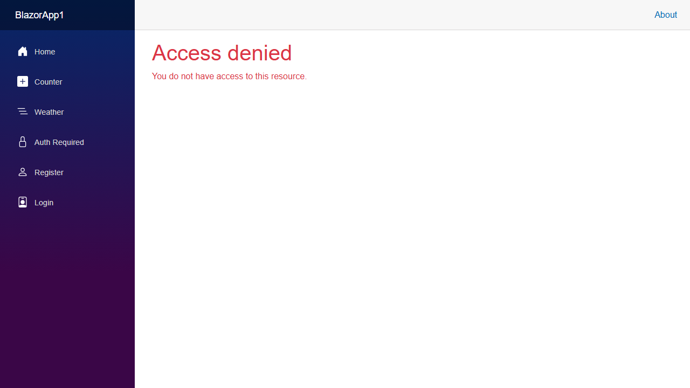
</a>
<br /><code>/Account/AccessDenied</code>
</td>
<td align="center" width="33%">
<a href="snapshots/Account/ConfirmEmail/default.png">
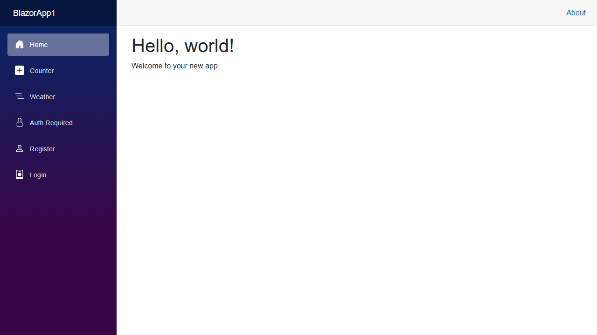
</a>
<br /><code>/Account/ConfirmEmail</code>
</td>
<td align="center" width="33%">
<a href="snapshots/Account/ForgotPassword/default.png">
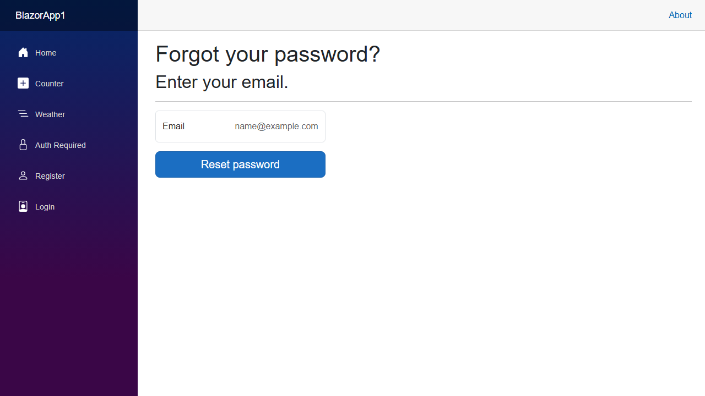
</a>
<br /><code>/Account/ForgotPassword</code>
</td>
</tr>
<tr>
<td align="center" width="33%">
<a href="snapshots/Account/ForgotPasswordConfirmation/default.png">
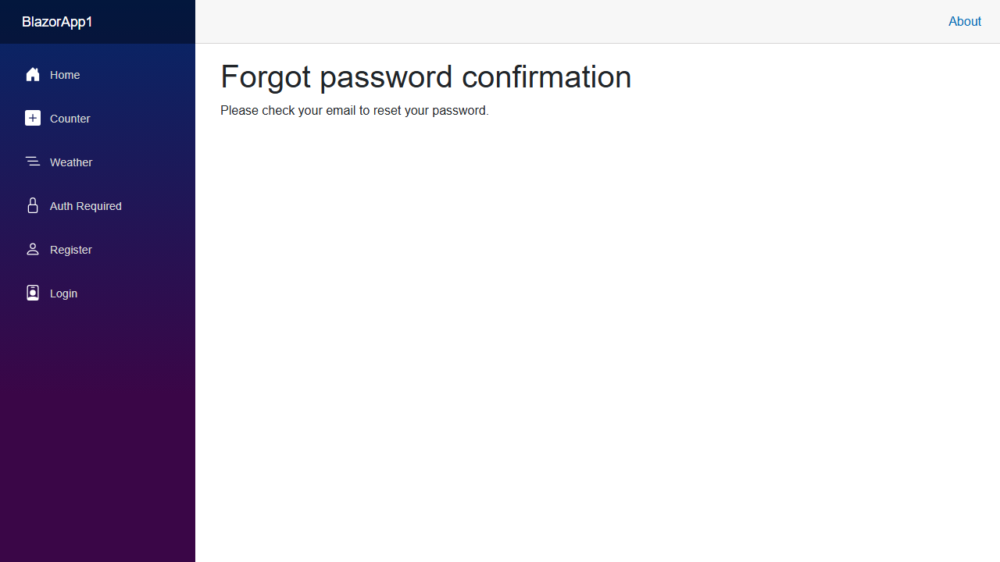
</a>
<br /><code>...otPasswordConfirmation</code>
</td>
<td align="center" width="33%">
<a href="snapshots/Account/InvalidPasswordReset/default.png">

</a>
<br /><code>...t/InvalidPasswordReset</code>
</td>
<td align="center" width="33%">
<a href="snapshots/Account/InvalidUser/default.png">
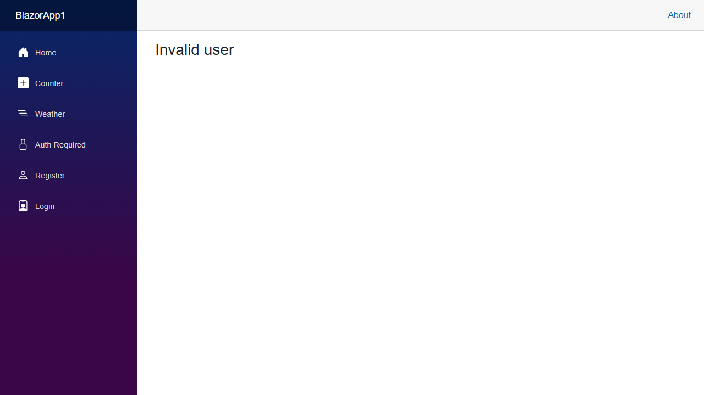
</a>
<br /><code>/Account/InvalidUser</code>
</td>
</tr>
<tr>
<td align="center" width="33%">
<a href="snapshots/Account/Lockout/default.png">
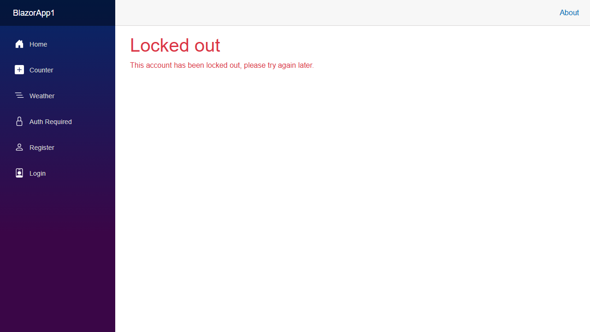
</a>
<br /><code>/Account/Lockout</code>
</td>
<td align="center" width="33%">
<a href="snapshots/Account/LoginWith2fa/default.png">
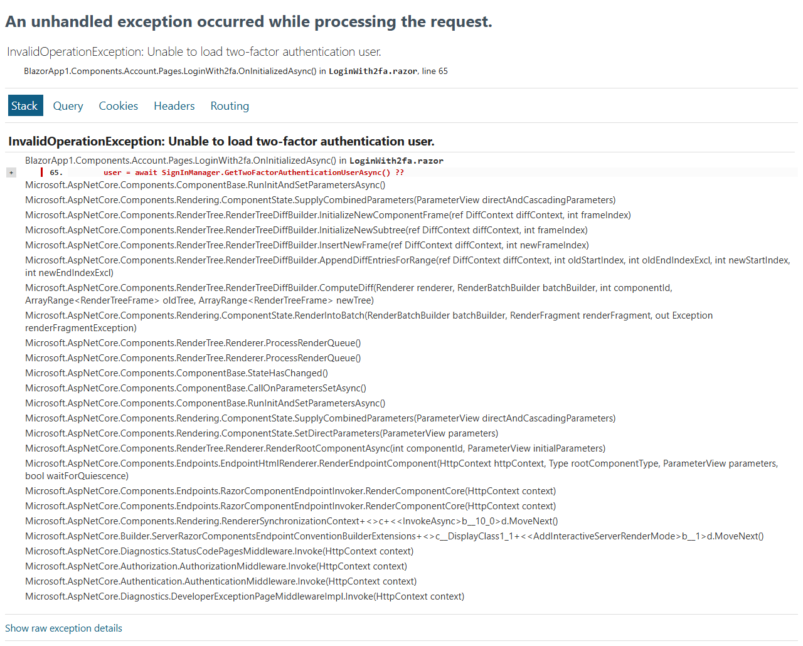
</a>
<br /><code>/Account/LoginWith2fa</code>
</td>
<td align="center" width="33%">
<a href="snapshots/Account/LoginWithRecoveryCode/default.png">
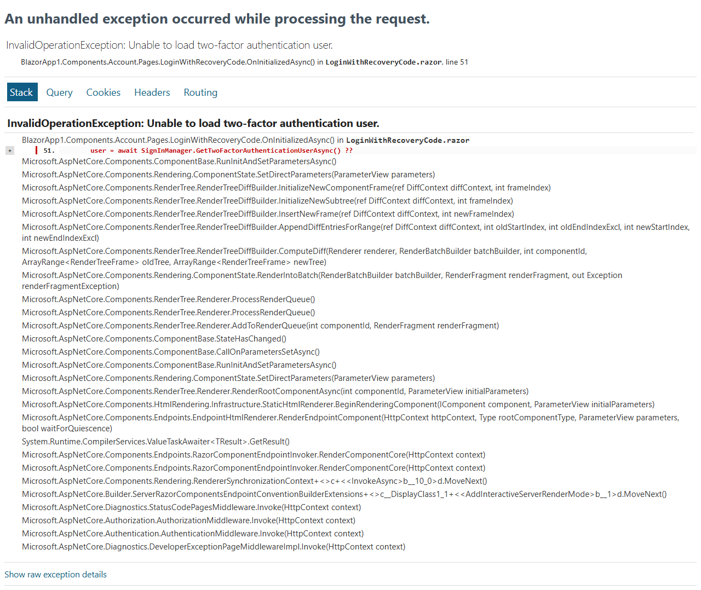
</a>
<br /><code>.../LoginWithRecoveryCode</code>
</td>
</tr>
<tr>
<td align="center" width="33%">
<a href="snapshots/Account/RegisterConfirmation/default.png">

</a>
<br /><code>...t/RegisterConfirmation</code>
</td>
<td align="center" width="33%">
<a href="snapshots/Account/ResendEmailConfirmation/default.png">
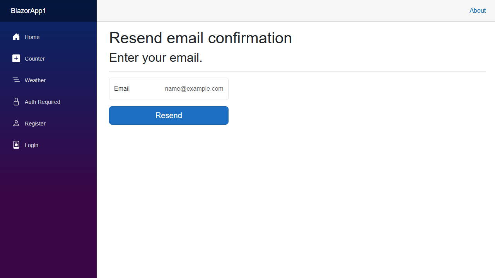
</a>
<br /><code>...esendEmailConfirmation</code>
</td>
<td align="center" width="33%">
<a href="snapshots/Account/ResetPassword/default.png">
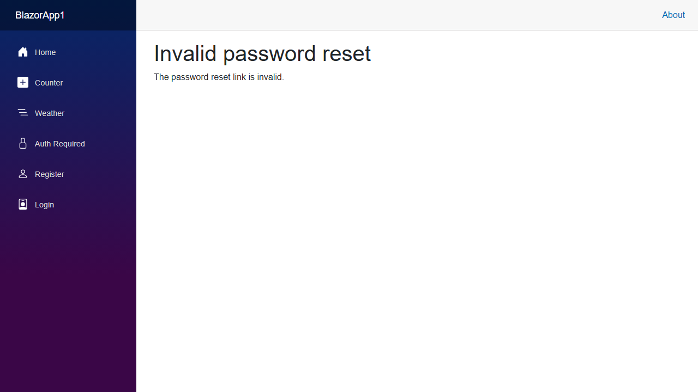
</a>
<br /><code>/Account/ResetPassword</code>
</td>
</tr>
<tr>
<td align="center" width="33%">
<a href="snapshots/Account/ResetPasswordConfirmation/default.png">
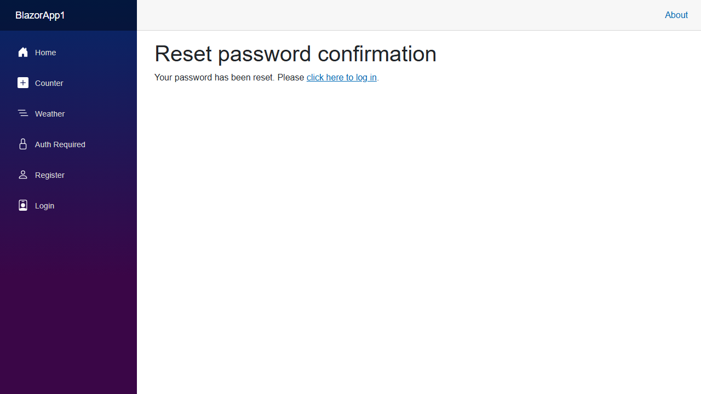
</a>
<br /><code>...etPasswordConfirmation</code>
</td>
<td></td>
<td></td>
</tr>
</table>

</details>

<details open>
<summary><strong>📁 counter</strong> (1 pages)</summary>

<table>
<tr>
<td align="center" width="33%">
<a href="snapshots/counter/default.png">
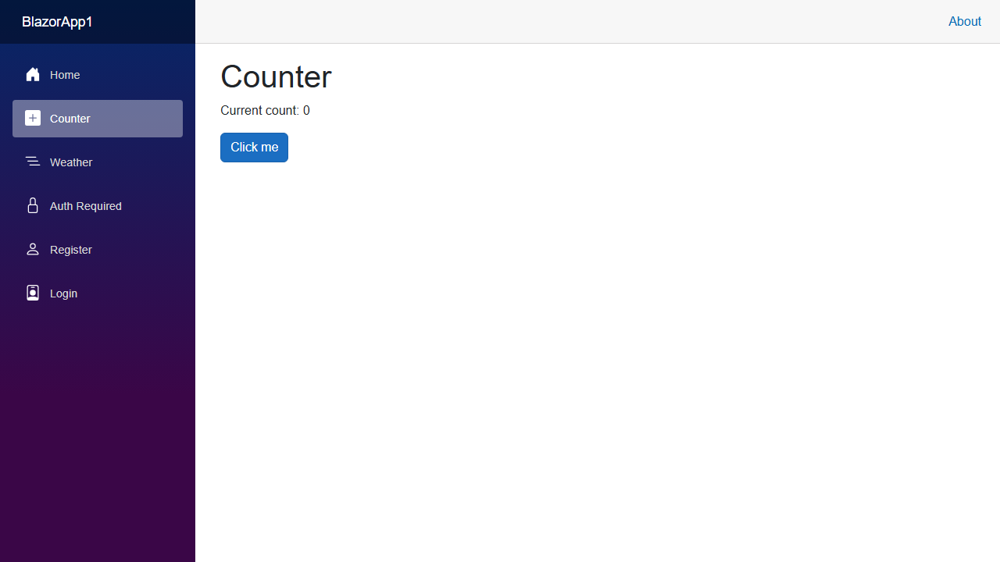
</a>
<br /><code>/counter</code>
</td>
<td></td>
<td></td>
</tr>
</table>

</details>

<details open>
<summary><strong>📁 Error</strong> (1 pages)</summary>

<table>
<tr>
<td align="center" width="33%">
<a href="snapshots/Error/default.png">
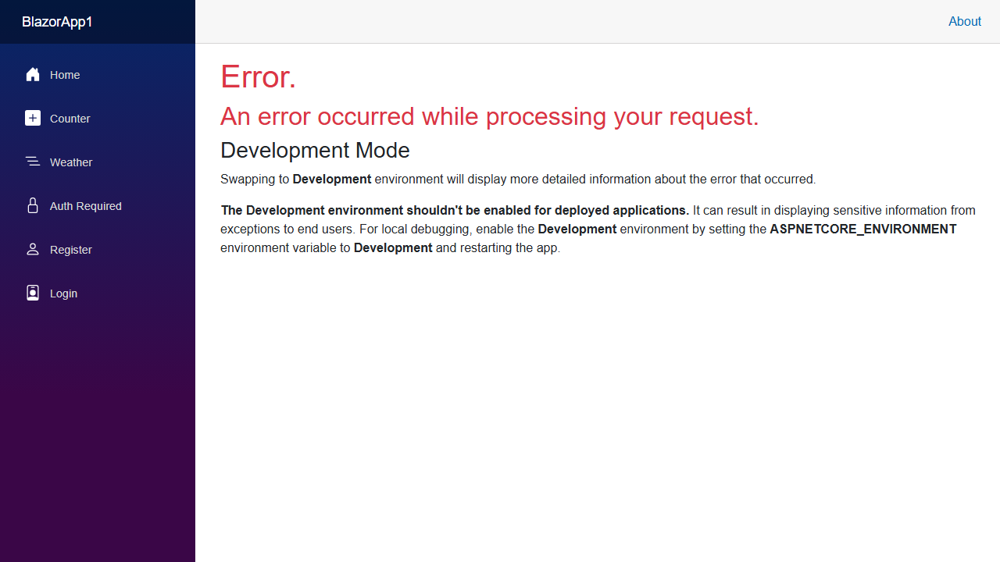
</a>
<br /><code>/Error</code>
</td>
<td></td>
<td></td>
</tr>
</table>

</details>

<details open>
<summary><strong>📁 not-found</strong> (1 pages)</summary>

<table>
<tr>
<td align="center" width="33%">
<a href="snapshots/not-found/default.png">
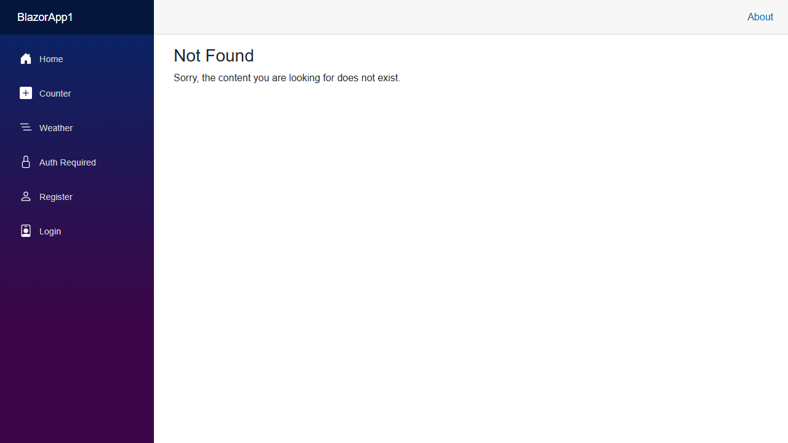
</a>
<br /><code>/not-found</code>
</td>
<td></td>
<td></td>
</tr>
</table>

</details>

<details open>
<summary><strong>📁 Home</strong> (1 pages)</summary>

<table>
<tr>
<td align="center" width="33%">
<a href="snapshots/root/default.png">

</a>
<br /><code>/root</code>
</td>
<td></td>
<td></td>
</tr>
</table>

</details>

<details open>
<summary><strong>📁 weather</strong> (1 pages)</summary>

<table>
<tr>
<td align="center" width="33%">
<a href="snapshots/weather/default.png">
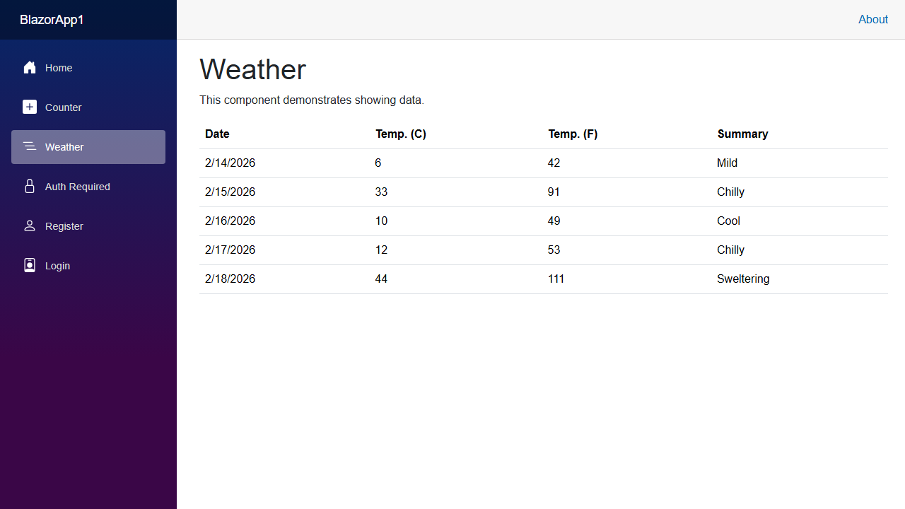
</a>
<br /><code>/weather</code>
</td>
<td></td>
<td></td>
</tr>
</table>

</details>

---

### 🔐 Auth-Required Pages (18)

These pages redirected to login. Showing **final result** after authentication.

> 💡 Click step numbers to view: **①** redirect → **②** fill form → **③** result

<details open>
<summary><strong>📁 Protected Routes</strong> (18 pages)</summary>

<table>
<tr>
<td align="center" width="33%">
<a href="snapshots/Account/ConfirmEmailChange/3-result.png">
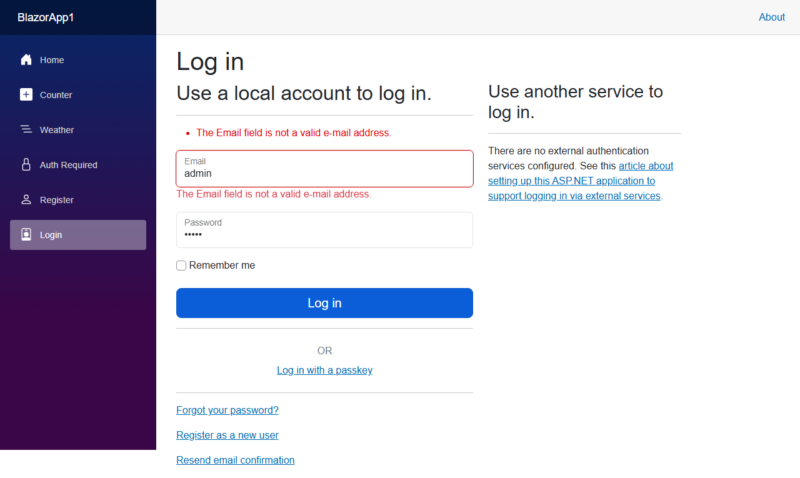
</a>
<br /><code>...onfirmEmailChange</code> 🔐 <a href="snapshots/Account/ConfirmEmailChange/1-initial.png" title="Step 1: Redirect">①</a><a href="snapshots/Account/ConfirmEmailChange/2-filled.png" title="Step 2: Fill Form">②</a><a href="snapshots/Account/ConfirmEmailChange/3-result.png" title="Step 3: Result">③</a>
</td>
<td align="center" width="33%">
<a href="snapshots/Account/ExternalLogin/3-result.png">

</a>
<br /><code>...unt/ExternalLogin</code> 🔐 <a href="snapshots/Account/ExternalLogin/1-initial.png" title="Step 1: Redirect">①</a><a href="snapshots/Account/ExternalLogin/2-filled.png" title="Step 2: Fill Form">②</a><a href="snapshots/Account/ExternalLogin/3-result.png" title="Step 3: Result">③</a>
</td>
<td align="center" width="33%">
<a href="snapshots/Account/Login/3-result.png">

</a>
<br /><code>/Account/Login</code> 🔐 <a href="snapshots/Account/Login/1-initial.png" title="Step 1: Redirect">①</a><a href="snapshots/Account/Login/2-filled.png" title="Step 2: Fill Form">②</a><a href="snapshots/Account/Login/3-result.png" title="Step 3: Result">③</a>
</td>
</tr>
<tr>
<td align="center" width="33%">
<a href="snapshots/Account/Manage/3-result.png">

</a>
<br /><code>/Account/Manage</code> 🔐 <a href="snapshots/Account/Manage/1-initial.png" title="Step 1: Redirect">①</a><a href="snapshots/Account/Manage/2-filled.png" title="Step 2: Fill Form">②</a><a href="snapshots/Account/Manage/3-result.png" title="Step 3: Result">③</a>
</td>
<td align="center" width="33%">
<a href="snapshots/Account/Manage/ChangePassword/3-result.png">

</a>
<br /><code>.../ChangePassword</code> 🔐 <a href="snapshots/Account/Manage/ChangePassword/1-initial.png" title="Step 1: Redirect">①</a><a href="snapshots/Account/Manage/ChangePassword/2-filled.png" title="Step 2: Fill Form">②</a><a href="snapshots/Account/Manage/ChangePassword/3-result.png" title="Step 3: Result">③</a>
</td>
<td align="center" width="33%">
<a href="snapshots/Account/Manage/DeletePersonalData/3-result.png">

</a>
<br /><code>.../DeletePersonalData</code> 🔐 <a href="snapshots/Account/Manage/DeletePersonalData/1-initial.png" title="Step 1: Redirect">①</a><a href="snapshots/Account/Manage/DeletePersonalData/2-filled.png" title="Step 2: Fill Form">②</a><a href="snapshots/Account/Manage/DeletePersonalData/3-result.png" title="Step 3: Result">③</a>
</td>
</tr>
<tr>
<td align="center" width="33%">
<a href="snapshots/Account/Manage/Disable2fa/3-result.png">

</a>
<br /><code>.../Disable2fa</code> 🔐 <a href="snapshots/Account/Manage/Disable2fa/1-initial.png" title="Step 1: Redirect">①</a><a href="snapshots/Account/Manage/Disable2fa/2-filled.png" title="Step 2: Fill Form">②</a><a href="snapshots/Account/Manage/Disable2fa/3-result.png" title="Step 3: Result">③</a>
</td>
<td align="center" width="33%">
<a href="snapshots/Account/Manage/Email/3-result.png">

</a>
<br /><code>/Account/.../Email</code> 🔐 <a href="snapshots/Account/Manage/Email/1-initial.png" title="Step 1: Redirect">①</a><a href="snapshots/Account/Manage/Email/2-filled.png" title="Step 2: Fill Form">②</a><a href="snapshots/Account/Manage/Email/3-result.png" title="Step 3: Result">③</a>
</td>
<td align="center" width="33%">
<a href="snapshots/Account/Manage/EnableAuthenticator/3-result.png">

</a>
<br /><code>.../EnableAuthenticator</code> 🔐 <a href="snapshots/Account/Manage/EnableAuthenticator/1-initial.png" title="Step 1: Redirect">①</a><a href="snapshots/Account/Manage/EnableAuthenticator/2-filled.png" title="Step 2: Fill Form">②</a><a href="snapshots/Account/Manage/EnableAuthenticator/3-result.png" title="Step 3: Result">③</a>
</td>
</tr>
<tr>
<td align="center" width="33%">
<a href="snapshots/Account/Manage/ExternalLogins/3-result.png">

</a>
<br /><code>.../ExternalLogins</code> 🔐 <a href="snapshots/Account/Manage/ExternalLogins/1-initial.png" title="Step 1: Redirect">①</a><a href="snapshots/Account/Manage/ExternalLogins/2-filled.png" title="Step 2: Fill Form">②</a><a href="snapshots/Account/Manage/ExternalLogins/3-result.png" title="Step 3: Result">③</a>
</td>
<td align="center" width="33%">
<a href="snapshots/Account/Manage/GenerateRecoveryCodes/3-result.png">

</a>
<br /><code>.../GenerateRecoveryCodes</code> 🔐 <a href="snapshots/Account/Manage/GenerateRecoveryCodes/1-initial.png" title="Step 1: Redirect">①</a><a href="snapshots/Account/Manage/GenerateRecoveryCodes/2-filled.png" title="Step 2: Fill Form">②</a><a href="snapshots/Account/Manage/GenerateRecoveryCodes/3-result.png" title="Step 3: Result">③</a>
</td>
<td align="center" width="33%">
<a href="snapshots/Account/Manage/Passkeys/3-result.png">

</a>
<br /><code>.../Passkeys</code> 🔐 <a href="snapshots/Account/Manage/Passkeys/1-initial.png" title="Step 1: Redirect">①</a><a href="snapshots/Account/Manage/Passkeys/2-filled.png" title="Step 2: Fill Form">②</a><a href="snapshots/Account/Manage/Passkeys/3-result.png" title="Step 3: Result">③</a>
</td>
</tr>
<tr>
<td align="center" width="33%">
<a href="snapshots/Account/Manage/PersonalData/3-result.png">

</a>
<br /><code>.../PersonalData</code> 🔐 <a href="snapshots/Account/Manage/PersonalData/1-initial.png" title="Step 1: Redirect">①</a><a href="snapshots/Account/Manage/PersonalData/2-filled.png" title="Step 2: Fill Form">②</a><a href="snapshots/Account/Manage/PersonalData/3-result.png" title="Step 3: Result">③</a>
</td>
<td align="center" width="33%">
<a href="snapshots/Account/Manage/ResetAuthenticator/3-result.png">

</a>
<br /><code>.../ResetAuthenticator</code> 🔐 <a href="snapshots/Account/Manage/ResetAuthenticator/1-initial.png" title="Step 1: Redirect">①</a><a href="snapshots/Account/Manage/ResetAuthenticator/2-filled.png" title="Step 2: Fill Form">②</a><a href="snapshots/Account/Manage/ResetAuthenticator/3-result.png" title="Step 3: Result">③</a>
</td>
<td align="center" width="33%">
<a href="snapshots/Account/Manage/SetPassword/3-result.png">

</a>
<br /><code>.../SetPassword</code> 🔐 <a href="snapshots/Account/Manage/SetPassword/1-initial.png" title="Step 1: Redirect">①</a><a href="snapshots/Account/Manage/SetPassword/2-filled.png" title="Step 2: Fill Form">②</a><a href="snapshots/Account/Manage/SetPassword/3-result.png" title="Step 3: Result">③</a>
</td>
</tr>
<tr>
<td align="center" width="33%">
<a href="snapshots/Account/Manage/TwoFactorAuthentication/3-result.png">

</a>
<br /><code>.../TwoFactorAuthentication</code> 🔐 <a href="snapshots/Account/Manage/TwoFactorAuthentication/1-initial.png" title="Step 1: Redirect">①</a><a href="snapshots/Account/Manage/TwoFactorAuthentication/2-filled.png" title="Step 2: Fill Form">②</a><a href="snapshots/Account/Manage/TwoFactorAuthentication/3-result.png" title="Step 3: Result">③</a>
</td>
<td align="center" width="33%">
<a href="snapshots/Account/Register/3-result.png">
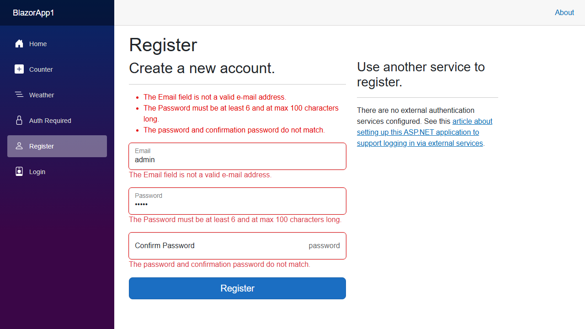
</a>
<br /><code>/Account/Register</code> 🔐 <a href="snapshots/Account/Register/1-initial.png" title="Step 1: Redirect">①</a><a href="snapshots/Account/Register/2-filled.png" title="Step 2: Fill Form">②</a><a href="snapshots/Account/Register/3-result.png" title="Step 3: Result">③</a>
</td>
<td align="center" width="33%">
<a href="snapshots/auth/3-result.png">

</a>
<br /><code>/auth</code> 🔐 <a href="snapshots/auth/1-initial.png" title="Step 1: Redirect">①</a><a href="snapshots/auth/2-filled.png" title="Step 2: Fill Form">②</a><a href="snapshots/auth/3-result.png" title="Step 3: Result">③</a>
</td>
</tr>
</table>

</details>

<details>
<summary>🔍 <strong>View Auth Flow Pattern</strong> (same for all protected pages)</summary>

All protected pages follow this login flow:

| Step | Action | Screenshot |
|:----:|--------|:----------:|
| ① | **Redirect** — User hits protected route, sent to `/Account/Login` | 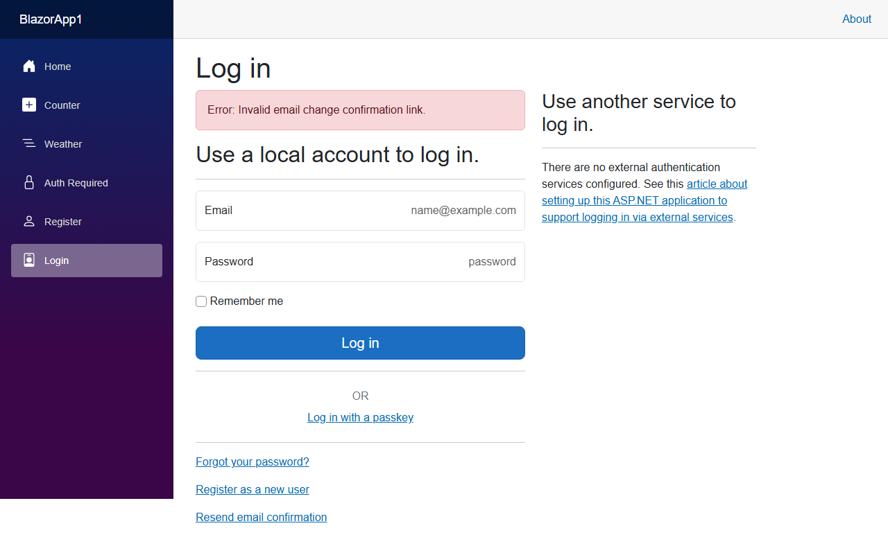 |
| ② | **Fill Form** — Enter credentials: `admin@test.com` | 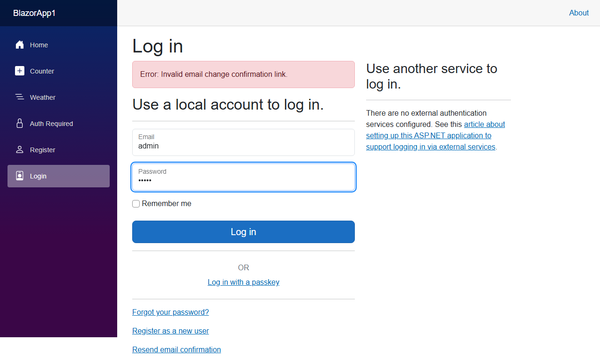 |
| ③ | **Result** — Login successful, user sees protected content |  |

</details>

---

## 🔧 Tool Information

This report was generated by the **WorkspaceReporter** tool, which aggregates outputs from:

| Tool | Purpose |
|------|---------|
| **WorkspaceInventory** | Scans codebase, extracts metrics and classifications |
| **EndpointMapper** | Discovers Blazor routes from `@page` directives |
| **EndpointPoker** | Performs HTTP GET requests to verify routes |
| **BrowserSnapshot** | Captures full-page screenshots with Playwright |

---

*Part of the [FreeTools](https://github.com/WSU-EIT/FreeTools) suite — Open source workspace analysis tools for .NET projects*
