# 📊 FreeTools Workspace Report

> **Generated:** 2026-02-27 17:13:18  
> **Repository:** FreeExamples  
> **Scope:** Blazor pages only — API endpoints not included  

---

## 📑 Table of Contents

- [About This Report](#-about-this-report)
- [Workspace Overview](#-workspace-overview)
- [File Statistics](#-file-statistics)
- [Code Distribution](#-code-distribution)
- [Largest Files](#-largest-files)
- [Large File Warnings](#%EF%B8%8F-large-file-warnings)
- [Blazor Page Routes](#%EF%B8%8F-blazor-page-routes)
- [Route Map](#-route-map)
- [Screenshot Health](#-screenshot-health)
- [Screenshot Gallery](#-screenshot-gallery)

---

## 📋 About This Report

This report is auto-generated by the **WorkspaceReporter** tool pipeline.

### Scope

| Included | Not Included |
|----------|--------------|
| ✅ Blazor pages (`@page` directives) | ❌ API endpoints (`/api/*`) |
| ✅ Razor components | ❌ Dynamic routes (MapGet/MapPost) |
| ✅ C# source files | ❌ Routes with parameters (`{id}`) |
| ✅ Configuration files | |

### File Categories (Kind)

| Kind | Description |
|------|-------------|
| **RazorPage** | `.razor` file with `@page` directive (routable) |
| **RazorComponent** | `.razor` file without `@page` (reusable component) |
| **CSharpSource** | `.cs` file (classes, services, etc.) |
| **ProjectFile** | `.csproj` file (project configuration) |
| **SolutionFile** | `.sln` file (solution configuration) |
| **Config** | `.json`, `.xml`, `.yaml`, `.yml`, `.config` files |
| **Markdown** | `.md` documentation files |

---

## 📁 Workspace Overview

| Metric | Value |
|--------|-------|
| **Total Files** | 311 |
| **Total Lines** | 74,691 |
| **Total Characters** | 2,877,547 |
| **Total Size** | 2.8 MB |
| **Avg Lines/File** | 240.2 |
| **Avg Size/File** | 9.1 KB |

## 📈 File Statistics

### By Category

| Category | Count | Avg Lines | Total Lines | Percentage |
|----------|------:|----------:|------------:|------------|
| CSharpSource | 130 | 251 | 32,681 | [████████░░░░░░░░░░░░] 41.8% |
| RazorComponent | 57 | 128 | 7,311 | [███░░░░░░░░░░░░░░░░░] 18.3% |
| RazorPage | 56 | 279 | 15,643 | [███░░░░░░░░░░░░░░░░░] 18.0% |
| Markdown | 48 | 384 | 18,433 | [███░░░░░░░░░░░░░░░░░] 15.4% |
| ProjectFile | 10 | 35 | 348 | [█░░░░░░░░░░░░░░░░░░░░] 3.2% |
| Config | 10 | 28 | 275 | [█░░░░░░░░░░░░░░░░░░░░] 3.2% |

### Files by Category

<details>
<summary><strong>CSharpSource</strong> (130 files)</summary>

| File | Lines | Size |
|------|------:|-----:|
| [FreeExamples.Client/DataModel.App.cs](../../../../../../FreeExamples/FreeExamples.Client/DataModel.App.cs) | 52 | 1.3 KB |
| [FreeExamples.Client/DataModel.cs](../../../../../../FreeExamples/FreeExamples.Client/DataModel.cs) | 2,027 | 68.3 KB |
| [FreeExamples.Client/DynamicBlazorSupport/CodeFile.cs](../../../../../../FreeExamples/FreeExamples.Client/DynamicBlazorSupport/CodeFile.cs) | 45 | 1.1 KB |
| [FreeExamples.Client/DynamicBlazorSupport/CodeFileType.cs](../../../../../../FreeExamples/FreeExamples.Client/DynamicBlazorSupport/CodeFileType.cs) | 9 | 107 bytes |
| [...ples.Client/DynamicBlazorSupport/CompilationDiagnostic.cs](../../../../../../FreeExamples/FreeExamples.Client/DynamicBlazorSupport/CompilationDiagnostic.cs) | 74 | 2.2 KB |
| [....Client/DynamicBlazorSupport/CompilationDiagnosticKind.cs](../../../../../../FreeExamples/FreeExamples.Client/DynamicBlazorSupport/CompilationDiagnosticKind.cs) | 9 | 120 bytes |
| [...xamples.Client/DynamicBlazorSupport/CompilationService.cs](../../../../../../FreeExamples/FreeExamples.Client/DynamicBlazorSupport/CompilationService.cs) | 572 | 24.6 KB |
| [...es.Client/DynamicBlazorSupport/CompileToAssemblyResult.cs](../../../../../../FreeExamples/FreeExamples.Client/DynamicBlazorSupport/CompileToAssemblyResult.cs) | 22 | 704 bytes |
| [...ples.Client/DynamicBlazorSupport/CompileToCSharpResult.cs](../../../../../../FreeExamples/FreeExamples.Client/DynamicBlazorSupport/CompileToCSharpResult.cs) | 16 | 394 bytes |
| [FreeExamples.Client/DynamicBlazorSupport/CoreConstants.cs](../../../../../../FreeExamples/FreeExamples.Client/DynamicBlazorSupport/CoreConstants.cs) | 43 | 6.5 KB |
| [...ient/DynamicBlazorSupport/IServiceCollectionExtensions.cs](../../../../../../FreeExamples/FreeExamples.Client/DynamicBlazorSupport/IServiceCollectionExtensions.cs) | 25 | 817 bytes |
| [...amples.Client/DynamicBlazorSupport/NotFoundProjectItem.cs](../../../../../../FreeExamples/FreeExamples.Client/DynamicBlazorSupport/NotFoundProjectItem.cs) | 25 | 636 bytes |
| [FreeExamples.Client/DynamicBlazorSupport/TryConstants.cs](../../../../../../FreeExamples/FreeExamples.Client/DynamicBlazorSupport/TryConstants.cs) | 26 | 1.1 KB |
| [...s.Client/DynamicBlazorSupport/VirtualProjectFileSystem.cs](../../../../../../FreeExamples/FreeExamples.Client/DynamicBlazorSupport/VirtualProjectFileSystem.cs) | 23 | 740 bytes |
| [...xamples.Client/DynamicBlazorSupport/VirtualProjectItem.cs](../../../../../../FreeExamples/FreeExamples.Client/DynamicBlazorSupport/VirtualProjectItem.cs) | 42 | 1.1 KB |
| [FreeExamples.Client/FreeExample.App.Helpers.cs](../../../../../../FreeExamples/FreeExamples.Client/FreeExample.App.Helpers.cs) | 135 | 4.7 KB |
| [FreeExamples.Client/Helpers.App.cs](../../../../../../FreeExamples/FreeExamples.Client/Helpers.App.cs) | 161 | 5.1 KB |
| [FreeExamples.Client/Helpers.cs](../../../../../../FreeExamples/FreeExamples.Client/Helpers.cs) | 6,275 | 232.5 KB |
| [FreeExamples.Client/Models/SnippetsOptions.cs](../../../../../../FreeExamples/FreeExamples.Client/Models/SnippetsOptions.cs) | 7 | 138 bytes |
| [FreeExamples.Client/Program.cs](../../../../../../FreeExamples/FreeExamples.Client/Program.cs) | 31 | 1.2 KB |
| [FreeExamples.DataAccess/DataAccess.ActiveDirectory.cs](../../../../../../FreeExamples/FreeExamples.DataAccess/DataAccess.ActiveDirectory.cs) | 233 | 10.8 KB |
| [FreeExamples.DataAccess/DataAccess.Ajax.cs](../../../../../../FreeExamples/FreeExamples.DataAccess/DataAccess.Ajax.cs) | 143 | 6.4 KB |
| [FreeExamples.DataAccess/DataAccess.App.cs](../../../../../../FreeExamples/FreeExamples.DataAccess/DataAccess.App.cs) | 493 | 19.7 KB |
| [FreeExamples.DataAccess/DataAccess.ApplicationSettings.cs](../../../../../../FreeExamples/FreeExamples.DataAccess/DataAccess.ApplicationSettings.cs) | 127 | 6.3 KB |
| [FreeExamples.DataAccess/DataAccess.Authenticate.cs](../../../../../../FreeExamples/FreeExamples.DataAccess/DataAccess.Authenticate.cs) | 224 | 9.4 KB |
| [FreeExamples.DataAccess/DataAccess.cs](../../../../../../FreeExamples/FreeExamples.DataAccess/DataAccess.cs) | 162 | 6.5 KB |
| [FreeExamples.DataAccess/DataAccess.CSharpCode.cs](../../../../../../FreeExamples/FreeExamples.DataAccess/DataAccess.CSharpCode.cs) | 127 | 7.3 KB |
| [FreeExamples.DataAccess/DataAccess.Departments.cs](../../../../../../FreeExamples/FreeExamples.DataAccess/DataAccess.Departments.cs) | 526 | 22.3 KB |
| [FreeExamples.DataAccess/DataAccess.Disposable.cs](../../../../../../FreeExamples/FreeExamples.DataAccess/DataAccess.Disposable.cs) | 26 | 641 bytes |
| [FreeExamples.DataAccess/DataAccess.Encryption.cs](../../../../../../FreeExamples/FreeExamples.DataAccess/DataAccess.Encryption.cs) | 291 | 10.1 KB |
| [FreeExamples.DataAccess/DataAccess.FileStorage.cs](../../../../../../FreeExamples/FreeExamples.DataAccess/DataAccess.FileStorage.cs) | 634 | 24.5 KB |
| [FreeExamples.DataAccess/DataAccess.JWT.cs](../../../../../../FreeExamples/FreeExamples.DataAccess/DataAccess.JWT.cs) | 68 | 2.1 KB |
| [FreeExamples.DataAccess/DataAccess.Language.cs](../../../../../../FreeExamples/FreeExamples.DataAccess/DataAccess.Language.cs) | 746 | 44.5 KB |
| [FreeExamples.DataAccess/DataAccess.Migrations.cs](../../../../../../FreeExamples/FreeExamples.DataAccess/DataAccess.Migrations.cs) | 207 | 7.1 KB |
| [FreeExamples.DataAccess/DataAccess.Plugins.cs](../../../../../../FreeExamples/FreeExamples.DataAccess/DataAccess.Plugins.cs) | 334 | 12.2 KB |
| [FreeExamples.DataAccess/DataAccess.SeedTestData.cs](../../../../../../FreeExamples/FreeExamples.DataAccess/DataAccess.SeedTestData.cs) | 369 | 18.6 KB |
| [FreeExamples.DataAccess/DataAccess.Settings.cs](../../../../../../FreeExamples/FreeExamples.DataAccess/DataAccess.Settings.cs) | 604 | 24.6 KB |
| [FreeExamples.DataAccess/DataAccess.SignalR.cs](../../../../../../FreeExamples/FreeExamples.DataAccess/DataAccess.SignalR.cs) | 36 | 1.2 KB |
| [FreeExamples.DataAccess/DataAccess.Tags.cs](../../../../../../FreeExamples/FreeExamples.DataAccess/DataAccess.Tags.cs) | 264 | 9.3 KB |
| [FreeExamples.DataAccess/DataAccess.Tenants.cs](../../../../../../FreeExamples/FreeExamples.DataAccess/DataAccess.Tenants.cs) | 709 | 27.2 KB |
| [FreeExamples.DataAccess/DataAccess.UDFLabels.cs](../../../../../../FreeExamples/FreeExamples.DataAccess/DataAccess.UDFLabels.cs) | 277 | 10.5 KB |
| [FreeExamples.DataAccess/DataAccess.UserGroups.cs](../../../../../../FreeExamples/FreeExamples.DataAccess/DataAccess.UserGroups.cs) | 390 | 15.7 KB |
| [FreeExamples.DataAccess/DataAccess.Users.cs](../../../../../../FreeExamples/FreeExamples.DataAccess/DataAccess.Users.cs) | 2,531 | 104.3 KB |
| [FreeExamples.DataAccess/DataAccess.Utilities.cs](../../../../../../FreeExamples/FreeExamples.DataAccess/DataAccess.Utilities.cs) | 2,455 | 88.3 KB |
| [FreeExamples.DataAccess/DataMigrations.MySQL.cs](../../../../../../FreeExamples/FreeExamples.DataAccess/DataMigrations.MySQL.cs) | 306 | 11.7 KB |
| [FreeExamples.DataAccess/DataMigrations.PostgreSQL.cs](../../../../../../FreeExamples/FreeExamples.DataAccess/DataMigrations.PostgreSQL.cs) | 309 | 11.4 KB |
| [FreeExamples.DataAccess/DataMigrations.SQLite.cs](../../../../../../FreeExamples/FreeExamples.DataAccess/DataMigrations.SQLite.cs) | 296 | 10.3 KB |
| [FreeExamples.DataAccess/DataMigrations.SQLServer.cs](../../../../../../FreeExamples/FreeExamples.DataAccess/DataMigrations.SQLServer.cs) | 389 | 17.8 KB |
| [...ples.DataAccess/FreeExamples.App.DataAccess.SampleData.cs](../../../../../../FreeExamples/FreeExamples.DataAccess/FreeExamples.App.DataAccess.SampleData.cs) | 391 | 16.0 KB |
| [FreeExamples.DataAccess/GlobalUsings.cs](../../../../../../FreeExamples/FreeExamples.DataAccess/GlobalUsings.cs) | 16 | 515 bytes |
| [FreeExamples.DataAccess/GraphAPI.App.cs](../../../../../../FreeExamples/FreeExamples.DataAccess/GraphAPI.App.cs) | 7 | 139 bytes |
| [FreeExamples.DataAccess/GraphAPI.cs](../../../../../../FreeExamples/FreeExamples.DataAccess/GraphAPI.cs) | 166 | 6.0 KB |
| [FreeExamples.DataAccess/RandomPasswordGenerator.App.cs](../../../../../../FreeExamples/FreeExamples.DataAccess/RandomPasswordGenerator.App.cs) | 4 | 53 bytes |
| [FreeExamples.DataAccess/RandomPasswordGenerator.cs](../../../../../../FreeExamples/FreeExamples.DataAccess/RandomPasswordGenerator.cs) | 115 | 4.5 KB |
| [FreeExamples.DataAccess/Utilities.App.cs](../../../../../../FreeExamples/FreeExamples.DataAccess/Utilities.App.cs) | 6 | 117 bytes |
| [FreeExamples.DataAccess/Utilities.cs](../../../../../../FreeExamples/FreeExamples.DataAccess/Utilities.cs) | 962 | 36.3 KB |
| [FreeExamples.DataObjects/Caching.cs](../../../../../../FreeExamples/FreeExamples.DataObjects/Caching.cs) | 99 | 3.2 KB |
| [FreeExamples.DataObjects/ConfigurationHelper.App.cs](../../../../../../FreeExamples/FreeExamples.DataObjects/ConfigurationHelper.App.cs) | 25 | 516 bytes |
| [FreeExamples.DataObjects/ConfigurationHelper.cs](../../../../../../FreeExamples/FreeExamples.DataObjects/ConfigurationHelper.cs) | 80 | 2.1 KB |
| [FreeExamples.DataObjects/DataObjects.ActiveDirectory.cs](../../../../../../FreeExamples/FreeExamples.DataObjects/DataObjects.ActiveDirectory.cs) | 30 | 999 bytes |
| [FreeExamples.DataObjects/DataObjects.Ajax.cs](../../../../../../FreeExamples/FreeExamples.DataObjects/DataObjects.Ajax.cs) | 23 | 686 bytes |
| [FreeExamples.DataObjects/DataObjects.App.cs](../../../../../../FreeExamples/FreeExamples.DataObjects/DataObjects.App.cs) | 21 | 471 bytes |
| [FreeExamples.DataObjects/DataObjects.cs](../../../../../../FreeExamples/FreeExamples.DataObjects/DataObjects.cs) | 648 | 24.7 KB |
| [FreeExamples.DataObjects/DataObjects.Departments.cs](../../../../../../FreeExamples/FreeExamples.DataObjects/DataObjects.Departments.cs) | 33 | 1.2 KB |
| [FreeExamples.DataObjects/DataObjects.Services.cs](../../../../../../FreeExamples/FreeExamples.DataObjects/DataObjects.Services.cs) | 23 | 829 bytes |
| [FreeExamples.DataObjects/DataObjects.SignalR.cs](../../../../../../FreeExamples/FreeExamples.DataObjects/DataObjects.SignalR.cs) | 37 | 1.4 KB |
| [FreeExamples.DataObjects/DataObjects.Tags.cs](../../../../../../FreeExamples/FreeExamples.DataObjects/DataObjects.Tags.cs) | 29 | 871 bytes |
| [FreeExamples.DataObjects/DataObjects.UDFLabels.cs](../../../../../../FreeExamples/FreeExamples.DataObjects/DataObjects.UDFLabels.cs) | 19 | 638 bytes |
| [FreeExamples.DataObjects/DataObjects.UserGroups.cs](../../../../../../FreeExamples/FreeExamples.DataObjects/DataObjects.UserGroups.cs) | 25 | 825 bytes |
| [...es.DataObjects/FreeExamples.App.DataObjects.ApiKeyDemo.cs](../../../../../../FreeExamples/FreeExamples.DataObjects/FreeExamples.App.DataObjects.ApiKeyDemo.cs) | 50 | 1.5 KB |
| [...es.DataObjects/FreeExamples.App.DataObjects.GitBrowser.cs](../../../../../../FreeExamples/FreeExamples.DataObjects/FreeExamples.App.DataObjects.GitBrowser.cs) | 47 | 1.3 KB |
| [...es.DataObjects/FreeExamples.App.DataObjects.SampleData.cs](../../../../../../FreeExamples/FreeExamples.DataObjects/FreeExamples.App.DataObjects.SampleData.cs) | 129 | 4.0 KB |
| [FreeExamples.DataObjects/GlobalSettings.App.cs](../../../../../../FreeExamples/FreeExamples.DataObjects/GlobalSettings.App.cs) | 6 | 121 bytes |
| [FreeExamples.DataObjects/GlobalSettings.cs](../../../../../../FreeExamples/FreeExamples.DataObjects/GlobalSettings.cs) | 14 | 560 bytes |
| [FreeExamples.EFModels/EFModelOverrides.cs](../../../../../../FreeExamples/FreeExamples.EFModels/EFModelOverrides.cs) | 29 | 1.2 KB |
| [FreeExamples.EFModels/EFModels/Department.cs](../../../../../../FreeExamples/FreeExamples.EFModels/EFModels/Department.cs) | 33 | 755 bytes |
| [FreeExamples.EFModels/EFModels/DepartmentGroup.cs](../../../../../../FreeExamples/FreeExamples.EFModels/EFModels/DepartmentGroup.cs) | 25 | 540 bytes |
| [FreeExamples.EFModels/EFModels/EFDataModel.cs](../../../../../../FreeExamples/FreeExamples.EFModels/EFModels/EFDataModel.cs) | 249 | 10.7 KB |
| [FreeExamples.EFModels/EFModels/FileStorage.cs](../../../../../../FreeExamples/FreeExamples.EFModels/EFModels/FileStorage.cs) | 39 | 830 bytes |
| [FreeExamples.EFModels/EFModels/PluginCache.cs](../../../../../../FreeExamples/FreeExamples.EFModels/EFModels/PluginCache.cs) | 31 | 633 bytes |
| [FreeExamples.EFModels/EFModels/Setting.cs](../../../../../../FreeExamples/FreeExamples.EFModels/EFModels/Setting.cs) | 25 | 534 bytes |
| [FreeExamples.EFModels/EFModels/Tag.cs](../../../../../../FreeExamples/FreeExamples.EFModels/EFModels/Tag.cs) | 37 | 820 bytes |
| [FreeExamples.EFModels/EFModels/TagItem.cs](../../../../../../FreeExamples/FreeExamples.EFModels/EFModels/TagItem.cs) | 17 | 331 bytes |
| [FreeExamples.EFModels/EFModels/Tenant.cs](../../../../../../FreeExamples/FreeExamples.EFModels/EFModels/Tenant.cs) | 25 | 559 bytes |
| [FreeExamples.EFModels/EFModels/UDFLabel.cs](../../../../../../FreeExamples/FreeExamples.EFModels/EFModels/UDFLabel.cs) | 27 | 567 bytes |
| [FreeExamples.EFModels/EFModels/User.cs](../../../../../../FreeExamples/FreeExamples.EFModels/EFModels/User.cs) | 91 | 2.0 KB |
| [FreeExamples.EFModels/EFModels/UserGroup.cs](../../../../../../FreeExamples/FreeExamples.EFModels/EFModels/UserGroup.cs) | 31 | 698 bytes |
| [FreeExamples.EFModels/EFModels/UserInGroup.cs](../../../../../../FreeExamples/FreeExamples.EFModels/EFModels/UserInGroup.cs) | 19 | 402 bytes |
| [...les.NuGetClient/Extensions/ServiceCollectionExtensions.cs](../../../../../../FreeExamples/FreeExamples.NuGetClient/Extensions/ServiceCollectionExtensions.cs) | 65 | 2.1 KB |
| [FreeExamples.NuGetClient/FreeExamplesClient.cs](../../../../../../FreeExamples/FreeExamples.NuGetClient/FreeExamplesClient.cs) | 225 | 8.3 KB |
| [FreeExamples.NuGetClient/FreeExamplesClientOptions.cs](../../../../../../FreeExamples/FreeExamples.NuGetClient/FreeExamplesClientOptions.cs) | 58 | 2.1 KB |
| [FreeExamples.NuGetClient/IFreeExamplesClient.cs](../../../../../../FreeExamples/FreeExamples.NuGetClient/IFreeExamplesClient.cs) | 36 | 1.7 KB |
| [FreeExamples.NuGetClient/Models/ApiModels.cs](../../../../../../FreeExamples/FreeExamples.NuGetClient/Models/ApiModels.cs) | 42 | 1.2 KB |
| [FreeExamples.NuGetClient/Models/FreeExamplesException.cs](../../../../../../FreeExamples/FreeExamples.NuGetClient/Models/FreeExamplesException.cs) | 42 | 1.4 KB |
| [FreeExamples.NuGetClientPublisher/Program.cs](../../../../../../FreeExamples/FreeExamples.NuGetClientPublisher/Program.cs) | 394 | 16.9 KB |
| [FreeExamples.Plugins/Encryption.cs](../../../../../../FreeExamples/FreeExamples.Plugins/Encryption.cs) | 377 | 13.5 KB |
| [FreeExamples.Plugins/Plugins.cs](../../../../../../FreeExamples/FreeExamples.Plugins/Plugins.cs) | 862 | 34.2 KB |
| [FreeExamples.TestClient/Program.cs](../../../../../../FreeExamples/FreeExamples.TestClient/Program.cs) | 237 | 9.8 KB |
| [FreeExamples/Classes/BackgroundProcessor.cs](../../../../../../FreeExamples/FreeExamples/Classes/BackgroundProcessor.cs) | 157 | 5.8 KB |
| [FreeExamples/Classes/CustomAuthenticationHandler.cs](../../../../../../FreeExamples/FreeExamples/Classes/CustomAuthenticationHandler.cs) | 77 | 2.9 KB |
| [FreeExamples/Classes/CustomAuthIdentity.cs](../../../../../../FreeExamples/FreeExamples/Classes/CustomAuthIdentity.cs) | 229 | 8.6 KB |
| [FreeExamples/Classes/RouteHelper.cs](../../../../../../FreeExamples/FreeExamples/Classes/RouteHelper.cs) | 99 | 2.5 KB |
| [FreeExamples/Controllers/AuthorizationController.cs](../../../../../../FreeExamples/FreeExamples/Controllers/AuthorizationController.cs) | 378 | 14.5 KB |
| [FreeExamples/Controllers/DataController.Ajax.cs](../../../../../../FreeExamples/FreeExamples/Controllers/DataController.Ajax.cs) | 16 | 431 bytes |
| [FreeExamples/Controllers/DataController.App.cs](../../../../../../FreeExamples/FreeExamples/Controllers/DataController.App.cs) | 51 | 1.5 KB |
| [...xamples/Controllers/DataController.ApplicationSettings.cs](../../../../../../FreeExamples/FreeExamples/Controllers/DataController.ApplicationSettings.cs) | 25 | 796 bytes |
| [FreeExamples/Controllers/DataController.Authenticate.cs](../../../../../../FreeExamples/FreeExamples/Controllers/DataController.Authenticate.cs) | 29 | 1.0 KB |
| [FreeExamples/Controllers/DataController.cs](../../../../../../FreeExamples/FreeExamples/Controllers/DataController.cs) | 138 | 5.2 KB |
| [FreeExamples/Controllers/DataController.Departments.cs](../../../../../../FreeExamples/FreeExamples/Controllers/DataController.Departments.cs) | 79 | 2.5 KB |
| [FreeExamples/Controllers/DataController.Encryption.cs](../../../../../../FreeExamples/FreeExamples/Controllers/DataController.Encryption.cs) | 89 | 2.6 KB |
| [FreeExamples/Controllers/DataController.FileStorage.cs](../../../../../../FreeExamples/FreeExamples/Controllers/DataController.FileStorage.cs) | 186 | 6.1 KB |
| [FreeExamples/Controllers/DataController.Language.cs](../../../../../../FreeExamples/FreeExamples/Controllers/DataController.Language.cs) | 50 | 1.5 KB |
| [FreeExamples/Controllers/DataController.Plugins.cs](../../../../../../FreeExamples/FreeExamples/Controllers/DataController.Plugins.cs) | 41 | 1.2 KB |
| [FreeExamples/Controllers/DataController.Tags.cs](../../../../../../FreeExamples/FreeExamples/Controllers/DataController.Tags.cs) | 43 | 1.2 KB |
| [FreeExamples/Controllers/DataController.Tenants.cs](../../../../../../FreeExamples/FreeExamples/Controllers/DataController.Tenants.cs) | 109 | 3.2 KB |
| [FreeExamples/Controllers/DataController.UDF.cs](../../../../../../FreeExamples/FreeExamples/Controllers/DataController.UDF.cs) | 25 | 756 bytes |
| [FreeExamples/Controllers/DataController.UserGroups.cs](../../../../../../FreeExamples/FreeExamples/Controllers/DataController.UserGroups.cs) | 43 | 1.3 KB |
| [FreeExamples/Controllers/DataController.Users.cs](../../../../../../FreeExamples/FreeExamples/Controllers/DataController.Users.cs) | 230 | 7.2 KB |
| [FreeExamples/Controllers/DataController.Utilities.cs](../../../../../../FreeExamples/FreeExamples/Controllers/DataController.Utilities.cs) | 218 | 6.9 KB |
| [FreeExamples/Controllers/FreeExamples.App.API.ApiKeyDemo.cs](../../../../../../FreeExamples/FreeExamples/Controllers/FreeExamples.App.API.ApiKeyDemo.cs) | 143 | 4.9 KB |
| [FreeExamples/Controllers/FreeExamples.App.API.GitBrowser.cs](../../../../../../FreeExamples/FreeExamples/Controllers/FreeExamples.App.API.GitBrowser.cs) | 48 | 1.8 KB |
| [FreeExamples/Controllers/FreeExamples.App.API.SampleData.cs](../../../../../../FreeExamples/FreeExamples/Controllers/FreeExamples.App.API.SampleData.cs) | 131 | 4.3 KB |
| [FreeExamples/Controllers/SetupController.cs](../../../../../../FreeExamples/FreeExamples/Controllers/SetupController.cs) | 144 | 7.0 KB |
| [FreeExamples/Hubs/signalrHub.cs](../../../../../../FreeExamples/FreeExamples/Hubs/signalrHub.cs) | 45 | 1.4 KB |
| [FreeExamples/Middleware/ApiKeyDemoMiddleware.cs](../../../../../../FreeExamples/FreeExamples/Middleware/ApiKeyDemoMiddleware.cs) | 80 | 2.8 KB |
| [FreeExamples/PluginsInterfaces.cs](../../../../../../FreeExamples/FreeExamples/PluginsInterfaces.cs) | 68 | 1.9 KB |
| [FreeExamples/Program.App.cs](../../../../../../FreeExamples/FreeExamples/Program.App.cs) | 53 | 1.5 KB |
| [FreeExamples/Program.cs](../../../../../../FreeExamples/FreeExamples/Program.cs) | 260 | 13.0 KB |
| [FreeExamples/Services/ApiKeyDemoService.cs](../../../../../../FreeExamples/FreeExamples/Services/ApiKeyDemoService.cs) | 106 | 3.5 KB |
| [FreeExamples/Services/GitBrowserService.cs](../../../../../../FreeExamples/FreeExamples/Services/GitBrowserService.cs) | 375 | 12.9 KB |

</details>

<details>
<summary><strong>RazorComponent</strong> (57 files)</summary>

| File | Lines | Size |
|------|------:|-----:|
| [FreeExamples.Client/_Imports.razor](../../../../../../FreeExamples/FreeExamples.Client/_Imports.razor) | 14 | 493 bytes |
| [FreeExamples.Client/Layout/MainLayout.App.razor](../../../../../../FreeExamples/FreeExamples.Client/Layout/MainLayout.App.razor) | 37 | 1.1 KB |
| [FreeExamples.Client/Layout/MainLayout.razor](../../../../../../FreeExamples/FreeExamples.Client/Layout/MainLayout.razor) | 856 | 33.5 KB |
| [FreeExamples.Client/Pages/Settings/Files/ManageFile.razor](../../../../../../FreeExamples/FreeExamples.Client/Pages/Settings/Files/ManageFile.razor) | 203 | 6.2 KB |
| [FreeExamples.Client/Routes.razor](../../../../../../FreeExamples/FreeExamples.Client/Routes.razor) | 6 | 360 bytes |
| [FreeExamples.Client/Shared/AboutSection.razor](../../../../../../FreeExamples/FreeExamples.Client/Shared/AboutSection.razor) | 49 | 1.6 KB |
| [FreeExamples.Client/Shared/AppComponents/About.App.razor](../../../../../../FreeExamples/FreeExamples.Client/Shared/AppComponents/About.App.razor) | 47 | 1.1 KB |
| [...xamples.Client/Shared/AppComponents/AppSettings.App.razor](../../../../../../FreeExamples/FreeExamples.Client/Shared/AppComponents/AppSettings.App.razor) | 86 | 2.3 KB |
| [...les.Client/Shared/AppComponents/EditAppointment.App.razor](../../../../../../FreeExamples/FreeExamples.Client/Shared/AppComponents/EditAppointment.App.razor) | 14 | 167 bytes |
| [...ples.Client/Shared/AppComponents/EditDepartment.App.razor](../../../../../../FreeExamples/FreeExamples.Client/Shared/AppComponents/EditDepartment.App.razor) | 57 | 1.6 KB |
| [...Client/Shared/AppComponents/EditDepartmentGroup.App.razor](../../../../../../FreeExamples/FreeExamples.Client/Shared/AppComponents/EditDepartmentGroup.App.razor) | 57 | 1.6 KB |
| [FreeExamples.Client/Shared/AppComponents/EditTag.App.razor](../../../../../../FreeExamples/FreeExamples.Client/Shared/AppComponents/EditTag.App.razor) | 78 | 2.3 KB |
| [...Examples.Client/Shared/AppComponents/EditTenant.App.razor](../../../../../../FreeExamples/FreeExamples.Client/Shared/AppComponents/EditTenant.App.razor) | 66 | 1.9 KB |
| [FreeExamples.Client/Shared/AppComponents/EditUser.App.razor](../../../../../../FreeExamples/FreeExamples.Client/Shared/AppComponents/EditUser.App.razor) | 82 | 2.6 KB |
| [...mples.Client/Shared/AppComponents/EditUserGroup.App.razor](../../../../../../FreeExamples/FreeExamples.Client/Shared/AppComponents/EditUserGroup.App.razor) | 82 | 2.6 KB |
| [FreeExamples.Client/Shared/AppComponents/Index.App.razor](../../../../../../FreeExamples/FreeExamples.Client/Shared/AppComponents/Index.App.razor) | 85 | 2.5 KB |
| [...ples.Client/Shared/AppComponents/NavigationMenu.App.razor](../../../../../../FreeExamples/FreeExamples.Client/Shared/AppComponents/NavigationMenu.App.razor) | 20 | 466 bytes |
| [...Client/Shared/AppComponents/OffcanvasPopoutMenu.App.razor](../../../../../../FreeExamples/FreeExamples.Client/Shared/AppComponents/OffcanvasPopoutMenu.App.razor) | 38 | 895 bytes |
| [FreeExamples.Client/Shared/AppComponents/Settings.App.razor](../../../../../../FreeExamples/FreeExamples.Client/Shared/AppComponents/Settings.App.razor) | 110 | 3.3 KB |
| [...Examples.Client/Shared/AppComponents/UserGroups.App.razor](../../../../../../FreeExamples/FreeExamples.Client/Shared/AppComponents/UserGroups.App.razor) | 79 | 2.6 KB |
| [FreeExamples.Client/Shared/AppComponents/Users.App.razor](../../../../../../FreeExamples/FreeExamples.Client/Shared/AppComponents/Users.App.razor) | 79 | 2.6 KB |
| [FreeExamples.Client/Shared/BlazorPlugin.razor](../../../../../../FreeExamples/FreeExamples.Client/Shared/BlazorPlugin.razor) | 75 | 2.2 KB |
| [FreeExamples.Client/Shared/BlazorPlugins.razor](../../../../../../FreeExamples/FreeExamples.Client/Shared/BlazorPlugins.razor) | 90 | 2.4 KB |
| [FreeExamples.Client/Shared/GeneratePasswordDialog.razor](../../../../../../FreeExamples/FreeExamples.Client/Shared/GeneratePasswordDialog.razor) | 74 | 2.5 KB |
| [FreeExamples.Client/Shared/GetInputDialog.razor](../../../../../../FreeExamples/FreeExamples.Client/Shared/GetInputDialog.razor) | 96 | 2.8 KB |
| [FreeExamples.Client/Shared/Highcharts.razor](../../../../../../FreeExamples/FreeExamples.Client/Shared/Highcharts.razor) | 235 | 6.8 KB |
| [FreeExamples.Client/Shared/HtmlEditorDialog.razor](../../../../../../FreeExamples/FreeExamples.Client/Shared/HtmlEditorDialog.razor) | 95 | 3.0 KB |
| [FreeExamples.Client/Shared/Icon.razor](../../../../../../FreeExamples/FreeExamples.Client/Shared/Icon.razor) | 73 | 2.1 KB |
| [FreeExamples.Client/Shared/InfoTip.razor](../../../../../../FreeExamples/FreeExamples.Client/Shared/InfoTip.razor) | 47 | 2.2 KB |
| [FreeExamples.Client/Shared/Language.razor](../../../../../../FreeExamples/FreeExamples.Client/Shared/Language.razor) | 121 | 3.7 KB |
| [FreeExamples.Client/Shared/LastModifiedMessage.razor](../../../../../../FreeExamples/FreeExamples.Client/Shared/LastModifiedMessage.razor) | 60 | 2.3 KB |
| [FreeExamples.Client/Shared/LoadingMessage.razor](../../../../../../FreeExamples/FreeExamples.Client/Shared/LoadingMessage.razor) | 2 | 95 bytes |
| [FreeExamples.Client/Shared/ModalMessage.razor](../../../../../../FreeExamples/FreeExamples.Client/Shared/ModalMessage.razor) | 15 | 327 bytes |
| [FreeExamples.Client/Shared/MonacoEditor.razor](../../../../../../FreeExamples/FreeExamples.Client/Shared/MonacoEditor.razor) | 511 | 18.7 KB |
| [FreeExamples.Client/Shared/NavigationMenu.razor](../../../../../../FreeExamples/FreeExamples.Client/Shared/NavigationMenu.razor) | 198 | 11.2 KB |
| [FreeExamples.Client/Shared/NetworkChart.razor](../../../../../../FreeExamples/FreeExamples.Client/Shared/NetworkChart.razor) | 226 | 7.0 KB |
| [FreeExamples.Client/Shared/OffcanvasPopoutMenu.razor](../../../../../../FreeExamples/FreeExamples.Client/Shared/OffcanvasPopoutMenu.razor) | 300 | 11.9 KB |
| [FreeExamples.Client/Shared/PDF_Viewer.razor](../../../../../../FreeExamples/FreeExamples.Client/Shared/PDF_Viewer.razor) | 37 | 912 bytes |
| [FreeExamples.Client/Shared/PluginPrompts.razor](../../../../../../FreeExamples/FreeExamples.Client/Shared/PluginPrompts.razor) | 969 | 44.6 KB |
| [FreeExamples.Client/Shared/RenderFiles.razor](../../../../../../FreeExamples/FreeExamples.Client/Shared/RenderFiles.razor) | 93 | 3.6 KB |
| [FreeExamples.Client/Shared/RequiredIndicator.razor](../../../../../../FreeExamples/FreeExamples.Client/Shared/RequiredIndicator.razor) | 4 | 122 bytes |
| [FreeExamples.Client/Shared/SelectFile.razor](../../../../../../FreeExamples/FreeExamples.Client/Shared/SelectFile.razor) | 156 | 4.7 KB |
| [FreeExamples.Client/Shared/Signature.razor](../../../../../../FreeExamples/FreeExamples.Client/Shared/Signature.razor) | 117 | 3.4 KB |
| [FreeExamples.Client/Shared/StickyMenuIcon.razor](../../../../../../FreeExamples/FreeExamples.Client/Shared/StickyMenuIcon.razor) | 28 | 713 bytes |
| [FreeExamples.Client/Shared/SwitchTenants.razor](../../../../../../FreeExamples/FreeExamples.Client/Shared/SwitchTenants.razor) | 73 | 2.5 KB |
| [FreeExamples.Client/Shared/TagSelector.razor](../../../../../../FreeExamples/FreeExamples.Client/Shared/TagSelector.razor) | 268 | 8.0 KB |
| [FreeExamples.Client/Shared/ToastMessages.razor](../../../../../../FreeExamples/FreeExamples.Client/Shared/ToastMessages.razor) | 88 | 3.4 KB |
| [FreeExamples.Client/Shared/Tooltip.razor](../../../../../../FreeExamples/FreeExamples.Client/Shared/Tooltip.razor) | 35 | 853 bytes |
| [FreeExamples.Client/Shared/UndeleteMessage.razor](../../../../../../FreeExamples/FreeExamples.Client/Shared/UndeleteMessage.razor) | 66 | 2.2 KB |
| [FreeExamples.Client/Shared/UploadFile.razor](../../../../../../FreeExamples/FreeExamples.Client/Shared/UploadFile.razor) | 190 | 6.5 KB |
| [FreeExamples.Client/Shared/UserDefinedFields.razor](../../../../../../FreeExamples/FreeExamples.Client/Shared/UserDefinedFields.razor) | 144 | 5.1 KB |
| [FreeExamples.Client/Shared/Wizard/WizardStepHeader.razor](../../../../../../FreeExamples/FreeExamples.Client/Shared/Wizard/WizardStepHeader.razor) | 69 | 3.5 KB |
| [FreeExamples.Client/Shared/Wizard/WizardStepper.razor](../../../../../../FreeExamples/FreeExamples.Client/Shared/Wizard/WizardStepper.razor) | 78 | 4.1 KB |
| [FreeExamples.Client/Shared/Wizard/WizardSummary.razor](../../../../../../FreeExamples/FreeExamples.Client/Shared/Wizard/WizardSummary.razor) | 34 | 1.5 KB |
| [FreeExamples/Components/_Imports.razor](../../../../../../FreeExamples/FreeExamples/Components/_Imports.razor) | 11 | 409 bytes |
| [FreeExamples/Components/App.razor](../../../../../../FreeExamples/FreeExamples/Components/App.razor) | 436 | 18.1 KB |
| [FreeExamples/Components/Modules.App.razor](../../../../../../FreeExamples/FreeExamples/Components/Modules.App.razor) | 52 | 1.8 KB |

</details>

<details>
<summary><strong>RazorPage</strong> (56 files)</summary>

| File | Lines | Size |
|------|------:|-----:|
| [FreeExamples.Client/Pages/About.razor](../../../../../../FreeExamples/FreeExamples.Client/Pages/About.razor) | 69 | 1.7 KB |
| [FreeExamples.Client/Pages/Authorization/AccessDenied.razor](../../../../../../FreeExamples/FreeExamples.Client/Pages/Authorization/AccessDenied.razor) | 70 | 1.8 KB |
| [FreeExamples.Client/Pages/Authorization/InvalidUser.razor](../../../../../../FreeExamples/FreeExamples.Client/Pages/Authorization/InvalidUser.razor) | 56 | 1.4 KB |
| [FreeExamples.Client/Pages/Authorization/Login.razor](../../../../../../FreeExamples/FreeExamples.Client/Pages/Authorization/Login.razor) | 1,260 | 48.9 KB |
| [FreeExamples.Client/Pages/Authorization/Logout.razor](../../../../../../FreeExamples/FreeExamples.Client/Pages/Authorization/Logout.razor) | 96 | 3.4 KB |
| [FreeExamples.Client/Pages/Authorization/NoLocalAccount.razor](../../../../../../FreeExamples/FreeExamples.Client/Pages/Authorization/NoLocalAccount.razor) | 60 | 1.5 KB |
| [FreeExamples.Client/Pages/Authorization/ProcessLogin.razor](../../../../../../FreeExamples/FreeExamples.Client/Pages/Authorization/ProcessLogin.razor) | 39 | 1.1 KB |
| [FreeExamples.Client/Pages/ChangePassword.razor](../../../../../../FreeExamples/FreeExamples.Client/Pages/ChangePassword.razor) | 252 | 8.5 KB |
| [FreeExamples.Client/Pages/DatabaseOffline.razor](../../../../../../FreeExamples/FreeExamples.Client/Pages/DatabaseOffline.razor) | 60 | 1.6 KB |
| [...nt/Pages/Examples/FreeExamples.App.Pages.ApiKeyDemo.razor](../../../../../../FreeExamples/FreeExamples.Client/Pages/Examples/FreeExamples.App.Pages.ApiKeyDemo.razor) | 467 | 26.1 KB |
| [...s/Examples/FreeExamples.App.Pages.BootstrapShowcase.razor](../../../../../../FreeExamples/FreeExamples.Client/Pages/Examples/FreeExamples.App.Pages.BootstrapShowcase.razor) | 685 | 40.1 KB |
| [...ges/Examples/FreeExamples.App.Pages.ChartsDashboard.razor](../../../../../../FreeExamples/FreeExamples.Client/Pages/Examples/FreeExamples.App.Pages.ChartsDashboard.razor) | 188 | 9.6 KB |
| [...nt/Pages/Examples/FreeExamples.App.Pages.CodeEditor.razor](../../../../../../FreeExamples/FreeExamples.Client/Pages/Examples/FreeExamples.App.Pages.CodeEditor.razor) | 163 | 9.1 KB |
| [...ent/Pages/Examples/FreeExamples.App.Pages.Dashboard.razor](../../../../../../FreeExamples/FreeExamples.Client/Pages/Examples/FreeExamples.App.Pages.Dashboard.razor) | 220 | 12.0 KB |
| [...ages/Examples/FreeExamples.App.Pages.EditSampleItem.razor](../../../../../../FreeExamples/FreeExamples.Client/Pages/Examples/FreeExamples.App.Pages.EditSampleItem.razor) | 217 | 9.3 KB |
| [...ient/Pages/Examples/FreeExamples.App.Pages.FileDemo.razor](../../../../../../FreeExamples/FreeExamples.Client/Pages/Examples/FreeExamples.App.Pages.FileDemo.razor) | 240 | 13.4 KB |
| [...nt/Pages/Examples/FreeExamples.App.Pages.GitBrowser.razor](../../../../../../FreeExamples/FreeExamples.Client/Pages/Examples/FreeExamples.App.Pages.GitBrowser.razor) | 452 | 22.6 KB |
| [.../Pages/Examples/FreeExamples.App.Pages.NetworkGraph.razor](../../../../../../FreeExamples/FreeExamples.Client/Pages/Examples/FreeExamples.App.Pages.NetworkGraph.razor) | 239 | 10.7 KB |
| [...t/Pages/Examples/FreeExamples.App.Pages.SampleItems.razor](../../../../../../FreeExamples/FreeExamples.Client/Pages/Examples/FreeExamples.App.Pages.SampleItems.razor) | 473 | 22.6 KB |
| [...t/Pages/Examples/FreeExamples.App.Pages.SignalRDemo.razor](../../../../../../FreeExamples/FreeExamples.Client/Pages/Examples/FreeExamples.App.Pages.SignalRDemo.razor) | 475 | 27.0 KB |
| [...Pages/Examples/FreeExamples.App.Pages.SignatureDemo.razor](../../../../../../FreeExamples/FreeExamples.Client/Pages/Examples/FreeExamples.App.Pages.SignatureDemo.razor) | 156 | 8.0 KB |
| [...ent/Pages/Examples/FreeExamples.App.Pages.TimerDemo.razor](../../../../../../FreeExamples/FreeExamples.Client/Pages/Examples/FreeExamples.App.Pages.TimerDemo.razor) | 233 | 11.8 KB |
| [...nt/Pages/Examples/FreeExamples.App.Pages.WizardDemo.razor](../../../../../../FreeExamples/FreeExamples.Client/Pages/Examples/FreeExamples.App.Pages.WizardDemo.razor) | 359 | 20.5 KB |
| [FreeExamples.Client/Pages/Index.razor](../../../../../../FreeExamples/FreeExamples.Client/Pages/Index.razor) | 85 | 2.5 KB |
| [FreeExamples.Client/Pages/NotFound.razor](../../../../../../FreeExamples/FreeExamples.Client/Pages/NotFound.razor) | 4 | 103 bytes |
| [FreeExamples.Client/Pages/PasswordChanged.razor](../../../../../../FreeExamples/FreeExamples.Client/Pages/PasswordChanged.razor) | 69 | 1.8 KB |
| [FreeExamples.Client/Pages/Profile.razor](../../../../../../FreeExamples/FreeExamples.Client/Pages/Profile.razor) | 359 | 13.2 KB |
| [FreeExamples.Client/Pages/ServerUpdated.razor](../../../../../../FreeExamples/FreeExamples.Client/Pages/ServerUpdated.razor) | 49 | 1.4 KB |
| [....Client/Pages/Settings/Departments/DepartmentGroups.razor](../../../../../../FreeExamples/FreeExamples.Client/Pages/Settings/Departments/DepartmentGroups.razor) | 171 | 5.7 KB |
| [...mples.Client/Pages/Settings/Departments/Departments.razor](../../../../../../FreeExamples/FreeExamples.Client/Pages/Settings/Departments/Departments.razor) | 170 | 6.0 KB |
| [...es.Client/Pages/Settings/Departments/EditDepartment.razor](../../../../../../FreeExamples/FreeExamples.Client/Pages/Settings/Departments/EditDepartment.razor) | 283 | 10.1 KB |
| [...ient/Pages/Settings/Departments/EditDepartmentGroup.razor](../../../../../../FreeExamples/FreeExamples.Client/Pages/Settings/Departments/EditDepartmentGroup.razor) | 254 | 9.0 KB |
| [FreeExamples.Client/Pages/Settings/Files/Files.razor](../../../../../../FreeExamples/FreeExamples.Client/Pages/Settings/Files/Files.razor) | 680 | 23.7 KB |
| [FreeExamples.Client/Pages/Settings/Misc/AppSettings.razor](../../../../../../FreeExamples/FreeExamples.Client/Pages/Settings/Misc/AppSettings.razor) | 456 | 18.0 KB |
| [FreeExamples.Client/Pages/Settings/Misc/DeletedRecords.razor](../../../../../../FreeExamples/FreeExamples.Client/Pages/Settings/Misc/DeletedRecords.razor) | 260 | 9.1 KB |
| [...amples.Client/Pages/Settings/Misc/InvalidTenantCode.razor](../../../../../../FreeExamples/FreeExamples.Client/Pages/Settings/Misc/InvalidTenantCode.razor) | 85 | 2.3 KB |
| [FreeExamples.Client/Pages/Settings/Misc/Languages.razor](../../../../../../FreeExamples/FreeExamples.Client/Pages/Settings/Misc/Languages.razor) | 517 | 17.3 KB |
| [...amples.Client/Pages/Settings/Misc/MissingTenantCode.razor](../../../../../../FreeExamples/FreeExamples.Client/Pages/Settings/Misc/MissingTenantCode.razor) | 86 | 2.3 KB |
| [FreeExamples.Client/Pages/Settings/Misc/Settings.razor](../../../../../../FreeExamples/FreeExamples.Client/Pages/Settings/Misc/Settings.razor) | 1,013 | 51.9 KB |
| [FreeExamples.Client/Pages/Settings/Misc/Setup.razor](../../../../../../FreeExamples/FreeExamples.Client/Pages/Settings/Misc/Setup.razor) | 332 | 14.3 KB |
| [FreeExamples.Client/Pages/Settings/Misc/UDF.razor](../../../../../../FreeExamples/FreeExamples.Client/Pages/Settings/Misc/UDF.razor) | 259 | 9.9 KB |
| [FreeExamples.Client/Pages/Settings/Tags/EditTag.razor](../../../../../../FreeExamples/FreeExamples.Client/Pages/Settings/Tags/EditTag.razor) | 325 | 11.0 KB |
| [FreeExamples.Client/Pages/Settings/Tags/Tags.razor](../../../../../../FreeExamples/FreeExamples.Client/Pages/Settings/Tags/Tags.razor) | 193 | 6.7 KB |
| [FreeExamples.Client/Pages/Settings/Tenants/EditTenant.razor](../../../../../../FreeExamples/FreeExamples.Client/Pages/Settings/Tenants/EditTenant.razor) | 677 | 26.4 KB |
| [FreeExamples.Client/Pages/Settings/Tenants/Tenants.razor](../../../../../../FreeExamples/FreeExamples.Client/Pages/Settings/Tenants/Tenants.razor) | 162 | 5.5 KB |
| [FreeExamples.Client/Pages/Settings/Users/EditUser.razor](../../../../../../FreeExamples/FreeExamples.Client/Pages/Settings/Users/EditUser.razor) | 661 | 26.7 KB |
| [FreeExamples.Client/Pages/Settings/Users/EditUserGroup.razor](../../../../../../FreeExamples/FreeExamples.Client/Pages/Settings/Users/EditUserGroup.razor) | 348 | 12.3 KB |
| [FreeExamples.Client/Pages/Settings/Users/UserGroups.razor](../../../../../../FreeExamples/FreeExamples.Client/Pages/Settings/Users/UserGroups.razor) | 189 | 7.1 KB |
| [FreeExamples.Client/Pages/Settings/Users/Users.razor](../../../../../../FreeExamples/FreeExamples.Client/Pages/Settings/Users/Users.razor) | 715 | 26.1 KB |
| [FreeExamples.Client/Pages/TestPages/DoubleClick.razor](../../../../../../FreeExamples/FreeExamples.Client/Pages/TestPages/DoubleClick.razor) | 46 | 1.0 KB |
| [FreeExamples.Client/Pages/TestPages/DynamicComponent.razor](../../../../../../FreeExamples/FreeExamples.Client/Pages/TestPages/DynamicComponent.razor) | 109 | 3.1 KB |
| [FreeExamples.Client/Pages/TestPages/Monaco.razor](../../../../../../FreeExamples/FreeExamples.Client/Pages/TestPages/Monaco.razor) | 85 | 2.5 KB |
| [FreeExamples.Client/Pages/TestPages/PluginTesting.razor](../../../../../../FreeExamples/FreeExamples.Client/Pages/TestPages/PluginTesting.razor) | 250 | 8.0 KB |
| [FreeExamples.Client/Pages/TestPages/Sort.razor](../../../../../../FreeExamples/FreeExamples.Client/Pages/TestPages/Sort.razor) | 101 | 2.7 KB |
| [FreeExamples.Client/Pages/TestPages/Test.razor](../../../../../../FreeExamples/FreeExamples.Client/Pages/TestPages/Test.razor) | 85 | 2.2 KB |
| [FreeExamples/Components/Pages/Error.razor](../../../../../../FreeExamples/FreeExamples/Components/Pages/Error.razor) | 36 | 1.2 KB |

</details>

<details>
<summary><strong>Markdown</strong> (48 files)</summary>

| File | Lines | Size |
|------|------:|-----:|
| [Docs/000_quickstart.md](../../../../../../FreeExamples/Docs/000_quickstart.md) | 276 | 7.1 KB |
| [Docs/001_roleplay.md](../../../../../../FreeExamples/Docs/001_roleplay.md) | 266 | 6.8 KB |
| [Docs/002_docsguide.md](../../../../../../FreeExamples/Docs/002_docsguide.md) | 236 | 5.5 KB |
| [Docs/003_templates.md](../../../../../../FreeExamples/Docs/003_templates.md) | 708 | 13.0 KB |
| [Docs/004_styleguide.md](../../../../../../FreeExamples/Docs/004_styleguide.md) | 1,924 | 53.1 KB |
| [Docs/005_style.comments.md](../../../../../../FreeExamples/Docs/005_style.comments.md) | 427 | 10.4 KB |
| [Docs/005_style.md](../../../../../../FreeExamples/Docs/005_style.md) | 94 | 3.0 KB |
| [Docs/006_architecture.appcomponents.app.md](../../../../../../FreeExamples/Docs/006_architecture.appcomponents.app.md) | 252 | 7.9 KB |
| [Docs/006_architecture.configurationhelper.app.md](../../../../../../FreeExamples/Docs/006_architecture.configurationhelper.app.md) | 165 | 4.7 KB |
| [Docs/006_architecture.dataaccess.app.md](../../../../../../FreeExamples/Docs/006_architecture.dataaccess.app.md) | 302 | 9.7 KB |
| [Docs/006_architecture.datacontroller.app.md](../../../../../../FreeExamples/Docs/006_architecture.datacontroller.app.md) | 169 | 5.3 KB |
| [Docs/006_architecture.datamodel.app.md](../../../../../../FreeExamples/Docs/006_architecture.datamodel.app.md) | 79 | 2.1 KB |
| [Docs/006_architecture.dataobjects.app.md](../../../../../../FreeExamples/Docs/006_architecture.dataobjects.app.md) | 105 | 3.2 KB |
| [Docs/006_architecture.extension_hooks.md](../../../../../../FreeExamples/Docs/006_architecture.extension_hooks.md) | 399 | 14.9 KB |
| [Docs/006_architecture.freecrm_overview.md](../../../../../../FreeExamples/Docs/006_architecture.freecrm_overview.md) | 683 | 22.4 KB |
| [Docs/006_architecture.helpers.app.md](../../../../../../FreeExamples/Docs/006_architecture.helpers.app.md) | 183 | 4.9 KB |
| [Docs/006_architecture.mainlayout.app.md](../../../../../../FreeExamples/Docs/006_architecture.mainlayout.app.md) | 68 | 1.9 KB |
| [Docs/006_architecture.md](../../../../../../FreeExamples/Docs/006_architecture.md) | 112 | 5.2 KB |
| [Docs/006_architecture.modules.app.md](../../../../../../FreeExamples/Docs/006_architecture.modules.app.md) | 102 | 3.0 KB |
| [Docs/006_architecture.program.app.md](../../../../../../FreeExamples/Docs/006_architecture.program.app.md) | 200 | 5.6 KB |
| [Docs/006_architecture.unique_features.md](../../../../../../FreeExamples/Docs/006_architecture.unique_features.md) | 275 | 8.9 KB |
| [Docs/007_patterns.crud_api.md](../../../../../../FreeExamples/Docs/007_patterns.crud_api.md) | 173 | 5.7 KB |
| [Docs/007_patterns.file_operations.md](../../../../../../FreeExamples/Docs/007_patterns.file_operations.md) | 211 | 6.4 KB |
| [Docs/007_patterns.filter_pagination.md](../../../../../../FreeExamples/Docs/007_patterns.filter_pagination.md) | 214 | 6.2 KB |
| [Docs/007_patterns.helpers.md](../../../../../../FreeExamples/Docs/007_patterns.helpers.md) | 946 | 26.8 KB |
| [Docs/007_patterns.md](../../../../../../FreeExamples/Docs/007_patterns.md) | 124 | 4.4 KB |
| [Docs/007_patterns.playwright.md](../../../../../../FreeExamples/Docs/007_patterns.playwright.md) | 1,328 | 39.2 KB |
| [Docs/007_patterns.signalr.md](../../../../../../FreeExamples/Docs/007_patterns.signalr.md) | 551 | 15.6 KB |
| [Docs/007_patterns.timers.md](../../../../../../FreeExamples/Docs/007_patterns.timers.md) | 245 | 7.0 KB |
| [Docs/008_components.bootstrap_patterns.md](../../../../../../FreeExamples/Docs/008_components.bootstrap_patterns.md) | 251 | 6.8 KB |
| [Docs/008_components.highcharts.md](../../../../../../FreeExamples/Docs/008_components.highcharts.md) | 601 | 17.9 KB |
| [Docs/008_components.md](../../../../../../FreeExamples/Docs/008_components.md) | 162 | 5.2 KB |
| [Docs/008_components.monaco.md](../../../../../../FreeExamples/Docs/008_components.monaco.md) | 1,058 | 34.1 KB |
| [Docs/008_components.network_chart.md](../../../../../../FreeExamples/Docs/008_components.network_chart.md) | 708 | 19.9 KB |
| [Docs/008_components.razor_templates.md](../../../../../../FreeExamples/Docs/008_components.razor_templates.md) | 1,073 | 42.4 KB |
| [Docs/008_components.signature.md](../../../../../../FreeExamples/Docs/008_components.signature.md) | 495 | 12.5 KB |
| [Docs/008_components.wizard.md](../../../../../../FreeExamples/Docs/008_components.wizard.md) | 693 | 23.6 KB |
| [Docs/100_project_plan_research.md](../../../../../../FreeExamples/Docs/100_project_plan_research.md) | 141 | 6.7 KB |
| [Docs/101_project_research.md](../../../../../../FreeExamples/Docs/101_project_research.md) | 799 | 40.6 KB |
| [Docs/102_research_app_hook_files.md](../../../../../../FreeExamples/Docs/102_research_app_hook_files.md) | 283 | 15.3 KB |
| [Docs/103_research_unique_patterns_by_project.md](../../../../../../FreeExamples/Docs/103_research_unique_patterns_by_project.md) | 217 | 12.0 KB |
| [Docs/104_research_implementation_recommendations.md](../../../../../../FreeExamples/Docs/104_research_implementation_recommendations.md) | 179 | 8.3 KB |
| [Docs/105_research_example_pages_deep_dive.md](../../../../../../FreeExamples/Docs/105_research_example_pages_deep_dive.md) | 268 | 21.6 KB |
| [Docs/106_infotip_placement_audit.md](../../../../../../FreeExamples/Docs/106_infotip_placement_audit.md) | 220 | 29.3 KB |
| [FreeExamples.Client/DynamicBlazorSupport/README.md](../../../../../../FreeExamples/FreeExamples.Client/DynamicBlazorSupport/README.md) | 12 | 609 bytes |
| [FreeExamples.NuGetClient/README.md](../../../../../../FreeExamples/FreeExamples.NuGetClient/README.md) | 90 | 2.4 KB |
| [FreeExamples/PluginFiles/Plugins.md](../../../../../../FreeExamples/FreeExamples/PluginFiles/Plugins.md) | 249 | 12.6 KB |
| [README.md](../../../../../../FreeExamples/README.md) | 117 | 5.2 KB |

</details>

<details>
<summary><strong>ProjectFile</strong> (10 files)</summary>

| File | Lines | Size |
|------|------:|-----:|
| [Docs/Docs.csproj](../../../../../../FreeExamples/Docs/Docs.csproj) | 24 | 796 bytes |
| [FreeExamples.Client/FreeExamples.Client.csproj](../../../../../../FreeExamples/FreeExamples.Client/FreeExamples.Client.csproj) | 50 | 2.4 KB |
| [FreeExamples.DataAccess/FreeExamples.DataAccess.csproj](../../../../../../FreeExamples/FreeExamples.DataAccess/FreeExamples.DataAccess.csproj) | 26 | 1.1 KB |
| [FreeExamples.DataObjects/FreeExamples.DataObjects.csproj](../../../../../../FreeExamples/FreeExamples.DataObjects/FreeExamples.DataObjects.csproj) | 17 | 429 bytes |
| [FreeExamples.EFModels/FreeExamples.EFModels.csproj](../../../../../../FreeExamples/FreeExamples.EFModels/FreeExamples.EFModels.csproj) | 22 | 1015 bytes |
| [FreeExamples.NuGetClient/FreeExamples.NuGetClient.csproj](../../../../../../FreeExamples/FreeExamples.NuGetClient/FreeExamples.NuGetClient.csproj) | 63 | 2.6 KB |
| [...tClientPublisher/FreeExamples.NuGetClientPublisher.csproj](../../../../../../FreeExamples/FreeExamples.NuGetClientPublisher/FreeExamples.NuGetClientPublisher.csproj) | 25 | 977 bytes |
| [FreeExamples.Plugins/FreeExamples.Plugins.csproj](../../../../../../FreeExamples/FreeExamples.Plugins/FreeExamples.Plugins.csproj) | 14 | 406 bytes |
| [FreeExamples.TestClient/FreeExamples.TestClient.csproj](../../../../../../FreeExamples/FreeExamples.TestClient/FreeExamples.TestClient.csproj) | 29 | 1.1 KB |
| [FreeExamples/FreeExamples.csproj](../../../../../../FreeExamples/FreeExamples/FreeExamples.csproj) | 78 | 3.3 KB |

</details>

<details>
<summary><strong>Config</strong> (10 files)</summary>

| File | Lines | Size |
|------|------:|-----:|
| [FreeExamples.Client/Properties/launchSettings.json](../../../../../../FreeExamples/FreeExamples.Client/Properties/launchSettings.json) | 8 | 121 bytes |
| [FreeExamples.Client/wwwroot/appsettings.Development.json](../../../../../../FreeExamples/FreeExamples.Client/wwwroot/appsettings.Development.json) | 8 | 119 bytes |
| [FreeExamples.Client/wwwroot/appsettings.json](../../../../../../FreeExamples/FreeExamples.Client/wwwroot/appsettings.json) | 8 | 119 bytes |
| [FreeExamples.NuGetClientPublisher/appsettings.json](../../../../../../FreeExamples/FreeExamples.NuGetClientPublisher/appsettings.json) | 30 | 914 bytes |
| [FreeExamples.TestClient/appsettings.json](../../../../../../FreeExamples/FreeExamples.TestClient/appsettings.json) | 11 | 356 bytes |
| [FreeExamples/.config/dotnet-tools.json](../../../../../../FreeExamples/FreeExamples/.config/dotnet-tools.json) | 13 | 182 bytes |
| [FreeExamples/appsettings.Development.json](../../../../../../FreeExamples/FreeExamples/appsettings.Development.json) | 8 | 119 bytes |
| [FreeExamples/appsettings.json](../../../../../../FreeExamples/FreeExamples/appsettings.json) | 125 | 3.0 KB |
| [FreeExamples/Properties/launchSettings.json](../../../../../../FreeExamples/FreeExamples/Properties/launchSettings.json) | 42 | 1.3 KB |
| [FreeExamples/web.config](../../../../../../FreeExamples/FreeExamples/web.config) | 22 | 933 bytes |

</details>

## 📊 Code Distribution

### Lines of Code by Category

```
CSharpSource         ████████████████████████████████████████ 32,681
Markdown             ██████████████████████ 18,433
RazorPage            ███████████████████ 15,643
RazorComponent       ████████ 7,311
ProjectFile          █ 348
Config               █ 275
```

### By Extension

```
.cs        ██████████████████████████████ 130
.razor     ██████████████████████████ 113
.md        ███████████ 48
.csproj    ██ 10
.json      ██ 9
.config    █ 1
```

## 📏 Largest Files

### Top 15 C# Files by Line Count

| # | File | Lines | Size |
|--:|------|------:|-----:|
| 1 | [FreeExamples.Client/Helpers.cs](../../../../../../FreeExamples/FreeExamples.Client/Helpers.cs) | 6,275 | 232.5 KB |
| 2 | [FreeExamples.DataAccess/DataAccess.Users.cs](../../../../../../FreeExamples/FreeExamples.DataAccess/DataAccess.Users.cs) | 2,531 | 104.3 KB |
| 3 | [FreeExamples.DataAccess/DataAccess.Utilities.cs](../../../../../../FreeExamples/FreeExamples.DataAccess/DataAccess.Utilities.cs) | 2,455 | 88.3 KB |
| 4 | [FreeExamples.Client/DataModel.cs](../../../../../../FreeExamples/FreeExamples.Client/DataModel.cs) | 2,027 | 68.3 KB |
| 5 | [FreeExamples.DataAccess/Utilities.cs](../../../../../../FreeExamples/FreeExamples.DataAccess/Utilities.cs) | 962 | 36.3 KB |
| 6 | [FreeExamples.Plugins/Plugins.cs](../../../../../../FreeExamples/FreeExamples.Plugins/Plugins.cs) | 862 | 34.2 KB |
| 7 | [FreeExamples.DataAccess/DataAccess.Language.cs](../../../../../../FreeExamples/FreeExamples.DataAccess/DataAccess.Language.cs) | 746 | 44.5 KB |
| 8 | [FreeExamples.DataAccess/DataAccess.Tenants.cs](../../../../../../FreeExamples/FreeExamples.DataAccess/DataAccess.Tenants.cs) | 709 | 27.2 KB |
| 9 | [FreeExamples.DataObjects/DataObjects.cs](../../../../../../FreeExamples/FreeExamples.DataObjects/DataObjects.cs) | 648 | 24.7 KB |
| 10 | [FreeExamples.DataAccess/DataAccess.FileStorage.cs](../../../../../../FreeExamples/FreeExamples.DataAccess/DataAccess.FileStorage.cs) | 634 | 24.5 KB |
| 11 | [FreeExamples.DataAccess/DataAccess.Settings.cs](../../../../../../FreeExamples/FreeExamples.DataAccess/DataAccess.Settings.cs) | 604 | 24.6 KB |
| 12 | [...ient/DynamicBlazorSupport/CompilationService.cs](../../../../../../FreeExamples/FreeExamples.Client/DynamicBlazorSupport/CompilationService.cs) | 572 | 24.6 KB |
| 13 | [FreeExamples.DataAccess/DataAccess.Departments.cs](../../../../../../FreeExamples/FreeExamples.DataAccess/DataAccess.Departments.cs) | 526 | 22.3 KB |
| 14 | [FreeExamples.DataAccess/DataAccess.App.cs](../../../../../../FreeExamples/FreeExamples.DataAccess/DataAccess.App.cs) | 493 | 19.7 KB |
| 15 | [FreeExamples.NuGetClientPublisher/Program.cs](../../../../../../FreeExamples/FreeExamples.NuGetClientPublisher/Program.cs) | 394 | 16.9 KB |

### Top 15 Razor Files by Line Count

| # | File | Lines | Kind |
|--:|------|------:|------|
| 1 | [...Examples.Client/Pages/Authorization/Login.razor](../../../../../../FreeExamples/FreeExamples.Client/Pages/Authorization/Login.razor) | 1,260 | RazorPage |
| 2 | [...mples.Client/Pages/Settings/Misc/Settings.razor](../../../../../../FreeExamples/FreeExamples.Client/Pages/Settings/Misc/Settings.razor) | 1,013 | RazorPage |
| 3 | [FreeExamples.Client/Shared/PluginPrompts.razor](../../../../../../FreeExamples/FreeExamples.Client/Shared/PluginPrompts.razor) | 969 | RazorComponent |
| 4 | [FreeExamples.Client/Layout/MainLayout.razor](../../../../../../FreeExamples/FreeExamples.Client/Layout/MainLayout.razor) | 856 | RazorComponent |
| 5 | [...xamples.Client/Pages/Settings/Users/Users.razor](../../../../../../FreeExamples/FreeExamples.Client/Pages/Settings/Users/Users.razor) | 715 | RazorPage |
| 6 | [.../FreeExamples.App.Pages.BootstrapShowcase.razor](../../../../../../FreeExamples/FreeExamples.Client/Pages/Examples/FreeExamples.App.Pages.BootstrapShowcase.razor) | 685 | RazorPage |
| 7 | [...xamples.Client/Pages/Settings/Files/Files.razor](../../../../../../FreeExamples/FreeExamples.Client/Pages/Settings/Files/Files.razor) | 680 | RazorPage |
| 8 | [....Client/Pages/Settings/Tenants/EditTenant.razor](../../../../../../FreeExamples/FreeExamples.Client/Pages/Settings/Tenants/EditTenant.razor) | 677 | RazorPage |
| 9 | [...ples.Client/Pages/Settings/Users/EditUser.razor](../../../../../../FreeExamples/FreeExamples.Client/Pages/Settings/Users/EditUser.razor) | 661 | RazorPage |
| 10 | [...ples.Client/Pages/Settings/Misc/Languages.razor](../../../../../../FreeExamples/FreeExamples.Client/Pages/Settings/Misc/Languages.razor) | 517 | RazorPage |
| 11 | [FreeExamples.Client/Shared/MonacoEditor.razor](../../../../../../FreeExamples/FreeExamples.Client/Shared/MonacoEditor.razor) | 511 | RazorComponent |
| 12 | [...amples/FreeExamples.App.Pages.SignalRDemo.razor](../../../../../../FreeExamples/FreeExamples.Client/Pages/Examples/FreeExamples.App.Pages.SignalRDemo.razor) | 475 | RazorPage |
| 13 | [...amples/FreeExamples.App.Pages.SampleItems.razor](../../../../../../FreeExamples/FreeExamples.Client/Pages/Examples/FreeExamples.App.Pages.SampleItems.razor) | 473 | RazorPage |
| 14 | [...xamples/FreeExamples.App.Pages.ApiKeyDemo.razor](../../../../../../FreeExamples/FreeExamples.Client/Pages/Examples/FreeExamples.App.Pages.ApiKeyDemo.razor) | 467 | RazorPage |
| 15 | [...es.Client/Pages/Settings/Misc/AppSettings.razor](../../../../../../FreeExamples/FreeExamples.Client/Pages/Settings/Misc/AppSettings.razor) | 456 | RazorPage |

## ⚠️ Large File Warnings

> **LLM-Friendly File Size Guide:**
> - ✅ **Ideal:** 0-450 lines (1-3 LLM reads at ~150 lines each)
> - 🟡 **Notice:** 450-600 lines (getting long)
> - 🟠 **Warning:** 600-900 lines (too long)
> - 🔴 **Critical:** >900 lines (should split)

**43 files** exceed the ideal threshold of 450 lines:

| File | Lines | Kind | Severity | Recommendation |
|------|------:|------|:--------:|----------------|
| [FreeExamples.Client/Helpers.cs](../../../../../../FreeExamples/FreeExamples.Client/Helpers.cs) | 6,275 | CSharpSource | 🔴 Critical | Split into multiple services |
| [...amples.DataAccess/DataAccess.Users.cs](../../../../../../FreeExamples/FreeExamples.DataAccess/DataAccess.Users.cs) | 2,531 | CSharpSource | 🔴 Critical | Split into multiple services |
| [...es.DataAccess/DataAccess.Utilities.cs](../../../../../../FreeExamples/FreeExamples.DataAccess/DataAccess.Utilities.cs) | 2,455 | CSharpSource | 🔴 Critical | Split into multiple services |
| [FreeExamples.Client/DataModel.cs](../../../../../../FreeExamples/FreeExamples.Client/DataModel.cs) | 2,027 | CSharpSource | 🔴 Critical | Split into multiple services |
| [Docs/004_styleguide.md](../../../../../../FreeExamples/Docs/004_styleguide.md) | 1,924 | Markdown | 🔴 Critical | Review for refactoring opportunities |
| [Docs/007_patterns.playwright.md](../../../../../../FreeExamples/Docs/007_patterns.playwright.md) | 1,328 | Markdown | 🔴 Critical | Review for refactoring opportunities |
| [...lient/Pages/Authorization/Login.razor](../../../../../../FreeExamples/FreeExamples.Client/Pages/Authorization/Login.razor) | 1,260 | RazorPage | 🔴 Critical | Extract components urgently |
| [Docs/008_components.razor_templates.md](../../../../../../FreeExamples/Docs/008_components.razor_templates.md) | 1,073 | Markdown | 🔴 Critical | Review for refactoring opportunities |
| [Docs/008_components.monaco.md](../../../../../../FreeExamples/Docs/008_components.monaco.md) | 1,058 | Markdown | 🔴 Critical | Review for refactoring opportunities |
| [...nt/Pages/Settings/Misc/Settings.razor](../../../../../../FreeExamples/FreeExamples.Client/Pages/Settings/Misc/Settings.razor) | 1,013 | RazorPage | 🔴 Critical | Extract components urgently |
| [...les.Client/Shared/PluginPrompts.razor](../../../../../../FreeExamples/FreeExamples.Client/Shared/PluginPrompts.razor) | 969 | RazorComponent | 🔴 Critical | Split into smaller components |
| [FreeExamples.DataAccess/Utilities.cs](../../../../../../FreeExamples/FreeExamples.DataAccess/Utilities.cs) | 962 | CSharpSource | 🔴 Critical | Split into multiple services |
| [Docs/007_patterns.helpers.md](../../../../../../FreeExamples/Docs/007_patterns.helpers.md) | 946 | Markdown | 🔴 Critical | Review for refactoring opportunities |
| [FreeExamples.Plugins/Plugins.cs](../../../../../../FreeExamples/FreeExamples.Plugins/Plugins.cs) | 862 | CSharpSource | 🟠 Warning | Consider splitting into services |
| [...amples.Client/Layout/MainLayout.razor](../../../../../../FreeExamples/FreeExamples.Client/Layout/MainLayout.razor) | 856 | RazorComponent | 🟠 Warning | Split into smaller components |
| [Docs/101_project_research.md](../../../../../../FreeExamples/Docs/101_project_research.md) | 799 | Markdown | 🟠 Warning | Review for refactoring opportunities |
| [...les.DataAccess/DataAccess.Language.cs](../../../../../../FreeExamples/FreeExamples.DataAccess/DataAccess.Language.cs) | 746 | CSharpSource | 🟠 Warning | Consider splitting into services |
| [...ient/Pages/Settings/Users/Users.razor](../../../../../../FreeExamples/FreeExamples.Client/Pages/Settings/Users/Users.razor) | 715 | RazorPage | 🟠 Warning | Extract components urgently |
| [...ples.DataAccess/DataAccess.Tenants.cs](../../../../../../FreeExamples/FreeExamples.DataAccess/DataAccess.Tenants.cs) | 709 | CSharpSource | 🟠 Warning | Consider splitting into services |
| [Docs/003_templates.md](../../../../../../FreeExamples/Docs/003_templates.md) | 708 | Markdown | 🟠 Warning | Review for refactoring opportunities |
| [Docs/008_components.network_chart.md](../../../../../../FreeExamples/Docs/008_components.network_chart.md) | 708 | Markdown | 🟠 Warning | Review for refactoring opportunities |
| [Docs/008_components.wizard.md](../../../../../../FreeExamples/Docs/008_components.wizard.md) | 693 | Markdown | 🟠 Warning | Review for refactoring opportunities |
| [...les.App.Pages.BootstrapShowcase.razor](../../../../../../FreeExamples/FreeExamples.Client/Pages/Examples/FreeExamples.App.Pages.BootstrapShowcase.razor) | 685 | RazorPage | 🟠 Warning | Extract components urgently |
| [.../006_architecture.freecrm_overview.md](../../../../../../FreeExamples/Docs/006_architecture.freecrm_overview.md) | 683 | Markdown | 🟠 Warning | Review for refactoring opportunities |
| [...ient/Pages/Settings/Files/Files.razor](../../../../../../FreeExamples/FreeExamples.Client/Pages/Settings/Files/Files.razor) | 680 | RazorPage | 🟠 Warning | Extract components urgently |
| [...ges/Settings/Tenants/EditTenant.razor](../../../../../../FreeExamples/FreeExamples.Client/Pages/Settings/Tenants/EditTenant.razor) | 677 | RazorPage | 🟠 Warning | Extract components urgently |
| [...t/Pages/Settings/Users/EditUser.razor](../../../../../../FreeExamples/FreeExamples.Client/Pages/Settings/Users/EditUser.razor) | 661 | RazorPage | 🟠 Warning | Extract components urgently |
| [FreeExamples.DataObjects/DataObjects.cs](../../../../../../FreeExamples/FreeExamples.DataObjects/DataObjects.cs) | 648 | CSharpSource | 🟠 Warning | Consider splitting into services |
| [....DataAccess/DataAccess.FileStorage.cs](../../../../../../FreeExamples/FreeExamples.DataAccess/DataAccess.FileStorage.cs) | 634 | CSharpSource | 🟠 Warning | Consider splitting into services |
| [...les.DataAccess/DataAccess.Settings.cs](../../../../../../FreeExamples/FreeExamples.DataAccess/DataAccess.Settings.cs) | 604 | CSharpSource | 🟠 Warning | Consider splitting into services |
| [Docs/008_components.highcharts.md](../../../../../../FreeExamples/Docs/008_components.highcharts.md) | 601 | Markdown | 🟠 Warning | Review for refactoring opportunities |
| [...icBlazorSupport/CompilationService.cs](../../../../../../FreeExamples/FreeExamples.Client/DynamicBlazorSupport/CompilationService.cs) | 572 | CSharpSource | 🟡 Notice | Review for single responsibility |
| [Docs/007_patterns.signalr.md](../../../../../../FreeExamples/Docs/007_patterns.signalr.md) | 551 | Markdown | 🟡 Notice | Review for refactoring opportunities |
| [....DataAccess/DataAccess.Departments.cs](../../../../../../FreeExamples/FreeExamples.DataAccess/DataAccess.Departments.cs) | 526 | CSharpSource | 🟡 Notice | Review for single responsibility |
| [...t/Pages/Settings/Misc/Languages.razor](../../../../../../FreeExamples/FreeExamples.Client/Pages/Settings/Misc/Languages.razor) | 517 | RazorPage | 🟡 Notice | Consider extracting components |
| [...ples.Client/Shared/MonacoEditor.razor](../../../../../../FreeExamples/FreeExamples.Client/Shared/MonacoEditor.razor) | 511 | RazorComponent | 🟡 Notice | Split into smaller components |
| [Docs/008_components.signature.md](../../../../../../FreeExamples/Docs/008_components.signature.md) | 495 | Markdown | 🟡 Notice | Review for refactoring opportunities |
| [...Examples.DataAccess/DataAccess.App.cs](../../../../../../FreeExamples/FreeExamples.DataAccess/DataAccess.App.cs) | 493 | CSharpSource | 🟡 Notice | Review for single responsibility |
| [...eExamples.App.Pages.SignalRDemo.razor](../../../../../../FreeExamples/FreeExamples.Client/Pages/Examples/FreeExamples.App.Pages.SignalRDemo.razor) | 475 | RazorPage | 🟡 Notice | Consider extracting components |
| [...eExamples.App.Pages.SampleItems.razor](../../../../../../FreeExamples/FreeExamples.Client/Pages/Examples/FreeExamples.App.Pages.SampleItems.razor) | 473 | RazorPage | 🟡 Notice | Consider extracting components |
| [...eeExamples.App.Pages.ApiKeyDemo.razor](../../../../../../FreeExamples/FreeExamples.Client/Pages/Examples/FreeExamples.App.Pages.ApiKeyDemo.razor) | 467 | RazorPage | 🟡 Notice | Consider extracting components |
| [...Pages/Settings/Misc/AppSettings.razor](../../../../../../FreeExamples/FreeExamples.Client/Pages/Settings/Misc/AppSettings.razor) | 456 | RazorPage | 🟡 Notice | Consider extracting components |
| [...eeExamples.App.Pages.GitBrowser.razor](../../../../../../FreeExamples/FreeExamples.Client/Pages/Examples/FreeExamples.App.Pages.GitBrowser.razor) | 452 | RazorPage | 🟡 Notice | Consider extracting components |

### Severity Summary

| Severity | Count | Description |
|----------|------:|-------------|
| 🔴 Critical | 13 | >900 lines — strongly consider splitting |
| 🟠 Warning | 18 | 600-900 lines — review for refactoring |
| 🟡 Notice | 12 | 450-600 lines — monitor for growth |

**268 of 311 files (86%)** are within the ideal range (≤450 lines).

## 🛤️ Blazor Page Routes

> **Note:** This section shows Blazor pages with `@page` directives only.
> API endpoints (`/api/*`) are not included. Routes with parameters are skipped.

### Route Summary

| Metric | Count |
|--------|------:|
| **Testable Routes** | 56 |
| **Public Routes** | 56 |
| **Auth Required** | 0 |
| **Skipped (parameters)** | 64 |

### Access Distribution

```
🔓 Public:     [██████████████████████████████░] 100%
🔐 Protected:  [█░░░░░░░░░░░░░░░░░░░░░░░░░░░░░░] 0%
```

### Routes by Area

<details>
<summary><strong>FreeExamples</strong> (1 routes)</summary>

| Route | Auth |
|-------|:----:|
| `/Error` | 🔓 |

</details>

<details>
<summary><strong>FreeExamples.Client</strong> (54 routes)</summary>

| Route | Auth |
|-------|:----:|
| `/` | 🔓 |
| `/About` | 🔓 |
| `/Authorization/AccessDenied` | 🔓 |
| `/Authorization/InvalidUser` | 🔓 |
| `/ChangePassword` | 🔓 |
| `/DatabaseOffline` | 🔓 |
| `/DoubleClick` | 🔓 |
| `/DynamicComponent` | 🔓 |
| `/Examples/ApiKeyDemo` | 🔓 |
| `/Examples/BootstrapShowcase` | 🔓 |
| `/Examples/ChartsDashboard` | 🔓 |
| `/Examples/CodeEditor` | 🔓 |
| `/Examples/Dashboard` | 🔓 |
| `/Examples/EditSampleItem/New` | 🔓 |
| `/Examples/FileDemo` | 🔓 |
| `/Examples/GitBrowser` | 🔓 |
| `/Examples/NetworkGraph` | 🔓 |
| `/Examples/SampleItems` | 🔓 |
| `/Examples/SignalRDemo` | 🔓 |
| `/Examples/SignatureDemo` | 🔓 |
| `/Examples/TimerDemo` | 🔓 |
| `/Examples/WizardDemo` | 🔓 |
| `/InvalidTenantCode` | 🔓 |
| `/Login` | 🔓 |
| `/Logout` | 🔓 |
| `/MissingTenantCode` | 🔓 |
| `/Monaco` | 🔓 |
| `/not-found` | 🔓 |
| `/PasswordChanged` | 🔓 |
| `/Plugins` | 🔓 |
| `/ProcessLogin` | 🔓 |
| `/Profile` | 🔓 |
| `/ServerUpdated` | 🔓 |
| `/Settings` | 🔓 |
| `/Settings/AddDepartment` | 🔓 |
| `/Settings/AddDepartmentGroup` | 🔓 |
| `/Settings/AddTag` | 🔓 |
| `/Settings/AddTenant` | 🔓 |
| `/Settings/AddUser` | 🔓 |
| `/Settings/AddUserGroup` | 🔓 |
| `/Settings/AppSettings` | 🔓 |
| `/Settings/DeletedRecords` | 🔓 |
| `/Settings/DepartmentGroups` | 🔓 |
| `/Settings/Departments` | 🔓 |
| `/Settings/Files` | 🔓 |
| `/Settings/Language` | 🔓 |
| `/Settings/Tags` | 🔓 |
| `/Settings/Tenants` | 🔓 |
| `/Settings/UDF` | 🔓 |
| `/Settings/UserGroups` | 🔓 |
| `/Settings/Users` | 🔓 |
| `/Setup` | 🔓 |
| `/SortTest` | 🔓 |
| `/TimerTest` | 🔓 |

</details>

<details>
<summary><strong>Identity</strong> (1 routes)</summary>

| Route | Auth |
|-------|:----:|
| `/Authorization/NoLocalAccount` | 🔓 |

</details>

<details>
<summary><strong>⚠️ Skipped Routes</strong> (64 routes with parameters)</summary>

These routes contain parameters (e.g., `{Id}`) and cannot be tested without valid values:

| Route | Auth |
|-------|:----:|
| `/{TenantCode}` | 🔓 |
| `/{TenantCode}/About` | 🔓 |
| `/{TenantCode}/Authorization/AccessDenied` | 🔓 |
| `/{TenantCode}/Authorization/InvalidUser` | 🔓 |
| `/{TenantCode}/Authorization/NoLocalAccout` | 🔓 |
| `/{TenantCode}/ChangePassword` | 🔓 |
| `/{TenantCode}/DoubleClick` | 🔓 |
| `/{TenantCode}/DynamicComponent` | 🔓 |
| `/{TenantCode}/Examples/ApiKeyDemo` | 🔓 |
| `/{TenantCode}/Examples/BootstrapShowcase` | 🔓 |
| `/{TenantCode}/Examples/ChartsDashboard` | 🔓 |
| `/{TenantCode}/Examples/CodeEditor` | 🔓 |
| `/{TenantCode}/Examples/Dashboard` | 🔓 |
| `/{TenantCode}/Examples/EditSampleItem/{itemid}` | 🔓 |
| `/{TenantCode}/Examples/EditSampleItem/New` | 🔓 |
| `/{TenantCode}/Examples/FileDemo` | 🔓 |
| `/{TenantCode}/Examples/GitBrowser` | 🔓 |
| `/{TenantCode}/Examples/NetworkGraph` | 🔓 |
| `/{TenantCode}/Examples/SampleItems` | 🔓 |
| `/{TenantCode}/Examples/SignalRDemo` | 🔓 |
| `/{TenantCode}/Examples/SignatureDemo` | 🔓 |
| `/{TenantCode}/Examples/TimerDemo` | 🔓 |
| `/{TenantCode}/Examples/WizardDemo` | 🔓 |
| `/{TenantCode}/Login` | 🔓 |
| `/{TenantCode}/Logout` | 🔓 |
| `/{TenantCode}/Monaco` | 🔓 |
| `/{TenantCode}/PasswordChanged` | 🔓 |
| `/{TenantCode}/Plugins` | 🔓 |
| `/{TenantCode}/ProcessLogin` | 🔓 |
| `/{TenantCode}/Profile` | 🔓 |
| `/{TenantCode}/ServerUpdated` | 🔓 |
| `/{TenantCode}/Settings` | 🔓 |
| `/{TenantCode}/Settings/AddDepartment` | 🔓 |
| `/{TenantCode}/Settings/AddDepartmentGroup` | 🔓 |
| `/{TenantCode}/Settings/AddTag` | 🔓 |
| `/{TenantCode}/Settings/AddTenant` | 🔓 |
| `/{TenantCode}/Settings/AddUser` | 🔓 |
| `/{TenantCode}/Settings/AddUserGroup` | 🔓 |
| `/{TenantCode}/Settings/AppSettings` | 🔓 |
| `/{TenantCode}/Settings/DeletedRecords` | 🔓 |
| `/{TenantCode}/Settings/DepartmentGroups` | 🔓 |
| `/{TenantCode}/Settings/Departments` | 🔓 |
| `/{TenantCode}/Settings/EditDepartment/{departmentid}` | 🔓 |
| `/{TenantCode}/Settings/EditDepartmentGroup/{departmentgroupid}` | 🔓 |
| `/{TenantCode}/Settings/EditTag/{id}` | 🔓 |
| `/{TenantCode}/Settings/EditTenant/{tenantid}` | 🔓 |
| `/{TenantCode}/Settings/EditUser/{userid}` | 🔓 |
| `/{TenantCode}/Settings/EditUserGroup/{groupid}` | 🔓 |
| `/{TenantCode}/Settings/Files` | 🔓 |
| `/{TenantCode}/Settings/Language` | 🔓 |
| `/{TenantCode}/Settings/Tags` | 🔓 |
| `/{TenantCode}/Settings/Tenants` | 🔓 |
| `/{TenantCode}/Settings/UDF` | 🔓 |
| `/{TenantCode}/Settings/UserGroups` | 🔓 |
| `/{TenantCode}/Settings/Users` | 🔓 |
| `/{TenantCode}/SortTest` | 🔓 |
| `/{TenantCode}/TimerTest` | 🔓 |
| `/Examples/EditSampleItem/{itemid}` | 🔓 |
| `/Settings/EditDepartment/{departmentid}` | 🔓 |
| `/Settings/EditDepartmentGroup/{departmentgroupid}` | 🔓 |
| `/Settings/EditTag/{id}` | 🔓 |
| `/Settings/EditTenant/{tenantid}` | 🔓 |
| `/Settings/EditUser/{userid}` | 🔓 |
| `/Settings/EditUserGroup/{groupid}` | 🔓 |

</details>

## 🗺️ Route Map

> Visual representation of the route hierarchy. GitHub renders this as an interactive diagram.


```mermaid
graph TD
    ROOT[("/")]
    ROOT --> N1[["{TenantCode}"]]
    N1 --> N2[About]
    N1 --> N3(Authorization)
    N3 --> N4[AccessDenied]
    N3 --> N5[InvalidUser]
    N3 --> N6[NoLocalAccout]
    N1 --> N7[ChangePassword]
    N1 --> N8[DoubleClick]
    N1 --> N9[DynamicComponent]
    N1 --> N10(Examples)
    N10 --> N11[ApiKeyDemo]
    N10 --> N12[BootstrapShowcase]
    N10 --> N13[ChartsDashboard]
    N10 --> N14[CodeEditor]
    N10 --> N15[Dashboard]
    N10 --> N16(EditSampleItem)
    N16 --> N17[["{itemid}"]]
    N16 --> N18[New]
    N10 --> N19[FileDemo]
    N10 --> N20[GitBrowser]
    N10 --> N21[NetworkGraph]
    N10 --> N22[SampleItems]
    N10 --> N23[SignalRDemo]
    N10 --> N24[SignatureDemo]
    N10 --> N25[TimerDemo]
    N10 --> N26[WizardDemo]
    N1 --> N27[Login]
    N1 --> N28[Logout]
    N1 --> N29[Monaco]
    N1 --> N30[PasswordChanged]
    N1 --> N31[Plugins]
    N1 --> N32[ProcessLogin]
    N1 --> N33[Profile]
    N1 --> N34[ServerUpdated]
    N1 --> N35[Settings]
    N35 --> N36[AddDepartment]
    N35 --> N37[AddDepartmentGroup]
    N35 --> N38[AddTag]
    N35 --> N39[AddTenant]
    N35 --> N40[AddUser]
    N35 --> N41[AddUserGroup]
    N35 --> N42[AppSettings]
    N35 --> N43[DeletedRecords]
    N35 --> N44[DepartmentGroups]
    N35 --> N45[Departments]
    N35 --> N46(EditDepartment)
    N46 --> N47[["{departmentid}"]]
    N35 --> N48(EditDepartmentGroup)
    N48 --> N49[["{departmentgroupid}"]]
    N35 --> N50(EditTag)
    N50 --> N51[["{id}"]]
    N35 --> N52(EditTenant)
    N52 --> N53[["{tenantid}"]]
    N35 --> N54(EditUser)
    N54 --> N55[["{userid}"]]
    N35 --> N56(EditUserGroup)
    N56 --> N57[["{groupid}"]]
    N35 --> N58[Files]
    N35 --> N59[Language]
    N35 --> N60[Tags]
    N35 --> N61[Tenants]
    N35 --> N62[UDF]
    N35 --> N63[UserGroups]
    N35 --> N64[Users]
    N1 --> N65[SortTest]
    N1 --> N66[TimerTest]
    ROOT --> N67[About]
    ROOT --> N68(Authorization)
    N68 --> N69[AccessDenied]
    N68 --> N70[InvalidUser]
    N68 --> N71[NoLocalAccount]
    ROOT --> N72[ChangePassword]
    ROOT --> N73[DatabaseOffline]
    ROOT --> N74[DoubleClick]
    ROOT --> N75[DynamicComponent]
    ROOT --> N76[Error]
    ROOT --> N77(Examples)
    N77 --> N78[ApiKeyDemo]
    N77 --> N79[BootstrapShowcase]
    N77 --> N80[ChartsDashboard]
    N77 --> N81[CodeEditor]
    N77 --> N82[Dashboard]
    N77 --> N83(EditSampleItem)
    N83 --> N84[["{itemid}"]]
    N83 --> N85[New]
    N77 --> N86[FileDemo]
    N77 --> N87[GitBrowser]
    N77 --> N88[NetworkGraph]
    N77 --> N89[SampleItems]
    N77 --> N90[SignalRDemo]
    N77 --> N91[SignatureDemo]
    N77 --> N92[TimerDemo]
    N77 --> N93[WizardDemo]
    ROOT --> N94[InvalidTenantCode]
    ROOT --> N95[Login]
    ROOT --> N96[Logout]
    ROOT --> N97[MissingTenantCode]
    ROOT --> N98[Monaco]
    ROOT --> N99[not-found]
    ROOT --> N100[PasswordChanged]
    ROOT --> N101[Plugins]
    ROOT --> N102[ProcessLogin]
    ROOT --> N103[Profile]
    ROOT --> N104[ServerUpdated]
    ROOT --> N105[Settings]
    N105 --> N106[AddDepartment]
    N105 --> N107[AddDepartmentGroup]
    N105 --> N108[AddTag]
    N105 --> N109[AddTenant]
    N105 --> N110[AddUser]
    N105 --> N111[AddUserGroup]
    N105 --> N112[AppSettings]
    N105 --> N113[DeletedRecords]
    N105 --> N114[DepartmentGroups]
    N105 --> N115[Departments]
    N105 --> N116(EditDepartment)
    N116 --> N117[["{departmentid}"]]
    N105 --> N118(EditDepartmentGroup)
    N118 --> N119[["{departmentgroupid}"]]
    N105 --> N120(EditTag)
    N120 --> N121[["{id}"]]
    N105 --> N122(EditTenant)
    N122 --> N123[["{tenantid}"]]
    N105 --> N124(EditUser)
    N124 --> N125[["{userid}"]]
    N105 --> N126(EditUserGroup)
    N126 --> N127[["{groupid}"]]
    N105 --> N128[Files]
    N105 --> N129[Language]
    N105 --> N130[Tags]
    N105 --> N131[Tenants]
    N105 --> N132[UDF]
    N105 --> N133[UserGroups]
    N105 --> N134[Users]
    ROOT --> N135[Setup]
    ROOT --> N136[SortTest]
    ROOT --> N137[TimerTest]

    classDef authPage fill:#ff6b6b,stroke:#333,stroke-width:2px
    classDef paramRoute fill:#ffd93d,stroke:#333,stroke-width:2px
```

### Route Depth Analysis

| Depth | Count | Routes |
|------:|------:|--------|
| 0 | 1 | `/` |
| 1 | 22 | `/About`, `/ChangePassword`, `/DatabaseOffline` +19 more |
| 2 | 48 | `/Authorization/AccessDenied`, `/Authorization/InvalidUser`, `/Authorization/NoLocalAccount` +45 more |
| 3 | 41 | `/Examples/EditSampleItem/New`, `/{TenantCode}/Authorization/AccessDenied`, `/{TenantCode}/Authorization/InvalidUser` +38 more |
| 4 | 8 | `/{TenantCode}/Examples/EditSampleItem/{itemid}`, `/{TenantCode}/Examples/EditSampleItem/New`, `/{TenantCode}/Settings/EditDepartment/{departmentid}` +5 more |

## 📊 Screenshot Health

| Status | Count | Description |
|--------|------:|-------------|
| ✅ Public Success | 57 | Public screenshots > 10KB |
| 🔐 Logged-In Captured | 57 | Authenticated screenshots taken |
| ⚠️ Public Suspicious | 1 | Public screenshots < 10KB (blank when not logged in) |
| ⚠️ Logged-In Suspicious | 8 | Auth screenshots < 10KB |
| 🔄 Retried | 3 | Required retry attempt |
| ❌ HTTP Error | 0 | 4xx/5xx responses |
| 💥 Failed | 0 | Browser/timeout errors |
| 🔴 JS Errors | 0 | Pages with console errors |

<details>
<summary>⚠️ <strong>Suspicious Screenshots</strong> (1)</summary>

| Route | Size | Status | JS Errors |
|-------|-----:|:------:|----------:|
| `/tenant1/ProcessLogin` | 8.3 KB | 🔄 Retried | 0 |

</details>

**Overall Success Rate:** 98% (57/58 pages captured cleanly)

## 📸 Screenshot Gallery

**58 pages captured** (public + authenticated views)

### Quick Status

| ✅ Public OK | 🔐 Logged-In OK | ❌ Errors |
|:----------:|:------------:|:---------:|
| 57 | 49 | 0 |

<details>
<summary><strong>🔐 Login Flow</strong> (session captured once, reused for all authenticated pages)</summary>

<table><tr>
<td align="center">
<a href="snapshots/_auth-flow/1-initial.png">

</a>
<br /><strong>① Login Page</strong>
</td>
<td align="center">
<a href="snapshots/_auth-flow/2-filled.png">
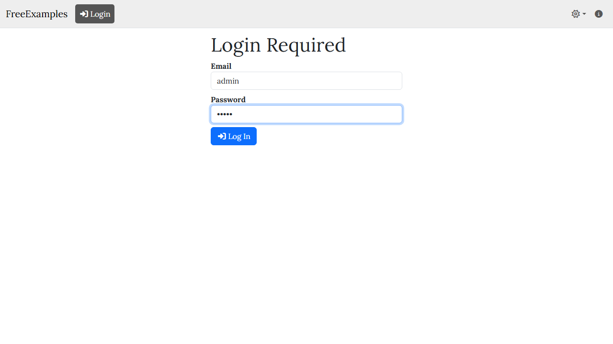
</a>
<br /><strong>② Credentials Filled</strong>
</td>
<td align="center">
<a href="snapshots/_auth-flow/3-result.png">

</a>
<br /><strong>③ After Login</strong>
</td>
</tr></table>

</details>

---

### 📸 All Pages — Public vs Login vs Logged-In (58)

Each page is shown in up to three states: **🔓 Public** (not logged in), **🔑 Login Redirect** (auth redirect), and **🔐 Logged In** (authenticated).

<details open>
<summary><strong>📁 Authorization</strong> (1 pages)</summary>

<table>
<tr>
<td colspan="3" align="center">
<strong><code>/Authorization/NoLocalAccount</code></strong>
<table><tr>
<td align="center">
<a href="snapshots/Authorization/NoLocalAccount/default.png">
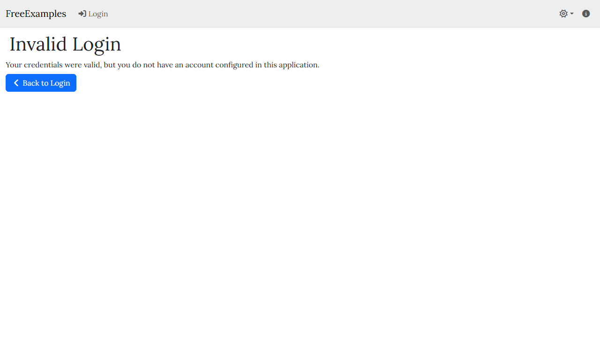
</a>
<br /><sub>🔓 Public</sub>
</td>
<td align="center">
<sub><em>public page</em></sub>
<br /><sub>—</sub>
</td>
<td align="center">
<a href="snapshots/Authorization/NoLocalAccount/logged-in.png">

</a>
<br /><sub>🔐 Logged In</sub>
</td>
</tr></table>
</td>
</tr>
</table>

</details>

<details open>
<summary><strong>📁 DatabaseOffline</strong> (1 pages)</summary>

<table>
<tr>
<td colspan="3" align="center">
<strong><code>/DatabaseOffline</code></strong>
<table><tr>
<td align="center">
<a href="snapshots/DatabaseOffline/default.png">
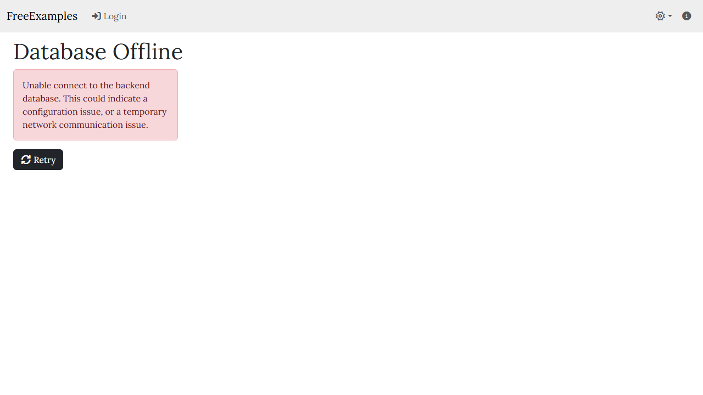
</a>
<br /><sub>🔓 Public</sub>
</td>
<td align="center">
<sub><em>public page</em></sub>
<br /><sub>—</sub>
</td>
<td align="center">
<a href="snapshots/DatabaseOffline/logged-in.png">
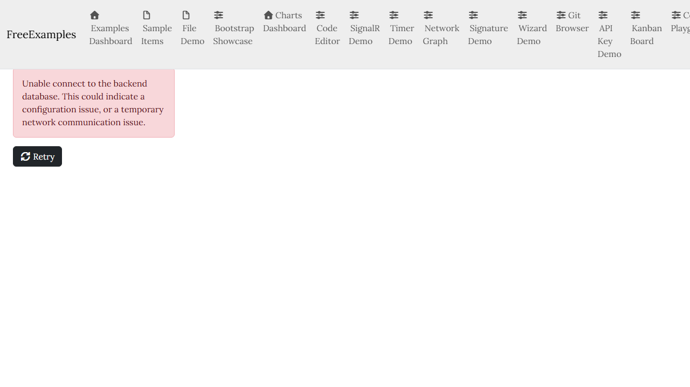
</a>
<br /><sub>🔐 Logged In</sub>
</td>
</tr></table>
</td>
</tr>
</table>

</details>

<details open>
<summary><strong>📁 Error</strong> (1 pages)</summary>

<table>
<tr>
<td colspan="3" align="center">
<strong><code>/Error</code></strong>
<table><tr>
<td align="center">
<a href="snapshots/Error/default.png">

</a>
<br /><sub>🔓 Public</sub>
</td>
<td align="center">
<sub><em>public page</em></sub>
<br /><sub>—</sub>
</td>
<td align="center">
<a href="snapshots/Error/logged-in.png">

</a>
<br /><sub>🔐 Logged In</sub>
</td>
</tr></table>
</td>
</tr>
</table>

</details>

<details open>
<summary><strong>📁 InvalidTenantCode</strong> (1 pages)</summary>

<table>
<tr>
<td colspan="3" align="center">
<strong><code>/InvalidTenantCode</code></strong>
<table><tr>
<td align="center">
<a href="snapshots/InvalidTenantCode/default.png">

</a>
<br /><sub>🔓 Public</sub>
</td>
<td align="center">
<sub><em>public page</em></sub>
<br /><sub>—</sub>
</td>
<td align="center">
<a href="snapshots/InvalidTenantCode/logged-in.png">

</a>
<br /><sub>🔐 Logged In</sub>
</td>
</tr></table>
</td>
</tr>
</table>

</details>

<details open>
<summary><strong>📁 MissingTenantCode</strong> (1 pages)</summary>

<table>
<tr>
<td colspan="3" align="center">
<strong><code>/MissingTenantCode</code></strong>
<table><tr>
<td align="center">
<a href="snapshots/MissingTenantCode/default.png">

</a>
<br /><sub>🔓 Public</sub>
</td>
<td align="center">
<sub><em>public page</em></sub>
<br /><sub>—</sub>
</td>
<td align="center">
<a href="snapshots/MissingTenantCode/logged-in.png">
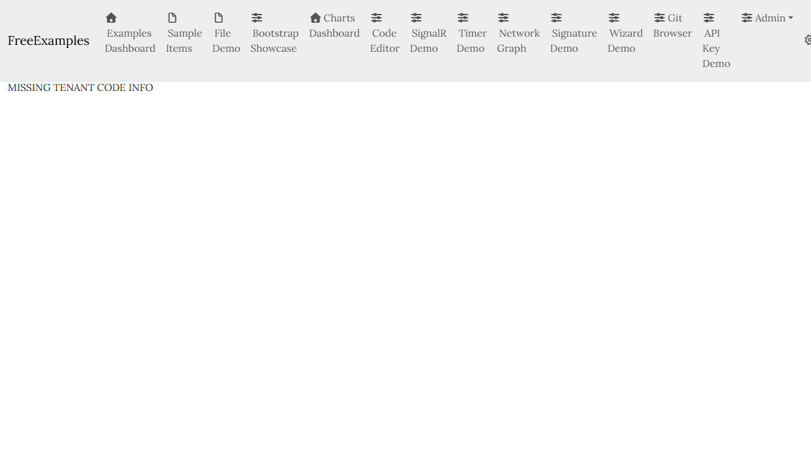
</a>
<br /><sub>🔐 Logged In</sub>
</td>
</tr></table>
</td>
</tr>
</table>

</details>

<details open>
<summary><strong>📁 not-found</strong> (1 pages)</summary>

<table>
<tr>
<td colspan="3" align="center">
<strong><code>/not-found</code></strong>
<table><tr>
<td align="center">
<a href="snapshots/not-found/default.png">

</a>
<br /><sub>🔓 Public</sub>
</td>
<td align="center">
<sub><em>public page</em></sub>
<br /><sub>—</sub>
</td>
<td align="center">
<a href="snapshots/not-found/logged-in.png">

</a>
<br /><sub>🔐 Logged In</sub>
</td>
</tr></table>
</td>
</tr>
</table>

</details>

<details open>
<summary><strong>📁 Home</strong> (1 pages)</summary>

<table>
<tr>
<td colspan="3" align="center">
<strong><code>/root</code></strong>
<table><tr>
<td align="center">
<a href="snapshots/root/default.png">

</a>
<br /><sub>🔓 Public</sub>
</td>
<td align="center">
<sub><em>public page</em></sub>
<br /><sub>—</sub>
</td>
<td align="center">
<a href="snapshots/root/logged-in.png">

</a>
<br /><sub>🔐 Logged In</sub>
</td>
</tr></table>
</td>
</tr>
</table>

</details>

<details open>
<summary><strong>📁 Setup</strong> (1 pages)</summary>

<table>
<tr>
<td colspan="3" align="center">
<strong><code>/Setup</code></strong>
<table><tr>
<td align="center">
<a href="snapshots/Setup/default.png">

</a>
<br /><sub>🔓 Public</sub>
</td>
<td align="center">
<sub><em>public page</em></sub>
<br /><sub>—</sub>
</td>
<td align="center">
<a href="snapshots/Setup/logged-in.png">

</a>
<br /><sub>🔐 Logged In</sub>
</td>
</tr></table>
</td>
</tr>
</table>

</details>

<details open>
<summary><strong>📁 tenant1</strong> (50 pages)</summary>

<table>
<tr>
<td colspan="3" align="center">
<strong><code>/tenant1</code></strong>
<table><tr>
<td align="center">
<a href="snapshots/tenant1/default.png">

</a>
<br /><sub>🔓 Public</sub>
</td>
<td align="center">
<sub><em>public page</em></sub>
<br /><sub>—</sub>
</td>
<td align="center">
<a href="snapshots/tenant1/logged-in.png">

</a>
<br /><sub>🔐 Logged In</sub>
</td>
</tr></table>
</td>
</tr>
<tr>
<td colspan="3" align="center">
<strong><code>/tenant1/About</code></strong>
<table><tr>
<td align="center">
<a href="snapshots/tenant1/About/default.png">

</a>
<br /><sub>🔓 Public</sub>
</td>
<td align="center">
<sub><em>public page</em></sub>
<br /><sub>—</sub>
</td>
<td align="center">
<a href="snapshots/tenant1/About/logged-in.png">

</a>
<br /><sub>🔐 Logged In</sub>
</td>
</tr></table>
</td>
</tr>
<tr>
<td colspan="3" align="center">
<strong><code>/tenant1/Authorization/AccessDenied</code></strong>
<table><tr>
<td align="center">
<a href="snapshots/tenant1/Authorization/AccessDenied/default.png">
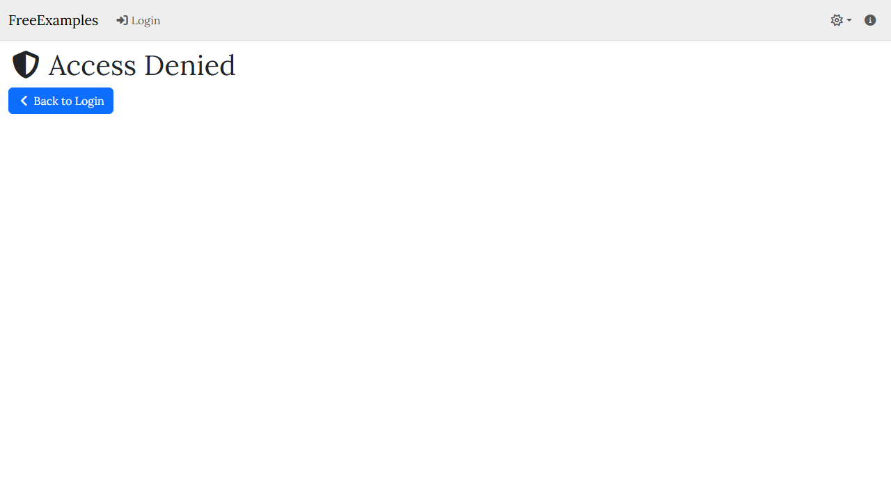
</a>
<br /><sub>🔓 Public</sub>
</td>
<td align="center">
<sub><em>public page</em></sub>
<br /><sub>—</sub>
</td>
<td align="center">
<a href="snapshots/tenant1/Authorization/AccessDenied/logged-in.png">

</a>
<br /><sub>🔐 Logged In</sub>
</td>
</tr></table>
</td>
</tr>
<tr>
<td colspan="3" align="center">
<strong><code>/tenant1/Authorization/InvalidUser</code></strong>
<table><tr>
<td align="center">
<a href="snapshots/tenant1/Authorization/InvalidUser/default.png">
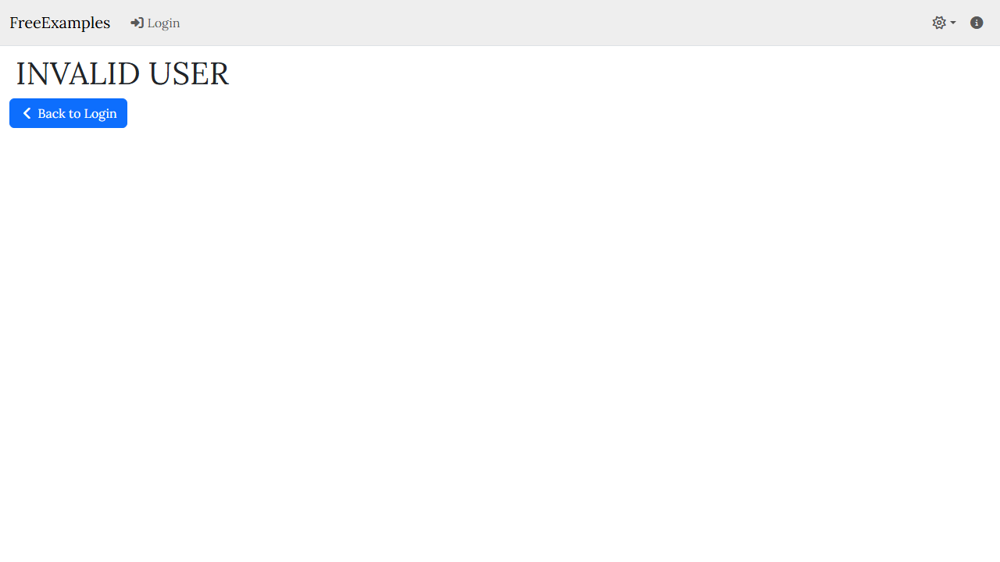
</a>
<br /><sub>🔓 Public</sub>
</td>
<td align="center">
<sub><em>public page</em></sub>
<br /><sub>—</sub>
</td>
<td align="center">
<a href="snapshots/tenant1/Authorization/InvalidUser/logged-in.png">

</a>
<br /><sub>🔐 Logged In</sub>
</td>
</tr></table>
</td>
</tr>
<tr>
<td colspan="3" align="center">
<strong><code>/tenant1/Authorization/NoLocalAccout</code></strong>
<table><tr>
<td align="center">
<a href="snapshots/tenant1/Authorization/NoLocalAccout/default.png">

</a>
<br /><sub>🔓 Public</sub>
</td>
<td align="center">
<sub><em>public page</em></sub>
<br /><sub>—</sub>
</td>
<td align="center">
<a href="snapshots/tenant1/Authorization/NoLocalAccout/logged-in.png">
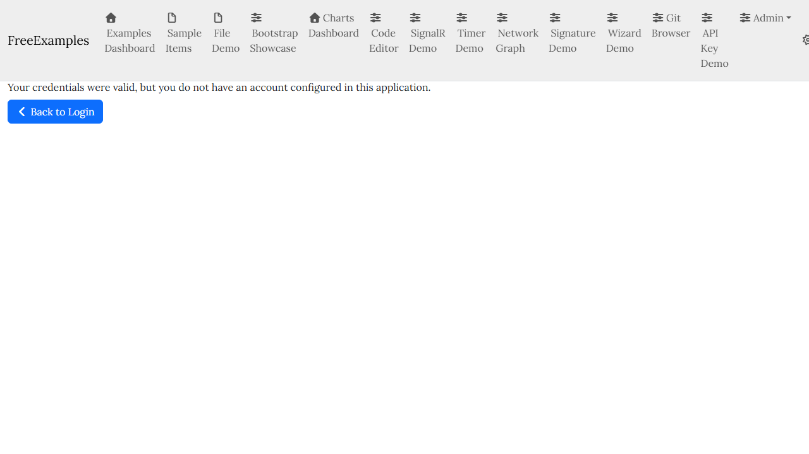
</a>
<br /><sub>🔐 Logged In</sub>
</td>
</tr></table>
</td>
</tr>
<tr>
<td colspan="3" align="center">
<strong><code>/tenant1/ChangePassword</code></strong>
<table><tr>
<td align="center">
<a href="snapshots/tenant1/ChangePassword/default.png">

</a>
<br /><sub>🔓 Public</sub>
</td>
<td align="center">
<sub><em>public page</em></sub>
<br /><sub>—</sub>
</td>
<td align="center">
<a href="snapshots/tenant1/ChangePassword/logged-in.png">

</a>
<br /><sub>🔐 Logged In</sub>
</td>
</tr></table>
</td>
</tr>
<tr>
<td colspan="3" align="center">
<strong><code>/tenant1/DoubleClick</code></strong>
<table><tr>
<td align="center">
<a href="snapshots/tenant1/DoubleClick/default.png">

</a>
<br /><sub>🔓 Public</sub>
</td>
<td align="center">
<sub><em>public page</em></sub>
<br /><sub>—</sub>
</td>
<td align="center">
<a href="snapshots/tenant1/DoubleClick/logged-in.png">

</a>
<br /><sub>🔐 Logged In</sub>
</td>
</tr></table>
</td>
</tr>
<tr>
<td colspan="3" align="center">
<strong><code>/tenant1/DynamicComponent</code></strong>
<table><tr>
<td align="center">
<a href="snapshots/tenant1/DynamicComponent/default.png">

</a>
<br /><sub>🔓 Public</sub>
</td>
<td align="center">
<sub><em>public page</em></sub>
<br /><sub>—</sub>
</td>
<td align="center">
<a href="snapshots/tenant1/DynamicComponent/logged-in.png">

</a>
<br /><sub>🔐 Logged In</sub>
</td>
</tr></table>
</td>
</tr>
<tr>
<td colspan="3" align="center">
<strong><code>/tenant1/Examples/ApiKeyDemo</code></strong>
<table><tr>
<td align="center">
<a href="snapshots/tenant1/Examples/ApiKeyDemo/default.png">

</a>
<br /><sub>🔓 Public</sub>
</td>
<td align="center">
<sub><em>public page</em></sub>
<br /><sub>—</sub>
</td>
<td align="center">
<a href="snapshots/tenant1/Examples/ApiKeyDemo/logged-in.png">
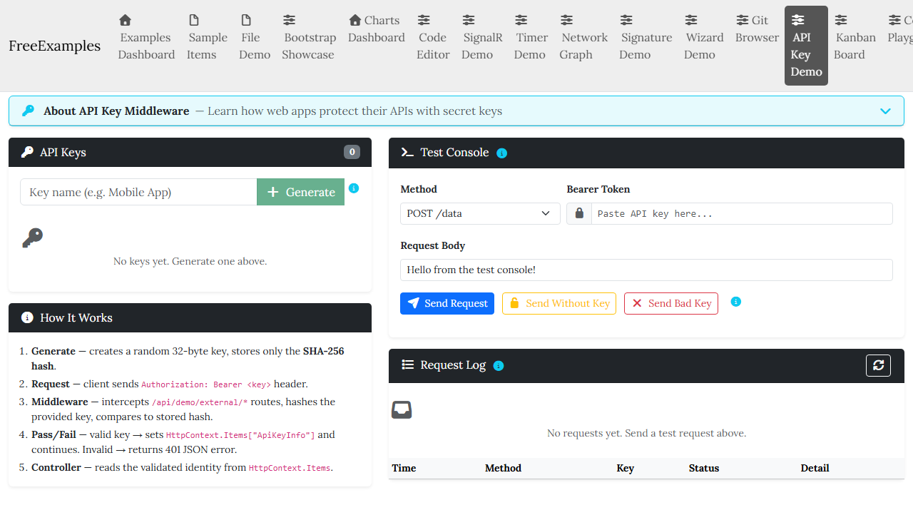
</a>
<br /><sub>🔐 Logged In</sub>
</td>
</tr></table>
</td>
</tr>
<tr>
<td colspan="3" align="center">
<strong><code>/tenant1/Examples/BootstrapShowcase</code></strong>
<table><tr>
<td align="center">
<a href="snapshots/tenant1/Examples/BootstrapShowcase/default.png">

</a>
<br /><sub>🔓 Public</sub>
</td>
<td align="center">
<sub><em>public page</em></sub>
<br /><sub>—</sub>
</td>
<td align="center">
<a href="snapshots/tenant1/Examples/BootstrapShowcase/logged-in.png">
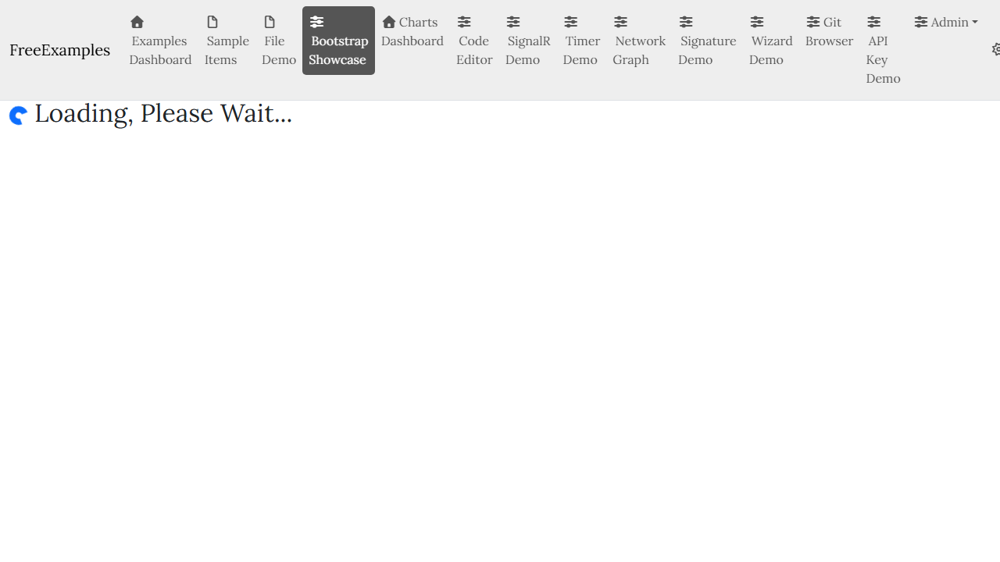
</a>
<br /><sub>🔐 Logged In</sub>
</td>
</tr></table>
</td>
</tr>
<tr>
<td colspan="3" align="center">
<strong><code>/tenant1/Examples/ChartsDashboard</code></strong>
<table><tr>
<td align="center">
<a href="snapshots/tenant1/Examples/ChartsDashboard/default.png">

</a>
<br /><sub>🔓 Public</sub>
</td>
<td align="center">
<sub><em>public page</em></sub>
<br /><sub>—</sub>
</td>
<td align="center">
<a href="snapshots/tenant1/Examples/ChartsDashboard/logged-in.png">
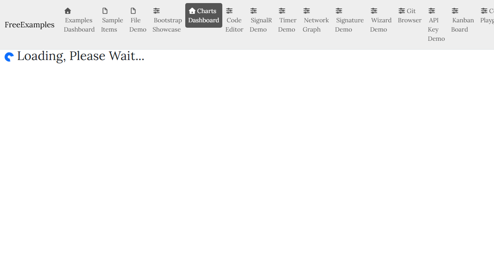
</a>
<br /><sub>🔐 Logged In</sub>
</td>
</tr></table>
</td>
</tr>
<tr>
<td colspan="3" align="center">
<strong><code>/tenant1/Examples/CodeEditor</code></strong>
<table><tr>
<td align="center">
<a href="snapshots/tenant1/Examples/CodeEditor/default.png">

</a>
<br /><sub>🔓 Public</sub>
</td>
<td align="center">
<sub><em>public page</em></sub>
<br /><sub>—</sub>
</td>
<td align="center">
<a href="snapshots/tenant1/Examples/CodeEditor/logged-in.png">
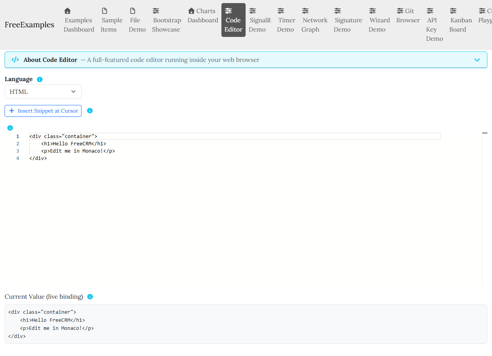
</a>
<br /><sub>🔐 Logged In</sub>
</td>
</tr></table>
</td>
</tr>
<tr>
<td colspan="3" align="center">
<strong><code>/tenant1/Examples/Dashboard</code></strong>
<table><tr>
<td align="center">
<a href="snapshots/tenant1/Examples/Dashboard/default.png">

</a>
<br /><sub>🔓 Public</sub>
</td>
<td align="center">
<sub><em>public page</em></sub>
<br /><sub>—</sub>
</td>
<td align="center">
<a href="snapshots/tenant1/Examples/Dashboard/logged-in.png">
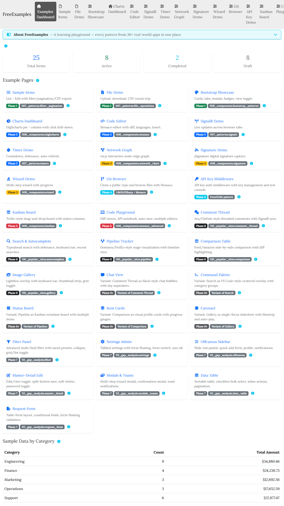
</a>
<br /><sub>🔐 Logged In</sub>
</td>
</tr></table>
</td>
</tr>
<tr>
<td colspan="3" align="center">
<strong><code>/tenant1/Examples/EditSampleItem/New</code></strong>
<table><tr>
<td align="center">
<a href="snapshots/tenant1/Examples/EditSampleItem/New/default.png">
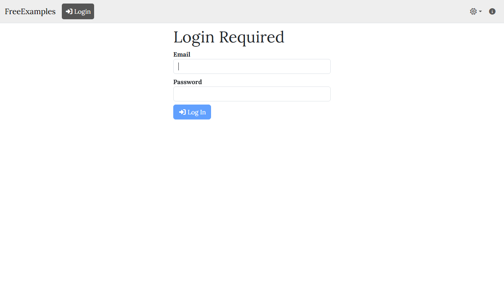
</a>
<br /><sub>🔓 Public</sub>
</td>
<td align="center">
<sub><em>public page</em></sub>
<br /><sub>—</sub>
</td>
<td align="center">
<a href="snapshots/tenant1/Examples/EditSampleItem/New/logged-in.png">
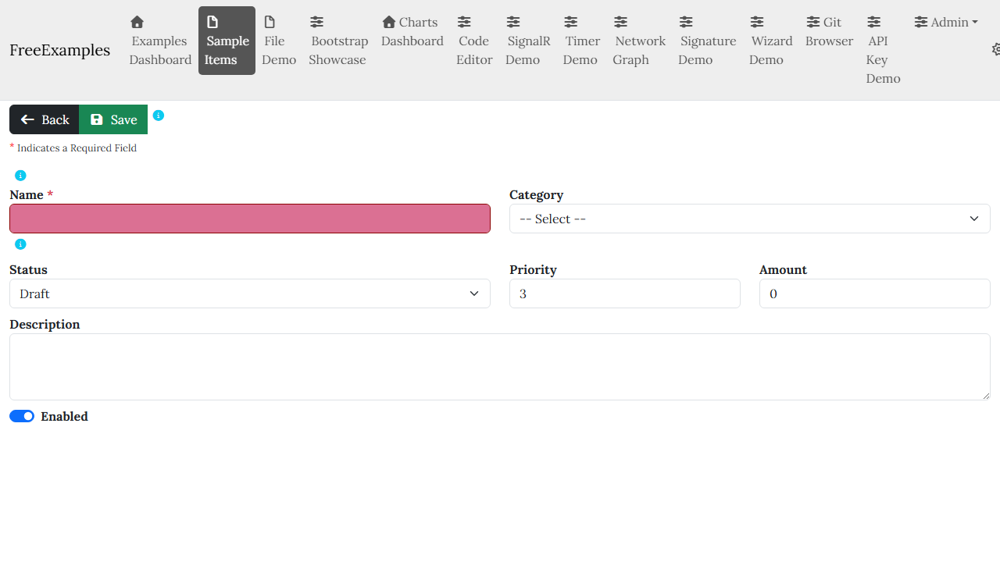
</a>
<br /><sub>🔐 Logged In</sub>
</td>
</tr></table>
</td>
</tr>
<tr>
<td colspan="3" align="center">
<strong><code>/tenant1/Examples/FileDemo</code></strong>
<table><tr>
<td align="center">
<a href="snapshots/tenant1/Examples/FileDemo/default.png">

</a>
<br /><sub>🔓 Public</sub>
</td>
<td align="center">
<sub><em>public page</em></sub>
<br /><sub>—</sub>
</td>
<td align="center">
<a href="snapshots/tenant1/Examples/FileDemo/logged-in.png">
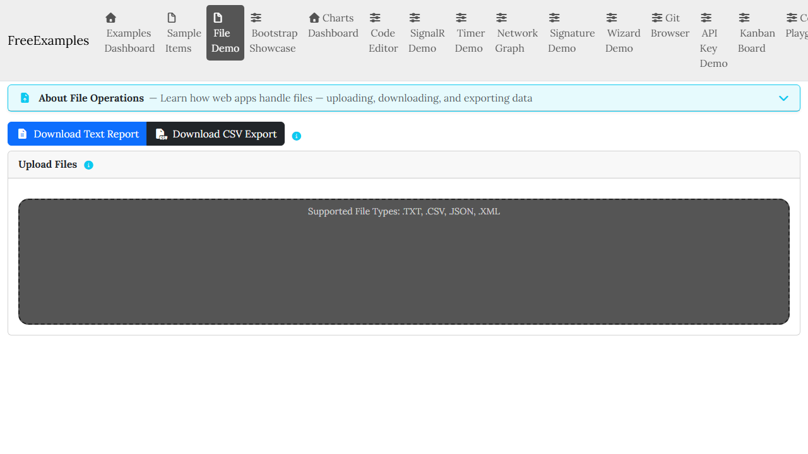
</a>
<br /><sub>🔐 Logged In</sub>
</td>
</tr></table>
</td>
</tr>
<tr>
<td colspan="3" align="center">
<strong><code>/tenant1/Examples/GitBrowser</code></strong>
<table><tr>
<td align="center">
<a href="snapshots/tenant1/Examples/GitBrowser/default.png">

</a>
<br /><sub>🔓 Public</sub>
</td>
<td align="center">
<sub><em>public page</em></sub>
<br /><sub>—</sub>
</td>
<td align="center">
<a href="snapshots/tenant1/Examples/GitBrowser/logged-in.png">
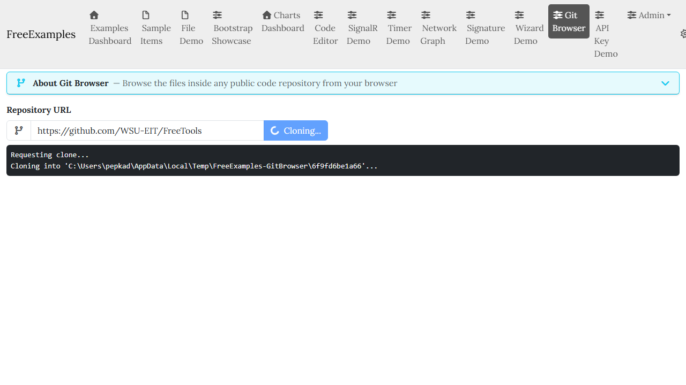
</a>
<br /><sub>🔐 Logged In</sub>
</td>
</tr></table>
</td>
</tr>
<tr>
<td colspan="3" align="center">
<strong><code>/tenant1/Examples/NetworkGraph</code></strong>
<table><tr>
<td align="center">
<a href="snapshots/tenant1/Examples/NetworkGraph/default.png">

</a>
<br /><sub>🔓 Public</sub>
</td>
<td align="center">
<sub><em>public page</em></sub>
<br /><sub>—</sub>
</td>
<td align="center">
<a href="snapshots/tenant1/Examples/NetworkGraph/logged-in.png">
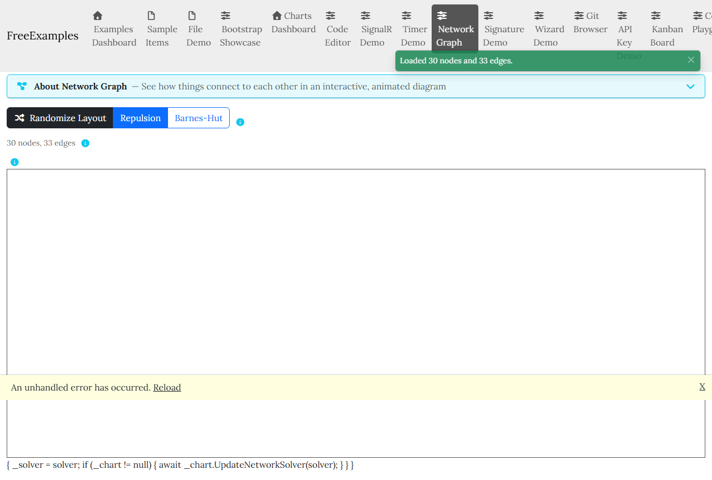
</a>
<br /><sub>🔐 Logged In</sub>
</td>
</tr></table>
</td>
</tr>
<tr>
<td colspan="3" align="center">
<strong><code>/tenant1/Examples/SampleItems</code></strong>
<table><tr>
<td align="center">
<a href="snapshots/tenant1/Examples/SampleItems/default.png">

</a>
<br /><sub>🔓 Public</sub>
</td>
<td align="center">
<sub><em>public page</em></sub>
<br /><sub>—</sub>
</td>
<td align="center">
<a href="snapshots/tenant1/Examples/SampleItems/logged-in.png">
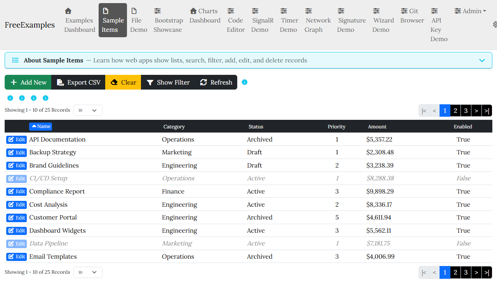
</a>
<br /><sub>🔐 Logged In</sub>
</td>
</tr></table>
</td>
</tr>
<tr>
<td colspan="3" align="center">
<strong><code>/tenant1/Examples/SignalRDemo</code></strong>
<table><tr>
<td align="center">
<a href="snapshots/tenant1/Examples/SignalRDemo/default.png">
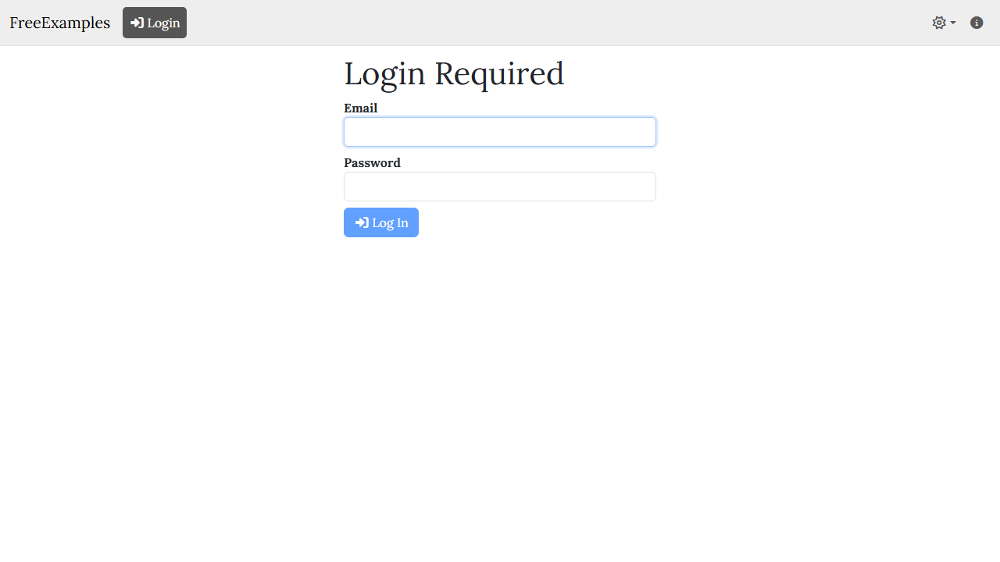
</a>
<br /><sub>🔓 Public</sub>
</td>
<td align="center">
<sub><em>public page</em></sub>
<br /><sub>—</sub>
</td>
<td align="center">
<a href="snapshots/tenant1/Examples/SignalRDemo/logged-in.png">
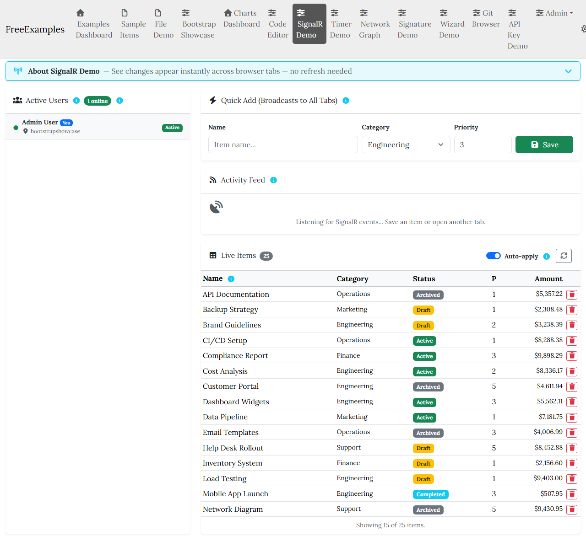
</a>
<br /><sub>🔐 Logged In</sub>
</td>
</tr></table>
</td>
</tr>
<tr>
<td colspan="3" align="center">
<strong><code>/tenant1/Examples/SignatureDemo</code></strong>
<table><tr>
<td align="center">
<a href="snapshots/tenant1/Examples/SignatureDemo/default.png">

</a>
<br /><sub>🔓 Public</sub>
</td>
<td align="center">
<sub><em>public page</em></sub>
<br /><sub>—</sub>
</td>
<td align="center">
<a href="snapshots/tenant1/Examples/SignatureDemo/logged-in.png">
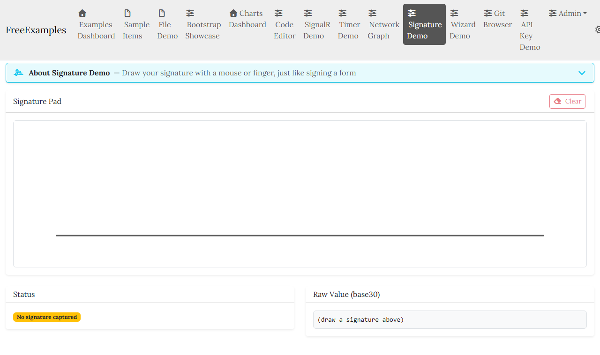
</a>
<br /><sub>🔐 Logged In</sub>
</td>
</tr></table>
</td>
</tr>
<tr>
<td colspan="3" align="center">
<strong><code>/tenant1/Examples/TimerDemo</code></strong>
<table><tr>
<td align="center">
<a href="snapshots/tenant1/Examples/TimerDemo/default.png">

</a>
<br /><sub>🔓 Public</sub>
</td>
<td align="center">
<sub><em>public page</em></sub>
<br /><sub>—</sub>
</td>
<td align="center">
<a href="snapshots/tenant1/Examples/TimerDemo/logged-in.png">
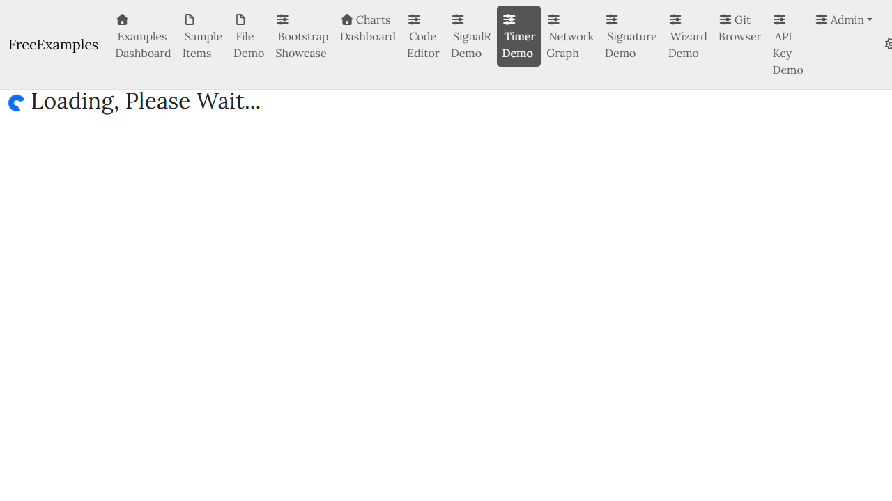
</a>
<br /><sub>🔐 Logged In</sub>
</td>
</tr></table>
</td>
</tr>
<tr>
<td colspan="3" align="center">
<strong><code>/tenant1/Examples/WizardDemo</code></strong>
<table><tr>
<td align="center">
<a href="snapshots/tenant1/Examples/WizardDemo/default.png">

</a>
<br /><sub>🔓 Public</sub>
</td>
<td align="center">
<sub><em>public page</em></sub>
<br /><sub>—</sub>
</td>
<td align="center">
<a href="snapshots/tenant1/Examples/WizardDemo/logged-in.png">

</a>
<br /><sub>🔐 Logged In</sub>
</td>
</tr></table>
</td>
</tr>
<tr>
<td colspan="3" align="center">
<strong><code>/tenant1/Login</code></strong>
<table><tr>
<td align="center">
<a href="snapshots/tenant1/Login/default.png">

</a>
<br /><sub>🔓 Public</sub>
</td>
<td align="center">
<sub><em>public page</em></sub>
<br /><sub>—</sub>
</td>
<td align="center">
<a href="snapshots/tenant1/Login/logged-in.png">

</a>
<br /><sub>🔐 Logged In</sub>
</td>
</tr></table>
</td>
</tr>
<tr>
<td colspan="3" align="center">
<strong><code>/tenant1/Logout</code></strong>
<table><tr>
<td align="center">
<a href="snapshots/tenant1/Logout/default.png">

</a>
<br /><sub>🔓 Public</sub>
</td>
<td align="center">
<sub><em>public page</em></sub>
<br /><sub>—</sub>
</td>
<td align="center">
<a href="snapshots/tenant1/Logout/logged-in.png">

</a>
<br /><sub>🔐 Logged In</sub>
</td>
</tr></table>
</td>
</tr>
<tr>
<td colspan="3" align="center">
<strong><code>/tenant1/Monaco</code></strong>
<table><tr>
<td align="center">
<a href="snapshots/tenant1/Monaco/default.png">

</a>
<br /><sub>🔓 Public</sub>
</td>
<td align="center">
<sub><em>public page</em></sub>
<br /><sub>—</sub>
</td>
<td align="center">
<a href="snapshots/tenant1/Monaco/logged-in.png">

</a>
<br /><sub>🔐 Logged In</sub>
</td>
</tr></table>
</td>
</tr>
<tr>
<td colspan="3" align="center">
<strong><code>/tenant1/PasswordChanged</code></strong>
<table><tr>
<td align="center">
<a href="snapshots/tenant1/PasswordChanged/default.png">

</a>
<br /><sub>🔓 Public</sub>
</td>
<td align="center">
<sub><em>public page</em></sub>
<br /><sub>—</sub>
</td>
<td align="center">
<sub><em>no auth capture</em></sub>
<br /><sub>🔐 Logged In</sub>
</td>
</tr></table>
</td>
</tr>
<tr>
<td colspan="3" align="center">
<strong><code>/tenant1/Plugins</code></strong>
<table><tr>
<td align="center">
<a href="snapshots/tenant1/Plugins/default.png">

</a>
<br /><sub>🔓 Public</sub>
</td>
<td align="center">
<sub><em>public page</em></sub>
<br /><sub>—</sub>
</td>
<td align="center">
<a href="snapshots/tenant1/Plugins/logged-in.png">

</a>
<br /><sub>🔐 Logged In</sub>
</td>
</tr></table>
</td>
</tr>
<tr>
<td colspan="3" align="center">
<strong><code>/tenant1/ProcessLogin</code></strong>
<table><tr>
<td align="center">
<a href="snapshots/tenant1/ProcessLogin/default.png">
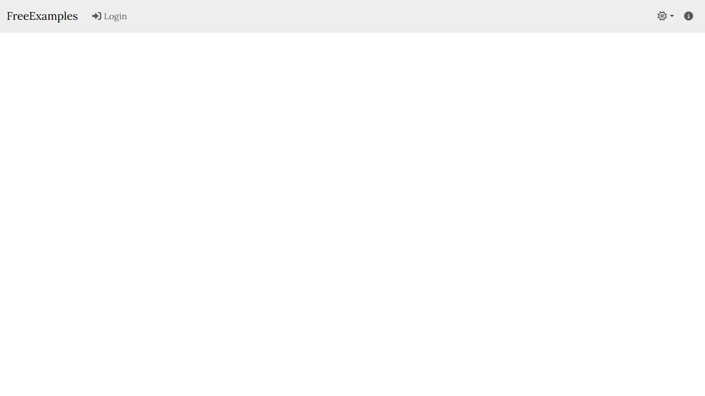
</a>
<br /><sub>🔓 Public</sub>
</td>
<td align="center">
<sub><em>public page</em></sub>
<br /><sub>—</sub>
</td>
<td align="center">
<a href="snapshots/tenant1/ProcessLogin/logged-in.png">

</a>
<br /><sub>🔐 Logged In</sub>
</td>
</tr></table>
</td>
</tr>
<tr>
<td colspan="3" align="center">
<strong><code>/tenant1/Profile</code></strong>
<table><tr>
<td align="center">
<a href="snapshots/tenant1/Profile/default.png">

</a>
<br /><sub>🔓 Public</sub>
</td>
<td align="center">
<sub><em>public page</em></sub>
<br /><sub>—</sub>
</td>
<td align="center">
<a href="snapshots/tenant1/Profile/logged-in.png">
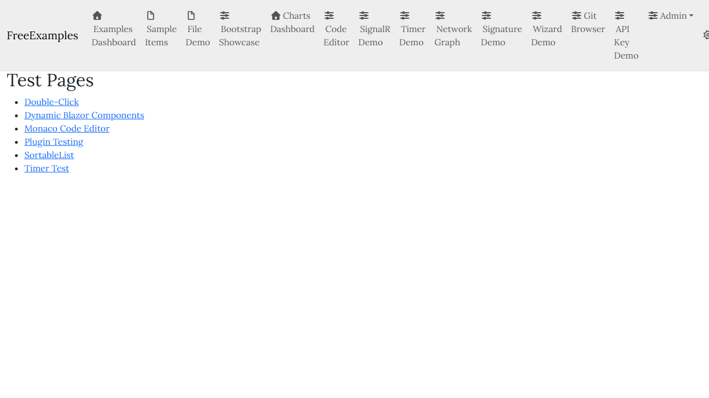
</a>
<br /><sub>🔐 Logged In</sub>
</td>
</tr></table>
</td>
</tr>
<tr>
<td colspan="3" align="center">
<strong><code>/tenant1/ServerUpdated</code></strong>
<table><tr>
<td align="center">
<a href="snapshots/tenant1/ServerUpdated/default.png">

</a>
<br /><sub>🔓 Public</sub>
</td>
<td align="center">
<sub><em>public page</em></sub>
<br /><sub>—</sub>
</td>
<td align="center">
<a href="snapshots/tenant1/ServerUpdated/logged-in.png">

</a>
<br /><sub>🔐 Logged In</sub>
</td>
</tr></table>
</td>
</tr>
<tr>
<td colspan="3" align="center">
<strong><code>/tenant1/Settings</code></strong>
<table><tr>
<td align="center">
<a href="snapshots/tenant1/Settings/default.png">

</a>
<br /><sub>🔓 Public</sub>
</td>
<td align="center">
<sub><em>public page</em></sub>
<br /><sub>—</sub>
</td>
<td align="center">
<a href="snapshots/tenant1/Settings/logged-in.png">

</a>
<br /><sub>🔐 Logged In</sub>
</td>
</tr></table>
</td>
</tr>
<tr>
<td colspan="3" align="center">
<strong><code>/tenant1/Settings/AddDepartment</code></strong>
<table><tr>
<td align="center">
<a href="snapshots/tenant1/Settings/AddDepartment/default.png">

</a>
<br /><sub>🔓 Public</sub>
</td>
<td align="center">
<sub><em>public page</em></sub>
<br /><sub>—</sub>
</td>
<td align="center">
<a href="snapshots/tenant1/Settings/AddDepartment/logged-in.png">

</a>
<br /><sub>🔐 Logged In</sub>
</td>
</tr></table>
</td>
</tr>
<tr>
<td colspan="3" align="center">
<strong><code>/tenant1/Settings/AddDepartmentGroup</code></strong>
<table><tr>
<td align="center">
<a href="snapshots/tenant1/Settings/AddDepartmentGroup/default.png">

</a>
<br /><sub>🔓 Public</sub>
</td>
<td align="center">
<sub><em>public page</em></sub>
<br /><sub>—</sub>
</td>
<td align="center">
<a href="snapshots/tenant1/Settings/AddDepartmentGroup/logged-in.png">

</a>
<br /><sub>🔐 Logged In</sub>
</td>
</tr></table>
</td>
</tr>
<tr>
<td colspan="3" align="center">
<strong><code>/tenant1/Settings/AddTag</code></strong>
<table><tr>
<td align="center">
<a href="snapshots/tenant1/Settings/AddTag/default.png">

</a>
<br /><sub>🔓 Public</sub>
</td>
<td align="center">
<sub><em>public page</em></sub>
<br /><sub>—</sub>
</td>
<td align="center">
<a href="snapshots/tenant1/Settings/AddTag/logged-in.png">

</a>
<br /><sub>🔐 Logged In</sub>
</td>
</tr></table>
</td>
</tr>
<tr>
<td colspan="3" align="center">
<strong><code>/tenant1/Settings/AddTenant</code></strong>
<table><tr>
<td align="center">
<a href="snapshots/tenant1/Settings/AddTenant/default.png">

</a>
<br /><sub>🔓 Public</sub>
</td>
<td align="center">
<sub><em>public page</em></sub>
<br /><sub>—</sub>
</td>
<td align="center">
<a href="snapshots/tenant1/Settings/AddTenant/logged-in.png">

</a>
<br /><sub>🔐 Logged In</sub>
</td>
</tr></table>
</td>
</tr>
<tr>
<td colspan="3" align="center">
<strong><code>/tenant1/Settings/AddUser</code></strong>
<table><tr>
<td align="center">
<a href="snapshots/tenant1/Settings/AddUser/default.png">

</a>
<br /><sub>🔓 Public</sub>
</td>
<td align="center">
<sub><em>public page</em></sub>
<br /><sub>—</sub>
</td>
<td align="center">
<a href="snapshots/tenant1/Settings/AddUser/logged-in.png">

</a>
<br /><sub>🔐 Logged In</sub>
</td>
</tr></table>
</td>
</tr>
<tr>
<td colspan="3" align="center">
<strong><code>/tenant1/Settings/AddUserGroup</code></strong>
<table><tr>
<td align="center">
<a href="snapshots/tenant1/Settings/AddUserGroup/default.png">

</a>
<br /><sub>🔓 Public</sub>
</td>
<td align="center">
<sub><em>public page</em></sub>
<br /><sub>—</sub>
</td>
<td align="center">
<a href="snapshots/tenant1/Settings/AddUserGroup/logged-in.png">

</a>
<br /><sub>🔐 Logged In</sub>
</td>
</tr></table>
</td>
</tr>
<tr>
<td colspan="3" align="center">
<strong><code>/tenant1/Settings/AppSettings</code></strong>
<table><tr>
<td align="center">
<a href="snapshots/tenant1/Settings/AppSettings/default.png">

</a>
<br /><sub>🔓 Public</sub>
</td>
<td align="center">
<sub><em>public page</em></sub>
<br /><sub>—</sub>
</td>
<td align="center">
<a href="snapshots/tenant1/Settings/AppSettings/logged-in.png">

</a>
<br /><sub>🔐 Logged In</sub>
</td>
</tr></table>
</td>
</tr>
<tr>
<td colspan="3" align="center">
<strong><code>/tenant1/Settings/DeletedRecords</code></strong>
<table><tr>
<td align="center">
<a href="snapshots/tenant1/Settings/DeletedRecords/default.png">

</a>
<br /><sub>🔓 Public</sub>
</td>
<td align="center">
<sub><em>public page</em></sub>
<br /><sub>—</sub>
</td>
<td align="center">
<a href="snapshots/tenant1/Settings/DeletedRecords/logged-in.png">

</a>
<br /><sub>🔐 Logged In</sub>
</td>
</tr></table>
</td>
</tr>
<tr>
<td colspan="3" align="center">
<strong><code>/tenant1/Settings/DepartmentGroups</code></strong>
<table><tr>
<td align="center">
<a href="snapshots/tenant1/Settings/DepartmentGroups/default.png">

</a>
<br /><sub>🔓 Public</sub>
</td>
<td align="center">
<sub><em>public page</em></sub>
<br /><sub>—</sub>
</td>
<td align="center">
<a href="snapshots/tenant1/Settings/DepartmentGroups/logged-in.png">

</a>
<br /><sub>🔐 Logged In</sub>
</td>
</tr></table>
</td>
</tr>
<tr>
<td colspan="3" align="center">
<strong><code>/tenant1/Settings/Departments</code></strong>
<table><tr>
<td align="center">
<a href="snapshots/tenant1/Settings/Departments/default.png">

</a>
<br /><sub>🔓 Public</sub>
</td>
<td align="center">
<sub><em>public page</em></sub>
<br /><sub>—</sub>
</td>
<td align="center">
<a href="snapshots/tenant1/Settings/Departments/logged-in.png">

</a>
<br /><sub>🔐 Logged In</sub>
</td>
</tr></table>
</td>
</tr>
<tr>
<td colspan="3" align="center">
<strong><code>/tenant1/Settings/Files</code></strong>
<table><tr>
<td align="center">
<a href="snapshots/tenant1/Settings/Files/default.png">

</a>
<br /><sub>🔓 Public</sub>
</td>
<td align="center">
<sub><em>public page</em></sub>
<br /><sub>—</sub>
</td>
<td align="center">
<a href="snapshots/tenant1/Settings/Files/logged-in.png">

</a>
<br /><sub>🔐 Logged In</sub>
</td>
</tr></table>
</td>
</tr>
<tr>
<td colspan="3" align="center">
<strong><code>/tenant1/Settings/Language</code></strong>
<table><tr>
<td align="center">
<a href="snapshots/tenant1/Settings/Language/default.png">

</a>
<br /><sub>🔓 Public</sub>
</td>
<td align="center">
<sub><em>public page</em></sub>
<br /><sub>—</sub>
</td>
<td align="center">
<a href="snapshots/tenant1/Settings/Language/logged-in.png">

</a>
<br /><sub>🔐 Logged In</sub>
</td>
</tr></table>
</td>
</tr>
<tr>
<td colspan="3" align="center">
<strong><code>/tenant1/Settings/Tags</code></strong>
<table><tr>
<td align="center">
<a href="snapshots/tenant1/Settings/Tags/default.png">

</a>
<br /><sub>🔓 Public</sub>
</td>
<td align="center">
<sub><em>public page</em></sub>
<br /><sub>—</sub>
</td>
<td align="center">
<a href="snapshots/tenant1/Settings/Tags/logged-in.png">

</a>
<br /><sub>🔐 Logged In</sub>
</td>
</tr></table>
</td>
</tr>
<tr>
<td colspan="3" align="center">
<strong><code>/tenant1/Settings/Tenants</code></strong>
<table><tr>
<td align="center">
<a href="snapshots/tenant1/Settings/Tenants/default.png">

</a>
<br /><sub>🔓 Public</sub>
</td>
<td align="center">
<sub><em>public page</em></sub>
<br /><sub>—</sub>
</td>
<td align="center">
<a href="snapshots/tenant1/Settings/Tenants/logged-in.png">
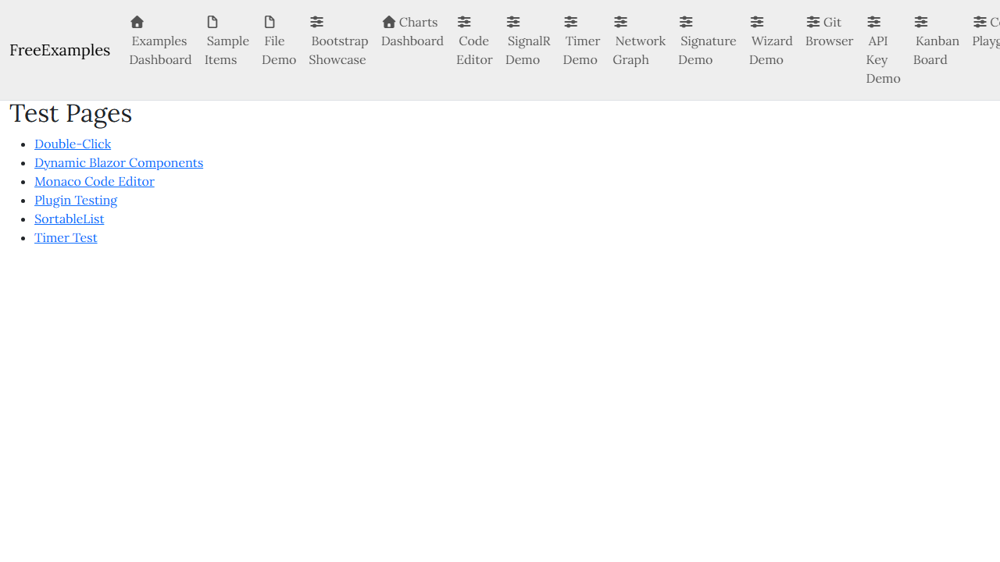
</a>
<br /><sub>🔐 Logged In</sub>
</td>
</tr></table>
</td>
</tr>
<tr>
<td colspan="3" align="center">
<strong><code>/tenant1/Settings/UDF</code></strong>
<table><tr>
<td align="center">
<a href="snapshots/tenant1/Settings/UDF/default.png">

</a>
<br /><sub>🔓 Public</sub>
</td>
<td align="center">
<sub><em>public page</em></sub>
<br /><sub>—</sub>
</td>
<td align="center">
<a href="snapshots/tenant1/Settings/UDF/logged-in.png">

</a>
<br /><sub>🔐 Logged In</sub>
</td>
</tr></table>
</td>
</tr>
<tr>
<td colspan="3" align="center">
<strong><code>/tenant1/Settings/UserGroups</code></strong>
<table><tr>
<td align="center">
<a href="snapshots/tenant1/Settings/UserGroups/default.png">

</a>
<br /><sub>🔓 Public</sub>
</td>
<td align="center">
<sub><em>public page</em></sub>
<br /><sub>—</sub>
</td>
<td align="center">
<a href="snapshots/tenant1/Settings/UserGroups/logged-in.png">

</a>
<br /><sub>🔐 Logged In</sub>
</td>
</tr></table>
</td>
</tr>
<tr>
<td colspan="3" align="center">
<strong><code>/tenant1/Settings/Users</code></strong>
<table><tr>
<td align="center">
<a href="snapshots/tenant1/Settings/Users/default.png">

</a>
<br /><sub>🔓 Public</sub>
</td>
<td align="center">
<sub><em>public page</em></sub>
<br /><sub>—</sub>
</td>
<td align="center">
<a href="snapshots/tenant1/Settings/Users/logged-in.png">

</a>
<br /><sub>🔐 Logged In</sub>
</td>
</tr></table>
</td>
</tr>
<tr>
<td colspan="3" align="center">
<strong><code>/tenant1/SortTest</code></strong>
<table><tr>
<td align="center">
<a href="snapshots/tenant1/SortTest/default.png">

</a>
<br /><sub>🔓 Public</sub>
</td>
<td align="center">
<sub><em>public page</em></sub>
<br /><sub>—</sub>
</td>
<td align="center">
<a href="snapshots/tenant1/SortTest/logged-in.png">

</a>
<br /><sub>🔐 Logged In</sub>
</td>
</tr></table>
</td>
</tr>
<tr>
<td colspan="3" align="center">
<strong><code>/tenant1/TimerTest</code></strong>
<table><tr>
<td align="center">
<a href="snapshots/tenant1/TimerTest/default.png">

</a>
<br /><sub>🔓 Public</sub>
</td>
<td align="center">
<sub><em>public page</em></sub>
<br /><sub>—</sub>
</td>
<td align="center">
<a href="snapshots/tenant1/TimerTest/logged-in.png">

</a>
<br /><sub>🔐 Logged In</sub>
</td>
</tr></table>
</td>
</tr>
</table>

</details>

---

## 🔧 Tool Information

This report was generated by the **WorkspaceReporter** tool, which aggregates outputs from:

| Tool | Purpose |
|------|---------|
| **WorkspaceInventory** | Scans codebase, extracts metrics and classifications |
| **EndpointMapper** | Discovers Blazor routes from `@page` directives |
| **EndpointPoker** | Performs HTTP GET requests to verify routes |
| **BrowserSnapshot** | Captures full-page screenshots with Playwright |

---

**[FreeTools](https://github.com/WSU-EIT/FreeTools)** — Open source workspace analysis tools for .NET projects

Developed by [Enrollment Information Technology](https://em.wsu.edu/eit/meet-our-staff/) at Washington State University

