# 📊 FreeTools Workspace Report

> **Generated:** 2026-03-04 10:39:43  
> **Repository:** FreeExamples  
> **Scope:** Blazor pages only — API endpoints not included  

---

## 📑 Table of Contents

- [About This Report](#-about-this-report)
- [Workspace Overview](#-workspace-overview)
- [File Statistics](#-file-statistics)
- [Code Distribution](#-code-distribution)
- [Largest Files](#-largest-files)
- [Large File Warnings](#%EF%B8%8F-large-file-warnings)
- [Blazor Page Routes](#%EF%B8%8F-blazor-page-routes)
- [Route Map](#-route-map)
- [Screenshot Health](#-screenshot-health)
- [Screenshot Gallery](#-screenshot-gallery)

---

## 📋 About This Report

This report is auto-generated by the **WorkspaceReporter** tool pipeline.

### Scope

| Included | Not Included |
|----------|--------------|
| ✅ Blazor pages (`@page` directives) | ❌ API endpoints (`/api/*`) |
| ✅ Razor components | ❌ Dynamic routes (MapGet/MapPost) |
| ✅ C# source files | ❌ Routes with parameters (`{id}`) |
| ✅ Configuration files | |

### File Categories (Kind)

| Kind | Description |
|------|-------------|
| **RazorPage** | `.razor` file with `@page` directive (routable) |
| **RazorComponent** | `.razor` file without `@page` (reusable component) |
| **CSharpSource** | `.cs` file (classes, services, etc.) |
| **ProjectFile** | `.csproj` file (project configuration) |
| **SolutionFile** | `.sln` file (solution configuration) |
| **Config** | `.json`, `.xml`, `.yaml`, `.yml`, `.config` files |
| **Markdown** | `.md` documentation files |

---

## ⚠️ Workspace Overview

> Workspace inventory CSV is empty.

## 🛤️ Blazor Page Routes

> **Note:** This section shows Blazor pages with `@page` directives only.
> API endpoints (`/api/*`) are not included. Routes with parameters are skipped.

### Route Summary

| Metric | Count |
|--------|------:|
| **Testable Routes** | 117 |
| **Public Routes** | 117 |
| **Auth Required** | 0 |
| **Skipped (parameters)** | 125 |

### Access Distribution

```
🔓 Public:     [██████████████████████████████░] 100%
🔐 Protected:  [█░░░░░░░░░░░░░░░░░░░░░░░░░░░░░░] 0%
```

### Routes by Area

<details>
<summary><strong>FreeExamples</strong> (1 routes)</summary>

| Route | Auth |
|-------|:----:|
| `/Error` | 🔓 |

</details>

<details>
<summary><strong>FreeExamples.Client</strong> (115 routes)</summary>

| Route | Auth |
|-------|:----:|
| `/` | 🔓 |
| `/About` | 🔓 |
| `/Authorization/AccessDenied` | 🔓 |
| `/Authorization/InvalidUser` | 🔓 |
| `/ChangePassword` | 🔓 |
| `/DatabaseOffline` | 🔓 |
| `/DoubleClick` | 🔓 |
| `/DynamicComponent` | 🔓 |
| `/Examples/ApiKeyDemo` | 🔓 |
| `/Examples/BootstrapShowcase` | 🔓 |
| `/Examples/BootstrapV1` | 🔓 |
| `/Examples/BootstrapV10` | 🔓 |
| `/Examples/BootstrapV11` | 🔓 |
| `/Examples/BootstrapV12` | 🔓 |
| `/Examples/BootstrapV2` | 🔓 |
| `/Examples/BootstrapV3` | 🔓 |
| `/Examples/BootstrapV4` | 🔓 |
| `/Examples/BootstrapV5` | 🔓 |
| `/Examples/BootstrapV6` | 🔓 |
| `/Examples/BootstrapV7` | 🔓 |
| `/Examples/BootstrapV8` | 🔓 |
| `/Examples/BootstrapV9` | 🔓 |
| `/Examples/Carousel` | 🔓 |
| `/Examples/ChartsDashboard` | 🔓 |
| `/Examples/ChartsV1` | 🔓 |
| `/Examples/ChartsV2` | 🔓 |
| `/Examples/ChartsV3` | 🔓 |
| `/Examples/ChartsV4` | 🔓 |
| `/Examples/ChartsV5` | 🔓 |
| `/Examples/ChatView` | 🔓 |
| `/Examples/CodeEditor` | 🔓 |
| `/Examples/CodeEditorV1` | 🔓 |
| `/Examples/CodeEditorV2` | 🔓 |
| `/Examples/CodeEditorV3` | 🔓 |
| `/Examples/CodeEditorV4` | 🔓 |
| `/Examples/CodeEditorV5` | 🔓 |
| `/Examples/CodePlayground` | 🔓 |
| `/Examples/CommandPalette` | 🔓 |
| `/Examples/CommentThread` | 🔓 |
| `/Examples/ComparisonTable` | 🔓 |
| `/Examples/Dashboard` | 🔓 |
| `/Examples/EditSampleItem/New` | 🔓 |
| `/Examples/FileDemo` | 🔓 |
| `/Examples/FileDemoV1` | 🔓 |
| `/Examples/FileDemoV2` | 🔓 |
| `/Examples/FileDemoV3` | 🔓 |
| `/Examples/FileDemoV4` | 🔓 |
| `/Examples/FileDemoV5` | 🔓 |
| `/Examples/GitBrowser` | 🔓 |
| `/Examples/ImageGallery` | 🔓 |
| `/Examples/ItemCards` | 🔓 |
| `/Examples/KanbanBoard` | 🔓 |
| `/Examples/NetworkGraph` | 🔓 |
| `/Examples/NetworkGraphV1` | 🔓 |
| `/Examples/NetworkGraphV2` | 🔓 |
| `/Examples/PipelineTracker` | 🔓 |
| `/Examples/SampleItems` | 🔓 |
| `/Examples/SampleItemsV1` | 🔓 |
| `/Examples/SampleItemsV2` | 🔓 |
| `/Examples/SampleItemsV3` | 🔓 |
| `/Examples/SampleItemsV4` | 🔓 |
| `/Examples/SampleItemsV5` | 🔓 |
| `/Examples/SearchAutocomplete` | 🔓 |
| `/Examples/SignalRDemo` | 🔓 |
| `/Examples/SignalRV1` | 🔓 |
| `/Examples/SignalRV2` | 🔓 |
| `/Examples/SignalRV3` | 🔓 |
| `/Examples/SignalRV4` | 🔓 |
| `/Examples/SignalRV5` | 🔓 |
| `/Examples/SignatureDemo` | 🔓 |
| `/Examples/SignatureV1` | 🔓 |
| `/Examples/SignatureV2` | 🔓 |
| `/Examples/SignatureV3` | 🔓 |
| `/Examples/SignatureV4` | 🔓 |
| `/Examples/SignatureV5` | 🔓 |
| `/Examples/StatusBoard` | 🔓 |
| `/Examples/TimerDemo` | 🔓 |
| `/Examples/TimerV1` | 🔓 |
| `/Examples/TimerV2` | 🔓 |
| `/Examples/TimerV3` | 🔓 |
| `/Examples/TimerV4` | 🔓 |
| `/Examples/TimerV5` | 🔓 |
| `/Examples/WizardDemo` | 🔓 |
| `/InvalidTenantCode` | 🔓 |
| `/Login` | 🔓 |
| `/Logout` | 🔓 |
| `/MissingTenantCode` | 🔓 |
| `/Monaco` | 🔓 |
| `/not-found` | 🔓 |
| `/PasswordChanged` | 🔓 |
| `/Plugins` | 🔓 |
| `/ProcessLogin` | 🔓 |
| `/Profile` | 🔓 |
| `/ServerUpdated` | 🔓 |
| `/Settings` | 🔓 |
| `/Settings/AddDepartment` | 🔓 |
| `/Settings/AddDepartmentGroup` | 🔓 |
| `/Settings/AddTag` | 🔓 |
| `/Settings/AddTenant` | 🔓 |
| `/Settings/AddUser` | 🔓 |
| `/Settings/AddUserGroup` | 🔓 |
| `/Settings/AppSettings` | 🔓 |
| `/Settings/DeletedRecords` | 🔓 |
| `/Settings/DepartmentGroups` | 🔓 |
| `/Settings/Departments` | 🔓 |
| `/Settings/Files` | 🔓 |
| `/Settings/Language` | 🔓 |
| `/Settings/Tags` | 🔓 |
| `/Settings/Tenants` | 🔓 |
| `/Settings/UDF` | 🔓 |
| `/Settings/UserGroups` | 🔓 |
| `/Settings/Users` | 🔓 |
| `/Setup` | 🔓 |
| `/SortTest` | 🔓 |
| `/TimerTest` | 🔓 |

</details>

<details>
<summary><strong>Identity</strong> (1 routes)</summary>

| Route | Auth |
|-------|:----:|
| `/Authorization/NoLocalAccount` | 🔓 |

</details>

<details>
<summary><strong>⚠️ Skipped Routes</strong> (125 routes with parameters)</summary>

These routes contain parameters (e.g., `{Id}`) and cannot be tested without valid values:

| Route | Auth |
|-------|:----:|
| `/{TenantCode}` | 🔓 |
| `/{TenantCode}/About` | 🔓 |
| `/{TenantCode}/Authorization/AccessDenied` | 🔓 |
| `/{TenantCode}/Authorization/InvalidUser` | 🔓 |
| `/{TenantCode}/Authorization/NoLocalAccout` | 🔓 |
| `/{TenantCode}/ChangePassword` | 🔓 |
| `/{TenantCode}/DoubleClick` | 🔓 |
| `/{TenantCode}/DynamicComponent` | 🔓 |
| `/{TenantCode}/Examples/ApiKeyDemo` | 🔓 |
| `/{TenantCode}/Examples/BootstrapShowcase` | 🔓 |
| `/{TenantCode}/Examples/BootstrapV1` | 🔓 |
| `/{TenantCode}/Examples/BootstrapV10` | 🔓 |
| `/{TenantCode}/Examples/BootstrapV11` | 🔓 |
| `/{TenantCode}/Examples/BootstrapV12` | 🔓 |
| `/{TenantCode}/Examples/BootstrapV2` | 🔓 |
| `/{TenantCode}/Examples/BootstrapV3` | 🔓 |
| `/{TenantCode}/Examples/BootstrapV4` | 🔓 |
| `/{TenantCode}/Examples/BootstrapV5` | 🔓 |
| `/{TenantCode}/Examples/BootstrapV6` | 🔓 |
| `/{TenantCode}/Examples/BootstrapV7` | 🔓 |
| `/{TenantCode}/Examples/BootstrapV8` | 🔓 |
| `/{TenantCode}/Examples/BootstrapV9` | 🔓 |
| `/{TenantCode}/Examples/Carousel` | 🔓 |
| `/{TenantCode}/Examples/ChartsDashboard` | 🔓 |
| `/{TenantCode}/Examples/ChartsV1` | 🔓 |
| `/{TenantCode}/Examples/ChartsV2` | 🔓 |
| `/{TenantCode}/Examples/ChartsV3` | 🔓 |
| `/{TenantCode}/Examples/ChartsV4` | 🔓 |
| `/{TenantCode}/Examples/ChartsV5` | 🔓 |
| `/{TenantCode}/Examples/ChatView` | 🔓 |
| `/{TenantCode}/Examples/CodeEditor` | 🔓 |
| `/{TenantCode}/Examples/CodeEditorV1` | 🔓 |
| `/{TenantCode}/Examples/CodeEditorV2` | 🔓 |
| `/{TenantCode}/Examples/CodeEditorV3` | 🔓 |
| `/{TenantCode}/Examples/CodeEditorV4` | 🔓 |
| `/{TenantCode}/Examples/CodeEditorV5` | 🔓 |
| `/{TenantCode}/Examples/CodePlayground` | 🔓 |
| `/{TenantCode}/Examples/CommandPalette` | 🔓 |
| `/{TenantCode}/Examples/CommentThread` | 🔓 |
| `/{TenantCode}/Examples/ComparisonTable` | 🔓 |
| `/{TenantCode}/Examples/Dashboard` | 🔓 |
| `/{TenantCode}/Examples/EditSampleItem/{itemid}` | 🔓 |
| `/{TenantCode}/Examples/EditSampleItem/New` | 🔓 |
| `/{TenantCode}/Examples/FileDemo` | 🔓 |
| `/{TenantCode}/Examples/FileDemoV1` | 🔓 |
| `/{TenantCode}/Examples/FileDemoV2` | 🔓 |
| `/{TenantCode}/Examples/FileDemoV3` | 🔓 |
| `/{TenantCode}/Examples/FileDemoV4` | 🔓 |
| `/{TenantCode}/Examples/FileDemoV5` | 🔓 |
| `/{TenantCode}/Examples/GitBrowser` | 🔓 |
| `/{TenantCode}/Examples/ImageGallery` | 🔓 |
| `/{TenantCode}/Examples/ItemCards` | 🔓 |
| `/{TenantCode}/Examples/KanbanBoard` | 🔓 |
| `/{TenantCode}/Examples/NetworkGraph` | 🔓 |
| `/{TenantCode}/Examples/NetworkGraphV1` | 🔓 |
| `/{TenantCode}/Examples/NetworkGraphV2` | 🔓 |
| `/{TenantCode}/Examples/PipelineTracker` | 🔓 |
| `/{TenantCode}/Examples/SampleItems` | 🔓 |
| `/{TenantCode}/Examples/SampleItemsV1` | 🔓 |
| `/{TenantCode}/Examples/SampleItemsV2` | 🔓 |
| `/{TenantCode}/Examples/SampleItemsV3` | 🔓 |
| `/{TenantCode}/Examples/SampleItemsV4` | 🔓 |
| `/{TenantCode}/Examples/SampleItemsV5` | 🔓 |
| `/{TenantCode}/Examples/SearchAutocomplete` | 🔓 |
| `/{TenantCode}/Examples/SignalRDemo` | 🔓 |
| `/{TenantCode}/Examples/SignalRV1` | 🔓 |
| `/{TenantCode}/Examples/SignalRV2` | 🔓 |
| `/{TenantCode}/Examples/SignalRV3` | 🔓 |
| `/{TenantCode}/Examples/SignalRV4` | 🔓 |
| `/{TenantCode}/Examples/SignalRV5` | 🔓 |
| `/{TenantCode}/Examples/SignatureDemo` | 🔓 |
| `/{TenantCode}/Examples/SignatureV1` | 🔓 |
| `/{TenantCode}/Examples/SignatureV2` | 🔓 |
| `/{TenantCode}/Examples/SignatureV3` | 🔓 |
| `/{TenantCode}/Examples/SignatureV4` | 🔓 |
| `/{TenantCode}/Examples/SignatureV5` | 🔓 |
| `/{TenantCode}/Examples/StatusBoard` | 🔓 |
| `/{TenantCode}/Examples/TimerDemo` | 🔓 |
| `/{TenantCode}/Examples/TimerV1` | 🔓 |
| `/{TenantCode}/Examples/TimerV2` | 🔓 |
| `/{TenantCode}/Examples/TimerV3` | 🔓 |
| `/{TenantCode}/Examples/TimerV4` | 🔓 |
| `/{TenantCode}/Examples/TimerV5` | 🔓 |
| `/{TenantCode}/Examples/WizardDemo` | 🔓 |
| `/{TenantCode}/Login` | 🔓 |
| `/{TenantCode}/Logout` | 🔓 |
| `/{TenantCode}/Monaco` | 🔓 |
| `/{TenantCode}/PasswordChanged` | 🔓 |
| `/{TenantCode}/Plugins` | 🔓 |
| `/{TenantCode}/ProcessLogin` | 🔓 |
| `/{TenantCode}/Profile` | 🔓 |
| `/{TenantCode}/ServerUpdated` | 🔓 |
| `/{TenantCode}/Settings` | 🔓 |
| `/{TenantCode}/Settings/AddDepartment` | 🔓 |
| `/{TenantCode}/Settings/AddDepartmentGroup` | 🔓 |
| `/{TenantCode}/Settings/AddTag` | 🔓 |
| `/{TenantCode}/Settings/AddTenant` | 🔓 |
| `/{TenantCode}/Settings/AddUser` | 🔓 |
| `/{TenantCode}/Settings/AddUserGroup` | 🔓 |
| `/{TenantCode}/Settings/AppSettings` | 🔓 |
| `/{TenantCode}/Settings/DeletedRecords` | 🔓 |
| `/{TenantCode}/Settings/DepartmentGroups` | 🔓 |
| `/{TenantCode}/Settings/Departments` | 🔓 |
| `/{TenantCode}/Settings/EditDepartment/{departmentid}` | 🔓 |
| `/{TenantCode}/Settings/EditDepartmentGroup/{departmentgroupid}` | 🔓 |
| `/{TenantCode}/Settings/EditTag/{id}` | 🔓 |
| `/{TenantCode}/Settings/EditTenant/{tenantid}` | 🔓 |
| `/{TenantCode}/Settings/EditUser/{userid}` | 🔓 |
| `/{TenantCode}/Settings/EditUserGroup/{groupid}` | 🔓 |
| `/{TenantCode}/Settings/Files` | 🔓 |
| `/{TenantCode}/Settings/Language` | 🔓 |
| `/{TenantCode}/Settings/Tags` | 🔓 |
| `/{TenantCode}/Settings/Tenants` | 🔓 |
| `/{TenantCode}/Settings/UDF` | 🔓 |
| `/{TenantCode}/Settings/UserGroups` | 🔓 |
| `/{TenantCode}/Settings/Users` | 🔓 |
| `/{TenantCode}/SortTest` | 🔓 |
| `/{TenantCode}/TimerTest` | 🔓 |
| `/Examples/EditSampleItem/{itemid}` | 🔓 |
| `/Settings/EditDepartment/{departmentid}` | 🔓 |
| `/Settings/EditDepartmentGroup/{departmentgroupid}` | 🔓 |
| `/Settings/EditTag/{id}` | 🔓 |
| `/Settings/EditTenant/{tenantid}` | 🔓 |
| `/Settings/EditUser/{userid}` | 🔓 |
| `/Settings/EditUserGroup/{groupid}` | 🔓 |

</details>

## 🗺️ Route Map

> Visual representation of the route hierarchy. GitHub renders this as an interactive diagram.


```mermaid
graph TD
    ROOT[("/")]
    ROOT --> N1[["{TenantCode}"]]
    N1 --> N2[About]
    N1 --> N3(Authorization)
    N3 --> N4[AccessDenied]
    N3 --> N5[InvalidUser]
    N3 --> N6[NoLocalAccout]
    N1 --> N7[ChangePassword]
    N1 --> N8[DoubleClick]
    N1 --> N9[DynamicComponent]
    N1 --> N10(Examples)
    N10 --> N11[ApiKeyDemo]
    N10 --> N12[BootstrapShowcase]
    N10 --> N13[BootstrapV1]
    N10 --> N14[BootstrapV10]
    N10 --> N15[BootstrapV11]
    N10 --> N16[BootstrapV12]
    N10 --> N17[BootstrapV2]
    N10 --> N18[BootstrapV3]
    N10 --> N19[BootstrapV4]
    N10 --> N20[BootstrapV5]
    N10 --> N21[BootstrapV6]
    N10 --> N22[BootstrapV7]
    N10 --> N23[BootstrapV8]
    N10 --> N24[BootstrapV9]
    N10 --> N25[Carousel]
    N10 --> N26[ChartsDashboard]
    N10 --> N27[ChartsV1]
    N10 --> N28[ChartsV2]
    N10 --> N29[ChartsV3]
    N10 --> N30[ChartsV4]
    N10 --> N31[ChartsV5]
    N10 --> N32[ChatView]
    N10 --> N33[CodeEditor]
    N10 --> N34[CodeEditorV1]
    N10 --> N35[CodeEditorV2]
    N10 --> N36[CodeEditorV3]
    N10 --> N37[CodeEditorV4]
    N10 --> N38[CodeEditorV5]
    N10 --> N39[CodePlayground]
    N10 --> N40[CommandPalette]
    N10 --> N41[CommentThread]
    N10 --> N42[ComparisonTable]
    N10 --> N43[Dashboard]
    N10 --> N44(EditSampleItem)
    N44 --> N45[["{itemid}"]]
    N44 --> N46[New]
    N10 --> N47[FileDemo]
    N10 --> N48[FileDemoV1]
    N10 --> N49[FileDemoV2]
    N10 --> N50[FileDemoV3]
    N10 --> N51[FileDemoV4]
    N10 --> N52[FileDemoV5]
    N10 --> N53[GitBrowser]
    N10 --> N54[ImageGallery]
    N10 --> N55[ItemCards]
    N10 --> N56[KanbanBoard]
    N10 --> N57[NetworkGraph]
    N10 --> N58[NetworkGraphV1]
    N10 --> N59[NetworkGraphV2]
    N10 --> N60[PipelineTracker]
    N10 --> N61[SampleItems]
    N10 --> N62[SampleItemsV1]
    N10 --> N63[SampleItemsV2]
    N10 --> N64[SampleItemsV3]
    N10 --> N65[SampleItemsV4]
    N10 --> N66[SampleItemsV5]
    N10 --> N67[SearchAutocomplete]
    N10 --> N68[SignalRDemo]
    N10 --> N69[SignalRV1]
    N10 --> N70[SignalRV2]
    N10 --> N71[SignalRV3]
    N10 --> N72[SignalRV4]
    N10 --> N73[SignalRV5]
    N10 --> N74[SignatureDemo]
    N10 --> N75[SignatureV1]
    N10 --> N76[SignatureV2]
    N10 --> N77[SignatureV3]
    N10 --> N78[SignatureV4]
    N10 --> N79[SignatureV5]
    N10 --> N80[StatusBoard]
    N10 --> N81[TimerDemo]
    N10 --> N82[TimerV1]
    N10 --> N83[TimerV2]
    N10 --> N84[TimerV3]
    N10 --> N85[TimerV4]
    N10 --> N86[TimerV5]
    N10 --> N87[WizardDemo]
    N1 --> N88[Login]
    N1 --> N89[Logout]
    N1 --> N90[Monaco]
    N1 --> N91[PasswordChanged]
    N1 --> N92[Plugins]
    N1 --> N93[ProcessLogin]
    N1 --> N94[Profile]
    N1 --> N95[ServerUpdated]
    N1 --> N96[Settings]
    N96 --> N97[AddDepartment]
    N96 --> N98[AddDepartmentGroup]
    N96 --> N99[AddTag]
    N96 --> N100[AddTenant]
    N96 --> N101[AddUser]
    N96 --> N102[AddUserGroup]
    N96 --> N103[AppSettings]
    N96 --> N104[DeletedRecords]
    N96 --> N105[DepartmentGroups]
    N96 --> N106[Departments]
    N96 --> N107(EditDepartment)
    N107 --> N108[["{departmentid}"]]
    N96 --> N109(EditDepartmentGroup)
    N109 --> N110[["{departmentgroupid}"]]
    N96 --> N111(EditTag)
    N111 --> N112[["{id}"]]
    N96 --> N113(EditTenant)
    N113 --> N114[["{tenantid}"]]
    N96 --> N115(EditUser)
    N115 --> N116[["{userid}"]]
    N96 --> N117(EditUserGroup)
    N117 --> N118[["{groupid}"]]
    N96 --> N119[Files]
    N96 --> N120[Language]
    N96 --> N121[Tags]
    N96 --> N122[Tenants]
    N96 --> N123[UDF]
    N96 --> N124[UserGroups]
    N96 --> N125[Users]
    N1 --> N126[SortTest]
    N1 --> N127[TimerTest]
    ROOT --> N128[About]
    ROOT --> N129(Authorization)
    N129 --> N130[AccessDenied]
    N129 --> N131[InvalidUser]
    N129 --> N132[NoLocalAccount]
    ROOT --> N133[ChangePassword]
    ROOT --> N134[DatabaseOffline]
    ROOT --> N135[DoubleClick]
    ROOT --> N136[DynamicComponent]
    ROOT --> N137[Error]
    ROOT --> N138(Examples)
    N138 --> N139[ApiKeyDemo]
    N138 --> N140[BootstrapShowcase]
    N138 --> N141[BootstrapV1]
    N138 --> N142[BootstrapV10]
    N138 --> N143[BootstrapV11]
    N138 --> N144[BootstrapV12]
    N138 --> N145[BootstrapV2]
    N138 --> N146[BootstrapV3]
    N138 --> N147[BootstrapV4]
    N138 --> N148[BootstrapV5]
    N138 --> N149[BootstrapV6]
    N138 --> N150[BootstrapV7]
    N138 --> N151[BootstrapV8]
    N138 --> N152[BootstrapV9]
    N138 --> N153[Carousel]
    N138 --> N154[ChartsDashboard]
    N138 --> N155[ChartsV1]
    N138 --> N156[ChartsV2]
    N138 --> N157[ChartsV3]
    N138 --> N158[ChartsV4]
    N138 --> N159[ChartsV5]
    N138 --> N160[ChatView]
    N138 --> N161[CodeEditor]
    N138 --> N162[CodeEditorV1]
    N138 --> N163[CodeEditorV2]
    N138 --> N164[CodeEditorV3]
    N138 --> N165[CodeEditorV4]
    N138 --> N166[CodeEditorV5]
    N138 --> N167[CodePlayground]
    N138 --> N168[CommandPalette]
    N138 --> N169[CommentThread]
    N138 --> N170[ComparisonTable]
    N138 --> N171[Dashboard]
    N138 --> N172(EditSampleItem)
    N172 --> N173[["{itemid}"]]
    N172 --> N174[New]
    N138 --> N175[FileDemo]
    N138 --> N176[FileDemoV1]
    N138 --> N177[FileDemoV2]
    N138 --> N178[FileDemoV3]
    N138 --> N179[FileDemoV4]
    N138 --> N180[FileDemoV5]
    N138 --> N181[GitBrowser]
    N138 --> N182[ImageGallery]
    N138 --> N183[ItemCards]
    N138 --> N184[KanbanBoard]
    N138 --> N185[NetworkGraph]
    N138 --> N186[NetworkGraphV1]
    N138 --> N187[NetworkGraphV2]
    N138 --> N188[PipelineTracker]
    N138 --> N189[SampleItems]
    N138 --> N190[SampleItemsV1]
    N138 --> N191[SampleItemsV2]
    N138 --> N192[SampleItemsV3]
    N138 --> N193[SampleItemsV4]
    N138 --> N194[SampleItemsV5]
    N138 --> N195[SearchAutocomplete]
    N138 --> N196[SignalRDemo]
    N138 --> N197[SignalRV1]
    N138 --> N198[SignalRV2]
    N138 --> N199[SignalRV3]
    N138 --> N200[SignalRV4]
    N138 --> N201[SignalRV5]
    N138 --> N202[SignatureDemo]
    N138 --> N203[SignatureV1]
    N138 --> N204[SignatureV2]
    N138 --> N205[SignatureV3]
    N138 --> N206[SignatureV4]
    N138 --> N207[SignatureV5]
    N138 --> N208[StatusBoard]
    N138 --> N209[TimerDemo]
    N138 --> N210[TimerV1]
    N138 --> N211[TimerV2]
    N138 --> N212[TimerV3]
    N138 --> N213[TimerV4]
    N138 --> N214[TimerV5]
    N138 --> N215[WizardDemo]
    ROOT --> N216[InvalidTenantCode]
    ROOT --> N217[Login]
    ROOT --> N218[Logout]
    ROOT --> N219[MissingTenantCode]
    ROOT --> N220[Monaco]
    ROOT --> N221[not-found]
    ROOT --> N222[PasswordChanged]
    ROOT --> N223[Plugins]
    ROOT --> N224[ProcessLogin]
    ROOT --> N225[Profile]
    ROOT --> N226[ServerUpdated]
    ROOT --> N227[Settings]
    N227 --> N228[AddDepartment]
    N227 --> N229[AddDepartmentGroup]
    N227 --> N230[AddTag]
    N227 --> N231[AddTenant]
    N227 --> N232[AddUser]
    N227 --> N233[AddUserGroup]
    N227 --> N234[AppSettings]
    N227 --> N235[DeletedRecords]
    N227 --> N236[DepartmentGroups]
    N227 --> N237[Departments]
    N227 --> N238(EditDepartment)
    N238 --> N239[["{departmentid}"]]
    N227 --> N240(EditDepartmentGroup)
    N240 --> N241[["{departmentgroupid}"]]
    N227 --> N242(EditTag)
    N242 --> N243[["{id}"]]
    N227 --> N244(EditTenant)
    N244 --> N245[["{tenantid}"]]
    N227 --> N246(EditUser)
    N246 --> N247[["{userid}"]]
    N227 --> N248(EditUserGroup)
    N248 --> N249[["{groupid}"]]
    N227 --> N250[Files]
    N227 --> N251[Language]
    N227 --> N252[Tags]
    N227 --> N253[Tenants]
    N227 --> N254[UDF]
    N227 --> N255[UserGroups]
    N227 --> N256[Users]
    ROOT --> N257[Setup]
    ROOT --> N258[SortTest]
    ROOT --> N259[TimerTest]

    classDef authPage fill:#ff6b6b,stroke:#333,stroke-width:2px
    classDef paramRoute fill:#ffd93d,stroke:#333,stroke-width:2px
```

### Route Depth Analysis

| Depth | Count | Routes |
|------:|------:|--------|
| 0 | 1 | `/` |
| 1 | 22 | `/About`, `/ChangePassword`, `/DatabaseOffline` +19 more |
| 2 | 109 | `/Authorization/AccessDenied`, `/Authorization/InvalidUser`, `/Authorization/NoLocalAccount` +106 more |
| 3 | 102 | `/Examples/EditSampleItem/New`, `/{TenantCode}/Authorization/AccessDenied`, `/{TenantCode}/Authorization/InvalidUser` +99 more |
| 4 | 8 | `/{TenantCode}/Examples/EditSampleItem/{itemid}`, `/{TenantCode}/Examples/EditSampleItem/New`, `/{TenantCode}/Settings/EditDepartment/{departmentid}` +5 more |

## 📊 Screenshot Health

| Status | Count | Description |
|--------|------:|-------------|
| ✅ Public Success | 118 | Public screenshots > 10KB |
| 🔐 Logged-In Captured | 119 | Authenticated screenshots taken |
| ⚠️ Public Suspicious | 1 | Public screenshots < 10KB (blank when not logged in) |
| ⚠️ Logged-In Suspicious | 4 | Auth screenshots < 10KB |
| 🔄 Retried | 5 | Required retry attempt |
| ❌ HTTP Error | 0 | 4xx/5xx responses |
| 💥 Failed | 0 | Browser/timeout errors |
| 🔴 JS Errors | 0 | Pages with console errors |

<details>
<summary>⚠️ <strong>Suspicious Screenshots</strong> (1)</summary>

| Route | Size | Status | JS Errors |
|-------|-----:|:------:|----------:|
| `/tenant1/ProcessLogin` | 8.3 KB | 🔄 Retried | 0 |

</details>

**Overall Success Rate:** 50% (118/238 pages captured cleanly)

## 📸 Screenshot Gallery

**119 pages captured** (public + authenticated views)

### Quick Status

| ✅ Public OK | 🔐 Logged-In OK | ❌ Errors |
|:----------:|:------------:|:---------:|
| 118 | 115 | 0 |

<details>
<summary><strong>🔐 Login Flow</strong> (session captured once, reused for all authenticated pages)</summary>

<table><tr>
<td align="center">
<a href="snapshots/_auth-flow/1-initial.png">

</a>
<br /><strong>① Login Page</strong>
</td>
<td align="center">
<a href="snapshots/_auth-flow/2-filled.png">

</a>
<br /><strong>② Credentials Filled</strong>
</td>
<td align="center">
<a href="snapshots/_auth-flow/3-result.png">

</a>
<br /><strong>③ After Login</strong>
</td>
</tr></table>

</details>

---

### 📸 All Pages — Public vs Login vs Logged-In (119)

Each page is shown in up to three states: **🔓 Public** (not logged in), **🔑 Login Redirect** (auth redirect), and **🔐 Logged In** (authenticated).

<details open>
<summary><strong>📁 Authorization</strong> (1 pages)</summary>

<table>
<tr>
<td colspan="3" align="center">
<strong><code>/Authorization/NoLocalAccount</code></strong>
<table><tr>
<td align="center">
<a href="snapshots/Authorization/NoLocalAccount/default.png">

</a>
<br /><sub>🔓 Public</sub>
</td>
<td align="center">
<sub><em>public page</em></sub>
<br /><sub>—</sub>
</td>
<td align="center">
<a href="snapshots/Authorization/NoLocalAccount/logged-in.png">

</a>
<br /><sub>🔐 Logged In</sub>
</td>
</tr></table>
</td>
</tr>
</table>

</details>

<details open>
<summary><strong>📁 DatabaseOffline</strong> (1 pages)</summary>

<table>
<tr>
<td colspan="3" align="center">
<strong><code>/DatabaseOffline</code></strong>
<table><tr>
<td align="center">
<a href="snapshots/DatabaseOffline/default.png">

</a>
<br /><sub>🔓 Public</sub>
</td>
<td align="center">
<sub><em>public page</em></sub>
<br /><sub>—</sub>
</td>
<td align="center">
<a href="snapshots/DatabaseOffline/logged-in.png">

</a>
<br /><sub>🔐 Logged In</sub>
</td>
</tr></table>
</td>
</tr>
</table>

</details>

<details open>
<summary><strong>📁 Error</strong> (1 pages)</summary>

<table>
<tr>
<td colspan="3" align="center">
<strong><code>/Error</code></strong>
<table><tr>
<td align="center">
<a href="snapshots/Error/default.png">

</a>
<br /><sub>🔓 Public</sub>
</td>
<td align="center">
<sub><em>public page</em></sub>
<br /><sub>—</sub>
</td>
<td align="center">
<a href="snapshots/Error/logged-in.png">

</a>
<br /><sub>🔐 Logged In</sub>
</td>
</tr></table>
</td>
</tr>
</table>

</details>

<details open>
<summary><strong>📁 InvalidTenantCode</strong> (1 pages)</summary>

<table>
<tr>
<td colspan="3" align="center">
<strong><code>/InvalidTenantCode</code></strong>
<table><tr>
<td align="center">
<a href="snapshots/InvalidTenantCode/default.png">

</a>
<br /><sub>🔓 Public</sub>
</td>
<td align="center">
<sub><em>public page</em></sub>
<br /><sub>—</sub>
</td>
<td align="center">
<a href="snapshots/InvalidTenantCode/logged-in.png">

</a>
<br /><sub>🔐 Logged In</sub>
</td>
</tr></table>
</td>
</tr>
</table>

</details>

<details open>
<summary><strong>📁 MissingTenantCode</strong> (1 pages)</summary>

<table>
<tr>
<td colspan="3" align="center">
<strong><code>/MissingTenantCode</code></strong>
<table><tr>
<td align="center">
<a href="snapshots/MissingTenantCode/default.png">

</a>
<br /><sub>🔓 Public</sub>
</td>
<td align="center">
<sub><em>public page</em></sub>
<br /><sub>—</sub>
</td>
<td align="center">
<a href="snapshots/MissingTenantCode/logged-in.png">

</a>
<br /><sub>🔐 Logged In</sub>
</td>
</tr></table>
</td>
</tr>
</table>

</details>

<details open>
<summary><strong>📁 not-found</strong> (1 pages)</summary>

<table>
<tr>
<td colspan="3" align="center">
<strong><code>/not-found</code></strong>
<table><tr>
<td align="center">
<a href="snapshots/not-found/default.png">

</a>
<br /><sub>🔓 Public</sub>
</td>
<td align="center">
<sub><em>public page</em></sub>
<br /><sub>—</sub>
</td>
<td align="center">
<a href="snapshots/not-found/logged-in.png">

</a>
<br /><sub>🔐 Logged In</sub>
</td>
</tr></table>
</td>
</tr>
</table>

</details>

<details open>
<summary><strong>📁 Home</strong> (1 pages)</summary>

<table>
<tr>
<td colspan="3" align="center">
<strong><code>/root</code></strong>
<table><tr>
<td align="center">
<a href="snapshots/root/default.png">

</a>
<br /><sub>🔓 Public</sub>
</td>
<td align="center">
<sub><em>public page</em></sub>
<br /><sub>—</sub>
</td>
<td align="center">
<a href="snapshots/root/logged-in.png">

</a>
<br /><sub>🔐 Logged In</sub>
</td>
</tr></table>
</td>
</tr>
</table>

</details>

<details open>
<summary><strong>📁 Setup</strong> (1 pages)</summary>

<table>
<tr>
<td colspan="3" align="center">
<strong><code>/Setup</code></strong>
<table><tr>
<td align="center">
<a href="snapshots/Setup/default.png">

</a>
<br /><sub>🔓 Public</sub>
</td>
<td align="center">
<sub><em>public page</em></sub>
<br /><sub>—</sub>
</td>
<td align="center">
<a href="snapshots/Setup/logged-in.png">

</a>
<br /><sub>🔐 Logged In</sub>
</td>
</tr></table>
</td>
</tr>
</table>

</details>

<details open>
<summary><strong>📁 tenant1</strong> (111 pages)</summary>

<table>
<tr>
<td colspan="3" align="center">
<strong><code>/tenant1</code></strong>
<table><tr>
<td align="center">
<a href="snapshots/tenant1/default.png">

</a>
<br /><sub>🔓 Public</sub>
</td>
<td align="center">
<sub><em>public page</em></sub>
<br /><sub>—</sub>
</td>
<td align="center">
<a href="snapshots/tenant1/logged-in.png">

</a>
<br /><sub>🔐 Logged In</sub>
</td>
</tr></table>
</td>
</tr>
<tr>
<td colspan="3" align="center">
<strong><code>/tenant1/About</code></strong>
<table><tr>
<td align="center">
<a href="snapshots/tenant1/About/default.png">

</a>
<br /><sub>🔓 Public</sub>
</td>
<td align="center">
<sub><em>public page</em></sub>
<br /><sub>—</sub>
</td>
<td align="center">
<a href="snapshots/tenant1/About/logged-in.png">

</a>
<br /><sub>🔐 Logged In</sub>
</td>
</tr></table>
</td>
</tr>
<tr>
<td colspan="3" align="center">
<strong><code>/tenant1/Authorization/AccessDenied</code></strong>
<table><tr>
<td align="center">
<a href="snapshots/tenant1/Authorization/AccessDenied/default.png">

</a>
<br /><sub>🔓 Public</sub>
</td>
<td align="center">
<sub><em>public page</em></sub>
<br /><sub>—</sub>
</td>
<td align="center">
<a href="snapshots/tenant1/Authorization/AccessDenied/logged-in.png">

</a>
<br /><sub>🔐 Logged In</sub>
</td>
</tr></table>
</td>
</tr>
<tr>
<td colspan="3" align="center">
<strong><code>/tenant1/Authorization/InvalidUser</code></strong>
<table><tr>
<td align="center">
<a href="snapshots/tenant1/Authorization/InvalidUser/default.png">

</a>
<br /><sub>🔓 Public</sub>
</td>
<td align="center">
<sub><em>public page</em></sub>
<br /><sub>—</sub>
</td>
<td align="center">
<a href="snapshots/tenant1/Authorization/InvalidUser/logged-in.png">

</a>
<br /><sub>🔐 Logged In</sub>
</td>
</tr></table>
</td>
</tr>
<tr>
<td colspan="3" align="center">
<strong><code>/tenant1/Authorization/NoLocalAccout</code></strong>
<table><tr>
<td align="center">
<a href="snapshots/tenant1/Authorization/NoLocalAccout/default.png">

</a>
<br /><sub>🔓 Public</sub>
</td>
<td align="center">
<sub><em>public page</em></sub>
<br /><sub>—</sub>
</td>
<td align="center">
<a href="snapshots/tenant1/Authorization/NoLocalAccout/logged-in.png">

</a>
<br /><sub>🔐 Logged In</sub>
</td>
</tr></table>
</td>
</tr>
<tr>
<td colspan="3" align="center">
<strong><code>/tenant1/ChangePassword</code></strong>
<table><tr>
<td align="center">
<a href="snapshots/tenant1/ChangePassword/default.png">

</a>
<br /><sub>🔓 Public</sub>
</td>
<td align="center">
<sub><em>public page</em></sub>
<br /><sub>—</sub>
</td>
<td align="center">
<a href="snapshots/tenant1/ChangePassword/logged-in.png">

</a>
<br /><sub>🔐 Logged In</sub>
</td>
</tr></table>
</td>
</tr>
<tr>
<td colspan="3" align="center">
<strong><code>/tenant1/DoubleClick</code></strong>
<table><tr>
<td align="center">
<a href="snapshots/tenant1/DoubleClick/default.png">

</a>
<br /><sub>🔓 Public</sub>
</td>
<td align="center">
<sub><em>public page</em></sub>
<br /><sub>—</sub>
</td>
<td align="center">
<a href="snapshots/tenant1/DoubleClick/logged-in.png">

</a>
<br /><sub>🔐 Logged In</sub>
</td>
</tr></table>
</td>
</tr>
<tr>
<td colspan="3" align="center">
<strong><code>/tenant1/DynamicComponent</code></strong>
<table><tr>
<td align="center">
<a href="snapshots/tenant1/DynamicComponent/default.png">

</a>
<br /><sub>🔓 Public</sub>
</td>
<td align="center">
<sub><em>public page</em></sub>
<br /><sub>—</sub>
</td>
<td align="center">
<a href="snapshots/tenant1/DynamicComponent/logged-in.png">

</a>
<br /><sub>🔐 Logged In</sub>
</td>
</tr></table>
</td>
</tr>
<tr>
<td colspan="3" align="center">
<strong><code>/tenant1/Examples/ApiKeyDemo</code></strong>
<table><tr>
<td align="center">
<a href="snapshots/tenant1/Examples/ApiKeyDemo/default.png">

</a>
<br /><sub>🔓 Public</sub>
</td>
<td align="center">
<sub><em>public page</em></sub>
<br /><sub>—</sub>
</td>
<td align="center">
<a href="snapshots/tenant1/Examples/ApiKeyDemo/logged-in.png">

</a>
<br /><sub>🔐 Logged In</sub>
</td>
</tr></table>
</td>
</tr>
<tr>
<td colspan="3" align="center">
<strong><code>/tenant1/Examples/BootstrapShowcase</code></strong>
<table><tr>
<td align="center">
<a href="snapshots/tenant1/Examples/BootstrapShowcase/default.png">

</a>
<br /><sub>🔓 Public</sub>
</td>
<td align="center">
<sub><em>public page</em></sub>
<br /><sub>—</sub>
</td>
<td align="center">
<a href="snapshots/tenant1/Examples/BootstrapShowcase/logged-in.png">

</a>
<br /><sub>🔐 Logged In</sub>
</td>
</tr></table>
</td>
</tr>
<tr>
<td colspan="3" align="center">
<strong><code>/tenant1/Examples/BootstrapV1</code></strong>
<table><tr>
<td align="center">
<a href="snapshots/tenant1/Examples/BootstrapV1/default.png">

</a>
<br /><sub>🔓 Public</sub>
</td>
<td align="center">
<sub><em>public page</em></sub>
<br /><sub>—</sub>
</td>
<td align="center">
<a href="snapshots/tenant1/Examples/BootstrapV1/logged-in.png">
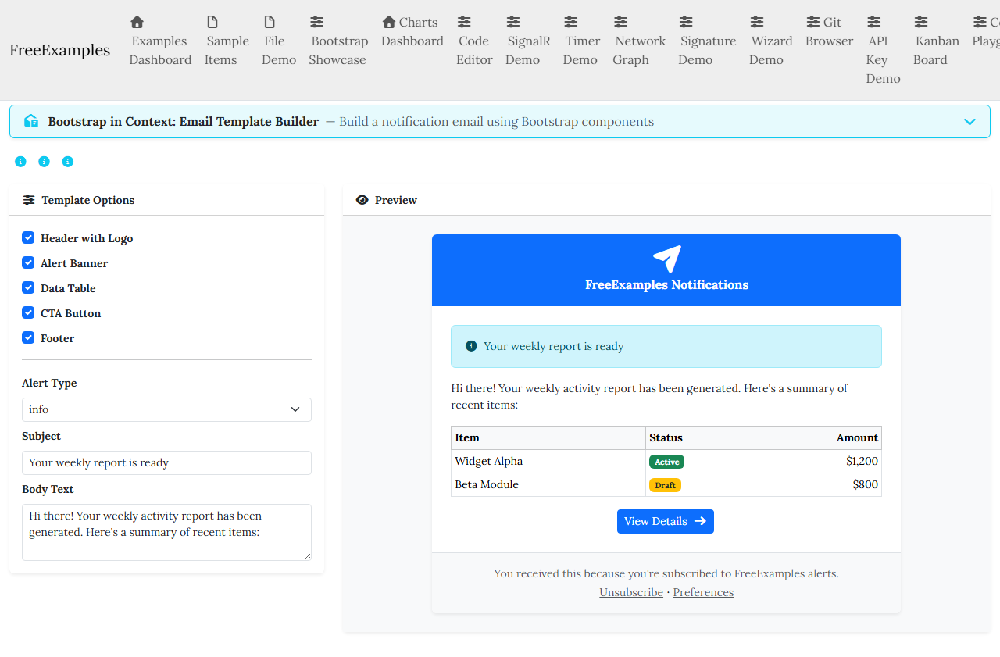
</a>
<br /><sub>🔐 Logged In</sub>
</td>
</tr></table>
</td>
</tr>
<tr>
<td colspan="3" align="center">
<strong><code>/tenant1/Examples/BootstrapV10</code></strong>
<table><tr>
<td align="center">
<a href="snapshots/tenant1/Examples/BootstrapV10/default.png">

</a>
<br /><sub>🔓 Public</sub>
</td>
<td align="center">
<sub><em>public page</em></sub>
<br /><sub>—</sub>
</td>
<td align="center">
<a href="snapshots/tenant1/Examples/BootstrapV10/logged-in.png">
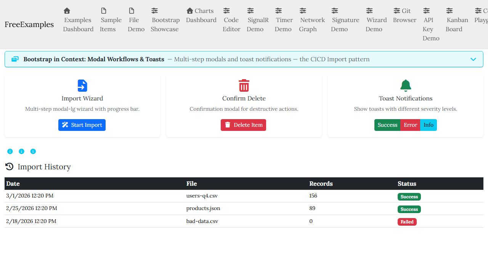
</a>
<br /><sub>🔐 Logged In</sub>
</td>
</tr></table>
</td>
</tr>
<tr>
<td colspan="3" align="center">
<strong><code>/tenant1/Examples/BootstrapV11</code></strong>
<table><tr>
<td align="center">
<a href="snapshots/tenant1/Examples/BootstrapV11/default.png">

</a>
<br /><sub>🔓 Public</sub>
</td>
<td align="center">
<sub><em>public page</em></sub>
<br /><sub>—</sub>
</td>
<td align="center">
<a href="snapshots/tenant1/Examples/BootstrapV11/logged-in.png">
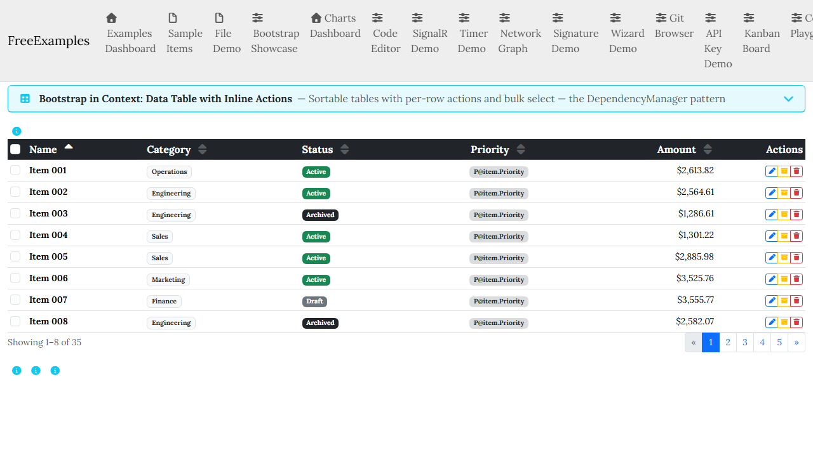
</a>
<br /><sub>🔐 Logged In</sub>
</td>
</tr></table>
</td>
</tr>
<tr>
<td colspan="3" align="center">
<strong><code>/tenant1/Examples/BootstrapV12</code></strong>
<table><tr>
<td align="center">
<a href="snapshots/tenant1/Examples/BootstrapV12/default.png">

</a>
<br /><sub>🔓 Public</sub>
</td>
<td align="center">
<sub><em>public page</em></sub>
<br /><sub>—</sub>
</td>
<td align="center">
<a href="snapshots/tenant1/Examples/BootstrapV12/logged-in.png">
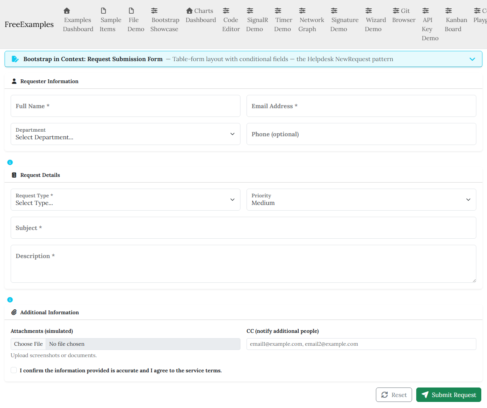
</a>
<br /><sub>🔐 Logged In</sub>
</td>
</tr></table>
</td>
</tr>
<tr>
<td colspan="3" align="center">
<strong><code>/tenant1/Examples/BootstrapV2</code></strong>
<table><tr>
<td align="center">
<a href="snapshots/tenant1/Examples/BootstrapV2/default.png">

</a>
<br /><sub>🔓 Public</sub>
</td>
<td align="center">
<sub><em>public page</em></sub>
<br /><sub>—</sub>
</td>
<td align="center">
<a href="snapshots/tenant1/Examples/BootstrapV2/logged-in.png">
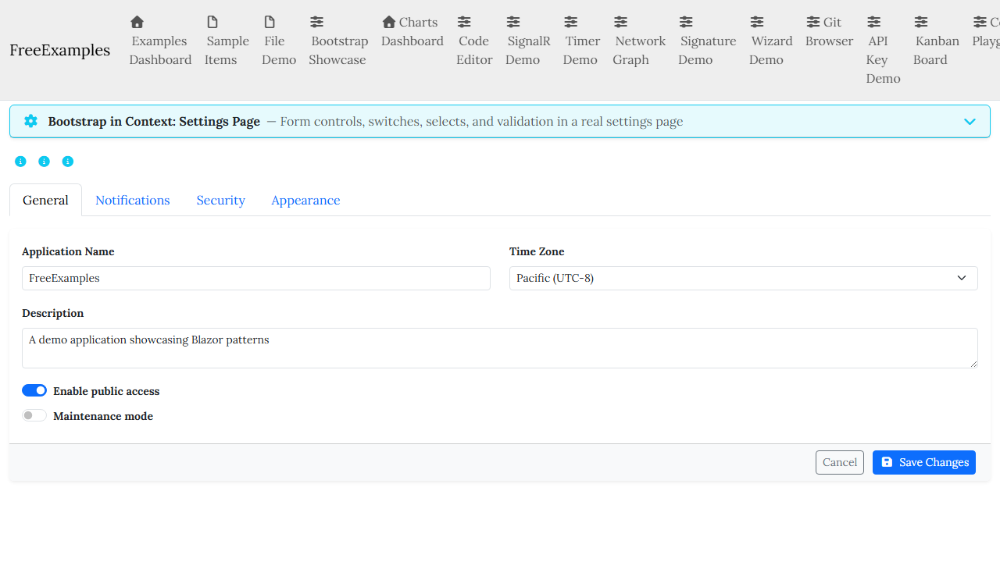
</a>
<br /><sub>🔐 Logged In</sub>
</td>
</tr></table>
</td>
</tr>
<tr>
<td colspan="3" align="center">
<strong><code>/tenant1/Examples/BootstrapV3</code></strong>
<table><tr>
<td align="center">
<a href="snapshots/tenant1/Examples/BootstrapV3/default.png">

</a>
<br /><sub>🔓 Public</sub>
</td>
<td align="center">
<sub><em>public page</em></sub>
<br /><sub>—</sub>
</td>
<td align="center">
<a href="snapshots/tenant1/Examples/BootstrapV3/logged-in.png">
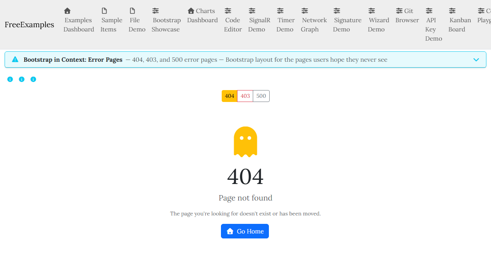
</a>
<br /><sub>🔐 Logged In</sub>
</td>
</tr></table>
</td>
</tr>
<tr>
<td colspan="3" align="center">
<strong><code>/tenant1/Examples/BootstrapV4</code></strong>
<table><tr>
<td align="center">
<a href="snapshots/tenant1/Examples/BootstrapV4/default.png">

</a>
<br /><sub>🔓 Public</sub>
</td>
<td align="center">
<sub><em>public page</em></sub>
<br /><sub>—</sub>
</td>
<td align="center">
<a href="snapshots/tenant1/Examples/BootstrapV4/logged-in.png">

</a>
<br /><sub>🔐 Logged In</sub>
</td>
</tr></table>
</td>
</tr>
<tr>
<td colspan="3" align="center">
<strong><code>/tenant1/Examples/BootstrapV5</code></strong>
<table><tr>
<td align="center">
<a href="snapshots/tenant1/Examples/BootstrapV5/default.png">

</a>
<br /><sub>🔓 Public</sub>
</td>
<td align="center">
<sub><em>public page</em></sub>
<br /><sub>—</sub>
</td>
<td align="center">
<a href="snapshots/tenant1/Examples/BootstrapV5/logged-in.png">
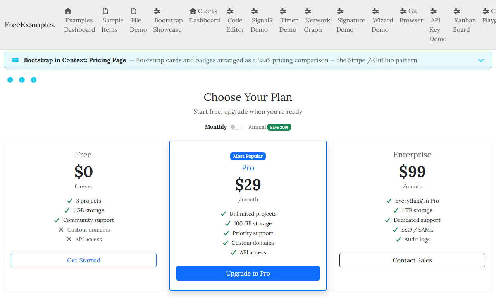
</a>
<br /><sub>🔐 Logged In</sub>
</td>
</tr></table>
</td>
</tr>
<tr>
<td colspan="3" align="center">
<strong><code>/tenant1/Examples/BootstrapV6</code></strong>
<table><tr>
<td align="center">
<a href="snapshots/tenant1/Examples/BootstrapV6/default.png">

</a>
<br /><sub>🔓 Public</sub>
</td>
<td align="center">
<sub><em>public page</em></sub>
<br /><sub>—</sub>
</td>
<td align="center">
<a href="snapshots/tenant1/Examples/BootstrapV6/logged-in.png">
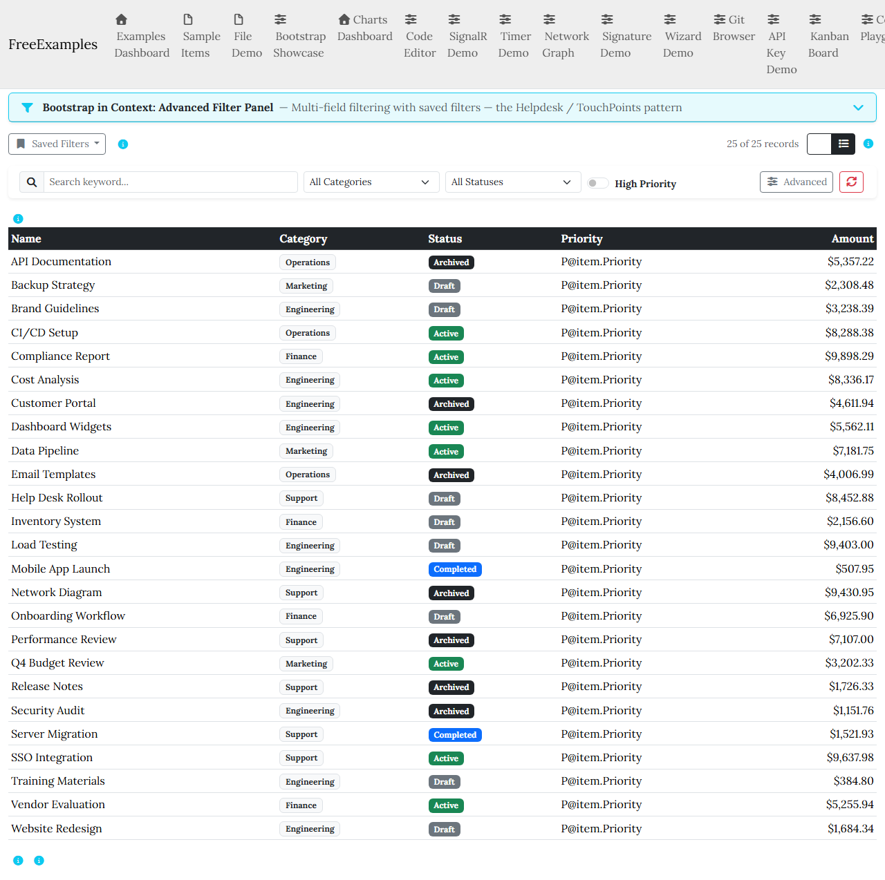
</a>
<br /><sub>🔐 Logged In</sub>
</td>
</tr></table>
</td>
</tr>
<tr>
<td colspan="3" align="center">
<strong><code>/tenant1/Examples/BootstrapV7</code></strong>
<table><tr>
<td align="center">
<a href="snapshots/tenant1/Examples/BootstrapV7/default.png">

</a>
<br /><sub>🔓 Public</sub>
</td>
<td align="center">
<sub><em>public page</em></sub>
<br /><sub>—</sub>
</td>
<td align="center">
<a href="snapshots/tenant1/Examples/BootstrapV7/logged-in.png">

</a>
<br /><sub>🔐 Logged In</sub>
</td>
</tr></table>
</td>
</tr>
<tr>
<td colspan="3" align="center">
<strong><code>/tenant1/Examples/BootstrapV8</code></strong>
<table><tr>
<td align="center">
<a href="snapshots/tenant1/Examples/BootstrapV8/default.png">

</a>
<br /><sub>🔓 Public</sub>
</td>
<td align="center">
<sub><em>public page</em></sub>
<br /><sub>—</sub>
</td>
<td align="center">
<a href="snapshots/tenant1/Examples/BootstrapV8/logged-in.png">
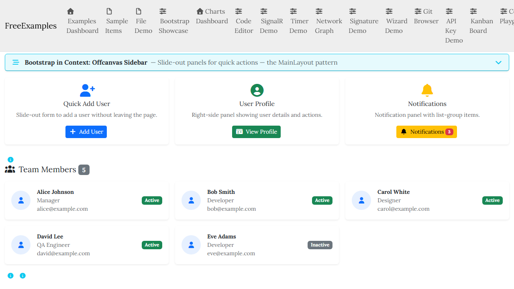
</a>
<br /><sub>🔐 Logged In</sub>
</td>
</tr></table>
</td>
</tr>
<tr>
<td colspan="3" align="center">
<strong><code>/tenant1/Examples/BootstrapV9</code></strong>
<table><tr>
<td align="center">
<a href="snapshots/tenant1/Examples/BootstrapV9/default.png">

</a>
<br /><sub>🔓 Public</sub>
</td>
<td align="center">
<sub><em>public page</em></sub>
<br /><sub>—</sub>
</td>
<td align="center">
<a href="snapshots/tenant1/Examples/BootstrapV9/logged-in.png">
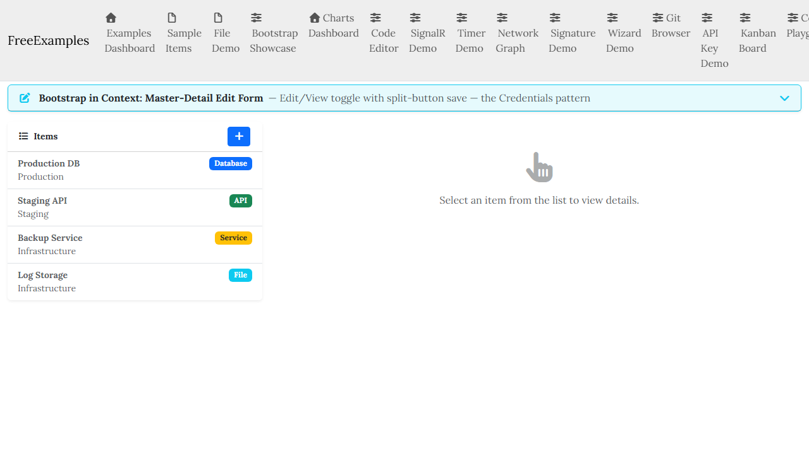
</a>
<br /><sub>🔐 Logged In</sub>
</td>
</tr></table>
</td>
</tr>
<tr>
<td colspan="3" align="center">
<strong><code>/tenant1/Examples/Carousel</code></strong>
<table><tr>
<td align="center">
<a href="snapshots/tenant1/Examples/Carousel/default.png">

</a>
<br /><sub>🔓 Public</sub>
</td>
<td align="center">
<sub><em>public page</em></sub>
<br /><sub>—</sub>
</td>
<td align="center">
<a href="snapshots/tenant1/Examples/Carousel/logged-in.png">

</a>
<br /><sub>🔐 Logged In</sub>
</td>
</tr></table>
</td>
</tr>
<tr>
<td colspan="3" align="center">
<strong><code>/tenant1/Examples/ChartsDashboard</code></strong>
<table><tr>
<td align="center">
<a href="snapshots/tenant1/Examples/ChartsDashboard/default.png">

</a>
<br /><sub>🔓 Public</sub>
</td>
<td align="center">
<sub><em>public page</em></sub>
<br /><sub>—</sub>
</td>
<td align="center">
<a href="snapshots/tenant1/Examples/ChartsDashboard/logged-in.png">

</a>
<br /><sub>🔐 Logged In</sub>
</td>
</tr></table>
</td>
</tr>
<tr>
<td colspan="3" align="center">
<strong><code>/tenant1/Examples/ChartsV1</code></strong>
<table><tr>
<td align="center">
<a href="snapshots/tenant1/Examples/ChartsV1/default.png">

</a>
<br /><sub>🔓 Public</sub>
</td>
<td align="center">
<sub><em>public page</em></sub>
<br /><sub>—</sub>
</td>
<td align="center">
<a href="snapshots/tenant1/Examples/ChartsV1/logged-in.png">
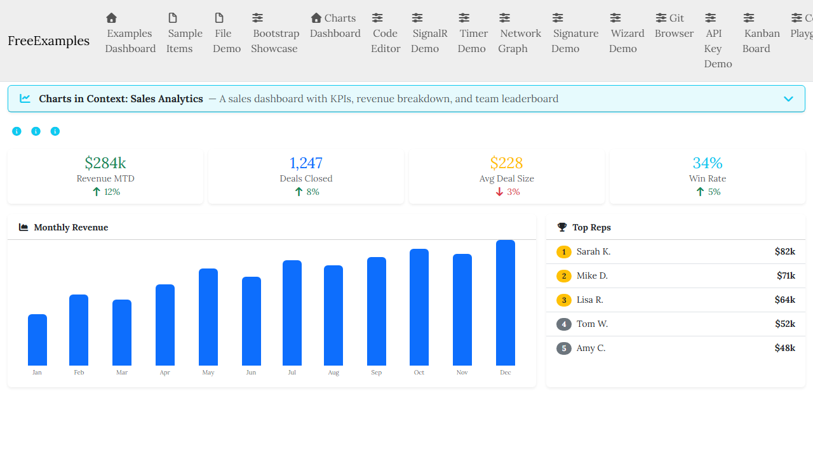
</a>
<br /><sub>🔐 Logged In</sub>
</td>
</tr></table>
</td>
</tr>
<tr>
<td colspan="3" align="center">
<strong><code>/tenant1/Examples/ChartsV2</code></strong>
<table><tr>
<td align="center">
<a href="snapshots/tenant1/Examples/ChartsV2/default.png">

</a>
<br /><sub>🔓 Public</sub>
</td>
<td align="center">
<sub><em>public page</em></sub>
<br /><sub>—</sub>
</td>
<td align="center">
<a href="snapshots/tenant1/Examples/ChartsV2/logged-in.png">
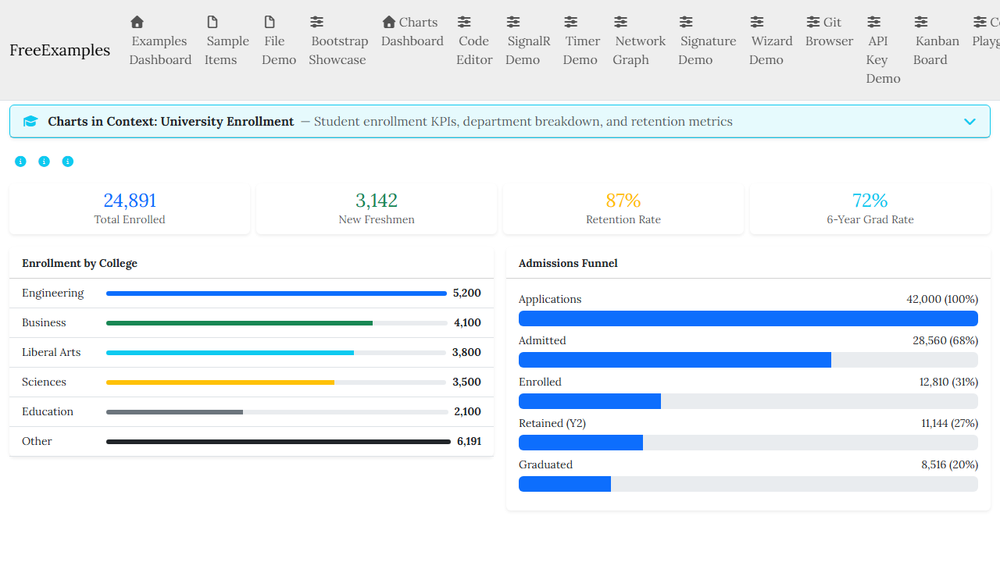
</a>
<br /><sub>🔐 Logged In</sub>
</td>
</tr></table>
</td>
</tr>
<tr>
<td colspan="3" align="center">
<strong><code>/tenant1/Examples/ChartsV3</code></strong>
<table><tr>
<td align="center">
<a href="snapshots/tenant1/Examples/ChartsV3/default.png">

</a>
<br /><sub>🔓 Public</sub>
</td>
<td align="center">
<sub><em>public page</em></sub>
<br /><sub>—</sub>
</td>
<td align="center">
<a href="snapshots/tenant1/Examples/ChartsV3/logged-in.png">
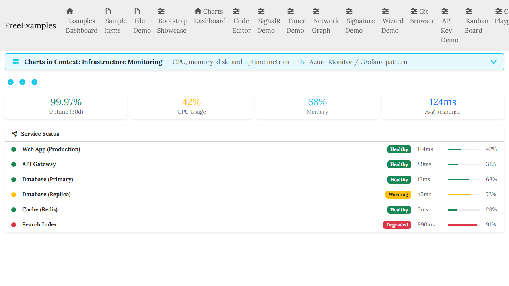
</a>
<br /><sub>🔐 Logged In</sub>
</td>
</tr></table>
</td>
</tr>
<tr>
<td colspan="3" align="center">
<strong><code>/tenant1/Examples/ChartsV4</code></strong>
<table><tr>
<td align="center">
<a href="snapshots/tenant1/Examples/ChartsV4/default.png">

</a>
<br /><sub>🔓 Public</sub>
</td>
<td align="center">
<sub><em>public page</em></sub>
<br /><sub>—</sub>
</td>
<td align="center">
<a href="snapshots/tenant1/Examples/ChartsV4/logged-in.png">
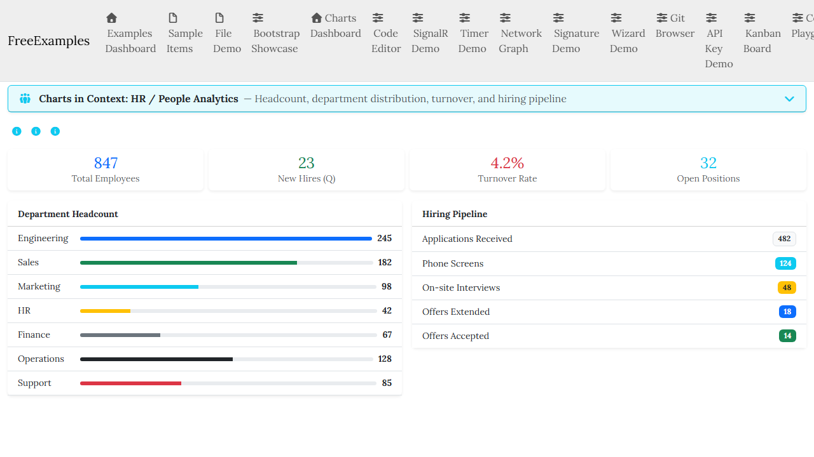
</a>
<br /><sub>🔐 Logged In</sub>
</td>
</tr></table>
</td>
</tr>
<tr>
<td colspan="3" align="center">
<strong><code>/tenant1/Examples/ChartsV5</code></strong>
<table><tr>
<td align="center">
<a href="snapshots/tenant1/Examples/ChartsV5/default.png">

</a>
<br /><sub>🔓 Public</sub>
</td>
<td align="center">
<sub><em>public page</em></sub>
<br /><sub>—</sub>
</td>
<td align="center">
<a href="snapshots/tenant1/Examples/ChartsV5/logged-in.png">
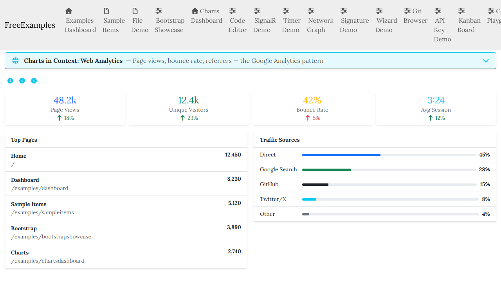
</a>
<br /><sub>🔐 Logged In</sub>
</td>
</tr></table>
</td>
</tr>
<tr>
<td colspan="3" align="center">
<strong><code>/tenant1/Examples/ChatView</code></strong>
<table><tr>
<td align="center">
<a href="snapshots/tenant1/Examples/ChatView/default.png">

</a>
<br /><sub>🔓 Public</sub>
</td>
<td align="center">
<sub><em>public page</em></sub>
<br /><sub>—</sub>
</td>
<td align="center">
<a href="snapshots/tenant1/Examples/ChatView/logged-in.png">
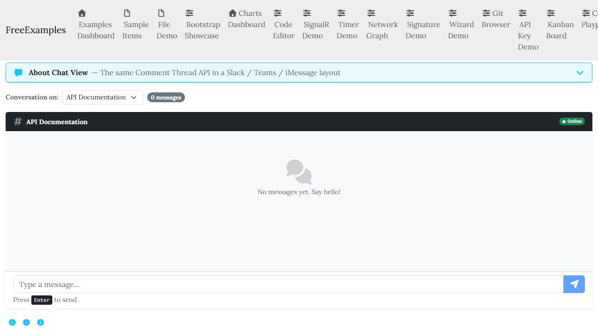
</a>
<br /><sub>🔐 Logged In</sub>
</td>
</tr></table>
</td>
</tr>
<tr>
<td colspan="3" align="center">
<strong><code>/tenant1/Examples/CodeEditor</code></strong>
<table><tr>
<td align="center">
<a href="snapshots/tenant1/Examples/CodeEditor/default.png">

</a>
<br /><sub>🔓 Public</sub>
</td>
<td align="center">
<sub><em>public page</em></sub>
<br /><sub>—</sub>
</td>
<td align="center">
<a href="snapshots/tenant1/Examples/CodeEditor/logged-in.png">

</a>
<br /><sub>🔐 Logged In</sub>
</td>
</tr></table>
</td>
</tr>
<tr>
<td colspan="3" align="center">
<strong><code>/tenant1/Examples/CodeEditorV1</code></strong>
<table><tr>
<td align="center">
<a href="snapshots/tenant1/Examples/CodeEditorV1/default.png">

</a>
<br /><sub>🔓 Public</sub>
</td>
<td align="center">
<sub><em>public page</em></sub>
<br /><sub>—</sub>
</td>
<td align="center">
<a href="snapshots/tenant1/Examples/CodeEditorV1/logged-in.png">
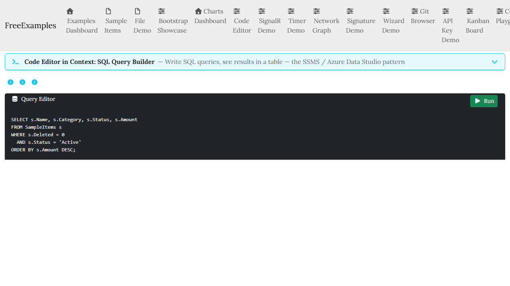
</a>
<br /><sub>🔐 Logged In</sub>
</td>
</tr></table>
</td>
</tr>
<tr>
<td colspan="3" align="center">
<strong><code>/tenant1/Examples/CodeEditorV2</code></strong>
<table><tr>
<td align="center">
<a href="snapshots/tenant1/Examples/CodeEditorV2/default.png">

</a>
<br /><sub>🔓 Public</sub>
</td>
<td align="center">
<sub><em>public page</em></sub>
<br /><sub>—</sub>
</td>
<td align="center">
<a href="snapshots/tenant1/Examples/CodeEditorV2/logged-in.png">
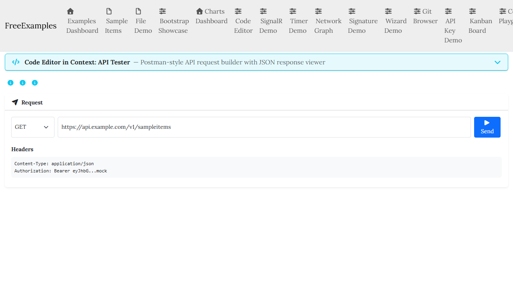
</a>
<br /><sub>🔐 Logged In</sub>
</td>
</tr></table>
</td>
</tr>
<tr>
<td colspan="3" align="center">
<strong><code>/tenant1/Examples/CodeEditorV3</code></strong>
<table><tr>
<td align="center">
<a href="snapshots/tenant1/Examples/CodeEditorV3/default.png">

</a>
<br /><sub>🔓 Public</sub>
</td>
<td align="center">
<sub><em>public page</em></sub>
<br /><sub>—</sub>
</td>
<td align="center">
<a href="snapshots/tenant1/Examples/CodeEditorV3/logged-in.png">

</a>
<br /><sub>🔐 Logged In</sub>
</td>
</tr></table>
</td>
</tr>
<tr>
<td colspan="3" align="center">
<strong><code>/tenant1/Examples/CodeEditorV4</code></strong>
<table><tr>
<td align="center">
<a href="snapshots/tenant1/Examples/CodeEditorV4/default.png">

</a>
<br /><sub>🔓 Public</sub>
</td>
<td align="center">
<sub><em>public page</em></sub>
<br /><sub>—</sub>
</td>
<td align="center">
<a href="snapshots/tenant1/Examples/CodeEditorV4/logged-in.png">
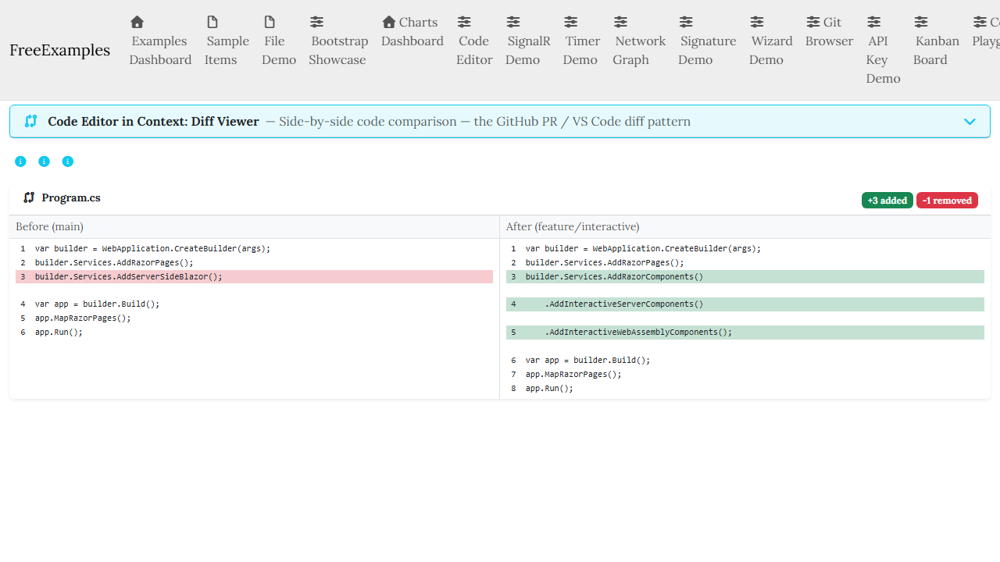
</a>
<br /><sub>🔐 Logged In</sub>
</td>
</tr></table>
</td>
</tr>
<tr>
<td colspan="3" align="center">
<strong><code>/tenant1/Examples/CodeEditorV5</code></strong>
<table><tr>
<td align="center">
<a href="snapshots/tenant1/Examples/CodeEditorV5/default.png">

</a>
<br /><sub>🔓 Public</sub>
</td>
<td align="center">
<sub><em>public page</em></sub>
<br /><sub>—</sub>
</td>
<td align="center">
<a href="snapshots/tenant1/Examples/CodeEditorV5/logged-in.png">

</a>
<br /><sub>🔐 Logged In</sub>
</td>
</tr></table>
</td>
</tr>
<tr>
<td colspan="3" align="center">
<strong><code>/tenant1/Examples/CodePlayground</code></strong>
<table><tr>
<td align="center">
<a href="snapshots/tenant1/Examples/CodePlayground/default.png">

</a>
<br /><sub>🔓 Public</sub>
</td>
<td align="center">
<sub><em>public page</em></sub>
<br /><sub>—</sub>
</td>
<td align="center">
<a href="snapshots/tenant1/Examples/CodePlayground/logged-in.png">

</a>
<br /><sub>🔐 Logged In</sub>
</td>
</tr></table>
</td>
</tr>
<tr>
<td colspan="3" align="center">
<strong><code>/tenant1/Examples/CommandPalette</code></strong>
<table><tr>
<td align="center">
<a href="snapshots/tenant1/Examples/CommandPalette/default.png">

</a>
<br /><sub>🔓 Public</sub>
</td>
<td align="center">
<sub><em>public page</em></sub>
<br /><sub>—</sub>
</td>
<td align="center">
<a href="snapshots/tenant1/Examples/CommandPalette/logged-in.png">

</a>
<br /><sub>🔐 Logged In</sub>
</td>
</tr></table>
</td>
</tr>
<tr>
<td colspan="3" align="center">
<strong><code>/tenant1/Examples/CommentThread</code></strong>
<table><tr>
<td align="center">
<a href="snapshots/tenant1/Examples/CommentThread/default.png">

</a>
<br /><sub>🔓 Public</sub>
</td>
<td align="center">
<sub><em>public page</em></sub>
<br /><sub>—</sub>
</td>
<td align="center">
<a href="snapshots/tenant1/Examples/CommentThread/logged-in.png">

</a>
<br /><sub>🔐 Logged In</sub>
</td>
</tr></table>
</td>
</tr>
<tr>
<td colspan="3" align="center">
<strong><code>/tenant1/Examples/ComparisonTable</code></strong>
<table><tr>
<td align="center">
<a href="snapshots/tenant1/Examples/ComparisonTable/default.png">

</a>
<br /><sub>🔓 Public</sub>
</td>
<td align="center">
<sub><em>public page</em></sub>
<br /><sub>—</sub>
</td>
<td align="center">
<a href="snapshots/tenant1/Examples/ComparisonTable/logged-in.png">
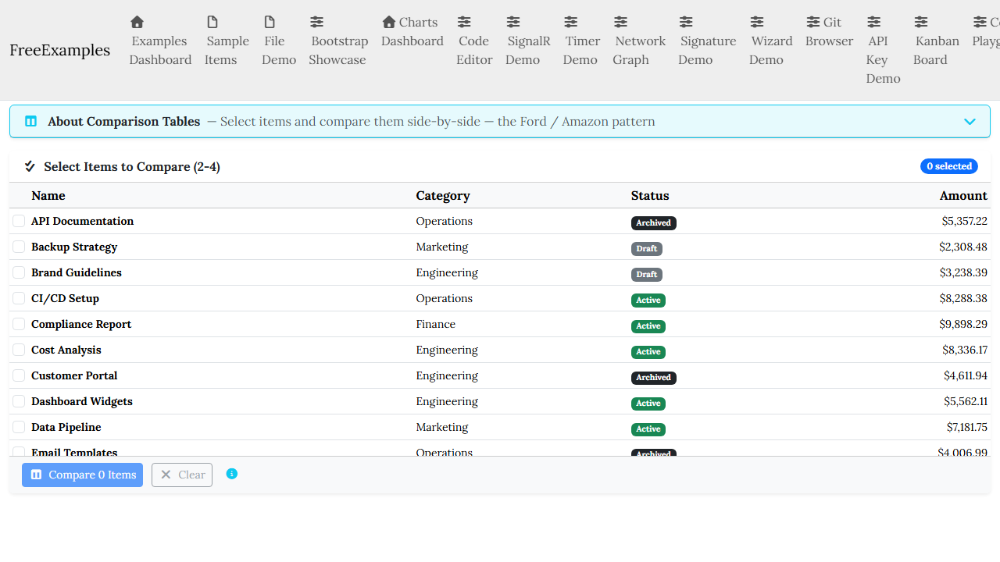
</a>
<br /><sub>🔐 Logged In</sub>
</td>
</tr></table>
</td>
</tr>
<tr>
<td colspan="3" align="center">
<strong><code>/tenant1/Examples/Dashboard</code></strong>
<table><tr>
<td align="center">
<a href="snapshots/tenant1/Examples/Dashboard/default.png">

</a>
<br /><sub>🔓 Public</sub>
</td>
<td align="center">
<sub><em>public page</em></sub>
<br /><sub>—</sub>
</td>
<td align="center">
<a href="snapshots/tenant1/Examples/Dashboard/logged-in.png">

</a>
<br /><sub>🔐 Logged In</sub>
</td>
</tr></table>
</td>
</tr>
<tr>
<td colspan="3" align="center">
<strong><code>/tenant1/Examples/EditSampleItem/New</code></strong>
<table><tr>
<td align="center">
<a href="snapshots/tenant1/Examples/EditSampleItem/New/default.png">

</a>
<br /><sub>🔓 Public</sub>
</td>
<td align="center">
<sub><em>public page</em></sub>
<br /><sub>—</sub>
</td>
<td align="center">
<a href="snapshots/tenant1/Examples/EditSampleItem/New/logged-in.png">

</a>
<br /><sub>🔐 Logged In</sub>
</td>
</tr></table>
</td>
</tr>
<tr>
<td colspan="3" align="center">
<strong><code>/tenant1/Examples/FileDemo</code></strong>
<table><tr>
<td align="center">
<a href="snapshots/tenant1/Examples/FileDemo/default.png">

</a>
<br /><sub>🔓 Public</sub>
</td>
<td align="center">
<sub><em>public page</em></sub>
<br /><sub>—</sub>
</td>
<td align="center">
<a href="snapshots/tenant1/Examples/FileDemo/logged-in.png">

</a>
<br /><sub>🔐 Logged In</sub>
</td>
</tr></table>
</td>
</tr>
<tr>
<td colspan="3" align="center">
<strong><code>/tenant1/Examples/FileDemoV1</code></strong>
<table><tr>
<td align="center">
<a href="snapshots/tenant1/Examples/FileDemoV1/default.png">

</a>
<br /><sub>🔓 Public</sub>
</td>
<td align="center">
<sub><em>public page</em></sub>
<br /><sub>—</sub>
</td>
<td align="center">
<a href="snapshots/tenant1/Examples/FileDemoV1/logged-in.png">

</a>
<br /><sub>🔐 Logged In</sub>
</td>
</tr></table>
</td>
</tr>
<tr>
<td colspan="3" align="center">
<strong><code>/tenant1/Examples/FileDemoV2</code></strong>
<table><tr>
<td align="center">
<a href="snapshots/tenant1/Examples/FileDemoV2/default.png">

</a>
<br /><sub>🔓 Public</sub>
</td>
<td align="center">
<sub><em>public page</em></sub>
<br /><sub>—</sub>
</td>
<td align="center">
<a href="snapshots/tenant1/Examples/FileDemoV2/logged-in.png">
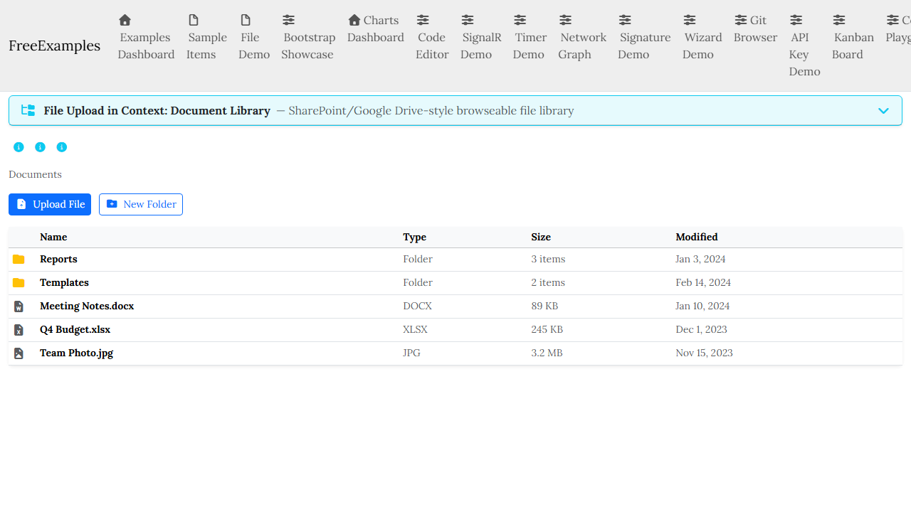
</a>
<br /><sub>🔐 Logged In</sub>
</td>
</tr></table>
</td>
</tr>
<tr>
<td colspan="3" align="center">
<strong><code>/tenant1/Examples/FileDemoV3</code></strong>
<table><tr>
<td align="center">
<a href="snapshots/tenant1/Examples/FileDemoV3/default.png">

</a>
<br /><sub>🔓 Public</sub>
</td>
<td align="center">
<sub><em>public page</em></sub>
<br /><sub>—</sub>
</td>
<td align="center">
<a href="snapshots/tenant1/Examples/FileDemoV3/logged-in.png">

</a>
<br /><sub>🔐 Logged In</sub>
</td>
</tr></table>
</td>
</tr>
<tr>
<td colspan="3" align="center">
<strong><code>/tenant1/Examples/FileDemoV4</code></strong>
<table><tr>
<td align="center">
<a href="snapshots/tenant1/Examples/FileDemoV4/default.png">

</a>
<br /><sub>🔓 Public</sub>
</td>
<td align="center">
<sub><em>public page</em></sub>
<br /><sub>—</sub>
</td>
<td align="center">
<a href="snapshots/tenant1/Examples/FileDemoV4/logged-in.png">
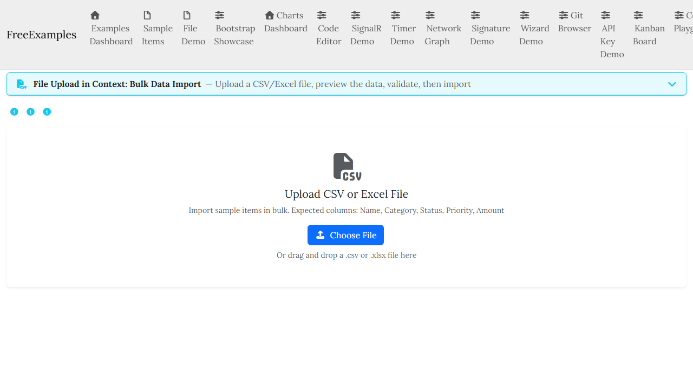
</a>
<br /><sub>🔐 Logged In</sub>
</td>
</tr></table>
</td>
</tr>
<tr>
<td colspan="3" align="center">
<strong><code>/tenant1/Examples/FileDemoV5</code></strong>
<table><tr>
<td align="center">
<a href="snapshots/tenant1/Examples/FileDemoV5/default.png">

</a>
<br /><sub>🔓 Public</sub>
</td>
<td align="center">
<sub><em>public page</em></sub>
<br /><sub>—</sub>
</td>
<td align="center">
<a href="snapshots/tenant1/Examples/FileDemoV5/logged-in.png">

</a>
<br /><sub>🔐 Logged In</sub>
</td>
</tr></table>
</td>
</tr>
<tr>
<td colspan="3" align="center">
<strong><code>/tenant1/Examples/GitBrowser</code></strong>
<table><tr>
<td align="center">
<a href="snapshots/tenant1/Examples/GitBrowser/default.png">

</a>
<br /><sub>🔓 Public</sub>
</td>
<td align="center">
<sub><em>public page</em></sub>
<br /><sub>—</sub>
</td>
<td align="center">
<a href="snapshots/tenant1/Examples/GitBrowser/logged-in.png">

</a>
<br /><sub>🔐 Logged In</sub>
</td>
</tr></table>
</td>
</tr>
<tr>
<td colspan="3" align="center">
<strong><code>/tenant1/Examples/ImageGallery</code></strong>
<table><tr>
<td align="center">
<a href="snapshots/tenant1/Examples/ImageGallery/default.png">

</a>
<br /><sub>🔓 Public</sub>
</td>
<td align="center">
<sub><em>public page</em></sub>
<br /><sub>—</sub>
</td>
<td align="center">
<a href="snapshots/tenant1/Examples/ImageGallery/logged-in.png">
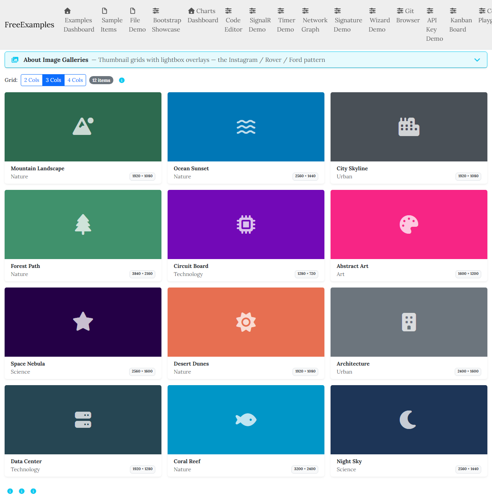
</a>
<br /><sub>🔐 Logged In</sub>
</td>
</tr></table>
</td>
</tr>
<tr>
<td colspan="3" align="center">
<strong><code>/tenant1/Examples/ItemCards</code></strong>
<table><tr>
<td align="center">
<a href="snapshots/tenant1/Examples/ItemCards/default.png">

</a>
<br /><sub>🔓 Public</sub>
</td>
<td align="center">
<sub><em>public page</em></sub>
<br /><sub>—</sub>
</td>
<td align="center">
<a href="snapshots/tenant1/Examples/ItemCards/logged-in.png">
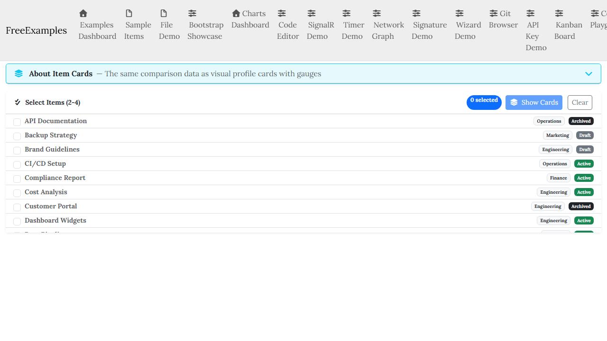
</a>
<br /><sub>🔐 Logged In</sub>
</td>
</tr></table>
</td>
</tr>
<tr>
<td colspan="3" align="center">
<strong><code>/tenant1/Examples/KanbanBoard</code></strong>
<table><tr>
<td align="center">
<a href="snapshots/tenant1/Examples/KanbanBoard/default.png">

</a>
<br /><sub>🔓 Public</sub>
</td>
<td align="center">
<sub><em>public page</em></sub>
<br /><sub>—</sub>
</td>
<td align="center">
<a href="snapshots/tenant1/Examples/KanbanBoard/logged-in.png">
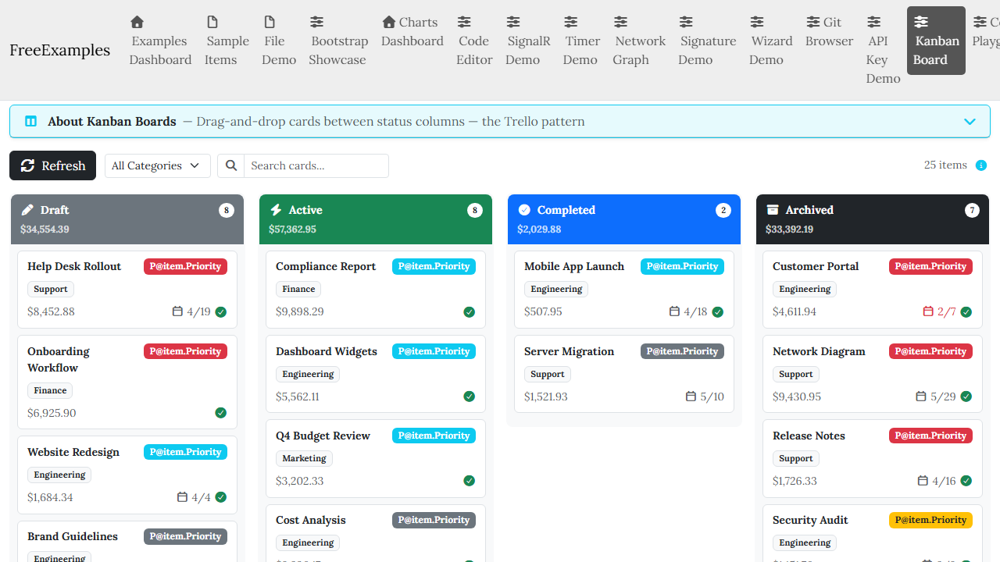
</a>
<br /><sub>🔐 Logged In</sub>
</td>
</tr></table>
</td>
</tr>
<tr>
<td colspan="3" align="center">
<strong><code>/tenant1/Examples/NetworkGraph</code></strong>
<table><tr>
<td align="center">
<a href="snapshots/tenant1/Examples/NetworkGraph/default.png">

</a>
<br /><sub>🔓 Public</sub>
</td>
<td align="center">
<sub><em>public page</em></sub>
<br /><sub>—</sub>
</td>
<td align="center">
<a href="snapshots/tenant1/Examples/NetworkGraph/logged-in.png">

</a>
<br /><sub>🔐 Logged In</sub>
</td>
</tr></table>
</td>
</tr>
<tr>
<td colspan="3" align="center">
<strong><code>/tenant1/Examples/NetworkGraphV1</code></strong>
<table><tr>
<td align="center">
<a href="snapshots/tenant1/Examples/NetworkGraphV1/default.png">

</a>
<br /><sub>🔓 Public</sub>
</td>
<td align="center">
<sub><em>public page</em></sub>
<br /><sub>—</sub>
</td>
<td align="center">
<a href="snapshots/tenant1/Examples/NetworkGraphV1/logged-in.png">
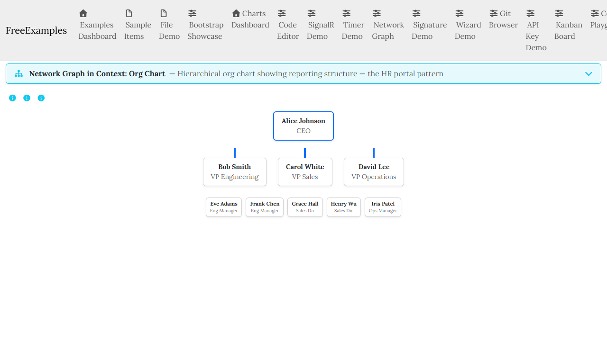
</a>
<br /><sub>🔐 Logged In</sub>
</td>
</tr></table>
</td>
</tr>
<tr>
<td colspan="3" align="center">
<strong><code>/tenant1/Examples/NetworkGraphV2</code></strong>
<table><tr>
<td align="center">
<a href="snapshots/tenant1/Examples/NetworkGraphV2/default.png">

</a>
<br /><sub>🔓 Public</sub>
</td>
<td align="center">
<sub><em>public page</em></sub>
<br /><sub>—</sub>
</td>
<td align="center">
<a href="snapshots/tenant1/Examples/NetworkGraphV2/logged-in.png">

</a>
<br /><sub>🔐 Logged In</sub>
</td>
</tr></table>
</td>
</tr>
<tr>
<td colspan="3" align="center">
<strong><code>/tenant1/Examples/PipelineTracker</code></strong>
<table><tr>
<td align="center">
<a href="snapshots/tenant1/Examples/PipelineTracker/default.png">

</a>
<br /><sub>🔓 Public</sub>
</td>
<td align="center">
<sub><em>public page</em></sub>
<br /><sub>—</sub>
</td>
<td align="center">
<a href="snapshots/tenant1/Examples/PipelineTracker/logged-in.png">
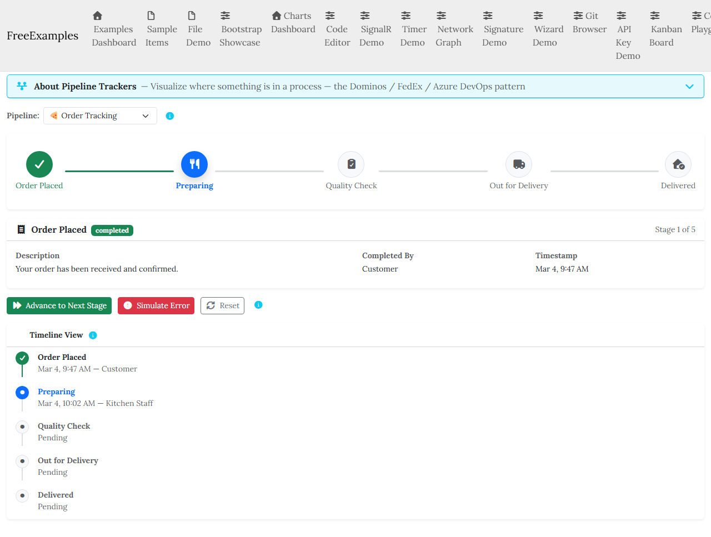
</a>
<br /><sub>🔐 Logged In</sub>
</td>
</tr></table>
</td>
</tr>
<tr>
<td colspan="3" align="center">
<strong><code>/tenant1/Examples/SampleItems</code></strong>
<table><tr>
<td align="center">
<a href="snapshots/tenant1/Examples/SampleItems/default.png">

</a>
<br /><sub>🔓 Public</sub>
</td>
<td align="center">
<sub><em>public page</em></sub>
<br /><sub>—</sub>
</td>
<td align="center">
<a href="snapshots/tenant1/Examples/SampleItems/logged-in.png">

</a>
<br /><sub>🔐 Logged In</sub>
</td>
</tr></table>
</td>
</tr>
<tr>
<td colspan="3" align="center">
<strong><code>/tenant1/Examples/SampleItemsV1</code></strong>
<table><tr>
<td align="center">
<a href="snapshots/tenant1/Examples/SampleItemsV1/default.png">

</a>
<br /><sub>🔓 Public</sub>
</td>
<td align="center">
<sub><em>public page</em></sub>
<br /><sub>—</sub>
</td>
<td align="center">
<a href="snapshots/tenant1/Examples/SampleItemsV1/logged-in.png">
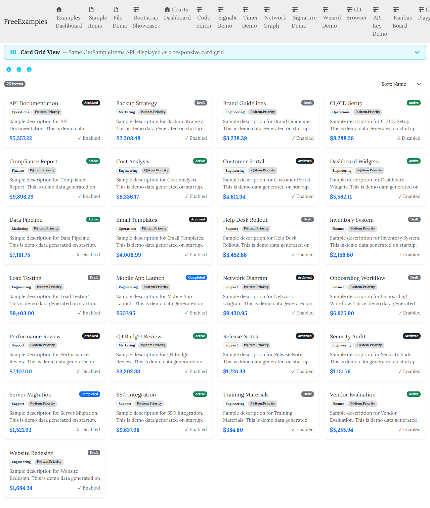
</a>
<br /><sub>🔐 Logged In</sub>
</td>
</tr></table>
</td>
</tr>
<tr>
<td colspan="3" align="center">
<strong><code>/tenant1/Examples/SampleItemsV2</code></strong>
<table><tr>
<td align="center">
<a href="snapshots/tenant1/Examples/SampleItemsV2/default.png">

</a>
<br /><sub>🔓 Public</sub>
</td>
<td align="center">
<sub><em>public page</em></sub>
<br /><sub>—</sub>
</td>
<td align="center">
<a href="snapshots/tenant1/Examples/SampleItemsV2/logged-in.png">

</a>
<br /><sub>🔐 Logged In</sub>
</td>
</tr></table>
</td>
</tr>
<tr>
<td colspan="3" align="center">
<strong><code>/tenant1/Examples/SampleItemsV3</code></strong>
<table><tr>
<td align="center">
<a href="snapshots/tenant1/Examples/SampleItemsV3/default.png">

</a>
<br /><sub>🔓 Public</sub>
</td>
<td align="center">
<sub><em>public page</em></sub>
<br /><sub>—</sub>
</td>
<td align="center">
<a href="snapshots/tenant1/Examples/SampleItemsV3/logged-in.png">

</a>
<br /><sub>🔐 Logged In</sub>
</td>
</tr></table>
</td>
</tr>
<tr>
<td colspan="3" align="center">
<strong><code>/tenant1/Examples/SampleItemsV4</code></strong>
<table><tr>
<td align="center">
<a href="snapshots/tenant1/Examples/SampleItemsV4/default.png">

</a>
<br /><sub>🔓 Public</sub>
</td>
<td align="center">
<sub><em>public page</em></sub>
<br /><sub>—</sub>
</td>
<td align="center">
<a href="snapshots/tenant1/Examples/SampleItemsV4/logged-in.png">
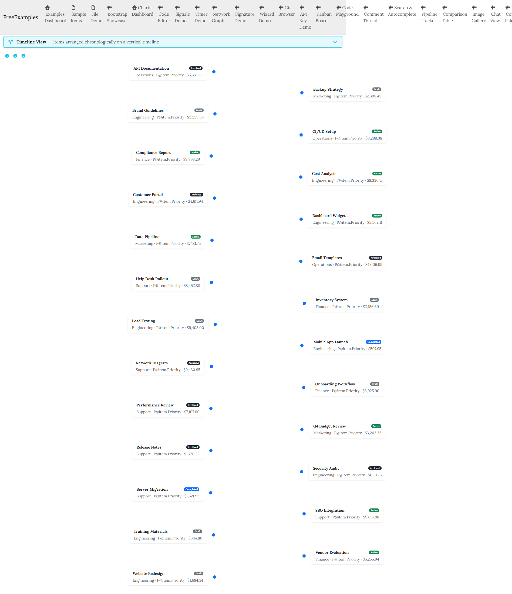
</a>
<br /><sub>🔐 Logged In</sub>
</td>
</tr></table>
</td>
</tr>
<tr>
<td colspan="3" align="center">
<strong><code>/tenant1/Examples/SampleItemsV5</code></strong>
<table><tr>
<td align="center">
<a href="snapshots/tenant1/Examples/SampleItemsV5/default.png">

</a>
<br /><sub>🔓 Public</sub>
</td>
<td align="center">
<sub><em>public page</em></sub>
<br /><sub>—</sub>
</td>
<td align="center">
<a href="snapshots/tenant1/Examples/SampleItemsV5/logged-in.png">

</a>
<br /><sub>🔐 Logged In</sub>
</td>
</tr></table>
</td>
</tr>
<tr>
<td colspan="3" align="center">
<strong><code>/tenant1/Examples/SearchAutocomplete</code></strong>
<table><tr>
<td align="center">
<a href="snapshots/tenant1/Examples/SearchAutocomplete/default.png">

</a>
<br /><sub>🔓 Public</sub>
</td>
<td align="center">
<sub><em>public page</em></sub>
<br /><sub>—</sub>
</td>
<td align="center">
<a href="snapshots/tenant1/Examples/SearchAutocomplete/logged-in.png">

</a>
<br /><sub>🔐 Logged In</sub>
</td>
</tr></table>
</td>
</tr>
<tr>
<td colspan="3" align="center">
<strong><code>/tenant1/Examples/SignalRDemo</code></strong>
<table><tr>
<td align="center">
<a href="snapshots/tenant1/Examples/SignalRDemo/default.png">

</a>
<br /><sub>🔓 Public</sub>
</td>
<td align="center">
<sub><em>public page</em></sub>
<br /><sub>—</sub>
</td>
<td align="center">
<a href="snapshots/tenant1/Examples/SignalRDemo/logged-in.png">

</a>
<br /><sub>🔐 Logged In</sub>
</td>
</tr></table>
</td>
</tr>
<tr>
<td colspan="3" align="center">
<strong><code>/tenant1/Examples/SignalRV1</code></strong>
<table><tr>
<td align="center">
<a href="snapshots/tenant1/Examples/SignalRV1/default.png">

</a>
<br /><sub>🔓 Public</sub>
</td>
<td align="center">
<sub><em>public page</em></sub>
<br /><sub>—</sub>
</td>
<td align="center">
<a href="snapshots/tenant1/Examples/SignalRV1/logged-in.png">

</a>
<br /><sub>🔐 Logged In</sub>
</td>
</tr></table>
</td>
</tr>
<tr>
<td colspan="3" align="center">
<strong><code>/tenant1/Examples/SignalRV2</code></strong>
<table><tr>
<td align="center">
<a href="snapshots/tenant1/Examples/SignalRV2/default.png">

</a>
<br /><sub>🔓 Public</sub>
</td>
<td align="center">
<sub><em>public page</em></sub>
<br /><sub>—</sub>
</td>
<td align="center">
<a href="snapshots/tenant1/Examples/SignalRV2/logged-in.png">
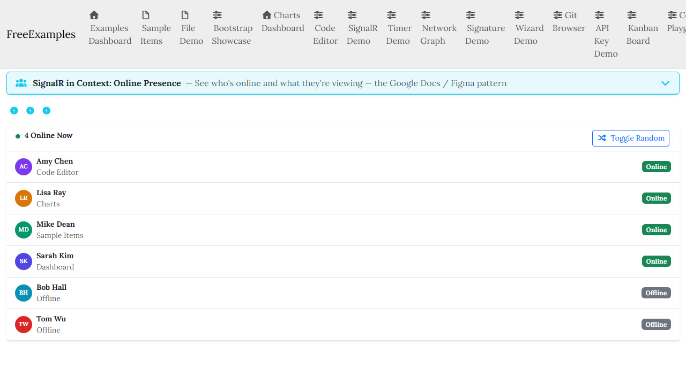
</a>
<br /><sub>🔐 Logged In</sub>
</td>
</tr></table>
</td>
</tr>
<tr>
<td colspan="3" align="center">
<strong><code>/tenant1/Examples/SignalRV3</code></strong>
<table><tr>
<td align="center">
<a href="snapshots/tenant1/Examples/SignalRV3/default.png">

</a>
<br /><sub>🔓 Public</sub>
</td>
<td align="center">
<sub><em>public page</em></sub>
<br /><sub>—</sub>
</td>
<td align="center">
<a href="snapshots/tenant1/Examples/SignalRV3/logged-in.png">
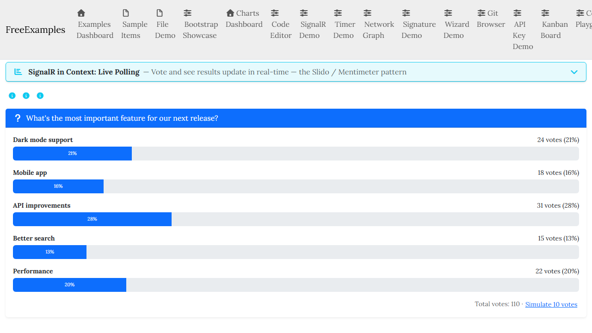
</a>
<br /><sub>🔐 Logged In</sub>
</td>
</tr></table>
</td>
</tr>
<tr>
<td colspan="3" align="center">
<strong><code>/tenant1/Examples/SignalRV4</code></strong>
<table><tr>
<td align="center">
<a href="snapshots/tenant1/Examples/SignalRV4/default.png">

</a>
<br /><sub>🔓 Public</sub>
</td>
<td align="center">
<sub><em>public page</em></sub>
<br /><sub>—</sub>
</td>
<td align="center">
<a href="snapshots/tenant1/Examples/SignalRV4/logged-in.png">
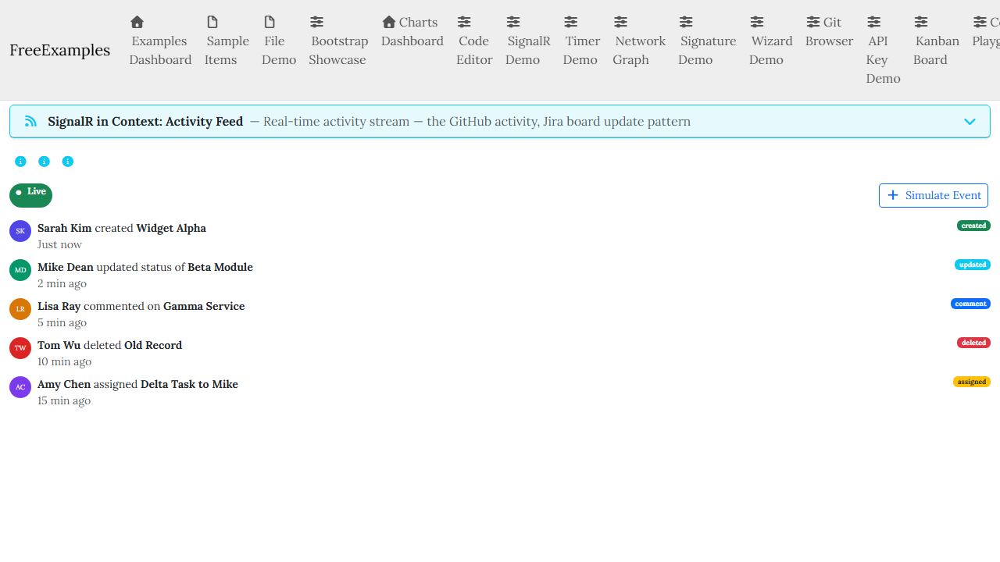
</a>
<br /><sub>🔐 Logged In</sub>
</td>
</tr></table>
</td>
</tr>
<tr>
<td colspan="3" align="center">
<strong><code>/tenant1/Examples/SignalRV5</code></strong>
<table><tr>
<td align="center">
<a href="snapshots/tenant1/Examples/SignalRV5/default.png">

</a>
<br /><sub>🔓 Public</sub>
</td>
<td align="center">
<sub><em>public page</em></sub>
<br /><sub>—</sub>
</td>
<td align="center">
<a href="snapshots/tenant1/Examples/SignalRV5/logged-in.png">
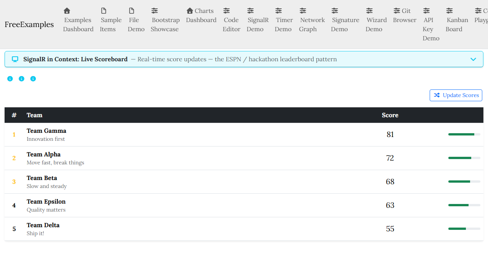
</a>
<br /><sub>🔐 Logged In</sub>
</td>
</tr></table>
</td>
</tr>
<tr>
<td colspan="3" align="center">
<strong><code>/tenant1/Examples/SignatureDemo</code></strong>
<table><tr>
<td align="center">
<a href="snapshots/tenant1/Examples/SignatureDemo/default.png">

</a>
<br /><sub>🔓 Public</sub>
</td>
<td align="center">
<sub><em>public page</em></sub>
<br /><sub>—</sub>
</td>
<td align="center">
<a href="snapshots/tenant1/Examples/SignatureDemo/logged-in.png">

</a>
<br /><sub>🔐 Logged In</sub>
</td>
</tr></table>
</td>
</tr>
<tr>
<td colspan="3" align="center">
<strong><code>/tenant1/Examples/SignatureV1</code></strong>
<table><tr>
<td align="center">
<a href="snapshots/tenant1/Examples/SignatureV1/default.png">

</a>
<br /><sub>🔓 Public</sub>
</td>
<td align="center">
<sub><em>public page</em></sub>
<br /><sub>—</sub>
</td>
<td align="center">
<a href="snapshots/tenant1/Examples/SignatureV1/logged-in.png">

</a>
<br /><sub>🔐 Logged In</sub>
</td>
</tr></table>
</td>
</tr>
<tr>
<td colspan="3" align="center">
<strong><code>/tenant1/Examples/SignatureV2</code></strong>
<table><tr>
<td align="center">
<a href="snapshots/tenant1/Examples/SignatureV2/default.png">

</a>
<br /><sub>🔓 Public</sub>
</td>
<td align="center">
<sub><em>public page</em></sub>
<br /><sub>—</sub>
</td>
<td align="center">
<a href="snapshots/tenant1/Examples/SignatureV2/logged-in.png">
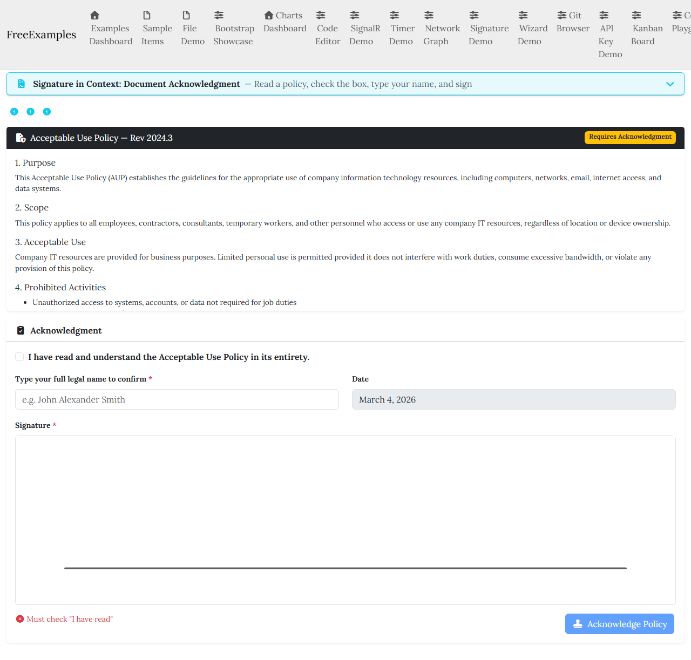
</a>
<br /><sub>🔐 Logged In</sub>
</td>
</tr></table>
</td>
</tr>
<tr>
<td colspan="3" align="center">
<strong><code>/tenant1/Examples/SignatureV3</code></strong>
<table><tr>
<td align="center">
<a href="snapshots/tenant1/Examples/SignatureV3/default.png">

</a>
<br /><sub>🔓 Public</sub>
</td>
<td align="center">
<sub><em>public page</em></sub>
<br /><sub>—</sub>
</td>
<td align="center">
<a href="snapshots/tenant1/Examples/SignatureV3/logged-in.png">
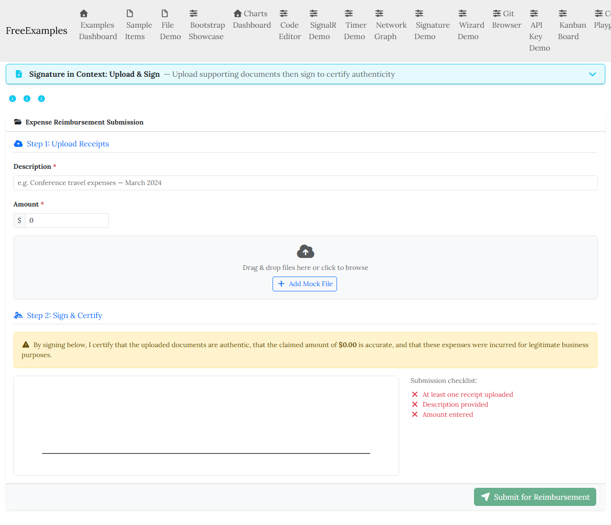
</a>
<br /><sub>🔐 Logged In</sub>
</td>
</tr></table>
</td>
</tr>
<tr>
<td colspan="3" align="center">
<strong><code>/tenant1/Examples/SignatureV4</code></strong>
<table><tr>
<td align="center">
<a href="snapshots/tenant1/Examples/SignatureV4/default.png">

</a>
<br /><sub>🔓 Public</sub>
</td>
<td align="center">
<sub><em>public page</em></sub>
<br /><sub>—</sub>
</td>
<td align="center">
<a href="snapshots/tenant1/Examples/SignatureV4/logged-in.png">
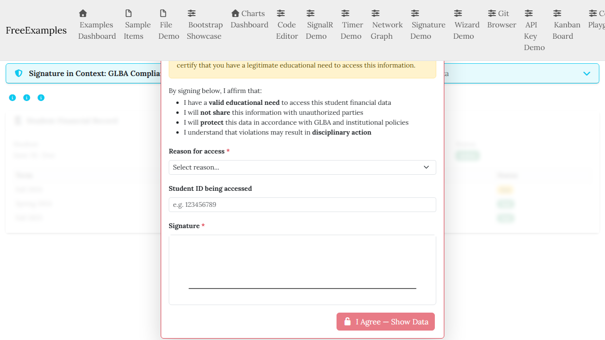
</a>
<br /><sub>🔐 Logged In</sub>
</td>
</tr></table>
</td>
</tr>
<tr>
<td colspan="3" align="center">
<strong><code>/tenant1/Examples/SignatureV5</code></strong>
<table><tr>
<td align="center">
<a href="snapshots/tenant1/Examples/SignatureV5/default.png">

</a>
<br /><sub>🔓 Public</sub>
</td>
<td align="center">
<sub><em>public page</em></sub>
<br /><sub>—</sub>
</td>
<td align="center">
<a href="snapshots/tenant1/Examples/SignatureV5/logged-in.png">

</a>
<br /><sub>🔐 Logged In</sub>
</td>
</tr></table>
</td>
</tr>
<tr>
<td colspan="3" align="center">
<strong><code>/tenant1/Examples/StatusBoard</code></strong>
<table><tr>
<td align="center">
<a href="snapshots/tenant1/Examples/StatusBoard/default.png">

</a>
<br /><sub>🔓 Public</sub>
</td>
<td align="center">
<sub><em>public page</em></sub>
<br /><sub>—</sub>
</td>
<td align="center">
<a href="snapshots/tenant1/Examples/StatusBoard/logged-in.png">

</a>
<br /><sub>🔐 Logged In</sub>
</td>
</tr></table>
</td>
</tr>
<tr>
<td colspan="3" align="center">
<strong><code>/tenant1/Examples/TimerDemo</code></strong>
<table><tr>
<td align="center">
<a href="snapshots/tenant1/Examples/TimerDemo/default.png">

</a>
<br /><sub>🔓 Public</sub>
</td>
<td align="center">
<sub><em>public page</em></sub>
<br /><sub>—</sub>
</td>
<td align="center">
<a href="snapshots/tenant1/Examples/TimerDemo/logged-in.png">

</a>
<br /><sub>🔐 Logged In</sub>
</td>
</tr></table>
</td>
</tr>
<tr>
<td colspan="3" align="center">
<strong><code>/tenant1/Examples/TimerV1</code></strong>
<table><tr>
<td align="center">
<a href="snapshots/tenant1/Examples/TimerV1/default.png">

</a>
<br /><sub>🔓 Public</sub>
</td>
<td align="center">
<sub><em>public page</em></sub>
<br /><sub>—</sub>
</td>
<td align="center">
<a href="snapshots/tenant1/Examples/TimerV1/logged-in.png">
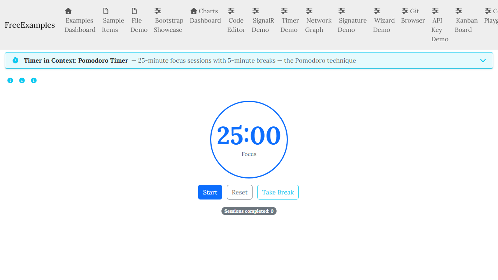
</a>
<br /><sub>🔐 Logged In</sub>
</td>
</tr></table>
</td>
</tr>
<tr>
<td colspan="3" align="center">
<strong><code>/tenant1/Examples/TimerV2</code></strong>
<table><tr>
<td align="center">
<a href="snapshots/tenant1/Examples/TimerV2/default.png">

</a>
<br /><sub>🔓 Public</sub>
</td>
<td align="center">
<sub><em>public page</em></sub>
<br /><sub>—</sub>
</td>
<td align="center">
<a href="snapshots/tenant1/Examples/TimerV2/logged-in.png">
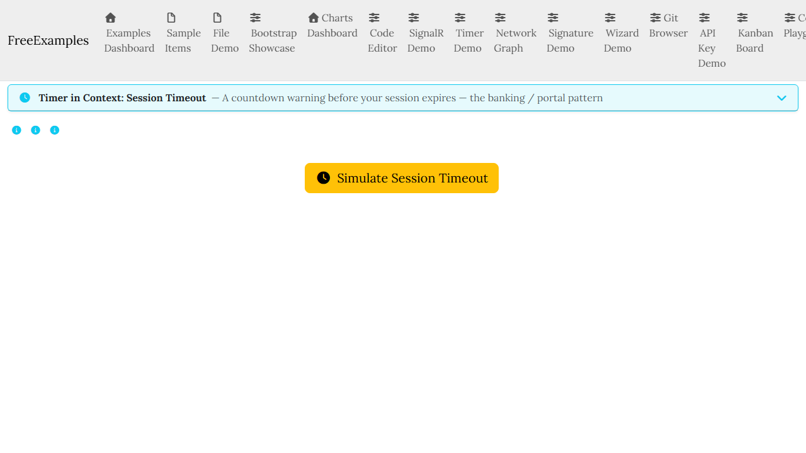
</a>
<br /><sub>🔐 Logged In</sub>
</td>
</tr></table>
</td>
</tr>
<tr>
<td colspan="3" align="center">
<strong><code>/tenant1/Examples/TimerV3</code></strong>
<table><tr>
<td align="center">
<a href="snapshots/tenant1/Examples/TimerV3/default.png">

</a>
<br /><sub>🔓 Public</sub>
</td>
<td align="center">
<sub><em>public page</em></sub>
<br /><sub>—</sub>
</td>
<td align="center">
<a href="snapshots/tenant1/Examples/TimerV3/logged-in.png">

</a>
<br /><sub>🔐 Logged In</sub>
</td>
</tr></table>
</td>
</tr>
<tr>
<td colspan="3" align="center">
<strong><code>/tenant1/Examples/TimerV4</code></strong>
<table><tr>
<td align="center">
<a href="snapshots/tenant1/Examples/TimerV4/default.png">

</a>
<br /><sub>🔓 Public</sub>
</td>
<td align="center">
<sub><em>public page</em></sub>
<br /><sub>—</sub>
</td>
<td align="center">
<a href="snapshots/tenant1/Examples/TimerV4/logged-in.png">
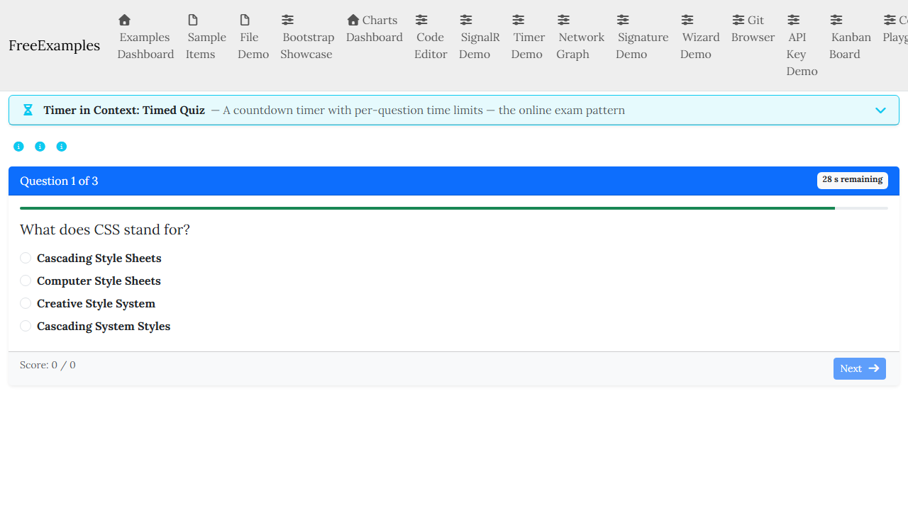
</a>
<br /><sub>🔐 Logged In</sub>
</td>
</tr></table>
</td>
</tr>
<tr>
<td colspan="3" align="center">
<strong><code>/tenant1/Examples/TimerV5</code></strong>
<table><tr>
<td align="center">
<a href="snapshots/tenant1/Examples/TimerV5/default.png">

</a>
<br /><sub>🔓 Public</sub>
</td>
<td align="center">
<sub><em>public page</em></sub>
<br /><sub>—</sub>
</td>
<td align="center">
<a href="snapshots/tenant1/Examples/TimerV5/logged-in.png">

</a>
<br /><sub>🔐 Logged In</sub>
</td>
</tr></table>
</td>
</tr>
<tr>
<td colspan="3" align="center">
<strong><code>/tenant1/Examples/WizardDemo</code></strong>
<table><tr>
<td align="center">
<a href="snapshots/tenant1/Examples/WizardDemo/default.png">

</a>
<br /><sub>🔓 Public</sub>
</td>
<td align="center">
<sub><em>public page</em></sub>
<br /><sub>—</sub>
</td>
<td align="center">
<a href="snapshots/tenant1/Examples/WizardDemo/logged-in.png">

</a>
<br /><sub>🔐 Logged In</sub>
</td>
</tr></table>
</td>
</tr>
<tr>
<td colspan="3" align="center">
<strong><code>/tenant1/Login</code></strong>
<table><tr>
<td align="center">
<a href="snapshots/tenant1/Login/default.png">

</a>
<br /><sub>🔓 Public</sub>
</td>
<td align="center">
<sub><em>public page</em></sub>
<br /><sub>—</sub>
</td>
<td align="center">
<a href="snapshots/tenant1/Login/logged-in.png">

</a>
<br /><sub>🔐 Logged In</sub>
</td>
</tr></table>
</td>
</tr>
<tr>
<td colspan="3" align="center">
<strong><code>/tenant1/Logout</code></strong>
<table><tr>
<td align="center">
<a href="snapshots/tenant1/Logout/default.png">

</a>
<br /><sub>🔓 Public</sub>
</td>
<td align="center">
<sub><em>public page</em></sub>
<br /><sub>—</sub>
</td>
<td align="center">
<a href="snapshots/tenant1/Logout/logged-in.png">

</a>
<br /><sub>🔐 Logged In</sub>
</td>
</tr></table>
</td>
</tr>
<tr>
<td colspan="3" align="center">
<strong><code>/tenant1/Monaco</code></strong>
<table><tr>
<td align="center">
<a href="snapshots/tenant1/Monaco/default.png">

</a>
<br /><sub>🔓 Public</sub>
</td>
<td align="center">
<sub><em>public page</em></sub>
<br /><sub>—</sub>
</td>
<td align="center">
<a href="snapshots/tenant1/Monaco/logged-in.png">

</a>
<br /><sub>🔐 Logged In</sub>
</td>
</tr></table>
</td>
</tr>
<tr>
<td colspan="3" align="center">
<strong><code>/tenant1/PasswordChanged</code></strong>
<table><tr>
<td align="center">
<a href="snapshots/tenant1/PasswordChanged/default.png">

</a>
<br /><sub>🔓 Public</sub>
</td>
<td align="center">
<sub><em>public page</em></sub>
<br /><sub>—</sub>
</td>
<td align="center">
<a href="snapshots/tenant1/PasswordChanged/logged-in.png">

</a>
<br /><sub>🔐 Logged In</sub>
</td>
</tr></table>
</td>
</tr>
<tr>
<td colspan="3" align="center">
<strong><code>/tenant1/Plugins</code></strong>
<table><tr>
<td align="center">
<a href="snapshots/tenant1/Plugins/default.png">

</a>
<br /><sub>🔓 Public</sub>
</td>
<td align="center">
<sub><em>public page</em></sub>
<br /><sub>—</sub>
</td>
<td align="center">
<a href="snapshots/tenant1/Plugins/logged-in.png">

</a>
<br /><sub>🔐 Logged In</sub>
</td>
</tr></table>
</td>
</tr>
<tr>
<td colspan="3" align="center">
<strong><code>/tenant1/ProcessLogin</code></strong>
<table><tr>
<td align="center">
<a href="snapshots/tenant1/ProcessLogin/default.png">

</a>
<br /><sub>🔓 Public</sub>
</td>
<td align="center">
<sub><em>public page</em></sub>
<br /><sub>—</sub>
</td>
<td align="center">
<a href="snapshots/tenant1/ProcessLogin/logged-in.png">

</a>
<br /><sub>🔐 Logged In</sub>
</td>
</tr></table>
</td>
</tr>
<tr>
<td colspan="3" align="center">
<strong><code>/tenant1/Profile</code></strong>
<table><tr>
<td align="center">
<a href="snapshots/tenant1/Profile/default.png">

</a>
<br /><sub>🔓 Public</sub>
</td>
<td align="center">
<sub><em>public page</em></sub>
<br /><sub>—</sub>
</td>
<td align="center">
<a href="snapshots/tenant1/Profile/logged-in.png">

</a>
<br /><sub>🔐 Logged In</sub>
</td>
</tr></table>
</td>
</tr>
<tr>
<td colspan="3" align="center">
<strong><code>/tenant1/ServerUpdated</code></strong>
<table><tr>
<td align="center">
<a href="snapshots/tenant1/ServerUpdated/default.png">

</a>
<br /><sub>🔓 Public</sub>
</td>
<td align="center">
<sub><em>public page</em></sub>
<br /><sub>—</sub>
</td>
<td align="center">
<a href="snapshots/tenant1/ServerUpdated/logged-in.png">

</a>
<br /><sub>🔐 Logged In</sub>
</td>
</tr></table>
</td>
</tr>
<tr>
<td colspan="3" align="center">
<strong><code>/tenant1/Settings</code></strong>
<table><tr>
<td align="center">
<a href="snapshots/tenant1/Settings/default.png">

</a>
<br /><sub>🔓 Public</sub>
</td>
<td align="center">
<sub><em>public page</em></sub>
<br /><sub>—</sub>
</td>
<td align="center">
<a href="snapshots/tenant1/Settings/logged-in.png">

</a>
<br /><sub>🔐 Logged In</sub>
</td>
</tr></table>
</td>
</tr>
<tr>
<td colspan="3" align="center">
<strong><code>/tenant1/Settings/AddDepartment</code></strong>
<table><tr>
<td align="center">
<a href="snapshots/tenant1/Settings/AddDepartment/default.png">

</a>
<br /><sub>🔓 Public</sub>
</td>
<td align="center">
<sub><em>public page</em></sub>
<br /><sub>—</sub>
</td>
<td align="center">
<a href="snapshots/tenant1/Settings/AddDepartment/logged-in.png">

</a>
<br /><sub>🔐 Logged In</sub>
</td>
</tr></table>
</td>
</tr>
<tr>
<td colspan="3" align="center">
<strong><code>/tenant1/Settings/AddDepartmentGroup</code></strong>
<table><tr>
<td align="center">
<a href="snapshots/tenant1/Settings/AddDepartmentGroup/default.png">

</a>
<br /><sub>🔓 Public</sub>
</td>
<td align="center">
<sub><em>public page</em></sub>
<br /><sub>—</sub>
</td>
<td align="center">
<a href="snapshots/tenant1/Settings/AddDepartmentGroup/logged-in.png">

</a>
<br /><sub>🔐 Logged In</sub>
</td>
</tr></table>
</td>
</tr>
<tr>
<td colspan="3" align="center">
<strong><code>/tenant1/Settings/AddTag</code></strong>
<table><tr>
<td align="center">
<a href="snapshots/tenant1/Settings/AddTag/default.png">

</a>
<br /><sub>🔓 Public</sub>
</td>
<td align="center">
<sub><em>public page</em></sub>
<br /><sub>—</sub>
</td>
<td align="center">
<a href="snapshots/tenant1/Settings/AddTag/logged-in.png">

</a>
<br /><sub>🔐 Logged In</sub>
</td>
</tr></table>
</td>
</tr>
<tr>
<td colspan="3" align="center">
<strong><code>/tenant1/Settings/AddTenant</code></strong>
<table><tr>
<td align="center">
<a href="snapshots/tenant1/Settings/AddTenant/default.png">

</a>
<br /><sub>🔓 Public</sub>
</td>
<td align="center">
<sub><em>public page</em></sub>
<br /><sub>—</sub>
</td>
<td align="center">
<a href="snapshots/tenant1/Settings/AddTenant/logged-in.png">

</a>
<br /><sub>🔐 Logged In</sub>
</td>
</tr></table>
</td>
</tr>
<tr>
<td colspan="3" align="center">
<strong><code>/tenant1/Settings/AddUser</code></strong>
<table><tr>
<td align="center">
<a href="snapshots/tenant1/Settings/AddUser/default.png">

</a>
<br /><sub>🔓 Public</sub>
</td>
<td align="center">
<sub><em>public page</em></sub>
<br /><sub>—</sub>
</td>
<td align="center">
<a href="snapshots/tenant1/Settings/AddUser/logged-in.png">

</a>
<br /><sub>🔐 Logged In</sub>
</td>
</tr></table>
</td>
</tr>
<tr>
<td colspan="3" align="center">
<strong><code>/tenant1/Settings/AddUserGroup</code></strong>
<table><tr>
<td align="center">
<a href="snapshots/tenant1/Settings/AddUserGroup/default.png">

</a>
<br /><sub>🔓 Public</sub>
</td>
<td align="center">
<sub><em>public page</em></sub>
<br /><sub>—</sub>
</td>
<td align="center">
<a href="snapshots/tenant1/Settings/AddUserGroup/logged-in.png">

</a>
<br /><sub>🔐 Logged In</sub>
</td>
</tr></table>
</td>
</tr>
<tr>
<td colspan="3" align="center">
<strong><code>/tenant1/Settings/AppSettings</code></strong>
<table><tr>
<td align="center">
<a href="snapshots/tenant1/Settings/AppSettings/default.png">

</a>
<br /><sub>🔓 Public</sub>
</td>
<td align="center">
<sub><em>public page</em></sub>
<br /><sub>—</sub>
</td>
<td align="center">
<a href="snapshots/tenant1/Settings/AppSettings/logged-in.png">

</a>
<br /><sub>🔐 Logged In</sub>
</td>
</tr></table>
</td>
</tr>
<tr>
<td colspan="3" align="center">
<strong><code>/tenant1/Settings/DeletedRecords</code></strong>
<table><tr>
<td align="center">
<a href="snapshots/tenant1/Settings/DeletedRecords/default.png">

</a>
<br /><sub>🔓 Public</sub>
</td>
<td align="center">
<sub><em>public page</em></sub>
<br /><sub>—</sub>
</td>
<td align="center">
<a href="snapshots/tenant1/Settings/DeletedRecords/logged-in.png">

</a>
<br /><sub>🔐 Logged In</sub>
</td>
</tr></table>
</td>
</tr>
<tr>
<td colspan="3" align="center">
<strong><code>/tenant1/Settings/DepartmentGroups</code></strong>
<table><tr>
<td align="center">
<a href="snapshots/tenant1/Settings/DepartmentGroups/default.png">

</a>
<br /><sub>🔓 Public</sub>
</td>
<td align="center">
<sub><em>public page</em></sub>
<br /><sub>—</sub>
</td>
<td align="center">
<a href="snapshots/tenant1/Settings/DepartmentGroups/logged-in.png">

</a>
<br /><sub>🔐 Logged In</sub>
</td>
</tr></table>
</td>
</tr>
<tr>
<td colspan="3" align="center">
<strong><code>/tenant1/Settings/Departments</code></strong>
<table><tr>
<td align="center">
<a href="snapshots/tenant1/Settings/Departments/default.png">

</a>
<br /><sub>🔓 Public</sub>
</td>
<td align="center">
<sub><em>public page</em></sub>
<br /><sub>—</sub>
</td>
<td align="center">
<a href="snapshots/tenant1/Settings/Departments/logged-in.png">

</a>
<br /><sub>🔐 Logged In</sub>
</td>
</tr></table>
</td>
</tr>
<tr>
<td colspan="3" align="center">
<strong><code>/tenant1/Settings/Files</code></strong>
<table><tr>
<td align="center">
<a href="snapshots/tenant1/Settings/Files/default.png">

</a>
<br /><sub>🔓 Public</sub>
</td>
<td align="center">
<sub><em>public page</em></sub>
<br /><sub>—</sub>
</td>
<td align="center">
<a href="snapshots/tenant1/Settings/Files/logged-in.png">

</a>
<br /><sub>🔐 Logged In</sub>
</td>
</tr></table>
</td>
</tr>
<tr>
<td colspan="3" align="center">
<strong><code>/tenant1/Settings/Language</code></strong>
<table><tr>
<td align="center">
<a href="snapshots/tenant1/Settings/Language/default.png">

</a>
<br /><sub>🔓 Public</sub>
</td>
<td align="center">
<sub><em>public page</em></sub>
<br /><sub>—</sub>
</td>
<td align="center">
<a href="snapshots/tenant1/Settings/Language/logged-in.png">

</a>
<br /><sub>🔐 Logged In</sub>
</td>
</tr></table>
</td>
</tr>
<tr>
<td colspan="3" align="center">
<strong><code>/tenant1/Settings/Tags</code></strong>
<table><tr>
<td align="center">
<a href="snapshots/tenant1/Settings/Tags/default.png">

</a>
<br /><sub>🔓 Public</sub>
</td>
<td align="center">
<sub><em>public page</em></sub>
<br /><sub>—</sub>
</td>
<td align="center">
<a href="snapshots/tenant1/Settings/Tags/logged-in.png">

</a>
<br /><sub>🔐 Logged In</sub>
</td>
</tr></table>
</td>
</tr>
<tr>
<td colspan="3" align="center">
<strong><code>/tenant1/Settings/Tenants</code></strong>
<table><tr>
<td align="center">
<a href="snapshots/tenant1/Settings/Tenants/default.png">

</a>
<br /><sub>🔓 Public</sub>
</td>
<td align="center">
<sub><em>public page</em></sub>
<br /><sub>—</sub>
</td>
<td align="center">
<a href="snapshots/tenant1/Settings/Tenants/logged-in.png">

</a>
<br /><sub>🔐 Logged In</sub>
</td>
</tr></table>
</td>
</tr>
<tr>
<td colspan="3" align="center">
<strong><code>/tenant1/Settings/UDF</code></strong>
<table><tr>
<td align="center">
<a href="snapshots/tenant1/Settings/UDF/default.png">

</a>
<br /><sub>🔓 Public</sub>
</td>
<td align="center">
<sub><em>public page</em></sub>
<br /><sub>—</sub>
</td>
<td align="center">
<a href="snapshots/tenant1/Settings/UDF/logged-in.png">

</a>
<br /><sub>🔐 Logged In</sub>
</td>
</tr></table>
</td>
</tr>
<tr>
<td colspan="3" align="center">
<strong><code>/tenant1/Settings/UserGroups</code></strong>
<table><tr>
<td align="center">
<a href="snapshots/tenant1/Settings/UserGroups/default.png">

</a>
<br /><sub>🔓 Public</sub>
</td>
<td align="center">
<sub><em>public page</em></sub>
<br /><sub>—</sub>
</td>
<td align="center">
<a href="snapshots/tenant1/Settings/UserGroups/logged-in.png">

</a>
<br /><sub>🔐 Logged In</sub>
</td>
</tr></table>
</td>
</tr>
<tr>
<td colspan="3" align="center">
<strong><code>/tenant1/Settings/Users</code></strong>
<table><tr>
<td align="center">
<a href="snapshots/tenant1/Settings/Users/default.png">

</a>
<br /><sub>🔓 Public</sub>
</td>
<td align="center">
<sub><em>public page</em></sub>
<br /><sub>—</sub>
</td>
<td align="center">
<a href="snapshots/tenant1/Settings/Users/logged-in.png">

</a>
<br /><sub>🔐 Logged In</sub>
</td>
</tr></table>
</td>
</tr>
<tr>
<td colspan="3" align="center">
<strong><code>/tenant1/SortTest</code></strong>
<table><tr>
<td align="center">
<a href="snapshots/tenant1/SortTest/default.png">

</a>
<br /><sub>🔓 Public</sub>
</td>
<td align="center">
<sub><em>public page</em></sub>
<br /><sub>—</sub>
</td>
<td align="center">
<a href="snapshots/tenant1/SortTest/logged-in.png">

</a>
<br /><sub>🔐 Logged In</sub>
</td>
</tr></table>
</td>
</tr>
<tr>
<td colspan="3" align="center">
<strong><code>/tenant1/TimerTest</code></strong>
<table><tr>
<td align="center">
<a href="snapshots/tenant1/TimerTest/default.png">

</a>
<br /><sub>🔓 Public</sub>
</td>
<td align="center">
<sub><em>public page</em></sub>
<br /><sub>—</sub>
</td>
<td align="center">
<a href="snapshots/tenant1/TimerTest/logged-in.png">

</a>
<br /><sub>🔐 Logged In</sub>
</td>
</tr></table>
</td>
</tr>
</table>

</details>

---

## 🔧 Tool Information

This report was generated by the **WorkspaceReporter** tool, which aggregates outputs from:

| Tool | Purpose |
|------|---------|
| **WorkspaceInventory** | Scans codebase, extracts metrics and classifications |
| **EndpointMapper** | Discovers Blazor routes from `@page` directives |
| **EndpointPoker** | Performs HTTP GET requests to verify routes |
| **BrowserSnapshot** | Captures full-page screenshots with Playwright |

---

**[FreeTools](https://github.com/WSU-EIT/FreeTools)** — Open source workspace analysis tools for .NET projects

Developed by [Enrollment Information Technology](https://em.wsu.edu/eit/meet-our-staff/) at Washington State University

