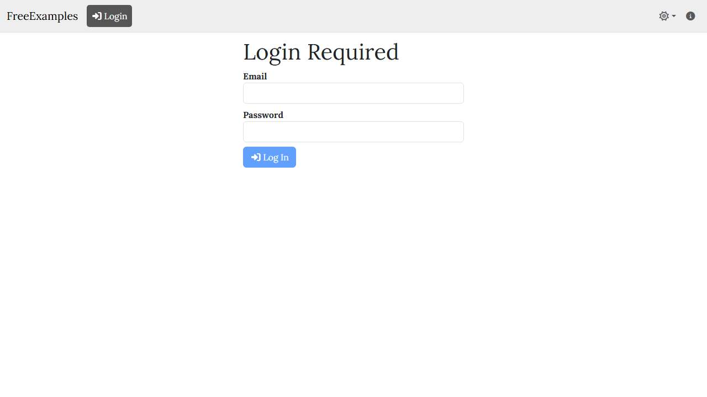

# 📄 Page Scan Report

> **URL:** https://localhost:7271/Setup  
> **Captured:** 2026-03-04 21:13:05 UTC  
> **Status:** ❌ 200  

---

## 📑 Contents

- [Summary](#-summary)
- [Screenshots](#-screenshots)
- [Page Images](#-page-images)
- [Actions](#-actions)
- [Files](#-files)

---

## 📋 Summary

| Field | Value |
|-------|-------|
| URL | https://localhost:7271/Setup |
| Redirected To | https://localhost:7271/Login |
| Title | *(none)* |
| Status | ❌ 200 |
| HTML Size | 0 bytes |
| Screenshots | 2 (30.8 KB) |
| Images | 0 (referenced by URL) |
| Images Missing Alt | ✅ 0 |
| JS Errors | ✅ 0 |
| JS Warnings | 0 |
| Auth | none |
| Captured | 2026-03-04T21:13:05.3988533Z |

> ❌ **Error:** `Timeout 30000ms exceeded.
Call log:
  - waiting for Locator("#login-email").First
    - locator resolved to <input _bl_384="" type="text" id="login-email" class="form-control"/>
    - fill("admin")
  - attempting fill action
    - waiting for element to be visible, enabled and editable
  - element was detached from the DOM, retrying
    - locator resolved to <input _bl_402="" type="text" id="login-email" class="form-control"/>
    - fill("admin")
  - attempting fill action
    - waiting for element to be visible, enabled and editable
  - element was detached from the DOM, retrying
    - locator resolved to <input _bl_426="" type="text" id="login-email" class="form-control"/>
    - fill("admin")
  - attempting fill action
    - waiting for element to be visible, enabled and editable
  - element was detached from the DOM, retrying
    - locator resolved to <input _bl_450="" type="text" id="login-email" class="form-control"/>
    - fill("admin")
  - attempting fill action
    - waiting for element to be visible, enabled and editable
  - element was detached from the DOM, retrying
    - locator resolved to <input _bl_474="" type="text" id="login-email" class="form-control"/>
    - fill("admin")
  - attempting fill action
    - waiting for element to be visible, enabled and editable
  - element was detached from the DOM, retrying
    - locator resolved to <input _bl_498="" type="text" id="login-email" class="form-control"/>
    - fill("admin")
  - attempting fill action
    - waiting for element to be visible, enabled and editable
  - element was detached from the DOM, retrying
    - locator resolved to <input _bl_552="" type="text" id="login-email" class="form-control"/>
    - fill("admin")
  - attempting fill action
    - waiting for element to be visible, enabled and editable
  - element was detached from the DOM, retrying
    - locator resolved to <input _bl_600="" type="text" id="login-email" class="form-control"/>
    - fill("admin")
  - attempting fill action
    - waiting for element to be visible, enabled and editable
  - element was detached from the DOM, retrying
    - locator resolved to <input _bl_660="" type="text" id="login-email" class="form-control"/>
    - fill("admin")
  - attempting fill action
    - waiting for element to be visible, enabled and editable
  - element was detached from the DOM, retrying
    - locator resolved to <input _bl_720="" type="text" id="login-email" class="form-control"/>
    - fill("admin")
  - attempting fill action
    - waiting for element to be visible, enabled and editable
  - element was detached from the DOM, retrying
    - locator resolved to <input _bl_774="" type="text" id="login-email" class="form-control"/>
    - fill("admin")
  - attempting fill action
    - waiting for element to be visible, enabled and editable
  - element was detached from the DOM, retrying
    - locator resolved to <input _bl_834="" type="text" id="login-email" class="form-control"/>
    - fill("admin")
  - attempting fill action
    - waiting for element to be visible, enabled and editable
  - element was detached from the DOM, retrying
    - locator resolved to <input _bl_894="" type="text" id="login-email" class="form-control"/>
    - fill("admin")
  - attempting fill action
    - waiting for element to be visible, enabled and editable
  - element was detached from the DOM, retrying
    - locator resolved to <input _bl_954="" type="text" id="login-email" class="form-control"/>
    - fill("admin")
  - attempting fill action
    - waiting for element to be visible, enabled and editable
  - element was detached from the DOM, retrying
    - locator resolved to <input type="text" _bl_1008="" id="login-email" class="form-control"/>
    - fill("admin")
  - attempting fill action
    - waiting for element to be visible, enabled and editable
  - element was detached from the DOM, retrying
    - locator resolved to <input type="text" _bl_1068="" id="login-email" class="form-control"/>
    - fill("admin")
  - attempting fill action
    - waiting for element to be visible, enabled and editable
  - element was detached from the DOM, retrying
    - locator resolved to <input type="text" _bl_1128="" id="login-email" class="form-control"/>
    - fill("admin")
  - attempting fill action
    - waiting for element to be visible, enabled and editable
  - element was detached from the DOM, retrying
    - locator resolved to <input type="text" _bl_1188="" id="login-email" class="form-control"/>
    - fill("admin")
  - attempting fill action
    - waiting for element to be visible, enabled and editable
  - element was detached from the DOM, retrying
    - locator resolved to <input type="text" _bl_1248="" id="login-email" class="form-control"/>
    - fill("admin")
  - attempting fill action
    - waiting for element to be visible, enabled and editable
  - element was detached from the DOM, retrying
    - locator resolved to <input type="text" _bl_1302="" id="login-email" class="form-control"/>
    - fill("admin")
  - attempting fill action
    - waiting for element to be visible, enabled and editable
  - element was detached from the DOM, retrying
    - locator resolved to <input type="text" _bl_1362="" id="login-email" class="form-control"/>
    - fill("admin")
  - attempting fill action
    - waiting for element to be visible, enabled and editable
  - element was detached from the DOM, retrying
    - locator resolved to <input type="text" _bl_1422="" id="login-email" class="form-control"/>
    - fill("admin")
  - attempting fill action
    - waiting for element to be visible, enabled and editable
  - element was detached from the DOM, retrying
    - locator resolved to <input type="text" _bl_1482="" id="login-email" class="form-control"/>
    - fill("admin")
  - attempting fill action
    - waiting for element to be visible, enabled and editable
  - element was detached from the DOM, retrying
    - locator resolved to <input type="text" _bl_1536="" id="login-email" class="form-control"/>
    - fill("admin")
  - attempting fill action
    - waiting for element to be visible, enabled and editable
  - element was detached from the DOM, retrying
    - locator resolved to <input type="text" _bl_1590="" id="login-email" class="form-control"/>
    - fill("admin")
  - attempting fill action
    - waiting for element to be visible, enabled and editable
  - element was detached from the DOM, retrying
    - locator resolved to <input type="text" _bl_1644="" id="login-email" class="form-control"/>
    - fill("admin")
  - attempting fill action
    - waiting for element to be visible, enabled and editable
  - element was detached from the DOM, retrying
    - locator resolved to <input type="text" _bl_1698="" id="login-email" class="form-control"/>
    - fill("admin")
  - attempting fill action
    - waiting for element to be visible, enabled and editable
  - element was detached from the DOM, retrying
    - locator resolved to <input type="text" _bl_1752="" id="login-email" class="form-control"/>
    - fill("admin")
  - attempting fill action
    - waiting for element to be visible, enabled and editable
  - element was detached from the DOM, retrying
    - locator resolved to <input type="text" _bl_1812="" id="login-email" class="form-control"/>
    - fill("admin")
  - attempting fill action
    - waiting for element to be visible, enabled and editable
  - element was detached from the DOM, retrying
    - locator resolved to <input type="text" _bl_1872="" id="login-email" class="form-control"/>
    - fill("admin")
  - attempting fill action
    - waiting for element to be visible, enabled and editable
  - element was detached from the DOM, retrying
    - locator resolved to <input type="text" _bl_1926="" id="login-email" class="form-control"/>
    - fill("admin")
  - attempting fill action
    - waiting for element to be visible, enabled and editable
  - element was detached from the DOM, retrying
    - locator resolved to <input type="text" _bl_1986="" id="login-email" class="form-control"/>
    - fill("admin")
  - attempting fill action
    - waiting for element to be visible, enabled and editable
  - element was detached from the DOM, retrying
    - locator resolved to <input type="text" _bl_2040="" id="login-email" class="form-control"/>
    - fill("admin")
  - attempting fill action
    - waiting for element to be visible, enabled and editable
  - element was detached from the DOM, retrying
    - locator resolved to <input type="text" _bl_2100="" id="login-email" class="form-control"/>
    - fill("admin")
  - attempting fill action
    - waiting for element to be visible, enabled and editable
  - element was detached from the DOM, retrying
    - locator resolved to <input type="text" _bl_2160="" id="login-email" class="form-control"/>
    - fill("admin")
  - attempting fill action
    - waiting for element to be visible, enabled and editable
  - element was detached from the DOM, retrying
    - locator resolved to <input type="text" _bl_2220="" id="login-email" class="form-control"/>
    - fill("admin")
  - attempting fill action
    - waiting for element to be visible, enabled and editable
  - element was detached from the DOM, retrying
    - locator resolved to <input type="text" _bl_2274="" id="login-email" class="form-control"/>
    - fill("admin")
  - attempting fill action
    - waiting for element to be visible, enabled and editable
  - element was detached from the DOM, retrying
    - locator resolved to <input type="text" _bl_2334="" id="login-email" class="form-control"/>
    - fill("admin")
  - attempting fill action
    - waiting for element to be visible, enabled and editable
  - element was detached from the DOM, retrying
    - locator resolved to <input type="text" _bl_2394="" id="login-email" class="form-control"/>
    - fill("admin")
  - attempting fill action
    - waiting for element to be visible, enabled and editable
  - element was detached from the DOM, retrying`

## 🔧 Actions

<strong>6 action(s) performed</strong>

- Screenshot #1: page-loaded (15.4 KB)
- Attempted login as 'admin'
- Found username field via: #login-email
- Found password field via: #login-password
- Screenshot #2: auth-form-detected (15.4 KB)
- Scan aborted due to error

## 📸 Screenshots

<table>
<tr>
<td align="center" width="50%">

 <strong>1. page-loaded</strong>
 15.4 KB
</td>
<td align="center" width="50%">

 <strong>2. auth-form-detected</strong>
 15.4 KB
</td>
</tr>
</table>

## 🖼️ Page Images (0)

*No images found on page.*

## 📁 Files

| File | Description |
|------|-------------|
| `01-page-loaded.jpg` | page-loaded (15.4 KB) |
| `02-auth-form-detected.jpg` | auth-form-detected (15.4 KB) |
| `page.html` | Rendered HTML content |
| `metadata.json` | Machine-readable scan data |
| `errors.log` | JavaScript console errors |
| `warnings.log` | JavaScript console warnings |
| `info.log` | Navigation and timing details |
| `actions.log` | Interactions performed |

---

*Generated by AccessibilityScanner (FreeTools) v1.0*
