# 📄 Page Scan Report

> **URL:** https://localhost:7271/tenant1/Profile  
> **Captured:** 2026-03-04 20:55:11 UTC  
> **Status:** ✅ 200  

---

## 📑 Contents

- [Summary](#-summary)
- [Screenshots](#-screenshots)
- [Page Images](#-page-images)
- [JavaScript Errors](#-javascript-errors)
- [Accessibility](#-accessibility)
- [Actions](#-actions)
- [Files](#-files)

---

## 📋 Summary

| Field | Value |
|-------|-------|
| URL | https://localhost:7271/tenant1/Profile |
| Title | FreeExamples |
| Status | ✅ 200 |
| HTML Size | 80.0 KB |
| Screenshots | 18 (697.7 KB) |
| Images | 1 (referenced by URL) |
| Images Missing Alt | ⚠️ 1 |
| JS Errors | 🔴 1 |
| JS Warnings | 9 |
| A11y Violations | ⚠️ 9 |
| 🔴 Critical | 1 |
| 🟠 Serious | 6 |
| 🟡 Moderate | 2 |
| 🔵 Minor | 0 |
| Tools Run | axe, htmlcheck |
| Auth | admin |
| Captured | 2026-03-04T20:55:11.0838893Z |

## 🔴 JavaScript Errors

<details>
<summary><strong>1 error(s) detected</strong></summary>

```
Failed to load resource: net::ERR_CONNECTION_FAILED
```

</details>

## 🔧 Actions

<details>
<summary><strong>30 action(s) performed</strong></summary>

- Screenshot #1: page-loaded (15.9 KB)
- Attempted login as 'admin'
- Found username field via: #login-email
- Found password field via: #login-password
- Screenshot #2: auth-form-detected (15.9 KB)
- Filled username field with 'admin'
- Filled password field with ****
- Screenshot #3: auth-form-filled (16.6 KB)
- Clicked submit button via: button:has-text('Log in')
- Waited 3000ms for post-login settle
- Screenshot #4: auth-result (7.1 KB)
- Auth flow completed for 'admin'
- Expanded 3 collapsed section(s)
- Screenshot #5: page-expanded (28.1 KB)
- Cataloged 1 images by URL (no download)
- axe-core: 4 violations (153ms)
- htmlcheck: 5 violations (0ms)
- Screenshot #6: axe-overlay (32.4 KB)
- Screenshot #7: wave-overlay (55.7 KB)
- Screenshot #8: htmlcs-overlay (73.4 KB)
- Screenshot #9: ibm-a11y-overlay (41.7 KB)
- Screenshot #10: structure-overlay (91.3 KB)
- Screenshot #11: cvd-protanopia (31.3 KB)
- Screenshot #12: cvd-deuteranopia (32.1 KB)
- Screenshot #13: cvd-tritanopia (31.6 KB)
- Screenshot #14: cvd-achromatopsia (31.2 KB)
- Screenshot #15: cvd-protanomaly (31.6 KB)
- Screenshot #16: cvd-deuteranomaly (32.0 KB)
- Screenshot #17: cvd-tritanomaly (31.5 KB)
- Screenshot #18: screenreader-view (98.3 KB)

</details>

## 📸 Screenshots

<table>
<tr>
<td align="center" width="50%">
<a href="01-page-loaded.jpg">

</a>
<br /><strong>1. page-loaded</strong>
<br /><sub>15.9 KB</sub>
</td>
<td align="center" width="50%">
<a href="02-auth-form-detected.jpg">
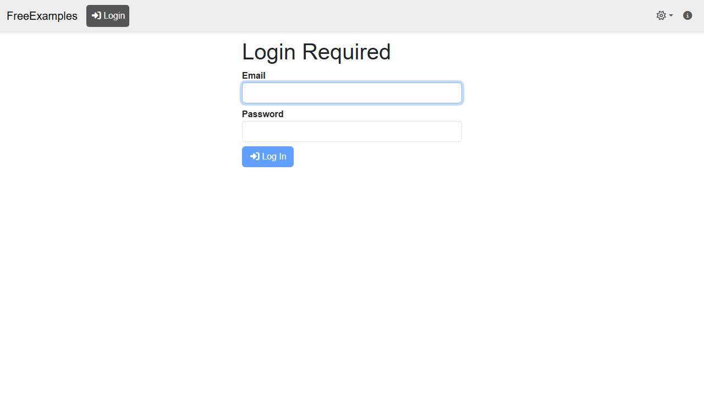
</a>
<br /><strong>2. auth-form-detected</strong>
<br /><sub>15.9 KB</sub>
</td>
</tr>
<tr>
<td align="center" width="50%">
<a href="03-auth-form-filled.jpg">
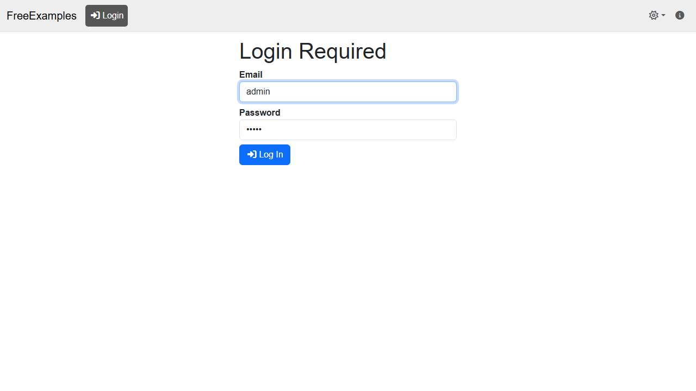
</a>
<br /><strong>3. auth-form-filled</strong>
<br /><sub>16.6 KB</sub>
</td>
<td align="center" width="50%">
<a href="04-auth-result.jpg">
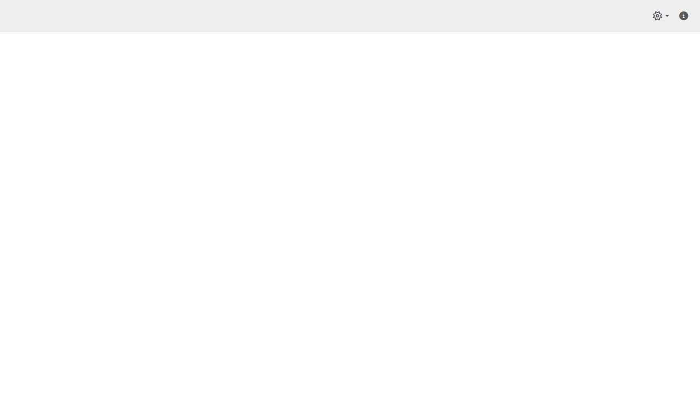
</a>
<br /><strong>4. auth-result</strong>
<br /><sub>7.1 KB</sub>
</td>
</tr>
<tr>
<td align="center" width="50%">
<a href="05-page-expanded.jpg">
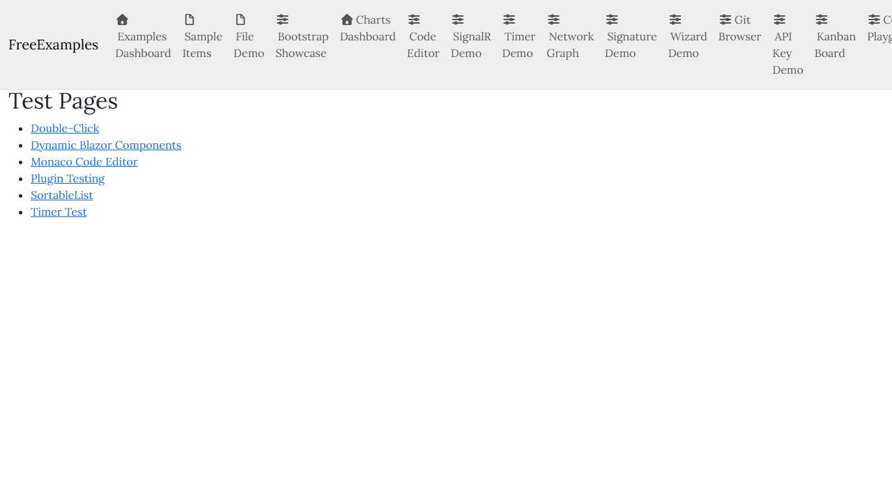
</a>
<br /><strong>5. page-expanded</strong>
<br /><sub>28.1 KB</sub>
</td>
<td align="center" width="50%">
<a href="06-axe-overlay.jpg">
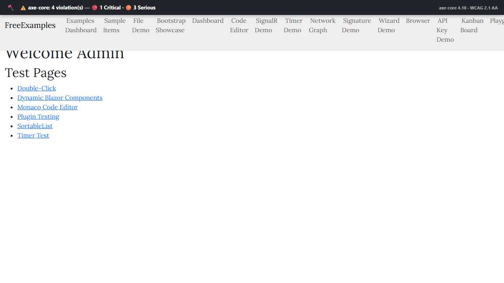
</a>
<br /><strong>6. axe-overlay</strong>
<br /><sub>32.4 KB</sub>
</td>
</tr>
<tr>
<td align="center" width="50%">
<a href="07-wave-overlay.jpg">
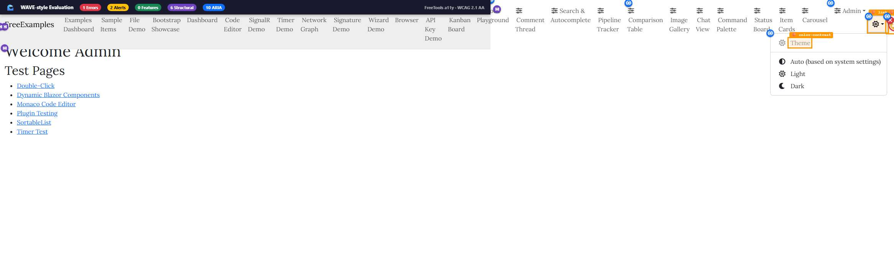
</a>
<br /><strong>7. wave-overlay</strong>
<br /><sub>55.7 KB</sub>
</td>
<td align="center" width="50%">
<a href="08-htmlcs-overlay.jpg">
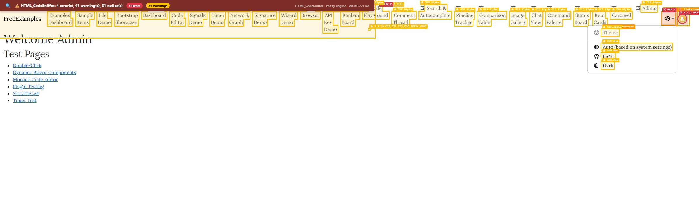
</a>
<br /><strong>8. htmlcs-overlay</strong>
<br /><sub>73.4 KB</sub>
</td>
</tr>
<tr>
<td align="center" width="50%">
<a href="09-ibm-a11y-overlay.jpg">
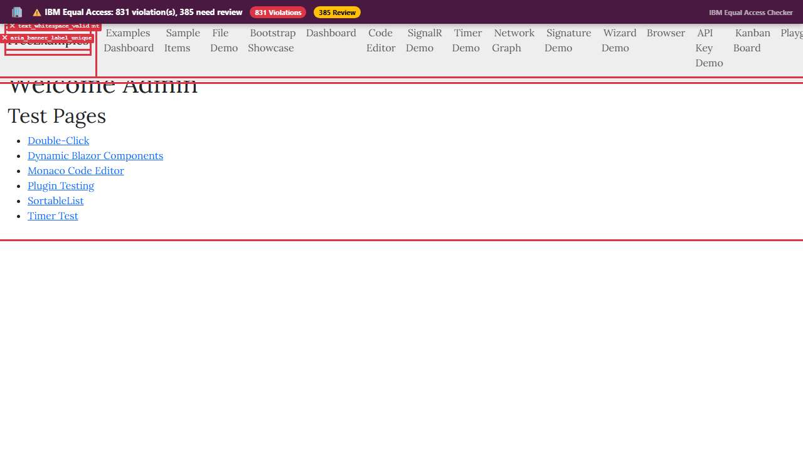
</a>
<br /><strong>9. ibm-a11y-overlay</strong>
<br /><sub>41.7 KB</sub>
</td>
<td align="center" width="50%">
<a href="10-structure-overlay.jpg">
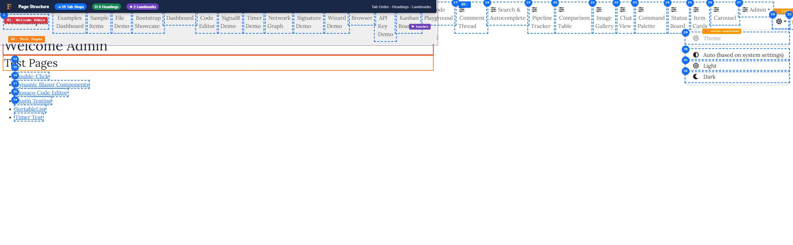
</a>
<br /><strong>10. structure-overlay</strong>
<br /><sub>91.3 KB</sub>
</td>
</tr>
<tr>
<td align="center" width="50%">
<a href="11-cvd-protanopia.jpg">

</a>
<br /><strong>11. cvd-protanopia</strong>
<br /><sub>31.3 KB</sub>
</td>
<td align="center" width="50%">
<a href="12-cvd-deuteranopia.jpg">
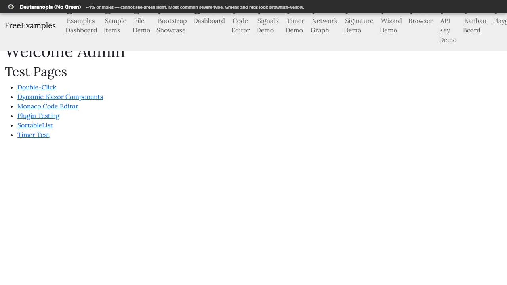
</a>
<br /><strong>12. cvd-deuteranopia</strong>
<br /><sub>32.1 KB</sub>
</td>
</tr>
<tr>
<td align="center" width="50%">
<a href="13-cvd-tritanopia.jpg">
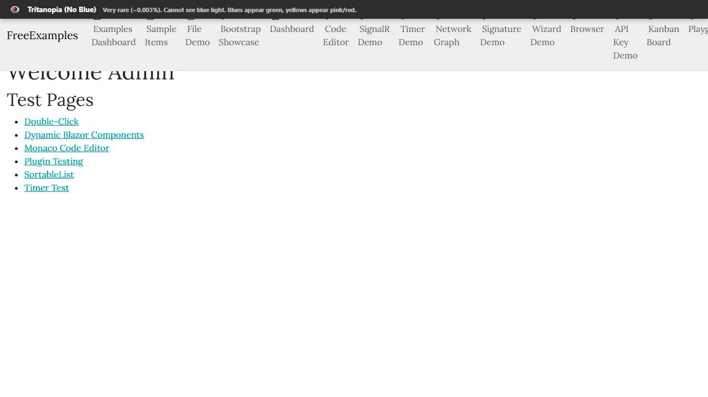
</a>
<br /><strong>13. cvd-tritanopia</strong>
<br /><sub>31.6 KB</sub>
</td>
<td align="center" width="50%">
<a href="14-cvd-achromatopsia.jpg">
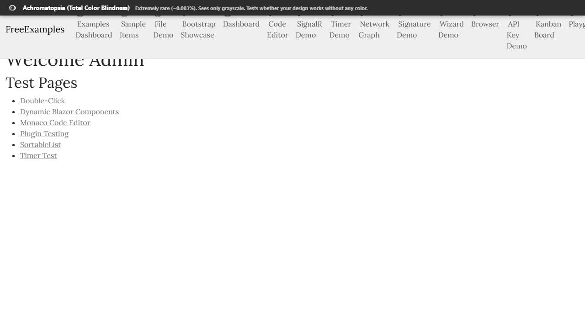
</a>
<br /><strong>14. cvd-achromatopsia</strong>
<br /><sub>31.2 KB</sub>
</td>
</tr>
<tr>
<td align="center" width="50%">
<a href="15-cvd-protanomaly.jpg">

</a>
<br /><strong>15. cvd-protanomaly</strong>
<br /><sub>31.6 KB</sub>
</td>
<td align="center" width="50%">
<a href="16-cvd-deuteranomaly.jpg">
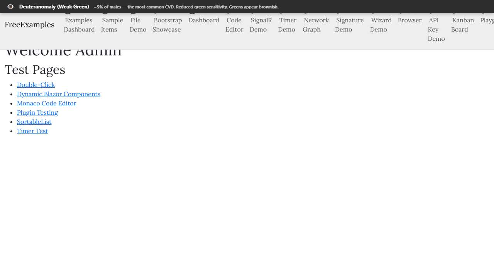
</a>
<br /><strong>16. cvd-deuteranomaly</strong>
<br /><sub>32.0 KB</sub>
</td>
</tr>
<tr>
<td align="center" width="50%">
<a href="17-cvd-tritanomaly.jpg">

</a>
<br /><strong>17. cvd-tritanomaly</strong>
<br /><sub>31.5 KB</sub>
</td>
<td align="center" width="50%">
<a href="18-screenreader-view.jpg">
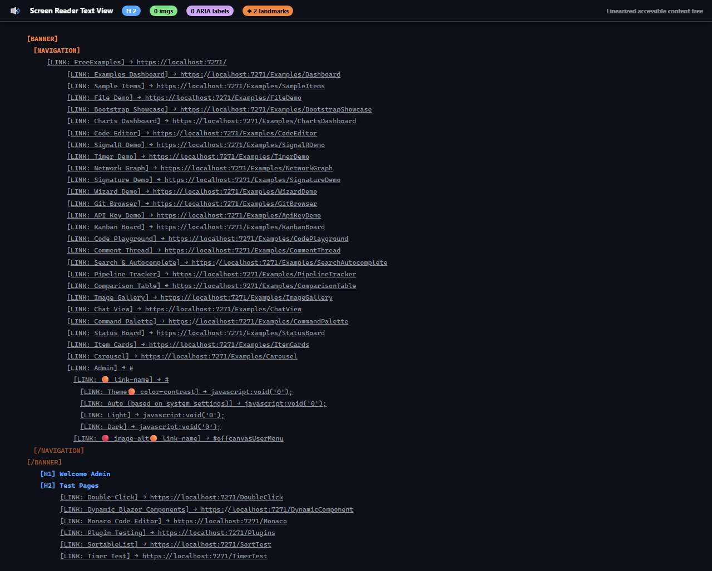
</a>
<br /><strong>18. screenreader-view</strong>
<br /><sub>98.3 KB</sub>
</td>
</tr>
</table>

## 🖼️ Page Images (1)

<details open>
<summary><strong>📋 Image Index</strong> — 1 images (referenced by URL)</summary>

| # | Source URL | Alt Text |
|--:|-----------|----------|
| 1 | https://localhost:7271/File/View/39efbd88-a08d-496d-88ea-2a2459072e55 | ⚠️ *(missing)* |

</details>

<details open>
<summary><strong>🖼️ Gallery</strong></summary>

<table>
<tr>
<td align="center" width="33%">
<a href="https://localhost:7271/File/View/39efbd88-a08d-496d-88ea-2a2459072e55">

</a>
<br /><sub>https://localhost:7271/File/View/39efbd88-a08d-... ⚠️</sub>
</td>
<td></td>
<td></td>
</tr>
</table>

</details>

<details>
<summary>⚠️ <strong>Images Missing Alt Text</strong> (1)</summary>

| # | Source URL |
|--:|-----------|
| 1 | https://localhost:7271/File/View/39efbd88-a08d-496d-88ea-2a2459072e55 |

</details>

## ♿ Accessibility

### Summary

| Severity | axe | htmlcheck |
|----------|:---:|:---:|
| 🔴 critical | 1 | 0 |
| 🟠 serious | 3 | 3 |
| 🟡 moderate | 0 | 2 |
| 🔵 minor | 0 | 0 |
| **Total** | **4** | **5** |

### Violations by Confidence

<details open>
<summary><strong>5 rule(s) violated</strong></summary>

| # | Rule | Sev | Confidence | axe | htmlcheck | Example |
|--:|------|:---:|:----------:|:---:|:---:|---------|
| 1 | [image-alt](../../a11y-rules.md#image-alt) | 🔴 | 🟢 2/2 | ⚠️ | ⚠️ | `<!--!-->Theme</span>` |
| 4 | [skip-link](../../a11y-rules.md#skip-link) | 🟡 | 🟡 1/2 | ✅ | ⚠️ |  |
| 5 | [landmark-one-main](../../a11y-rules.md#landmark-one-main) | 🟡 | 🟡 1/2 | ✅ | ⚠️ |  |

</details>

> **Note:** Automated scanning catches ~30-60% of WCAG issues. Manual keyboard and screen reader testing is still required for full compliance.

## 📁 Files

| File | Description |
|------|-------------|
| `01-page-loaded.jpg` | page-loaded (15.9 KB) |
| `02-auth-form-detected.jpg` | auth-form-detected (15.9 KB) |
| `03-auth-form-filled.jpg` | auth-form-filled (16.6 KB) |
| `04-auth-result.jpg` | auth-result (7.1 KB) |
| `05-page-expanded.jpg` | page-expanded (28.1 KB) |
| `06-axe-overlay.jpg` | axe-overlay (32.4 KB) |
| `07-wave-overlay.jpg` | wave-overlay (55.7 KB) |
| `08-htmlcs-overlay.jpg` | htmlcs-overlay (73.4 KB) |
| `09-ibm-a11y-overlay.jpg` | ibm-a11y-overlay (41.7 KB) |
| `10-structure-overlay.jpg` | structure-overlay (91.3 KB) |
| `11-cvd-protanopia.jpg` | cvd-protanopia (31.3 KB) |
| `12-cvd-deuteranopia.jpg` | cvd-deuteranopia (32.1 KB) |
| `13-cvd-tritanopia.jpg` | cvd-tritanopia (31.6 KB) |
| `14-cvd-achromatopsia.jpg` | cvd-achromatopsia (31.2 KB) |
| `15-cvd-protanomaly.jpg` | cvd-protanomaly (31.6 KB) |
| `16-cvd-deuteranomaly.jpg` | cvd-deuteranomaly (32.0 KB) |
| `17-cvd-tritanomaly.jpg` | cvd-tritanomaly (31.5 KB) |
| `18-screenreader-view.jpg` | screenreader-view (98.3 KB) |
| `page.html` | Rendered HTML content |
| `metadata.json` | Machine-readable scan data |
| `errors.log` | JavaScript console errors |
| `warnings.log` | JavaScript console warnings |
| `info.log` | Navigation and timing details |
| `actions.log` | Interactions performed |
| `a11y-axe.json` | axe accessibility results |
| `a11y-htmlcheck.json` | htmlcheck accessibility results |
| `a11y-summary.json` | Merged cross-tool accessibility summary |

---

*Generated by AccessibilityScanner (FreeTools) v1.0*
