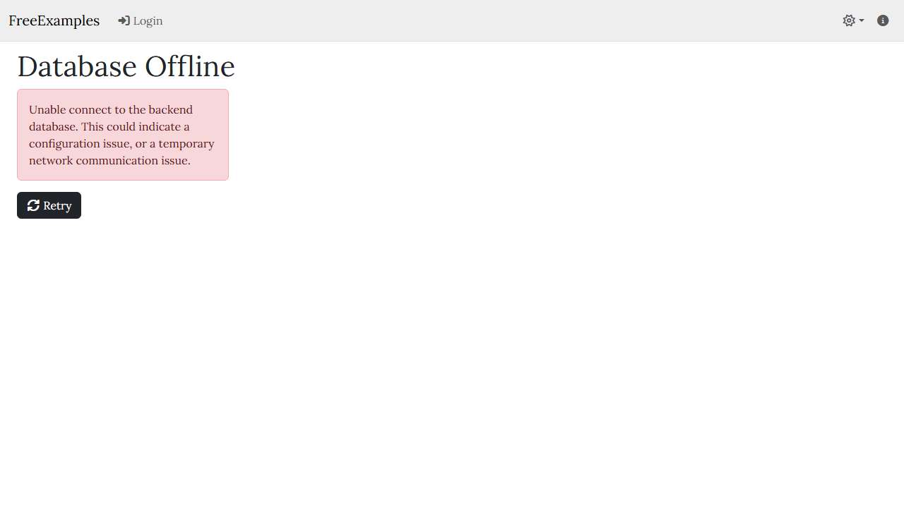
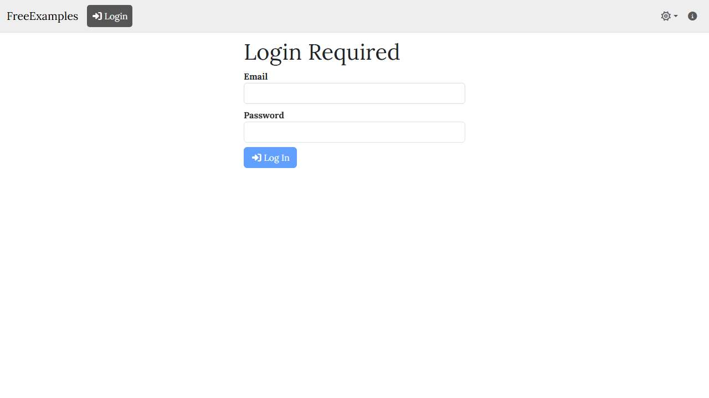
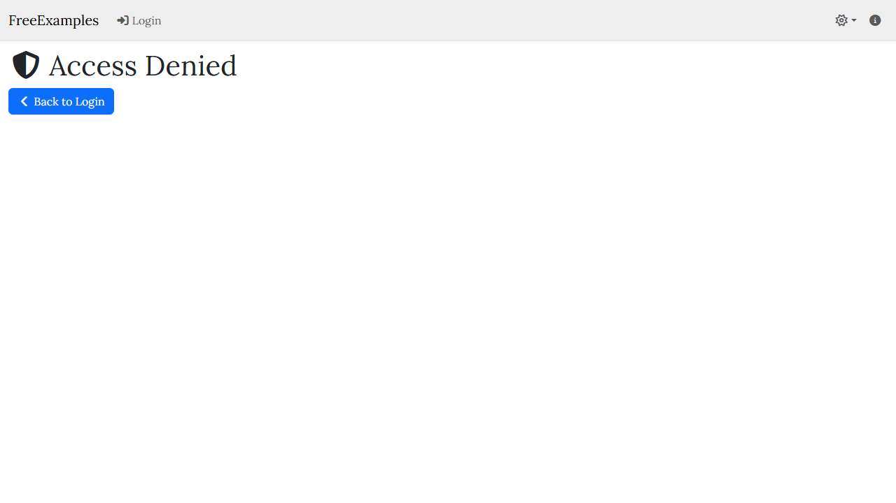
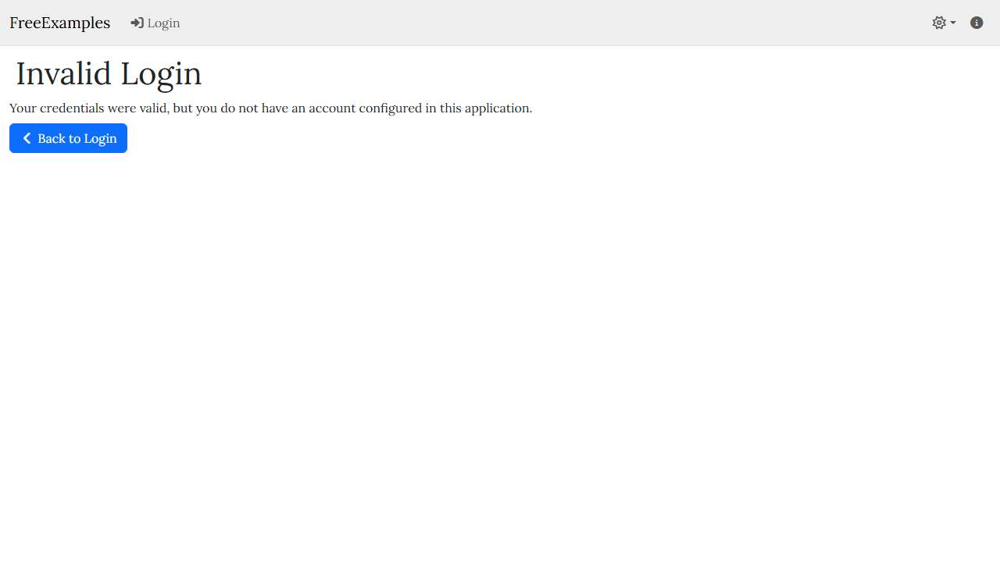
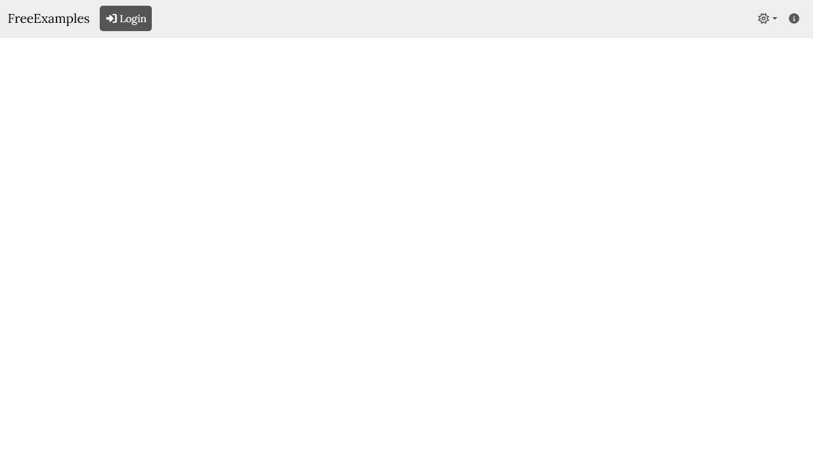
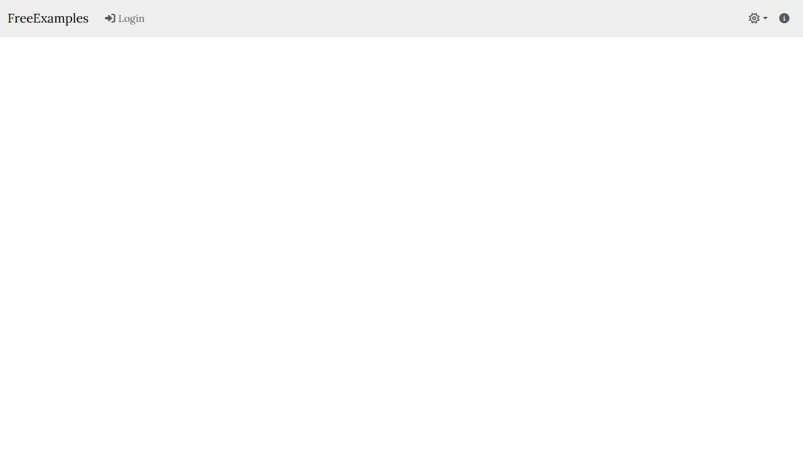

# 📊 Accessibility Scanner — Run Report

> **Generated:** 2026-03-04 18:39:40 UTC  
> **Status:** ✅ All pages passed  
> **Sites:** 1 | **Pages:** 120  

---

## 📑 Contents

- [Dashboard](#-dashboard)
- [Sites](#-sites)
- [Screenshot Gallery](#-screenshot-gallery)
- [All Pages](#-all-pages)
- [Accessibility Dashboard](#-accessibility-dashboard)
- [📖 A11y Rules Reference](a11y-rules.md)
- [SSL Certificates](#-ssl-certificates)

---

## 📋 Dashboard

```
Page Success:     [██████████████████████████████] 100%
Alt Text Cover:   [██████████████████████████████] 100%
A11y Clean Pages: [░░░░░░░░░░░░░░░░░░░░░░░░░░░░░░] 0%
```

| ✅ Passed | ❌ Failed | ⚠️ A11y Issues | 🔴 Critical | 🟠 Serious | 🟡 Moderate | 🔵 Minor |
|:---------:|:---------:|:-----------:|:----------:|:--------:|:----------:|:------:|
| 120 | 0 | 722 | 0 | 480 | 242 | 0 |

| Metric | Value |
|--------|-------|
| Sites | 1 |
| Total Pages | 120 |
| Total Images | 0 (by URL) |
| Total HTML | 8.6 MB |
| Total Screenshots | 1.9 MB |
| Total A11y Violations | ⚠️ 722 |
| JS Errors | 0 |

## 🌐 Sites

| Status | Site | Pages | 🔴 | 🟠 | 🟡 | 🔵 | A11y Total |
|:------:|------|:-----:|:--:|:--:|:--:|:--:|:---------:|
| ✅ | [https://localhost:7271/](localhost/report.md) | 120 |  | 480 | 242 |  | ⚠️ 722 |

## 📸 Screenshot Gallery

**120 pages** across **1 sites**. Click any thumbnail to view the full page report.

<details>
<summary><strong>✅ localhost</strong> — 120 page(s)</summary>

<table>
<tr>
<td align="center" width="33%">
<a href="localhost/_root/report.md">

</a>
<br />✅ <code>/</code>
</td>
<td align="center" width="33%">
<a href="localhost/_root/report.md">

</a>
<br />✅ <code>/</code>
</td>
<td align="center" width="33%">
<a href="localhost/Authorization_NoLocalAccount/report.md">

</a>
<br />✅ <code>/Authorization/NoLocalAccount</code>
</td>
</tr>
<tr>
<td align="center" width="33%">
<a href="localhost/DatabaseOffline/report.md">

</a>
<br />✅ <code>/DatabaseOffline</code>
</td>
<td align="center" width="33%">
<a href="localhost/Error/report.md">

</a>
<br />✅ <code>/Error</code>
</td>
<td align="center" width="33%">
<a href="localhost/InvalidTenantCode/report.md">

</a>
<br />✅ <code>/InvalidTenantCode</code>
</td>
</tr>
<tr>
<td align="center" width="33%">
<a href="localhost/MissingTenantCode/report.md">

</a>
<br />✅ <code>/MissingTenantCode</code>
</td>
<td align="center" width="33%">
<a href="localhost/not-found/report.md">

</a>
<br />✅ <code>/not-found</code>
</td>
<td align="center" width="33%">
<a href="localhost/Setup/report.md">

</a>
<br />✅ <code>/Setup</code>
</td>
</tr>
<tr>
<td align="center" width="33%">
<a href="localhost/tenant1/report.md">

</a>
<br />✅ <code>/tenant1</code>
</td>
<td align="center" width="33%">
<a href="localhost/tenant1_About/report.md">

</a>
<br />✅ <code>/tenant1/About</code>
</td>
<td align="center" width="33%">
<a href="localhost/tenant1_Authorization_AccessDenied/report.md">

</a>
<br />✅ <code>/tenant1/Authorization/AccessDenied</code>
</td>
</tr>
<tr>
<td align="center" width="33%">
<a href="localhost/tenant1_Authorization_InvalidUser/report.md">

</a>
<br />✅ <code>/tenant1/Authorization/InvalidUser</code>
</td>
<td align="center" width="33%">
<a href="localhost/tenant1_Authorization_NoLocalAccout/report.md">

</a>
<br />✅ <code>/tenant1/Authorization/NoLocalAccout</code>
</td>
<td align="center" width="33%">
<a href="localhost/tenant1_ChangePassword/report.md">

</a>
<br />✅ <code>/tenant1/ChangePassword</code>
</td>
</tr>
<tr>
<td align="center" width="33%">
<a href="localhost/tenant1_DoubleClick/report.md">

</a>
<br />✅ <code>/tenant1/DoubleClick</code>
</td>
<td align="center" width="33%">
<a href="localhost/tenant1_DynamicComponent/report.md">

</a>
<br />✅ <code>/tenant1/DynamicComponent</code>
</td>
<td align="center" width="33%">
<a href="localhost/tenant1_Examples_ApiKeyDemo/report.md">

</a>
<br />✅ <code>/tenant1/Examples/ApiKeyDemo</code>
</td>
</tr>
<tr>
<td align="center" width="33%">
<a href="localhost/tenant1_Examples_BootstrapShowcase/report.md">

</a>
<br />✅ <code>/tenant1/Examples/BootstrapShowcase</code>
</td>
<td align="center" width="33%">
<a href="localhost/tenant1_Examples_BootstrapV1/report.md">

</a>
<br />✅ <code>/tenant1/Examples/BootstrapV1</code>
</td>
<td align="center" width="33%">
<a href="localhost/tenant1_Examples_BootstrapV10/report.md">

</a>
<br />✅ <code>/tenant1/Examples/BootstrapV10</code>
</td>
</tr>
<tr>
<td align="center" width="33%">
<a href="localhost/tenant1_Examples_BootstrapV11/report.md">

</a>
<br />✅ <code>/tenant1/Examples/BootstrapV11</code>
</td>
<td align="center" width="33%">
<a href="localhost/tenant1_Examples_BootstrapV12/report.md">

</a>
<br />✅ <code>/tenant1/Examples/BootstrapV12</code>
</td>
<td align="center" width="33%">
<a href="localhost/tenant1_Examples_BootstrapV2/report.md">

</a>
<br />✅ <code>/tenant1/Examples/BootstrapV2</code>
</td>
</tr>
<tr>
<td align="center" width="33%">
<a href="localhost/tenant1_Examples_BootstrapV3/report.md">

</a>
<br />✅ <code>/tenant1/Examples/BootstrapV3</code>
</td>
<td align="center" width="33%">
<a href="localhost/tenant1_Examples_BootstrapV4/report.md">

</a>
<br />✅ <code>/tenant1/Examples/BootstrapV4</code>
</td>
<td align="center" width="33%">
<a href="localhost/tenant1_Examples_BootstrapV5/report.md">

</a>
<br />✅ <code>/tenant1/Examples/BootstrapV5</code>
</td>
</tr>
<tr>
<td align="center" width="33%">
<a href="localhost/tenant1_Examples_BootstrapV6/report.md">

</a>
<br />✅ <code>/tenant1/Examples/BootstrapV6</code>
</td>
<td align="center" width="33%">
<a href="localhost/tenant1_Examples_BootstrapV7/report.md">

</a>
<br />✅ <code>/tenant1/Examples/BootstrapV7</code>
</td>
<td align="center" width="33%">
<a href="localhost/tenant1_Examples_BootstrapV8/report.md">

</a>
<br />✅ <code>/tenant1/Examples/BootstrapV8</code>
</td>
</tr>
<tr>
<td align="center" width="33%">
<a href="localhost/tenant1_Examples_BootstrapV9/report.md">

</a>
<br />✅ <code>/tenant1/Examples/BootstrapV9</code>
</td>
<td align="center" width="33%">
<a href="localhost/tenant1_Examples_Carousel/report.md">

</a>
<br />✅ <code>/tenant1/Examples/Carousel</code>
</td>
<td align="center" width="33%">
<a href="localhost/tenant1_Examples_ChartsDashboard/report.md">

</a>
<br />✅ <code>/tenant1/Examples/ChartsDashboard</code>
</td>
</tr>
<tr>
<td align="center" width="33%">
<a href="localhost/tenant1_Examples_ChartsV1/report.md">

</a>
<br />✅ <code>/tenant1/Examples/ChartsV1</code>
</td>
<td align="center" width="33%">
<a href="localhost/tenant1_Examples_ChartsV2/report.md">

</a>
<br />✅ <code>/tenant1/Examples/ChartsV2</code>
</td>
<td align="center" width="33%">
<a href="localhost/tenant1_Examples_ChartsV3/report.md">

</a>
<br />✅ <code>/tenant1/Examples/ChartsV3</code>
</td>
</tr>
<tr>
<td align="center" width="33%">
<a href="localhost/tenant1_Examples_ChartsV4/report.md">

</a>
<br />✅ <code>/tenant1/Examples/ChartsV4</code>
</td>
<td align="center" width="33%">
<a href="localhost/tenant1_Examples_ChartsV5/report.md">

</a>
<br />✅ <code>/tenant1/Examples/ChartsV5</code>
</td>
<td align="center" width="33%">
<a href="localhost/tenant1_Examples_ChatView/report.md">

</a>
<br />✅ <code>/tenant1/Examples/ChatView</code>
</td>
</tr>
<tr>
<td align="center" width="33%">
<a href="localhost/tenant1_Examples_CodeEditor/report.md">

</a>
<br />✅ <code>/tenant1/Examples/CodeEditor</code>
</td>
<td align="center" width="33%">
<a href="localhost/tenant1_Examples_CodeEditorV1/report.md">

</a>
<br />✅ <code>/tenant1/Examples/CodeEditorV1</code>
</td>
<td align="center" width="33%">
<a href="localhost/tenant1_Examples_CodeEditorV2/report.md">

</a>
<br />✅ <code>/tenant1/Examples/CodeEditorV2</code>
</td>
</tr>
<tr>
<td align="center" width="33%">
<a href="localhost/tenant1_Examples_CodeEditorV3/report.md">

</a>
<br />✅ <code>/tenant1/Examples/CodeEditorV3</code>
</td>
<td align="center" width="33%">
<a href="localhost/tenant1_Examples_CodeEditorV4/report.md">

</a>
<br />✅ <code>/tenant1/Examples/CodeEditorV4</code>
</td>
<td align="center" width="33%">
<a href="localhost/tenant1_Examples_CodeEditorV5/report.md">

</a>
<br />✅ <code>/tenant1/Examples/CodeEditorV5</code>
</td>
</tr>
<tr>
<td align="center" width="33%">
<a href="localhost/tenant1_Examples_CodePlayground/report.md">

</a>
<br />✅ <code>/tenant1/Examples/CodePlayground</code>
</td>
<td align="center" width="33%">
<a href="localhost/tenant1_Examples_CommandPalette/report.md">

</a>
<br />✅ <code>/tenant1/Examples/CommandPalette</code>
</td>
<td align="center" width="33%">
<a href="localhost/tenant1_Examples_CommentThread/report.md">

</a>
<br />✅ <code>/tenant1/Examples/CommentThread</code>
</td>
</tr>
<tr>
<td align="center" width="33%">
<a href="localhost/tenant1_Examples_ComparisonTable/report.md">

</a>
<br />✅ <code>/tenant1/Examples/ComparisonTable</code>
</td>
<td align="center" width="33%">
<a href="localhost/tenant1_Examples_Dashboard/report.md">

</a>
<br />✅ <code>/tenant1/Examples/Dashboard</code>
</td>
<td align="center" width="33%">
<a href="localhost/tenant1_Examples_EditSampleItem_New/report.md">

</a>
<br />✅ <code>/tenant1/Examples/EditSampleItem/New</code>
</td>
</tr>
<tr>
<td align="center" width="33%">
<a href="localhost/tenant1_Examples_FileDemo/report.md">

</a>
<br />✅ <code>/tenant1/Examples/FileDemo</code>
</td>
<td align="center" width="33%">
<a href="localhost/tenant1_Examples_FileDemoV1/report.md">

</a>
<br />✅ <code>/tenant1/Examples/FileDemoV1</code>
</td>
<td align="center" width="33%">
<a href="localhost/tenant1_Examples_FileDemoV2/report.md">

</a>
<br />✅ <code>/tenant1/Examples/FileDemoV2</code>
</td>
</tr>
<tr>
<td align="center" width="33%">
<a href="localhost/tenant1_Examples_FileDemoV3/report.md">

</a>
<br />✅ <code>/tenant1/Examples/FileDemoV3</code>
</td>
<td align="center" width="33%">
<a href="localhost/tenant1_Examples_FileDemoV4/report.md">

</a>
<br />✅ <code>/tenant1/Examples/FileDemoV4</code>
</td>
<td align="center" width="33%">
<a href="localhost/tenant1_Examples_FileDemoV5/report.md">

</a>
<br />✅ <code>/tenant1/Examples/FileDemoV5</code>
</td>
</tr>
<tr>
<td align="center" width="33%">
<a href="localhost/tenant1_Examples_GitBrowser/report.md">

</a>
<br />✅ <code>/tenant1/Examples/GitBrowser</code>
</td>
<td align="center" width="33%">
<a href="localhost/tenant1_Examples_ImageGallery/report.md">

</a>
<br />✅ <code>/tenant1/Examples/ImageGallery</code>
</td>
<td align="center" width="33%">
<a href="localhost/tenant1_Examples_ItemCards/report.md">

</a>
<br />✅ <code>/tenant1/Examples/ItemCards</code>
</td>
</tr>
<tr>
<td align="center" width="33%">
<a href="localhost/tenant1_Examples_KanbanBoard/report.md">

</a>
<br />✅ <code>/tenant1/Examples/KanbanBoard</code>
</td>
<td align="center" width="33%">
<a href="localhost/tenant1_Examples_NetworkGraph/report.md">

</a>
<br />✅ <code>/tenant1/Examples/NetworkGraph</code>
</td>
<td align="center" width="33%">
<a href="localhost/tenant1_Examples_NetworkGraphV1/report.md">

</a>
<br />✅ <code>/tenant1/Examples/NetworkGraphV1</code>
</td>
</tr>
<tr>
<td align="center" width="33%">
<a href="localhost/tenant1_Examples_NetworkGraphV2/report.md">

</a>
<br />✅ <code>/tenant1/Examples/NetworkGraphV2</code>
</td>
<td align="center" width="33%">
<a href="localhost/tenant1_Examples_PipelineTracker/report.md">

</a>
<br />✅ <code>/tenant1/Examples/PipelineTracker</code>
</td>
<td align="center" width="33%">
<a href="localhost/tenant1_Examples_SampleItems/report.md">

</a>
<br />✅ <code>/tenant1/Examples/SampleItems</code>
</td>
</tr>
<tr>
<td align="center" width="33%">
<a href="localhost/tenant1_Examples_SampleItemsV1/report.md">

</a>
<br />✅ <code>/tenant1/Examples/SampleItemsV1</code>
</td>
<td align="center" width="33%">
<a href="localhost/tenant1_Examples_SampleItemsV2/report.md">

</a>
<br />✅ <code>/tenant1/Examples/SampleItemsV2</code>
</td>
<td align="center" width="33%">
<a href="localhost/tenant1_Examples_SampleItemsV3/report.md">

</a>
<br />✅ <code>/tenant1/Examples/SampleItemsV3</code>
</td>
</tr>
<tr>
<td align="center" width="33%">
<a href="localhost/tenant1_Examples_SampleItemsV4/report.md">

</a>
<br />✅ <code>/tenant1/Examples/SampleItemsV4</code>
</td>
<td align="center" width="33%">
<a href="localhost/tenant1_Examples_SampleItemsV5/report.md">

</a>
<br />✅ <code>/tenant1/Examples/SampleItemsV5</code>
</td>
<td align="center" width="33%">
<a href="localhost/tenant1_Examples_SearchAutocomplete/report.md">

</a>
<br />✅ <code>/tenant1/Examples/SearchAutocomplete</code>
</td>
</tr>
<tr>
<td align="center" width="33%">
<a href="localhost/tenant1_Examples_SignalRDemo/report.md">

</a>
<br />✅ <code>/tenant1/Examples/SignalRDemo</code>
</td>
<td align="center" width="33%">
<a href="localhost/tenant1_Examples_SignalRV1/report.md">

</a>
<br />✅ <code>/tenant1/Examples/SignalRV1</code>
</td>
<td align="center" width="33%">
<a href="localhost/tenant1_Examples_SignalRV2/report.md">

</a>
<br />✅ <code>/tenant1/Examples/SignalRV2</code>
</td>
</tr>
<tr>
<td align="center" width="33%">
<a href="localhost/tenant1_Examples_SignalRV3/report.md">

</a>
<br />✅ <code>/tenant1/Examples/SignalRV3</code>
</td>
<td align="center" width="33%">
<a href="localhost/tenant1_Examples_SignalRV4/report.md">

</a>
<br />✅ <code>/tenant1/Examples/SignalRV4</code>
</td>
<td align="center" width="33%">
<a href="localhost/tenant1_Examples_SignalRV5/report.md">

</a>
<br />✅ <code>/tenant1/Examples/SignalRV5</code>
</td>
</tr>
<tr>
<td align="center" width="33%">
<a href="localhost/tenant1_Examples_SignatureDemo/report.md">

</a>
<br />✅ <code>/tenant1/Examples/SignatureDemo</code>
</td>
<td align="center" width="33%">
<a href="localhost/tenant1_Examples_SignatureV1/report.md">

</a>
<br />✅ <code>/tenant1/Examples/SignatureV1</code>
</td>
<td align="center" width="33%">
<a href="localhost/tenant1_Examples_SignatureV2/report.md">

</a>
<br />✅ <code>/tenant1/Examples/SignatureV2</code>
</td>
</tr>
<tr>
<td align="center" width="33%">
<a href="localhost/tenant1_Examples_SignatureV3/report.md">

</a>
<br />✅ <code>/tenant1/Examples/SignatureV3</code>
</td>
<td align="center" width="33%">
<a href="localhost/tenant1_Examples_SignatureV4/report.md">

</a>
<br />✅ <code>/tenant1/Examples/SignatureV4</code>
</td>
<td align="center" width="33%">
<a href="localhost/tenant1_Examples_SignatureV5/report.md">

</a>
<br />✅ <code>/tenant1/Examples/SignatureV5</code>
</td>
</tr>
<tr>
<td align="center" width="33%">
<a href="localhost/tenant1_Examples_StatusBoard/report.md">

</a>
<br />✅ <code>/tenant1/Examples/StatusBoard</code>
</td>
<td align="center" width="33%">
<a href="localhost/tenant1_Examples_TimerDemo/report.md">

</a>
<br />✅ <code>/tenant1/Examples/TimerDemo</code>
</td>
<td align="center" width="33%">
<a href="localhost/tenant1_Examples_TimerV1/report.md">

</a>
<br />✅ <code>/tenant1/Examples/TimerV1</code>
</td>
</tr>
<tr>
<td align="center" width="33%">
<a href="localhost/tenant1_Examples_TimerV2/report.md">

</a>
<br />✅ <code>/tenant1/Examples/TimerV2</code>
</td>
<td align="center" width="33%">
<a href="localhost/tenant1_Examples_TimerV3/report.md">

</a>
<br />✅ <code>/tenant1/Examples/TimerV3</code>
</td>
<td align="center" width="33%">
<a href="localhost/tenant1_Examples_TimerV4/report.md">

</a>
<br />✅ <code>/tenant1/Examples/TimerV4</code>
</td>
</tr>
<tr>
<td align="center" width="33%">
<a href="localhost/tenant1_Examples_TimerV5/report.md">

</a>
<br />✅ <code>/tenant1/Examples/TimerV5</code>
</td>
<td align="center" width="33%">
<a href="localhost/tenant1_Examples_WizardDemo/report.md">

</a>
<br />✅ <code>/tenant1/Examples/WizardDemo</code>
</td>
<td align="center" width="33%">
<a href="localhost/tenant1_Login/report.md">

</a>
<br />✅ <code>/tenant1/Login</code>
</td>
</tr>
<tr>
<td align="center" width="33%">
<a href="localhost/tenant1_Logout/report.md">

</a>
<br />✅ <code>/tenant1/Logout</code>
</td>
<td align="center" width="33%">
<a href="localhost/tenant1_Monaco/report.md">

</a>
<br />✅ <code>/tenant1/Monaco</code>
</td>
<td align="center" width="33%">
<a href="localhost/tenant1_PasswordChanged/report.md">

</a>
<br />✅ <code>/tenant1/PasswordChanged</code>
</td>
</tr>
<tr>
<td align="center" width="33%">
<a href="localhost/tenant1_Plugins/report.md">

</a>
<br />✅ <code>/tenant1/Plugins</code>
</td>
<td align="center" width="33%">
<a href="localhost/tenant1_ProcessLogin/report.md">

</a>
<br />✅ <code>/tenant1/ProcessLogin</code>
</td>
<td align="center" width="33%">
<a href="localhost/tenant1_Profile/report.md">

</a>
<br />✅ <code>/tenant1/Profile</code>
</td>
</tr>
<tr>
<td align="center" width="33%">
<a href="localhost/tenant1_ServerUpdated/report.md">

</a>
<br />✅ <code>/tenant1/ServerUpdated</code>
</td>
<td align="center" width="33%">
<a href="localhost/tenant1_Settings/report.md">

</a>
<br />✅ <code>/tenant1/Settings</code>
</td>
<td align="center" width="33%">
<a href="localhost/tenant1_Settings_AddDepartment/report.md">

</a>
<br />✅ <code>/tenant1/Settings/AddDepartment</code>
</td>
</tr>
<tr>
<td align="center" width="33%">
<a href="localhost/tenant1_Settings_AddDepartmentGroup/report.md">

</a>
<br />✅ <code>/tenant1/Settings/AddDepartmentGroup</code>
</td>
<td align="center" width="33%">
<a href="localhost/tenant1_Settings_AddTag/report.md">

</a>
<br />✅ <code>/tenant1/Settings/AddTag</code>
</td>
<td align="center" width="33%">
<a href="localhost/tenant1_Settings_AddTenant/report.md">

</a>
<br />✅ <code>/tenant1/Settings/AddTenant</code>
</td>
</tr>
<tr>
<td align="center" width="33%">
<a href="localhost/tenant1_Settings_AddUser/report.md">

</a>
<br />✅ <code>/tenant1/Settings/AddUser</code>
</td>
<td align="center" width="33%">
<a href="localhost/tenant1_Settings_AddUserGroup/report.md">

</a>
<br />✅ <code>/tenant1/Settings/AddUserGroup</code>
</td>
<td align="center" width="33%">
<a href="localhost/tenant1_Settings_AppSettings/report.md">

</a>
<br />✅ <code>/tenant1/Settings/AppSettings</code>
</td>
</tr>
<tr>
<td align="center" width="33%">
<a href="localhost/tenant1_Settings_DeletedRecords/report.md">

</a>
<br />✅ <code>/tenant1/Settings/DeletedRecords</code>
</td>
<td align="center" width="33%">
<a href="localhost/tenant1_Settings_DepartmentGroups/report.md">

</a>
<br />✅ <code>/tenant1/Settings/DepartmentGroups</code>
</td>
<td align="center" width="33%">
<a href="localhost/tenant1_Settings_Departments/report.md">

</a>
<br />✅ <code>/tenant1/Settings/Departments</code>
</td>
</tr>
<tr>
<td align="center" width="33%">
<a href="localhost/tenant1_Settings_Files/report.md">

</a>
<br />✅ <code>/tenant1/Settings/Files</code>
</td>
<td align="center" width="33%">
<a href="localhost/tenant1_Settings_Language/report.md">

</a>
<br />✅ <code>/tenant1/Settings/Language</code>
</td>
<td align="center" width="33%">
<a href="localhost/tenant1_Settings_Tags/report.md">

</a>
<br />✅ <code>/tenant1/Settings/Tags</code>
</td>
</tr>
<tr>
<td align="center" width="33%">
<a href="localhost/tenant1_Settings_Tenants/report.md">

</a>
<br />✅ <code>/tenant1/Settings/Tenants</code>
</td>
<td align="center" width="33%">
<a href="localhost/tenant1_Settings_UDF/report.md">

</a>
<br />✅ <code>/tenant1/Settings/UDF</code>
</td>
<td align="center" width="33%">
<a href="localhost/tenant1_Settings_UserGroups/report.md">

</a>
<br />✅ <code>/tenant1/Settings/UserGroups</code>
</td>
</tr>
<tr>
<td align="center" width="33%">
<a href="localhost/tenant1_Settings_Users/report.md">

</a>
<br />✅ <code>/tenant1/Settings/Users</code>
</td>
<td align="center" width="33%">
<a href="localhost/tenant1_SortTest/report.md">

</a>
<br />✅ <code>/tenant1/SortTest</code>
</td>
<td align="center" width="33%">
<a href="localhost/tenant1_TimerTest/report.md">

</a>
<br />✅ <code>/tenant1/TimerTest</code>
</td>
</tr>
</table>

</details>

## 📑 All Pages

<details>
<summary><strong>120 pages scanned</strong></summary>

| Status | Site | Page | HTTP | 🔴 | 🟠 | 🟡 | 🔵 | A11y |
|:------:|------|------|:----:|:--:|:--:|:--:|:--:|:----:|
| ✅ | localhost | [/](localhost/_root/report.md) | 200 |  | 4 | 2 |  | ⚠️ 6 |
| ✅ | localhost | [/](localhost/_root/report.md) | 200 |  | 4 | 2 |  | ⚠️ 6 |
| ✅ | localhost | [/Authorization/NoLocalAccount](localhost/Authorization_NoLocalAccount/report.md) | 200 |  | 4 | 2 |  | ⚠️ 6 |
| ✅ | localhost | [/DatabaseOffline](localhost/DatabaseOffline/report.md) | 200 |  | 4 | 2 |  | ⚠️ 6 |
| ✅ | localhost | [/Error](localhost/Error/report.md) | 200 |  | 4 | 2 |  | ⚠️ 6 |
| ✅ | localhost | [/InvalidTenantCode](localhost/InvalidTenantCode/report.md) | 200 |  | 4 | 2 |  | ⚠️ 6 |
| ✅ | localhost | [/MissingTenantCode](localhost/MissingTenantCode/report.md) | 200 |  | 4 | 2 |  | ⚠️ 6 |
| ✅ | localhost | [/not-found](localhost/not-found/report.md) | 200 |  | 4 | 2 |  | ⚠️ 6 |
| ✅ | localhost | [/Setup](localhost/Setup/report.md) | 200 |  | 4 | 2 |  | ⚠️ 6 |
| ✅ | localhost | [/tenant1](localhost/tenant1/report.md) | 200 |  | 4 | 2 |  | ⚠️ 6 |
| ✅ | localhost | [/tenant1/About](localhost/tenant1_About/report.md) | 200 |  | 4 | 2 |  | ⚠️ 6 |
| ✅ | localhost | [/tenant1/Authorization/AccessDenied](localhost/tenant1_Authorization_AccessDenied/report.md) | 200 |  | 4 | 2 |  | ⚠️ 6 |
| ✅ | localhost | [/tenant1/Authorization/InvalidUser](localhost/tenant1_Authorization_InvalidUser/report.md) | 200 |  | 4 | 2 |  | ⚠️ 6 |
| ✅ | localhost | [/tenant1/Authorization/NoLocalAccout](localhost/tenant1_Authorization_NoLocalAccout/report.md) | 200 |  | 4 | 2 |  | ⚠️ 6 |
| ✅ | localhost | [/tenant1/ChangePassword](localhost/tenant1_ChangePassword/report.md) | 200 |  | 4 | 2 |  | ⚠️ 6 |
| ✅ | localhost | [/tenant1/DoubleClick](localhost/tenant1_DoubleClick/report.md) | 200 |  | 4 | 2 |  | ⚠️ 6 |
| ✅ | localhost | [/tenant1/DynamicComponent](localhost/tenant1_DynamicComponent/report.md) | 200 |  | 4 | 2 |  | ⚠️ 6 |
| ✅ | localhost | [/tenant1/Examples/ApiKeyDemo](localhost/tenant1_Examples_ApiKeyDemo/report.md) | 200 |  | 4 | 2 |  | ⚠️ 6 |
| ✅ | localhost | [/tenant1/Examples/BootstrapShowcase](localhost/tenant1_Examples_BootstrapShowcase/report.md) | 200 |  | 4 | 2 |  | ⚠️ 6 |
| ✅ | localhost | [/tenant1/Examples/BootstrapV1](localhost/tenant1_Examples_BootstrapV1/report.md) | 200 |  | 4 | 2 |  | ⚠️ 6 |
| ✅ | localhost | [/tenant1/Examples/BootstrapV10](localhost/tenant1_Examples_BootstrapV10/report.md) | 200 |  | 4 | 2 |  | ⚠️ 6 |
| ✅ | localhost | [/tenant1/Examples/BootstrapV11](localhost/tenant1_Examples_BootstrapV11/report.md) | 200 |  | 4 | 2 |  | ⚠️ 6 |
| ✅ | localhost | [/tenant1/Examples/BootstrapV12](localhost/tenant1_Examples_BootstrapV12/report.md) | 200 |  | 4 | 2 |  | ⚠️ 6 |
| ✅ | localhost | [/tenant1/Examples/BootstrapV2](localhost/tenant1_Examples_BootstrapV2/report.md) | 200 |  | 4 | 2 |  | ⚠️ 6 |
| ✅ | localhost | [/tenant1/Examples/BootstrapV3](localhost/tenant1_Examples_BootstrapV3/report.md) | 200 |  | 4 | 2 |  | ⚠️ 6 |
| ✅ | localhost | [/tenant1/Examples/BootstrapV4](localhost/tenant1_Examples_BootstrapV4/report.md) | 200 |  | 4 | 2 |  | ⚠️ 6 |
| ✅ | localhost | [/tenant1/Examples/BootstrapV5](localhost/tenant1_Examples_BootstrapV5/report.md) | 200 |  | 4 | 2 |  | ⚠️ 6 |
| ✅ | localhost | [/tenant1/Examples/BootstrapV6](localhost/tenant1_Examples_BootstrapV6/report.md) | 200 |  | 4 | 2 |  | ⚠️ 6 |
| ✅ | localhost | [/tenant1/Examples/BootstrapV7](localhost/tenant1_Examples_BootstrapV7/report.md) | 200 |  | 4 | 2 |  | ⚠️ 6 |
| ✅ | localhost | [/tenant1/Examples/BootstrapV8](localhost/tenant1_Examples_BootstrapV8/report.md) | 200 |  | 4 | 2 |  | ⚠️ 6 |
| ✅ | localhost | [/tenant1/Examples/BootstrapV9](localhost/tenant1_Examples_BootstrapV9/report.md) | 200 |  | 4 | 2 |  | ⚠️ 6 |
| ✅ | localhost | [/tenant1/Examples/Carousel](localhost/tenant1_Examples_Carousel/report.md) | 200 |  | 4 | 2 |  | ⚠️ 6 |
| ✅ | localhost | [/tenant1/Examples/ChartsDashboard](localhost/tenant1_Examples_ChartsDashboard/report.md) | 200 |  | 4 | 2 |  | ⚠️ 6 |
| ✅ | localhost | [/tenant1/Examples/ChartsV1](localhost/tenant1_Examples_ChartsV1/report.md) | 200 |  | 4 | 2 |  | ⚠️ 6 |
| ✅ | localhost | [/tenant1/Examples/ChartsV2](localhost/tenant1_Examples_ChartsV2/report.md) | 200 |  | 4 | 2 |  | ⚠️ 6 |
| ✅ | localhost | [/tenant1/Examples/ChartsV3](localhost/tenant1_Examples_ChartsV3/report.md) | 200 |  | 4 | 2 |  | ⚠️ 6 |
| ✅ | localhost | [/tenant1/Examples/ChartsV4](localhost/tenant1_Examples_ChartsV4/report.md) | 200 |  | 4 | 2 |  | ⚠️ 6 |
| ✅ | localhost | [/tenant1/Examples/ChartsV5](localhost/tenant1_Examples_ChartsV5/report.md) | 200 |  | 4 | 2 |  | ⚠️ 6 |
| ✅ | localhost | [/tenant1/Examples/ChatView](localhost/tenant1_Examples_ChatView/report.md) | 200 |  | 4 | 2 |  | ⚠️ 6 |
| ✅ | localhost | [/tenant1/Examples/CodeEditor](localhost/tenant1_Examples_CodeEditor/report.md) | 200 |  | 4 | 2 |  | ⚠️ 6 |
| ✅ | localhost | [/tenant1/Examples/CodeEditorV1](localhost/tenant1_Examples_CodeEditorV1/report.md) | 200 |  | 4 | 2 |  | ⚠️ 6 |
| ✅ | localhost | [/tenant1/Examples/CodeEditorV2](localhost/tenant1_Examples_CodeEditorV2/report.md) | 200 |  | 4 | 2 |  | ⚠️ 6 |
| ✅ | localhost | [/tenant1/Examples/CodeEditorV3](localhost/tenant1_Examples_CodeEditorV3/report.md) | 200 |  | 4 | 2 |  | ⚠️ 6 |
| ✅ | localhost | [/tenant1/Examples/CodeEditorV4](localhost/tenant1_Examples_CodeEditorV4/report.md) | 200 |  | 4 | 2 |  | ⚠️ 6 |
| ✅ | localhost | [/tenant1/Examples/CodeEditorV5](localhost/tenant1_Examples_CodeEditorV5/report.md) | 200 |  | 4 | 2 |  | ⚠️ 6 |
| ✅ | localhost | [/tenant1/Examples/CodePlayground](localhost/tenant1_Examples_CodePlayground/report.md) | 200 |  | 4 | 2 |  | ⚠️ 6 |
| ✅ | localhost | [/tenant1/Examples/CommandPalette](localhost/tenant1_Examples_CommandPalette/report.md) | 200 |  | 4 | 2 |  | ⚠️ 6 |
| ✅ | localhost | [/tenant1/Examples/CommentThread](localhost/tenant1_Examples_CommentThread/report.md) | 200 |  | 4 | 2 |  | ⚠️ 6 |
| ✅ | localhost | [/tenant1/Examples/ComparisonTable](localhost/tenant1_Examples_ComparisonTable/report.md) | 200 |  | 4 | 2 |  | ⚠️ 6 |
| ✅ | localhost | [/tenant1/Examples/Dashboard](localhost/tenant1_Examples_Dashboard/report.md) | 200 |  | 4 | 2 |  | ⚠️ 6 |
| ✅ | localhost | [/tenant1/Examples/EditSampleItem/New](localhost/tenant1_Examples_EditSampleItem_New/report.md) | 200 |  | 4 | 2 |  | ⚠️ 6 |
| ✅ | localhost | [/tenant1/Examples/FileDemo](localhost/tenant1_Examples_FileDemo/report.md) | 200 |  | 4 | 2 |  | ⚠️ 6 |
| ✅ | localhost | [/tenant1/Examples/FileDemoV1](localhost/tenant1_Examples_FileDemoV1/report.md) | 200 |  | 4 | 2 |  | ⚠️ 6 |
| ✅ | localhost | [/tenant1/Examples/FileDemoV2](localhost/tenant1_Examples_FileDemoV2/report.md) | 200 |  | 4 | 2 |  | ⚠️ 6 |
| ✅ | localhost | [/tenant1/Examples/FileDemoV3](localhost/tenant1_Examples_FileDemoV3/report.md) | 200 |  | 4 | 2 |  | ⚠️ 6 |
| ✅ | localhost | [/tenant1/Examples/FileDemoV4](localhost/tenant1_Examples_FileDemoV4/report.md) | 200 |  | 4 | 2 |  | ⚠️ 6 |
| ✅ | localhost | [/tenant1/Examples/FileDemoV5](localhost/tenant1_Examples_FileDemoV5/report.md) | 200 |  | 4 | 2 |  | ⚠️ 6 |
| ✅ | localhost | [/tenant1/Examples/GitBrowser](localhost/tenant1_Examples_GitBrowser/report.md) | 200 |  | 4 | 2 |  | ⚠️ 6 |
| ✅ | localhost | [/tenant1/Examples/ImageGallery](localhost/tenant1_Examples_ImageGallery/report.md) | 200 |  | 4 | 2 |  | ⚠️ 6 |
| ✅ | localhost | [/tenant1/Examples/ItemCards](localhost/tenant1_Examples_ItemCards/report.md) | 200 |  | 4 | 2 |  | ⚠️ 6 |
| ✅ | localhost | [/tenant1/Examples/KanbanBoard](localhost/tenant1_Examples_KanbanBoard/report.md) | 200 |  | 4 | 2 |  | ⚠️ 6 |
| ✅ | localhost | [/tenant1/Examples/NetworkGraph](localhost/tenant1_Examples_NetworkGraph/report.md) | 200 |  | 4 | 2 |  | ⚠️ 6 |
| ✅ | localhost | [/tenant1/Examples/NetworkGraphV1](localhost/tenant1_Examples_NetworkGraphV1/report.md) | 200 |  | 4 | 2 |  | ⚠️ 6 |
| ✅ | localhost | [/tenant1/Examples/NetworkGraphV2](localhost/tenant1_Examples_NetworkGraphV2/report.md) | 200 |  | 4 | 2 |  | ⚠️ 6 |
| ✅ | localhost | [/tenant1/Examples/PipelineTracker](localhost/tenant1_Examples_PipelineTracker/report.md) | 200 |  | 4 | 2 |  | ⚠️ 6 |
| ✅ | localhost | [/tenant1/Examples/SampleItems](localhost/tenant1_Examples_SampleItems/report.md) | 200 |  | 4 | 2 |  | ⚠️ 6 |
| ✅ | localhost | [/tenant1/Examples/SampleItemsV1](localhost/tenant1_Examples_SampleItemsV1/report.md) | 200 |  | 4 | 2 |  | ⚠️ 6 |
| ✅ | localhost | [/tenant1/Examples/SampleItemsV2](localhost/tenant1_Examples_SampleItemsV2/report.md) | 200 |  | 4 | 2 |  | ⚠️ 6 |
| ✅ | localhost | [/tenant1/Examples/SampleItemsV3](localhost/tenant1_Examples_SampleItemsV3/report.md) | 200 |  | 4 | 2 |  | ⚠️ 6 |
| ✅ | localhost | [/tenant1/Examples/SampleItemsV4](localhost/tenant1_Examples_SampleItemsV4/report.md) | 200 |  | 4 | 2 |  | ⚠️ 6 |
| ✅ | localhost | [/tenant1/Examples/SampleItemsV5](localhost/tenant1_Examples_SampleItemsV5/report.md) | 200 |  | 4 | 2 |  | ⚠️ 6 |
| ✅ | localhost | [/tenant1/Examples/SearchAutocomplete](localhost/tenant1_Examples_SearchAutocomplete/report.md) | 200 |  | 4 | 2 |  | ⚠️ 6 |
| ✅ | localhost | [/tenant1/Examples/SignalRDemo](localhost/tenant1_Examples_SignalRDemo/report.md) | 200 |  | 4 | 2 |  | ⚠️ 6 |
| ✅ | localhost | [/tenant1/Examples/SignalRV1](localhost/tenant1_Examples_SignalRV1/report.md) | 200 |  | 4 | 2 |  | ⚠️ 6 |
| ✅ | localhost | [/tenant1/Examples/SignalRV2](localhost/tenant1_Examples_SignalRV2/report.md) | 200 |  | 4 | 2 |  | ⚠️ 6 |
| ✅ | localhost | [/tenant1/Examples/SignalRV3](localhost/tenant1_Examples_SignalRV3/report.md) | 200 |  | 4 | 2 |  | ⚠️ 6 |
| ✅ | localhost | [/tenant1/Examples/SignalRV4](localhost/tenant1_Examples_SignalRV4/report.md) | 200 |  | 4 | 2 |  | ⚠️ 6 |
| ✅ | localhost | [/tenant1/Examples/SignalRV5](localhost/tenant1_Examples_SignalRV5/report.md) | 200 |  | 4 | 2 |  | ⚠️ 6 |
| ✅ | localhost | [/tenant1/Examples/SignatureDemo](localhost/tenant1_Examples_SignatureDemo/report.md) | 200 |  | 4 | 2 |  | ⚠️ 6 |
| ✅ | localhost | [/tenant1/Examples/SignatureV1](localhost/tenant1_Examples_SignatureV1/report.md) | 200 |  | 4 | 2 |  | ⚠️ 6 |
| ✅ | localhost | [/tenant1/Examples/SignatureV2](localhost/tenant1_Examples_SignatureV2/report.md) | 200 |  | 4 | 2 |  | ⚠️ 6 |
| ✅ | localhost | [/tenant1/Examples/SignatureV3](localhost/tenant1_Examples_SignatureV3/report.md) | 200 |  | 4 | 2 |  | ⚠️ 6 |
| ✅ | localhost | [/tenant1/Examples/SignatureV4](localhost/tenant1_Examples_SignatureV4/report.md) | 200 |  | 4 | 2 |  | ⚠️ 6 |
| ✅ | localhost | [/tenant1/Examples/SignatureV5](localhost/tenant1_Examples_SignatureV5/report.md) | 200 |  | 4 | 2 |  | ⚠️ 6 |
| ✅ | localhost | [/tenant1/Examples/StatusBoard](localhost/tenant1_Examples_StatusBoard/report.md) | 200 |  | 4 | 2 |  | ⚠️ 6 |
| ✅ | localhost | [/tenant1/Examples/TimerDemo](localhost/tenant1_Examples_TimerDemo/report.md) | 200 |  | 4 | 2 |  | ⚠️ 6 |
| ✅ | localhost | [/tenant1/Examples/TimerV1](localhost/tenant1_Examples_TimerV1/report.md) | 200 |  | 4 | 2 |  | ⚠️ 6 |
| ✅ | localhost | [/tenant1/Examples/TimerV2](localhost/tenant1_Examples_TimerV2/report.md) | 200 |  | 4 | 2 |  | ⚠️ 6 |
| ✅ | localhost | [/tenant1/Examples/TimerV3](localhost/tenant1_Examples_TimerV3/report.md) | 200 |  | 4 | 2 |  | ⚠️ 6 |
| ✅ | localhost | [/tenant1/Examples/TimerV4](localhost/tenant1_Examples_TimerV4/report.md) | 200 |  | 4 | 2 |  | ⚠️ 6 |
| ✅ | localhost | [/tenant1/Examples/TimerV5](localhost/tenant1_Examples_TimerV5/report.md) | 200 |  | 4 | 2 |  | ⚠️ 6 |
| ✅ | localhost | [/tenant1/Examples/WizardDemo](localhost/tenant1_Examples_WizardDemo/report.md) | 200 |  | 4 | 2 |  | ⚠️ 6 |
| ✅ | localhost | [/tenant1/Login](localhost/tenant1_Login/report.md) | 200 |  | 4 | 2 |  | ⚠️ 6 |
| ✅ | localhost | [/tenant1/Logout](localhost/tenant1_Logout/report.md) | 200 |  | 4 | 3 |  | ⚠️ 7 |
| ✅ | localhost | [/tenant1/Monaco](localhost/tenant1_Monaco/report.md) | 200 |  | 4 | 2 |  | ⚠️ 6 |
| ✅ | localhost | [/tenant1/PasswordChanged](localhost/tenant1_PasswordChanged/report.md) | 200 |  | 4 | 2 |  | ⚠️ 6 |
| ✅ | localhost | [/tenant1/Plugins](localhost/tenant1_Plugins/report.md) | 200 |  | 4 | 2 |  | ⚠️ 6 |
| ✅ | localhost | [/tenant1/ProcessLogin](localhost/tenant1_ProcessLogin/report.md) | 200 |  | 4 | 3 |  | ⚠️ 7 |
| ✅ | localhost | [/tenant1/Profile](localhost/tenant1_Profile/report.md) | 200 |  | 4 | 2 |  | ⚠️ 6 |
| ✅ | localhost | [/tenant1/ServerUpdated](localhost/tenant1_ServerUpdated/report.md) | 200 |  | 4 | 2 |  | ⚠️ 6 |
| ✅ | localhost | [/tenant1/Settings](localhost/tenant1_Settings/report.md) | 200 |  | 4 | 2 |  | ⚠️ 6 |
| ✅ | localhost | [/tenant1/Settings/AddDepartment](localhost/tenant1_Settings_AddDepartment/report.md) | 200 |  | 4 | 2 |  | ⚠️ 6 |
| ✅ | localhost | [/tenant1/Settings/AddDepartmentGroup](localhost/tenant1_Settings_AddDepartmentGroup/report.md) | 200 |  | 4 | 2 |  | ⚠️ 6 |
| ✅ | localhost | [/tenant1/Settings/AddTag](localhost/tenant1_Settings_AddTag/report.md) | 200 |  | 4 | 2 |  | ⚠️ 6 |
| ✅ | localhost | [/tenant1/Settings/AddTenant](localhost/tenant1_Settings_AddTenant/report.md) | 200 |  | 4 | 2 |  | ⚠️ 6 |
| ✅ | localhost | [/tenant1/Settings/AddUser](localhost/tenant1_Settings_AddUser/report.md) | 200 |  | 4 | 2 |  | ⚠️ 6 |
| ✅ | localhost | [/tenant1/Settings/AddUserGroup](localhost/tenant1_Settings_AddUserGroup/report.md) | 200 |  | 4 | 2 |  | ⚠️ 6 |
| ✅ | localhost | [/tenant1/Settings/AppSettings](localhost/tenant1_Settings_AppSettings/report.md) | 200 |  | 4 | 2 |  | ⚠️ 6 |
| ✅ | localhost | [/tenant1/Settings/DeletedRecords](localhost/tenant1_Settings_DeletedRecords/report.md) | 200 |  | 4 | 2 |  | ⚠️ 6 |
| ✅ | localhost | [/tenant1/Settings/DepartmentGroups](localhost/tenant1_Settings_DepartmentGroups/report.md) | 200 |  | 4 | 2 |  | ⚠️ 6 |
| ✅ | localhost | [/tenant1/Settings/Departments](localhost/tenant1_Settings_Departments/report.md) | 200 |  | 4 | 2 |  | ⚠️ 6 |
| ✅ | localhost | [/tenant1/Settings/Files](localhost/tenant1_Settings_Files/report.md) | 200 |  | 4 | 2 |  | ⚠️ 6 |
| ✅ | localhost | [/tenant1/Settings/Language](localhost/tenant1_Settings_Language/report.md) | 200 |  | 4 | 2 |  | ⚠️ 6 |
| ✅ | localhost | [/tenant1/Settings/Tags](localhost/tenant1_Settings_Tags/report.md) | 200 |  | 4 | 2 |  | ⚠️ 6 |
| ✅ | localhost | [/tenant1/Settings/Tenants](localhost/tenant1_Settings_Tenants/report.md) | 200 |  | 4 | 2 |  | ⚠️ 6 |
| ✅ | localhost | [/tenant1/Settings/UDF](localhost/tenant1_Settings_UDF/report.md) | 200 |  | 4 | 2 |  | ⚠️ 6 |
| ✅ | localhost | [/tenant1/Settings/UserGroups](localhost/tenant1_Settings_UserGroups/report.md) | 200 |  | 4 | 2 |  | ⚠️ 6 |
| ✅ | localhost | [/tenant1/Settings/Users](localhost/tenant1_Settings_Users/report.md) | 200 |  | 4 | 2 |  | ⚠️ 6 |
| ✅ | localhost | [/tenant1/SortTest](localhost/tenant1_SortTest/report.md) | 200 |  | 4 | 2 |  | ⚠️ 6 |
| ✅ | localhost | [/tenant1/TimerTest](localhost/tenant1_TimerTest/report.md) | 200 |  | 4 | 2 |  | ⚠️ 6 |

</details>

## ♿ Accessibility Dashboard

```
Critical:     [░░░░░░░░░░░░░░░░░░░░░░░░░░░░░░] 0%
Serious:      [███████████████████░░░░░░░░░░░] 66%
Moderate:     [██████████░░░░░░░░░░░░░░░░░░░░] 34%
Minor:        [░░░░░░░░░░░░░░░░░░░░░░░░░░░░░░] 0%
```

| 🔴 Critical | 🟠 Serious | 🟡 Moderate | 🔵 Minor | Total |
|:-----------:|:----------:|:-----------:|:--------:|:-----:|
| 0 | 480 | 242 | 0 | 722 |

| Metric | Value |
|--------|-------|
| Pages with violations | 120/120 |
| Sites with violations | 1/1 |

### Top 4 Violations (all sites)

| # | Rule | Sev | Sites | Pages | Instances | WCAG |
|--:|------|:---:|:-----:|:-----:|:---------:|:----:|
| 1 | [link-name](a11y-rules.md#link-name) | 🟠 | 1/1 | 120/120 | 480 | — |
| 2 | [skip-link](a11y-rules.md#skip-link) | 🟡 | 1/1 | 120/120 | 120 | 2.4.1 |
| 3 | [landmark-one-main](a11y-rules.md#landmark-one-main) | 🟡 | 1/1 | 120/120 | 120 | 1.3.1 |
| 4 | [page-has-heading-one](a11y-rules.md#page-has-heading-one) | 🟡 | 1/1 | 2/120 | 2 | 1.3.1 |

## 🔒 SSL Certificates

### Unique Certificates (1)

<details>
<summary><strong>1 unique cert(s) across 1 sites</strong></summary>

| Thumbprint | Subject | Sites Using | SANs | Expires |
|------------|---------|:-----------:|:----:|---------|
| `7D0F1748...` | CN=localhost | 1 | 5 | 2027-01-16 |

</details>

### 🔍 Domains Discovered via SANs (not in config)

These 2 domain(s) appear in SSL certificates but are not in the scan config:

<details>
<summary><strong>2 discoverable domain(s)</strong></summary>

- `host.containers.internal`
- `host.docker.internal`

</details>

---

*Generated by AccessibilityScanner (FreeTools) v1.0*

**[FreeTools](https://github.com/WSU-EIT/FreeTools)** — Open source accessibility scanning tools for .NET projects
