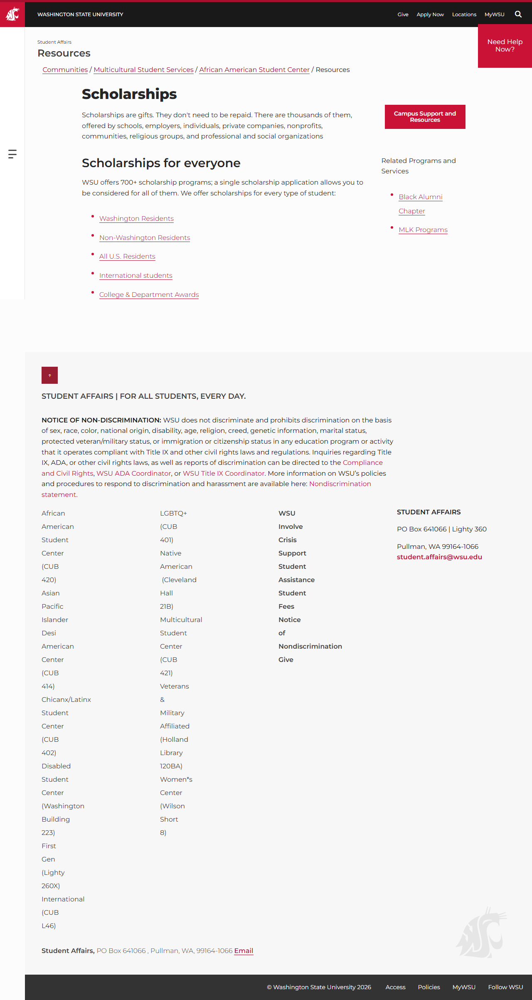

# Site Report: https://aastudentcenter.wsu.edu/

| Metric | Value |
|--------|-------|
| Status | ⚠️ 2/6 pages OK |
| Pages Scanned | 6 |
| Pages Passed | 2 |
| Pages Failed | 4 |
| Total JS Errors | 5 |
| Total JS Warnings | 0 |
| Total HTML | 114.0 KB |
| Total Screenshots | 1.1 MB |
| Folder | `aastudentcenter-wsu-edu/` |

## Pages

| Status | Page | HTTP | Title | JS Errors | JS Warnings | Screenshots |
|--------|------|------|-------|-----------|-------------|-------------|
| ✅ | [/](_root/report.md) | 200 | African American Student Center | 1 | 0 | 1 |
| ❌ | [/about/](about/report.md) | 404 | Page Not Found | 1 | 0 | 1 |
| ❌ | [/events/](events/report.md) | 404 | Page Not Found | 1 | 0 | 1 |
| ❌ | [/get-involved/](get-involved/report.md) | 404 | Page Not Found | 1 | 0 | 1 |
| ❌ | [/programs/](programs/report.md) | 404 | Page Not Found | 1 | 0 | 1 |
| ✅ | [/resources/](resources/report.md) | 200 | Resources | 0 | 0 | 1 |

## Page Screenshots

### [/](_root/report.md)

### [/about/](about/report.md)

### [/events/](events/report.md)

### [/get-involved/](get-involved/report.md)

### [/programs/](programs/report.md)

### [/resources/](resources/report.md)

## Failed Pages

### /about/

- **URL:** https://aastudentcenter.wsu.edu/about/
- **Status:** 404

### /programs/

- **URL:** https://aastudentcenter.wsu.edu/programs/
- **Status:** 404

### /events/

- **URL:** https://aastudentcenter.wsu.edu/events/
- **Status:** 404

### /get-involved/

- **URL:** https://aastudentcenter.wsu.edu/get-involved/
- **Status:** 404

## Pages with JavaScript Errors

### / (1 errors)

- `Failed to load resource: net::ERR_SOCKET_NOT_CONNECTED`

### /about/ (1 errors)

- `Failed to load resource: the server responded with a status of 404 ()`

### /programs/ (1 errors)

- `Failed to load resource: the server responded with a status of 404 ()`

### /events/ (1 errors)

- `Failed to load resource: the server responded with a status of 404 ()`

### /get-involved/ (1 errors)

- `Failed to load resource: the server responded with a status of 404 ()`

---

*Generated by AccessibilityScanner (FreeTools) v1.0*
