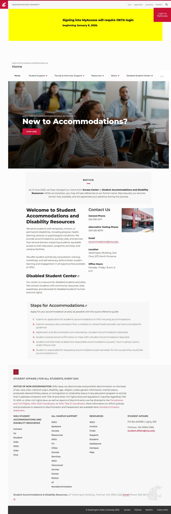

# Site Report: https://accesscenter.wsu.edu/

| Metric | Value |
|--------|-------|
| Status | ✅ 6/6 pages OK |
| Pages Scanned | 6 |
| Pages Passed | 6 |
| Pages Failed | 0 |
| Total JS Errors | 1 |
| Total JS Warnings | 0 |
| Total HTML | 338.3 KB |
| Total Screenshots | 7.3 MB |
| Folder | `accesscenter-wsu-edu/` |

## Pages

| Status | Page | HTTP | Title | JS Errors | JS Warnings | Screenshots |
|--------|------|------|-------|-----------|-------------|-------------|
| ✅ | [/](_root/report.md) | 200 |  | 1 | 0 | 1 |
| ✅ | [/accommodations/](accommodations/report.md) | 200 |  | 0 | 0 | 1 |
| ✅ | [/contact/](contact/report.md) | 200 |  | 0 | 0 | 1 |
| ✅ | [/faculty/](faculty/report.md) | 200 |  | 0 | 0 | 1 |
| ✅ | [/services/](services/report.md) | 200 |  | 0 | 0 | 1 |
| ✅ | [/students/](students/report.md) | 200 |  | 0 | 0 | 1 |

## Page Screenshots

### [/](_root/report.md)

### [/accommodations/](accommodations/report.md)

### [/contact/](contact/report.md)

### [/faculty/](faculty/report.md)

### [/services/](services/report.md)

### [/students/](students/report.md)

## Pages with JavaScript Errors

### / (1 errors)

- `Failed to load resource: net::ERR_HTTP2_PROTOCOL_ERROR`

---

*Generated by AccessibilityScanner (FreeTools) v1.0*
