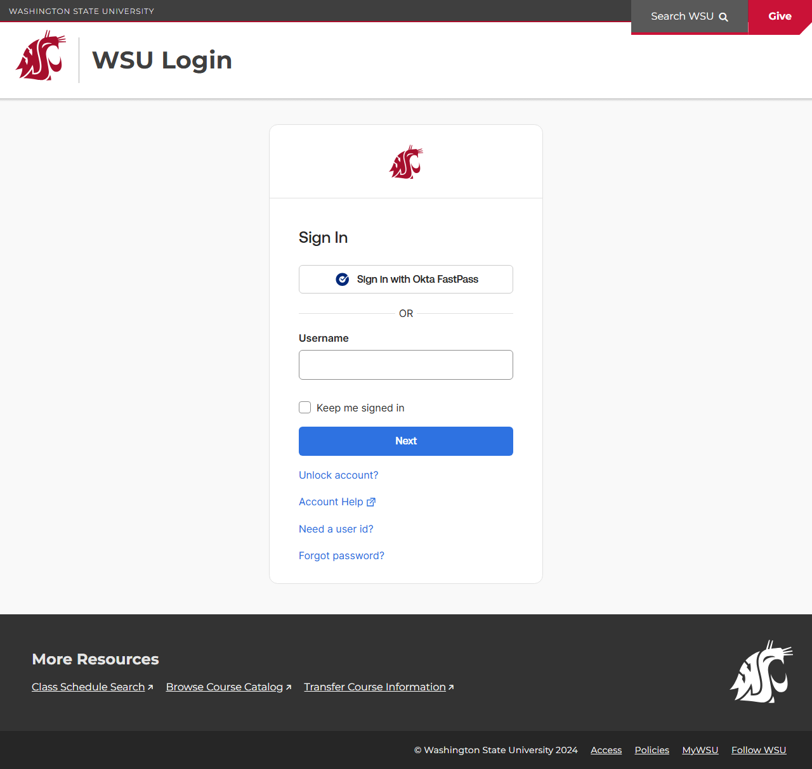

# 📄 Page Scan Report

> **URL:** https://account.wsu.edu/password-reset/  
> **Captured:** 2026-02-16 22:09:41 UTC  
> **Status:** ✅ 200  

---

## 📑 Contents

- [Summary](#-summary)
- [Screenshots](#-screenshots)
- [Page Images](#-page-images)
- [JavaScript Errors](#-javascript-errors)
- [Actions](#-actions)
- [Files](#-files)

---

## 📋 Summary

| Field | Value |
|-------|-------|
| URL | https://account.wsu.edu/password-reset/ |
| Redirected To | https://login.wsu.edu/oauth2/v1/authorize?client_id=okta.b8003760-1ca5-51b8-9404-85bb7ef9bc8c&scope=openid+profile+email+online_access+okta.internal.enduser.read+okta.myAccount.read+okta.myAccount.manage+okta.myAccount.profile.read+okta.myAccount.profile.manage+okta.enduser.dashboard.read+okta.enduser.dashboard.manage&state=s34V3SNVaYkNliEBgPAmgY6hB4-8paakpBHI8Es8zN8&redirect_uri=https%3A%2F%2Flogin.wsu.edu%2Faccount-settings%2Fcallback&response_type=code&nonce=XcRk22vyo_Du3hbPOmZuNvxiYR5YOMVkjKTPBaasWLk&code_challenge=BDW_Y-67FEuK07O9dWdkJCk2cJ_qvkDLsYUqQbEGIaE&code_challenge_method=S256 |
| Title | WSU | Sign In |
| Status | ✅ 200 |
| HTML Size | 141.2 KB |
| Screenshots | 1 (60.4 KB) |
| Images | 1 (7.7 KB) |
| Images Missing Alt | ✅ 0 |
| JS Errors | 🔴 8 |
| JS Warnings | 0 |
| Auth | none |
| Captured | 2026-02-16T22:09:41.6514807Z |

## 🔴 JavaScript Errors

<details>
<summary><strong>8 error(s) detected</strong></summary>

```
Failed to load resource: the server responded with a status of 404 ()
Something unexpected happened while we were checking url http://127.0.0.1:8769
Something unexpected happened while we were checking url http://127.0.0.1:65111
Something unexpected happened while we were checking url http://127.0.0.1:65121
Something unexpected happened while we were checking url http://127.0.0.1:65131
Something unexpected happened while we were checking url http://127.0.0.1:65141
Something unexpected happened while we were checking url http://127.0.0.1:65151
No available ports. Loopback server failed and polling is cancelled.
```

</details>

## 🔧 Actions

<details>
<summary><strong>2 action(s) performed</strong></summary>

- Screenshot #1: page-loaded (60.4 KB)
- Downloaded 1 images to /images/

</details>

## 📸 Screenshots

<table>
<tr>
<td align="center" width="50%">
<a href="01-page-loaded.png">

</a>
<br /><strong>1. page-loaded</strong>
<br /><sub>60.4 KB</sub>
</td>
<td></td>
</tr>
</table>

## 🖼️ Page Images (1)

<details open>
<summary><strong>📋 Image Index</strong> — 1 images, 7.7 KB</summary>

| # | Image | Alt Text | Size |
|--:|-------|----------|-----:|
| 1 | [fs015xh0tygNgGVxX2p8.img](images/fs015xh0tygNgGVxX2p8.img) | WSU logo | 7.7 KB |

</details>

<details open>
<summary><strong>🖼️ Gallery</strong></summary>

<table>
<tr>
<td align="center" width="33%">
<a href="images/fs015xh0tygNgGVxX2p8.img">

</a>
<br /><sub>fs015xh0tygNgGVxX2p8.img</sub>
</td>
<td></td>
<td></td>
</tr>
</table>

</details>

## 📁 Files

| File | Description |
|------|-------------|
| `01-page-loaded.png` | page-loaded (60.4 KB) |
| `page.html` | Rendered HTML content |
| `metadata.json` | Machine-readable scan data |
| `errors.log` | JavaScript console errors |
| `warnings.log` | JavaScript console warnings |
| `info.log` | Navigation and timing details |
| `actions.log` | Interactions performed |
| `images/` | 1 page images (7.7 KB) |

---

*Generated by AccessibilityScanner (FreeTools) v1.0*
