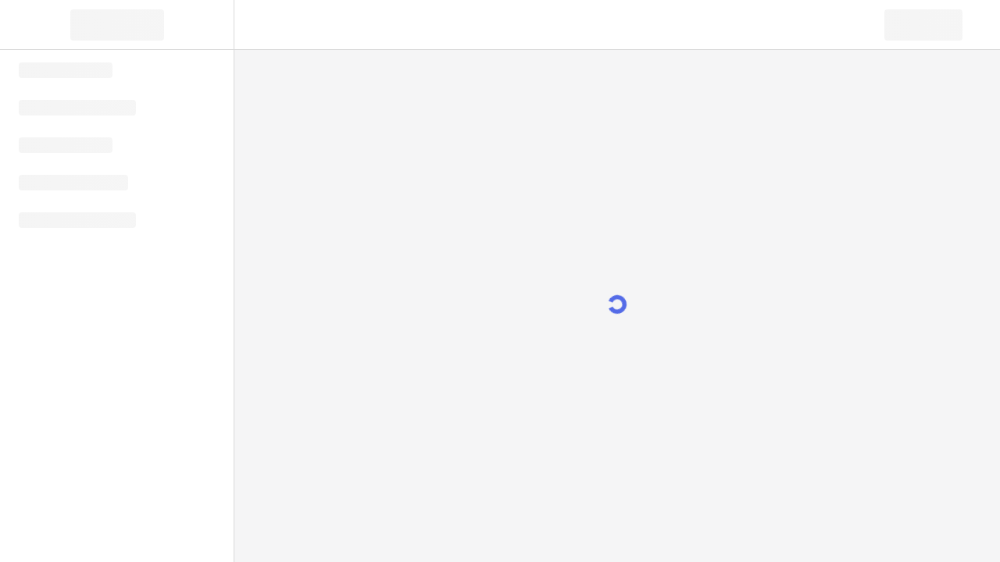

# Site Report: https://account.wsu.edu/

| Metric | Value |
|--------|-------|
| Status | ⚠️ 0/4 pages OK |
| Pages Scanned | 4 |
| Pages Passed | 0 |
| Pages Failed | 4 |
| Total JS Errors | 0 |
| Total JS Warnings | 0 |
| Total HTML | 10.0 KB |
| Total Screenshots | 31.9 KB |
| Total Images | 0 (0 bytes) |
| Images Missing Alt | 0 |
| Folder | `account-wsu-edu/` |

## Pages

| Status | Page | HTTP | Title | JS Errors | Images | Missing Alt |
|--------|------|------|-------|-----------|--------|-------------|
| ❌ | [/](_root/report.md) | 0 | My Settings \| WSU | 0 | 0 | 0 |
| ❌ | [/password-reset/](password-reset/report.md) | 0 | My Settings \| WSU | 0 | 0 | 0 |
| ❌ | [/security/](security/report.md) | 0 | (none) | 0 | 0 | 0 |
| ❌ | [/services/](services/report.md) | 0 | (none) | 0 | 0 | 0 |

## Page Screenshots

### [/](_root/report.md)

### [/password-reset/](password-reset/report.md)

### [/security/](security/report.md)

### [/services/](services/report.md)

## Failed Pages

### /

- **URL:** https://account.wsu.edu/
- **Status:** 0

### /services/

- **URL:** https://account.wsu.edu/services/
- **Status:** 0
- **Error:** `Execution context was destroyed, most likely because of a navigation`

### /password-reset/

- **URL:** https://account.wsu.edu/password-reset/
- **Status:** 0

### /security/

- **URL:** https://account.wsu.edu/security/
- **Status:** 0
- **Error:** `Unable to retrieve content because the page is navigating and changing the content.`

---

*Generated by AccessibilityScanner (FreeTools) v1.0*
