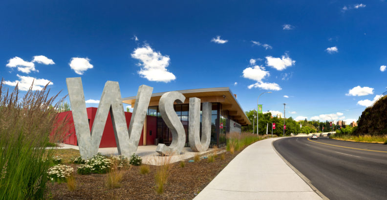

# 📄 Page Scan Report

> **URL:** https://accreditation.wsu.edu/about/  
> **Captured:** 2026-02-16 22:09:41 UTC  
> **Status:** ✅ 200  

---

## 📑 Contents

- [Summary](#-summary)
- [Screenshots](#-screenshots)
- [Page Images](#-page-images)
- [JavaScript Errors](#-javascript-errors)
- [Actions](#-actions)
- [Files](#-files)

---

## 📋 Summary

| Field | Value |
|-------|-------|
| URL | https://accreditation.wsu.edu/about/ |
| Redirected To | https://accreditation.wsu.edu/ |
| Title | Accreditation Site | Washington State University |
| Status | ✅ 200 |
| HTML Size | 60.0 KB |
| Screenshots | 1 (385.8 KB) |
| Images | 2 (76.8 KB) |
| Images Missing Alt | ⚠️ 1 |
| JS Errors | 🔴 1 |
| JS Warnings | 0 |
| Auth | none |
| Captured | 2026-02-16T22:09:41.7603874Z |

## 🔴 JavaScript Errors

<details>
<summary><strong>1 error(s) detected</strong></summary>

```
Failed to load resource: the server responded with a status of 404 ()
```

</details>

## 🔧 Actions

<details>
<summary><strong>2 action(s) performed</strong></summary>

- Screenshot #1: page-loaded (385.8 KB)
- Downloaded 2 images to /images/

</details>

## 📸 Screenshots

<table>
<tr>
<td align="center" width="50%">
<a href="01-page-loaded.png">

</a>
<br /><strong>1. page-loaded</strong>
<br /><sub>385.8 KB</sub>
</td>
<td></td>
</tr>
</table>

## 🖼️ Page Images (2)

<details open>
<summary><strong>📋 Image Index</strong> — 2 images, 76.8 KB</summary>

| # | Image | Alt Text | Size |
|--:|-------|----------|-----:|
| 1 | [Visitor-Center_3902-Pano-792x410.jpg](images/Visitor-Center_3902-Pano-792x410.jpg) | ⚠️ *(missing)* | 70.8 KB |
| 2 | [nwccu_logo_lighthouse-500x200-1-396x158.jpg](images/nwccu_logo_lighthouse-500x200-1-396x158.jpg) | NWCCU Logo | 6.0 KB |

</details>

<details open>
<summary><strong>🖼️ Gallery</strong></summary>

<table>
<tr>
<td align="center" width="33%">
<a href="images/Visitor-Center_3902-Pano-792x410.jpg">

</a>
<br /><sub>Visitor-Center_3902-Pano-792x410.jpg ⚠️</sub>
</td>
<td align="center" width="33%">
<a href="images/nwccu_logo_lighthouse-500x200-1-396x158.jpg">

</a>
<br /><sub>nwccu_logo_lighthouse-500x200-1-396x158.jpg</sub>
</td>
<td></td>
</tr>
</table>

</details>

<details>
<summary>⚠️ <strong>Images Missing Alt Text</strong> (1)</summary>

| Image | Source URL |
|-------|-----------|
| `Visitor-Center_3902-Pano-792x410.jpg` | https://wpcdn.web.wsu.edu/wp-provost/uploads/sites/154/2017/11/Visitor-Center... |

</details>

## 📁 Files

| File | Description |
|------|-------------|
| `01-page-loaded.png` | page-loaded (385.8 KB) |
| `page.html` | Rendered HTML content |
| `metadata.json` | Machine-readable scan data |
| `errors.log` | JavaScript console errors |
| `warnings.log` | JavaScript console warnings |
| `info.log` | Navigation and timing details |
| `actions.log` | Interactions performed |
| `images/` | 2 page images (76.8 KB) |

---

*Generated by AccessibilityScanner (FreeTools) v1.0*
