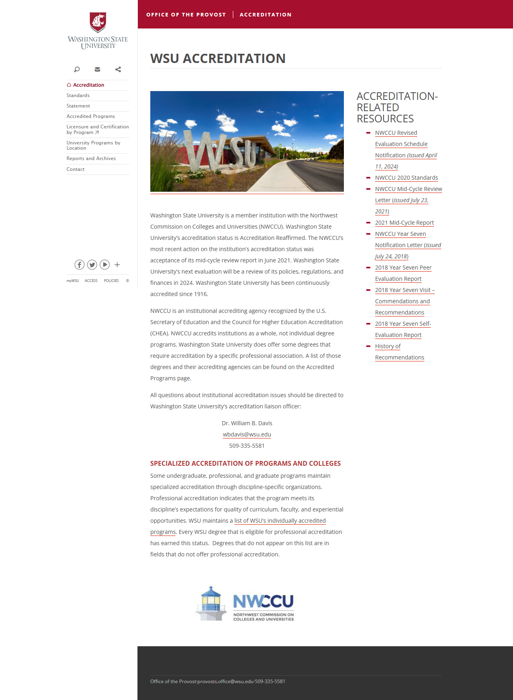
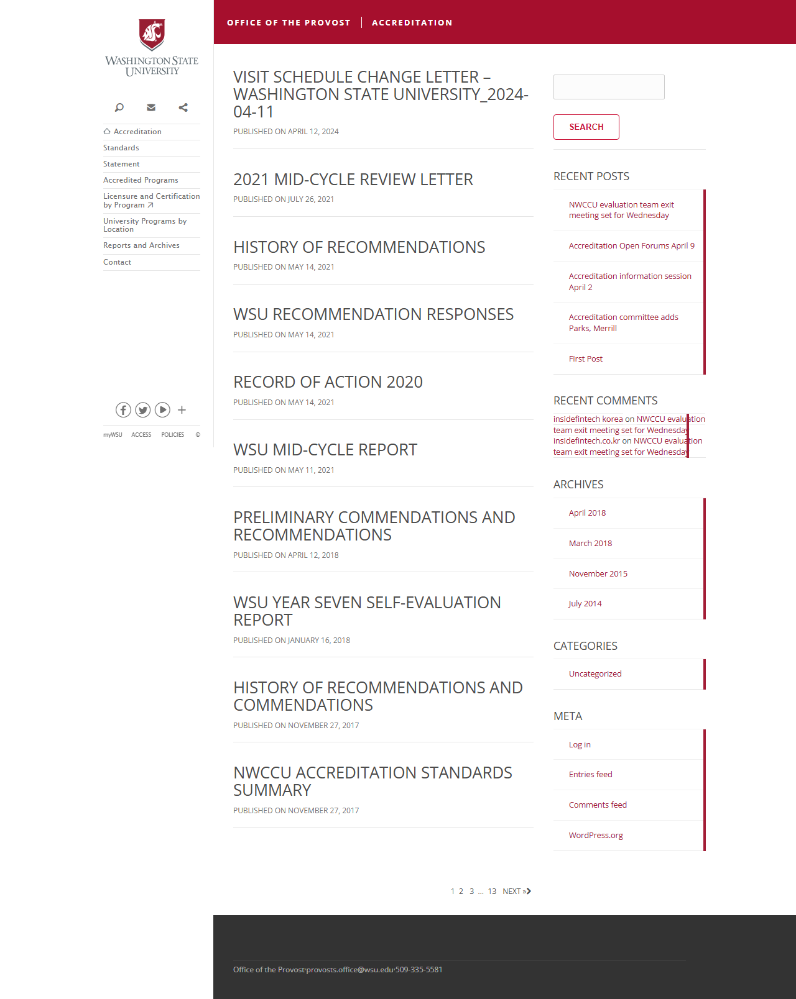
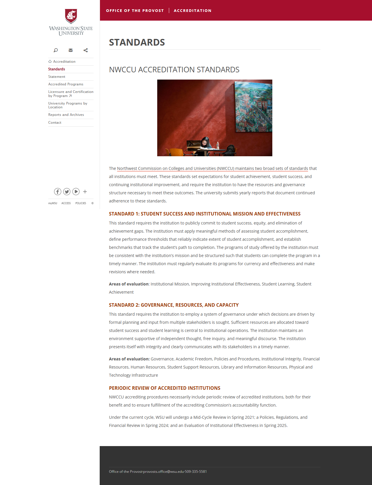
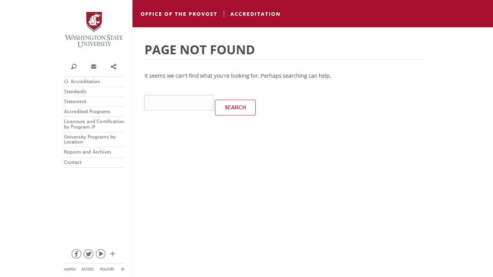

# Site Report: https://accreditation.wsu.edu/

| Metric | Value |
|--------|-------|
| Status | ⚠️ 5/6 pages OK |
| Pages Scanned | 6 |
| Pages Passed | 5 |
| Pages Failed | 1 |
| Total JS Errors | 7 |
| Total JS Warnings | 0 |
| Total HTML | 353.3 KB |
| Total Screenshots | 1.3 MB |
| Folder | `accreditation-wsu-edu/` |

## Pages

| Status | Page | HTTP | Title | JS Errors | JS Warnings | Screenshots |
|--------|------|------|-------|-----------|-------------|-------------|
| ✅ | [/](_root/report.md) | 200 | Accreditation Site \| Washington Stat... | 1 | 0 | 1 |
| ✅ | [/about/](about/report.md) | 200 | Accreditation Site \| Washington Stat... | 1 | 0 | 1 |
| ✅ | [/contact/](contact/report.md) | 200 | Contact \| Accreditation Site \| Wash... | 1 | 0 | 1 |
| ✅ | [/documents/](documents/report.md) | 200 | Documents \| Accreditation Site \| Wa... | 1 | 0 | 1 |
| ✅ | [/standards/](standards/report.md) | 200 | Standards \| Accreditation Site \| Wa... | 1 | 0 | 1 |
| ❌ | [/timeline/](timeline/report.md) | 404 | Page not found \| Accreditation Site ... | 2 | 0 | 1 |

## Page Screenshots

### [/](_root/report.md)

### [/about/](about/report.md)

### [/contact/](contact/report.md)

### [/documents/](documents/report.md)

### [/standards/](standards/report.md)

### [/timeline/](timeline/report.md)

## Failed Pages

### /timeline/

- **URL:** https://accreditation.wsu.edu/timeline/
- **Status:** 404

## Pages with JavaScript Errors

### /timeline/ (2 errors)

- `Failed to load resource: the server responded with a status of 404 ()`
- `Failed to load resource: the server responded with a status of 404 ()`

### / (1 errors)

- `Failed to load resource: the server responded with a status of 404 ()`

### /about/ (1 errors)

- `Failed to load resource: the server responded with a status of 404 ()`

### /standards/ (1 errors)

- `Failed to load resource: the server responded with a status of 404 ()`

### /documents/ (1 errors)

- `Failed to load resource: the server responded with a status of 404 ()`

### /contact/ (1 errors)

- `Failed to load resource: the server responded with a status of 404 ()`

---

*Generated by AccessibilityScanner (FreeTools) v1.0*
