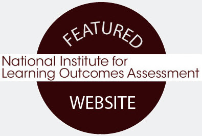

# Page Scan Report

| Field | Value |
|-------|-------|
| URL | https://ace.wsu.edu/ |
| Title | Office of Assessment for Curricular Effectiveness | Washington State University |
| Status | ❌ 0 |
| HTML Size | 64.9 KB |
| Screenshots | 1 (744.3 KB) |
| Images | 1 (23.8 KB) |
| Images Missing Alt | 0 |
| JS Errors | 0 |
| JS Warnings | 0 |
| Auth | none |
| Captured | 2026-02-16T20:37:04.9610133Z |

## Actions

- Screenshot #1: page-loaded (744.3 KB)
- Downloaded 1 images to /images/

## Screenshots

### 1. page-loaded

## Page Images (1)

| # | Image | Alt Text | Size |
|---|-------|----------|------|
| 1 | [featuredwebsite-NILOA-download-gray.jpg](images/featuredwebsite-NILOA-download-gray.jpg) | NILOA featured website logo. Read abo... | 23.8 KB |

### Gallery

## Files

- `01-page-loaded.png` — page-loaded (744.3 KB)
- `page.html` — rendered HTML content
- `metadata.json` — machine-readable scan data
- `errors.log` — JavaScript console errors
- `warnings.log` — JavaScript console warnings
- `info.log` — navigation and timing details
- `actions.log` — interactions performed on the page
- `images/` — 1 page images (23.8 KB)
