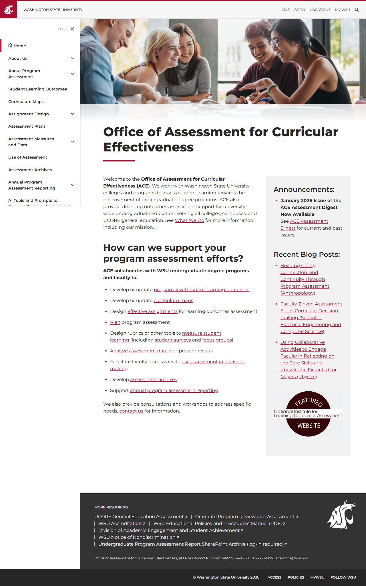
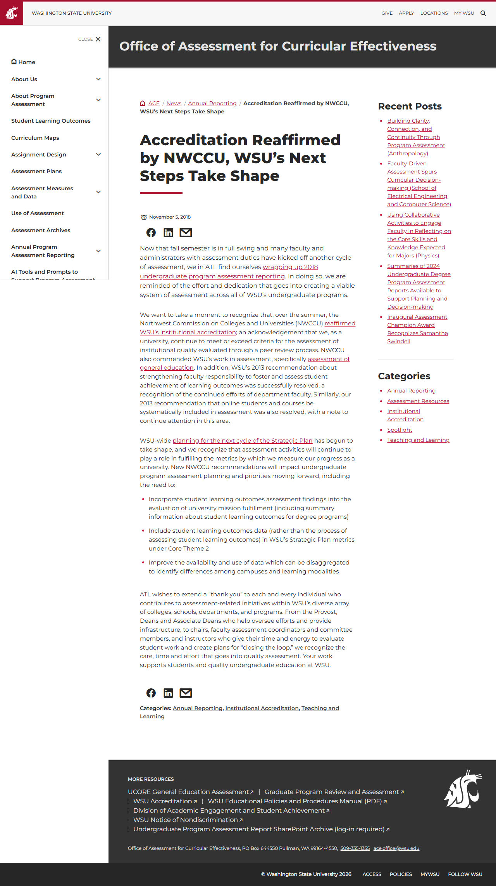
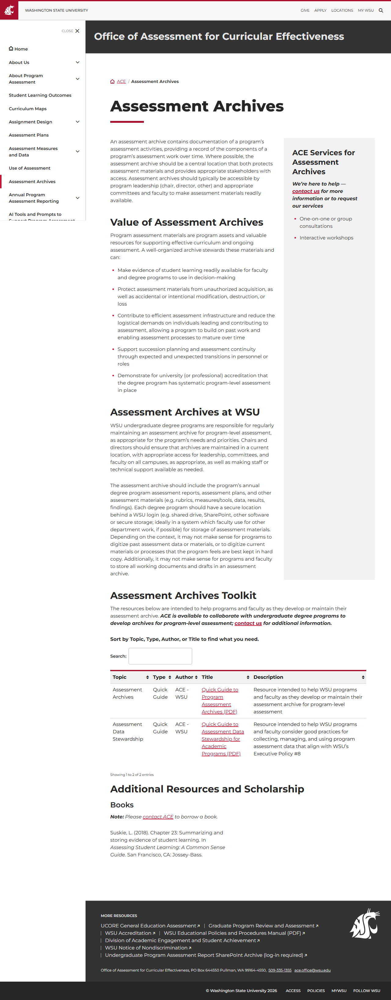
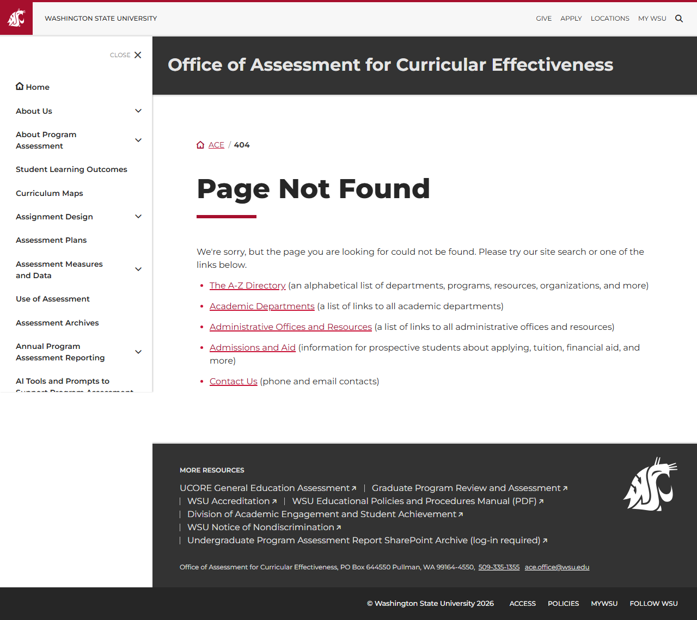
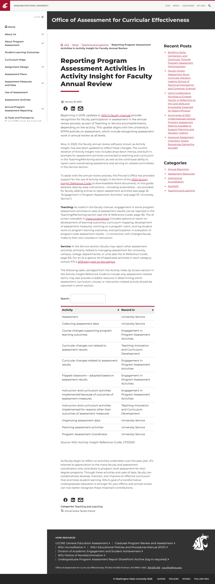

# Site Report: https://ace.wsu.edu/

| Metric | Value |
|--------|-------|
| Status | ⚠️ 4/6 pages OK |
| Pages Scanned | 6 |
| Pages Passed | 4 |
| Pages Failed | 2 |
| Total JS Errors | 2 |
| Total JS Warnings | 0 |
| Total HTML | 486.2 KB |
| Total Screenshots | 2.1 MB |
| Folder | `ace-wsu-edu/` |

## Pages

| Status | Page | HTTP | Title | JS Errors | JS Warnings | Screenshots |
|--------|------|------|-------|-----------|-------------|-------------|
| ✅ | [/](_root/report.md) | 200 | Office of Assessment for Curricular E... | 0 | 0 | 1 |
| ✅ | [/accreditation/](accreditation/report.md) | 200 | Accreditation Reaffirmed by NWCCU, WS... | 0 | 0 | 1 |
| ✅ | [/assessment/](assessment/report.md) | 200 | Assessment Archives \| Office of Asse... | 0 | 0 | 1 |
| ❌ | [/contact/](contact/report.md) | 404 | Page not found \| Office of Assessmen... | 1 | 0 | 1 |
| ✅ | [/reporting/](reporting/report.md) | 200 | Reporting Program Assessment Activiti... | 0 | 0 | 1 |
| ❌ | [/resources/](resources/report.md) | 404 | Page not found \| Office of Assessmen... | 1 | 0 | 1 |

## Page Screenshots

### [/](_root/report.md)

### [/accreditation/](accreditation/report.md)

### [/assessment/](assessment/report.md)

### [/contact/](contact/report.md)

### [/reporting/](reporting/report.md)

### [/resources/](resources/report.md)

## Failed Pages

### /resources/

- **URL:** https://ace.wsu.edu/resources/
- **Status:** 404

### /contact/

- **URL:** https://ace.wsu.edu/contact/
- **Status:** 404

## Pages with JavaScript Errors

### /resources/ (1 errors)

- `Failed to load resource: the server responded with a status of 404 ()`

### /contact/ (1 errors)

- `Failed to load resource: the server responded with a status of 404 ()`

---

*Generated by AccessibilityScanner (FreeTools) v1.0*
