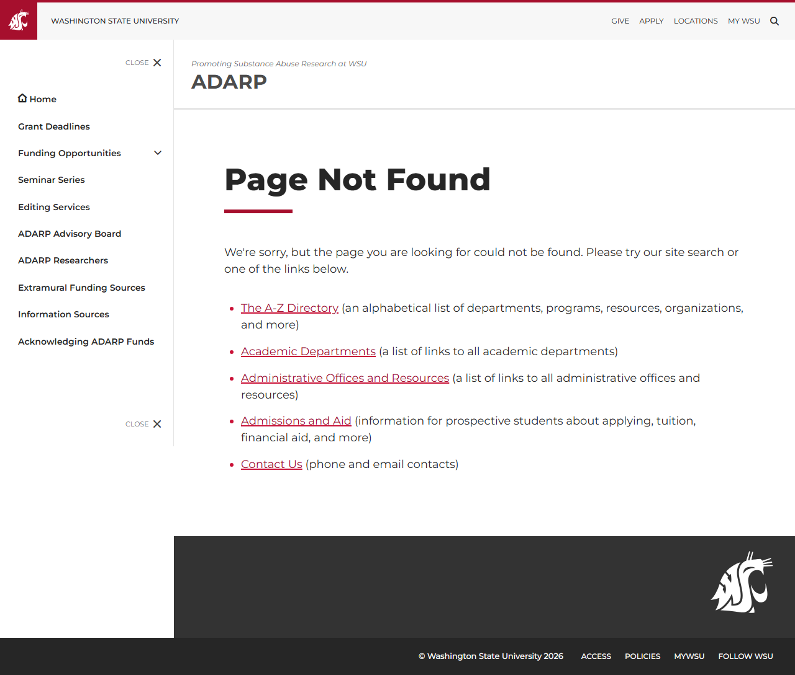

# Site Report: https://adarp.wsu.edu/

| Metric | Value |
|--------|-------|
| Status | ⚠️ 1/6 pages OK |
| Pages Scanned | 6 |
| Pages Passed | 1 |
| Pages Failed | 5 |
| Total JS Errors | 6 |
| Total JS Warnings | 0 |
| Total HTML | 342.7 KB |
| Total Screenshots | 1.2 MB |
| Folder | `adarp-wsu-edu/` |

## Pages

| Status | Page | HTTP | Title | JS Errors | JS Warnings | Screenshots |
|--------|------|------|-------|-----------|-------------|-------------|
| ✅ | [/](_root/report.md) | 200 | ADARP \| Washington State University | 1 | 0 | 1 |
| ❌ | [/about/](about/report.md) | 404 | Page not found \| ADARP \| Washington... | 1 | 0 | 1 |
| ❌ | [/contact/](contact/report.md) | 404 | Page not found \| ADARP \| Washington... | 1 | 0 | 1 |
| ❌ | [/projects/](projects/report.md) | 404 | Page not found \| ADARP \| Washington... | 1 | 0 | 1 |
| ❌ | [/publications/](publications/report.md) | 404 | Page not found \| ADARP \| Washington... | 1 | 0 | 1 |
| ❌ | [/research/](research/report.md) | 404 | Page not found \| ADARP \| Washington... | 1 | 0 | 1 |

## Page Screenshots

### [/](_root/report.md)

### [/about/](about/report.md)

### [/contact/](contact/report.md)

### [/projects/](projects/report.md)

### [/publications/](publications/report.md)

### [/research/](research/report.md)

## Failed Pages

### /research/

- **URL:** https://adarp.wsu.edu/research/
- **Status:** 404

### /projects/

- **URL:** https://adarp.wsu.edu/projects/
- **Status:** 404

### /publications/

- **URL:** https://adarp.wsu.edu/publications/
- **Status:** 404

### /about/

- **URL:** https://adarp.wsu.edu/about/
- **Status:** 404

### /contact/

- **URL:** https://adarp.wsu.edu/contact/
- **Status:** 404

## Pages with JavaScript Errors

### / (1 errors)

- `Failed to load resource: net::ERR_SOCKET_NOT_CONNECTED`

### /research/ (1 errors)

- `Failed to load resource: the server responded with a status of 404 ()`

### /projects/ (1 errors)

- `Failed to load resource: the server responded with a status of 404 ()`

### /publications/ (1 errors)

- `Failed to load resource: the server responded with a status of 404 ()`

### /about/ (1 errors)

- `Failed to load resource: the server responded with a status of 404 ()`

### /contact/ (1 errors)

- `Failed to load resource: the server responded with a status of 404 ()`

---

*Generated by AccessibilityScanner (FreeTools) v1.0*
