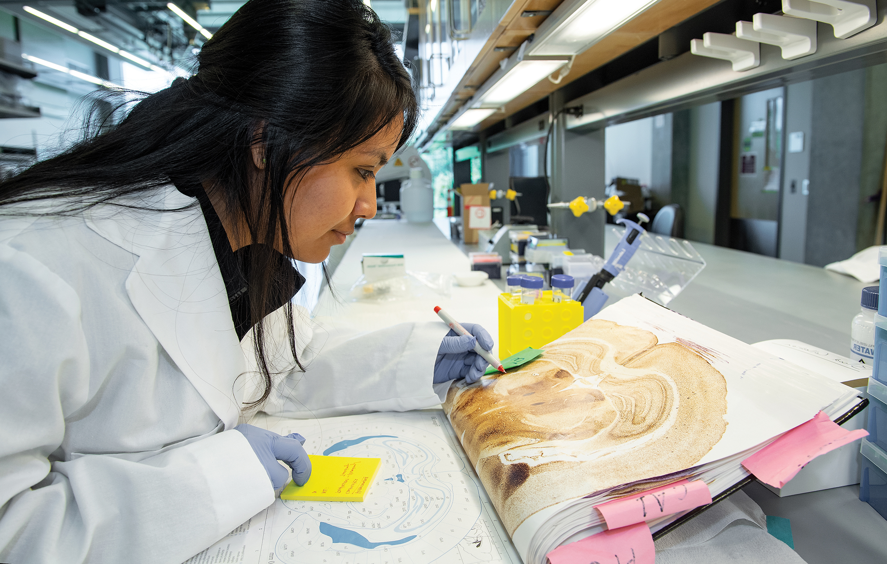
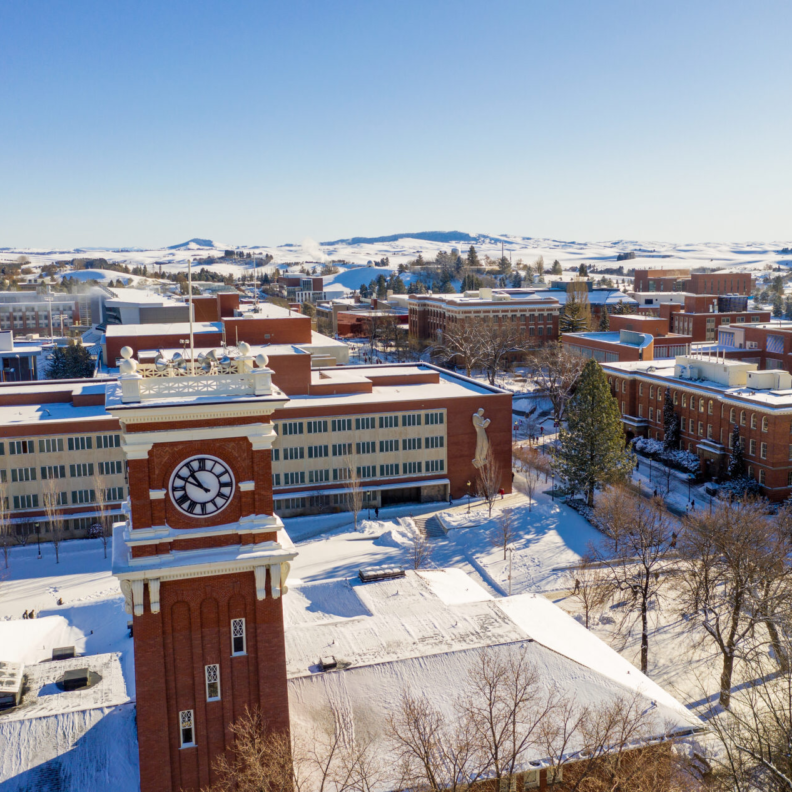
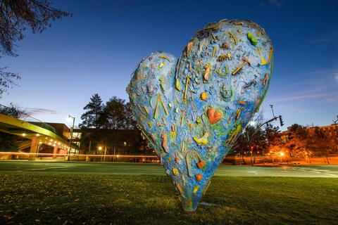
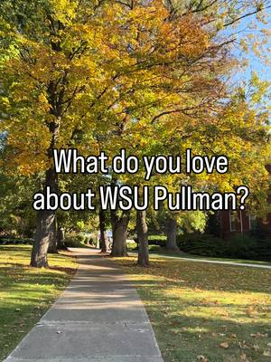

# 📄 Page Scan Report

> **URL:** https://admission.wsu.edu/  
> **Captured:** 2026-02-16 22:10:14 UTC  
> **Status:** ✅ 200  

---

## 📑 Contents

- [Summary](#-summary)
- [Screenshots](#-screenshots)
- [Page Images](#-page-images)
- [JavaScript Errors](#-javascript-errors)
- [Actions](#-actions)
- [Files](#-files)

---

## 📋 Summary

| Field | Value |
|-------|-------|
| URL | https://admission.wsu.edu/ |
| Title | Admissions | Washington State University |
| Status | ✅ 200 |
| HTML Size | 180.0 KB |
| Screenshots | 1 (2.8 MB) |
| Images | 30 (10.3 MB) |
| Images Missing Alt | ✅ 0 |
| JS Errors | 🔴 1 |
| JS Warnings | 1 |
| Auth | none |
| Captured | 2026-02-16T22:10:14.8559792Z |

## 🔴 JavaScript Errors

<details>
<summary><strong>1 error(s) detected</strong></summary>

```
Failed to load resource: net::ERR_TOO_MANY_REDIRECTS
```

</details>

## 🔧 Actions

<details>
<summary><strong>2 action(s) performed</strong></summary>

- Screenshot #1: page-loaded (2.8 MB)
- Downloaded 30 images to /images/

</details>

## 📸 Screenshots

<table>
<tr>
<td align="center" width="50%">
<a href="01-page-loaded.png">

</a>
<br /><strong>1. page-loaded</strong>
<br /><sub>2.8 MB</sub>
</td>
<td></td>
</tr>
</table>

## 🖼️ Page Images (30)

<details open>
<summary><strong>📋 Image Index</strong> — 30 images, 10.3 MB</summary>

| # | Image | Alt Text | Size |
|--:|-------|----------|-----:|
| 1 | [Business-class.jpg](images/Business-class.jpg) | Students talking at a table | 2.5 MB |
| 2 | [CBBRBusinessClass_2046.jpg](images/CBBRBusinessClass_2046.jpg) | Student working on a laptop | 2.4 MB |
| 3 | [Research.jpg](images/Research.jpg) | Student doing research in a lab | 2.1 MB |
| 4 | [students-on-grass-1188x553-1.png](images/students-on-grass-1188x553-1.png) | Students sitting on lawn talking | 379.6 KB |
| 5 | [Mask-group-23.png](images/Mask-group-23.png) | Students working together | 670.2 KB |
| 6 | [WinterDroneAerial_0468-1900x1266-1-792x792.png](images/WinterDroneAerial_0468-1900x1266-1-792x792.png) | WSU Campus | 1007.5 KB |
| 7 | [library-road-e1605824401570-792x564-1.jpg](images/library-road-e1605824401570-792x564-1.jpg) | Students walking on WSU Campus | 199.1 KB |
| 8 | [Mask-Group-32@2x-scaled-2-792x566-1.jpg](images/Mask-Group-32@2x-scaled-2-792x566-1.jpg) | Students wearing WSU Clothes | 171.8 KB |
| 9 | [Bike-Trail_0006@2x-792x567.jpg](images/Bike-Trail_0006@2x-792x567.jpg) | Students biking | 58.3 KB |
| 10 | [385273602.jpg](images/385273602.jpg) | Image posted by WSUPullman to facebook | 45.0 KB |
| 11 | [385273602_user_image.img](images/385273602_user_image.img) | Profile image for WSU Pullman | 1.3 KB |
| 12 | [385254882.jpg](images/385254882.jpg) | Image posted by WSUPullman to facebook | 84.9 KB |
| 13 | [picture.img](images/picture.img) | Profile image for WSU Pullman | 1.3 KB |
| 14 | [385211718.jpg](images/385211718.jpg) | Image posted by wsupullman to instagram | 123.7 KB |
| 15 | [385211718_user_image.jpg](images/385211718_user_image.jpg) | Profile image for wsupullman | 2.5 KB |
| 16 | [385190975.jpg](images/385190975.jpg) | Image posted by wsupullman to instagram | 36.4 KB |
| 17 | [385190975_user_image.jpg](images/385190975_user_image.jpg) | Profile image for wsupullman | 2.5 KB |
| 18 | [385272197.jpg](images/385272197.jpg) | Image posted by wsupullman to instagram | 52.8 KB |
| 19 | [385272197_user_image.jpg](images/385272197_user_image.jpg) | Profile image for wsupullman | 2.5 KB |
| 20 | [385262531.jpg](images/385262531.jpg) | Image posted by WSUPullman to facebook | 34.5 KB |
| 21 | [385262531_user_image.img](images/385262531_user_image.img) | Profile image for WSU Pullman | 1.3 KB |
| 22 | [385237686.jpg](images/385237686.jpg) | Image posted by WSUPullman to facebook | 27.7 KB |
| 23 | [385190922.jpg](images/385190922.jpg) | Image posted by WSUPullman to facebook | 35.8 KB |
| 24 | [HBNiNC_bMAAZN2i.img](images/HBNiNC_bMAAZN2i.img) | Image posted by WSUPullman to twitter | 17.4 KB |
| 25 | [cxupnNSr_normal.jpg](images/cxupnNSr_normal.jpg) | Profile image for WSU Pullman | 1.9 KB |
| 26 | [385244271.jpg](images/385244271.jpg) | Image posted by wsupullman to instagram | 44.4 KB |
| 27 | [385244271_user_image.jpg](images/385244271_user_image.jpg) | Profile image for wsupullman | 2.5 KB |
| 28 | [HBKgIWdakAAiGOz.img](images/HBKgIWdakAAiGOz.img) | Image posted by WSUPullman to twitter | 287.8 KB |
| 29 | [385211354.jpg](images/385211354.jpg) | Image posted by wsupullman to tiktok | 39.9 KB |
| 30 | [182239.webp](images/182239.webp) | Profile image for  | 1.3 KB |

</details>

<details open>
<summary><strong>🖼️ Gallery</strong></summary>

<table>
<tr>
<td align="center" width="33%">
<a href="images/Business-class.jpg">

</a>
<br /><sub>Business-class.jpg</sub>
</td>
<td align="center" width="33%">
<a href="images/CBBRBusinessClass_2046.jpg">

</a>
<br /><sub>CBBRBusinessClass_2046.jpg</sub>
</td>
<td align="center" width="33%">
<a href="images/Research.jpg">

</a>
<br /><sub>Research.jpg</sub>
</td>
</tr>
<tr>
<td align="center" width="33%">
<a href="images/students-on-grass-1188x553-1.png">

</a>
<br /><sub>students-on-grass-1188x553-1.png</sub>
</td>
<td align="center" width="33%">
<a href="images/Mask-group-23.png">

</a>
<br /><sub>Mask-group-23.png</sub>
</td>
<td align="center" width="33%">
<a href="images/WinterDroneAerial_0468-1900x1266-1-792x792.png">

</a>
<br /><sub>WinterDroneAerial_0468-1900x1266-1-792x792.png</sub>
</td>
</tr>
<tr>
<td align="center" width="33%">
<a href="images/library-road-e1605824401570-792x564-1.jpg">

</a>
<br /><sub>library-road-e1605824401570-792x564-1.jpg</sub>
</td>
<td align="center" width="33%">
<a href="images/Mask-Group-32@2x-scaled-2-792x566-1.jpg">

</a>
<br /><sub>Mask-Group-32@2x-scaled-2-792x566-1.jpg</sub>
</td>
<td align="center" width="33%">
<a href="images/Bike-Trail_0006@2x-792x567.jpg">

</a>
<br /><sub>Bike-Trail_0006@2x-792x567.jpg</sub>
</td>
</tr>
<tr>
<td align="center" width="33%">
<a href="images/385273602.jpg">

</a>
<br /><sub>385273602.jpg</sub>
</td>
<td align="center" width="33%">
<a href="images/385273602_user_image.img">

</a>
<br /><sub>385273602_user_image.img</sub>
</td>
<td align="center" width="33%">
<a href="images/385254882.jpg">

</a>
<br /><sub>385254882.jpg</sub>
</td>
</tr>
<tr>
<td align="center" width="33%">
<a href="images/picture.img">

</a>
<br /><sub>picture.img</sub>
</td>
<td align="center" width="33%">
<a href="images/385211718.jpg">

</a>
<br /><sub>385211718.jpg</sub>
</td>
<td align="center" width="33%">
<a href="images/385211718_user_image.jpg">

</a>
<br /><sub>385211718_user_image.jpg</sub>
</td>
</tr>
<tr>
<td align="center" width="33%">
<a href="images/385190975.jpg">

</a>
<br /><sub>385190975.jpg</sub>
</td>
<td align="center" width="33%">
<a href="images/385190975_user_image.jpg">

</a>
<br /><sub>385190975_user_image.jpg</sub>
</td>
<td align="center" width="33%">
<a href="images/385272197.jpg">

</a>
<br /><sub>385272197.jpg</sub>
</td>
</tr>
<tr>
<td align="center" width="33%">
<a href="images/385272197_user_image.jpg">

</a>
<br /><sub>385272197_user_image.jpg</sub>
</td>
<td align="center" width="33%">
<a href="images/385262531.jpg">

</a>
<br /><sub>385262531.jpg</sub>
</td>
<td align="center" width="33%">
<a href="images/385262531_user_image.img">

</a>
<br /><sub>385262531_user_image.img</sub>
</td>
</tr>
<tr>
<td align="center" width="33%">
<a href="images/385237686.jpg">

</a>
<br /><sub>385237686.jpg</sub>
</td>
<td align="center" width="33%">
<a href="images/385190922.jpg">

</a>
<br /><sub>385190922.jpg</sub>
</td>
<td align="center" width="33%">
<a href="images/HBNiNC_bMAAZN2i.img">

</a>
<br /><sub>HBNiNC_bMAAZN2i.img</sub>
</td>
</tr>
<tr>
<td align="center" width="33%">
<a href="images/cxupnNSr_normal.jpg">

</a>
<br /><sub>cxupnNSr_normal.jpg</sub>
</td>
<td align="center" width="33%">
<a href="images/385244271.jpg">

</a>
<br /><sub>385244271.jpg</sub>
</td>
<td align="center" width="33%">
<a href="images/385244271_user_image.jpg">

</a>
<br /><sub>385244271_user_image.jpg</sub>
</td>
</tr>
<tr>
<td align="center" width="33%">
<a href="images/HBKgIWdakAAiGOz.img">

</a>
<br /><sub>HBKgIWdakAAiGOz.img</sub>
</td>
<td align="center" width="33%">
<a href="images/385211354.jpg">

</a>
<br /><sub>385211354.jpg</sub>
</td>
<td align="center" width="33%">
<a href="images/182239.webp">

</a>
<br /><sub>182239.webp</sub>
</td>
</tr>
</table>

</details>

## 📁 Files

| File | Description |
|------|-------------|
| `01-page-loaded.png` | page-loaded (2.8 MB) |
| `page.html` | Rendered HTML content |
| `metadata.json` | Machine-readable scan data |
| `errors.log` | JavaScript console errors |
| `warnings.log` | JavaScript console warnings |
| `info.log` | Navigation and timing details |
| `actions.log` | Interactions performed |
| `images/` | 30 page images (10.3 MB) |

---

*Generated by AccessibilityScanner (FreeTools) v1.0*
