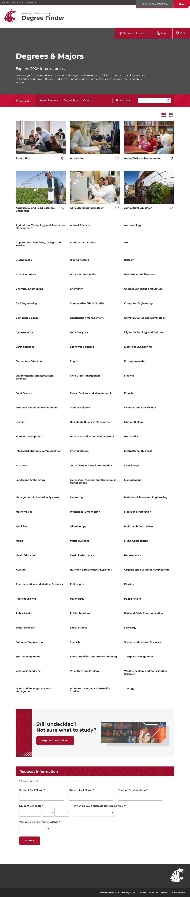

# 📄 Page Scan Report

> **URL:** https://admission.wsu.edu/academics/fos/Public/index.castle  
> **Captured:** 2026-02-19 02:07:47 UTC  
> **Status:** ✅ 200  

---

## 📑 Contents

- [Summary](#-summary)
- [Screenshots](#-screenshots)
- [Page Images](#-page-images)
- [JavaScript Errors](#-javascript-errors)
- [Accessibility](#-accessibility)
- [Actions](#-actions)
- [Files](#-files)

---

## 📋 Summary

| Field | Value |
|-------|-------|
| URL | https://admission.wsu.edu/academics/fos/Public/index.castle |
| Redirected To | https://degrees.wsu.edu/ |
| Title | Degree Finder | Washington State University |
| Status | ✅ 200 |
| HTML Size | 413.7 KB |
| Screenshots | 1 (346.9 KB) |
| Images | 7 (referenced by URL) |
| Images Missing Alt | ⚠️ 7 |
| JS Errors | 🔴 4 |
| JS Warnings | 1 |
| A11y Violations | ⚠️ 3 |
| 🔴 Critical | 0 |
| 🟠 Serious | 3 |
| 🟡 Moderate | 0 |
| 🔵 Minor | 0 |
| Tools Run | axe, htmlcheck |
| Auth | none |
| Captured | 2026-02-19T02:07:47.1790969Z |

## 🔴 JavaScript Errors

<details>
<summary><strong>4 error(s) detected</strong></summary>

```
Access to XMLHttpRequest at 'https://fw.cdn.technolutions.net/framework/base_safe.css?v=db27' from origin 'https://degrees.wsu.edu' has been blocked by CORS policy: No 'Access-Control-Allow-Origin' he...
Failed to load resource: net::ERR_FAILED
Access to XMLHttpRequest at 'https://slate-technolutions-net.cdn.technolutions.net/register/embed.css?v=TS-db27-638899359743360055' from origin 'https://degrees.wsu.edu' has been blocked by CORS polic...
Failed to load resource: net::ERR_FAILED
```

</details>

## 🔧 Actions

<details>
<summary><strong>4 action(s) performed</strong></summary>

- Screenshot #1: page-loaded (346.9 KB)
- Cataloged 7 images by URL (no download)
- axe-core: 0 violations (272ms)
- htmlcheck: 3 violations (3ms)

</details>

## 📸 Screenshots

<table>
<tr>
<td align="center" width="50%">
<a href="01-page-loaded.jpg">

</a>
<br /><strong>1. page-loaded</strong>
<br /><sub>346.9 KB</sub>
</td>
<td></td>
</tr>
</table>

## 🖼️ Page Images (7)

<details open>
<summary><strong>📋 Image Index</strong> — 7 images (referenced by URL)</summary>

| # | Source URL | Alt Text |
|--:|-----------|----------|
| 1 | https://wpcdn.web.wsu.edu/wp-ucomm/uploads/sites/3025/Accounting_CCOB-Class-R... | ⚠️ *(missing)* |
| 2 | https://wpcdn.web.wsu.edu/wp-ucomm/uploads/sites/3025/Murrow_6615-768x512.jpg | ⚠️ *(missing)* |
| 3 | https://wpcdn.web.wsu.edu/wp-ucomm/uploads/sites/3025/CCOB-at-Senior-Center_7... | ⚠️ *(missing)* |
| 4 | https://wpcdn.web.wsu.edu/wp-ucomm/uploads/sites/3025/CAHNRS_PotatoFieldDay-7... | ⚠️ *(missing)* |
| 5 | https://wpcdn.web.wsu.edu/wp-ucomm/uploads/sites/3025/CAHNRS_Tri-Cities-Biofu... | ⚠️ *(missing)* |
| 6 | https://wpcdn.web.wsu.edu/wp-ucomm/uploads/sites/3025/Agricultural-Education-... | ⚠️ *(missing)* |
| 7 | https://wpcdn.web.wsu.edu/wp-ucomm/uploads/sites/3025/2023-11-06-10_06_49-Unt... | ⚠️ *(missing)* |

</details>

<details open>
<summary><strong>🖼️ Gallery</strong></summary>

<table>
<tr>
<td align="center" width="33%">
<a href="https://wpcdn.web.wsu.edu/wp-ucomm/uploads/sites/3025/Accounting_CCOB-Class-Ryan-Sommerfeldt_4841-768x525.jpg">

</a>
<br /><sub>https://wpcdn.web.wsu.edu/wp-ucomm/uploads/site... ⚠️</sub>
</td>
<td align="center" width="33%">
<a href="https://wpcdn.web.wsu.edu/wp-ucomm/uploads/sites/3025/Murrow_6615-768x512.jpg">

</a>
<br /><sub>https://wpcdn.web.wsu.edu/wp-ucomm/uploads/site... ⚠️</sub>
</td>
<td align="center" width="33%">
<a href="https://wpcdn.web.wsu.edu/wp-ucomm/uploads/sites/3025/CCOB-at-Senior-Center_7514-768x528.jpg">

</a>
<br /><sub>https://wpcdn.web.wsu.edu/wp-ucomm/uploads/site... ⚠️</sub>
</td>
</tr>
<tr>
<td align="center" width="33%">
<a href="https://wpcdn.web.wsu.edu/wp-ucomm/uploads/sites/3025/CAHNRS_PotatoFieldDay-768x512.jpg">

</a>
<br /><sub>https://wpcdn.web.wsu.edu/wp-ucomm/uploads/site... ⚠️</sub>
</td>
<td align="center" width="33%">
<a href="https://wpcdn.web.wsu.edu/wp-ucomm/uploads/sites/3025/CAHNRS_Tri-Cities-Biofuels_BESL-Lab-Shots_9927-768x512.jpg">

</a>
<br /><sub>https://wpcdn.web.wsu.edu/wp-ucomm/uploads/site... ⚠️</sub>
</td>
<td align="center" width="33%">
<a href="https://wpcdn.web.wsu.edu/wp-ucomm/uploads/sites/3025/Agricultural-Education-Eggert-Farm-Tour-__-DSC_2071-768x511.jpg">

</a>
<br /><sub>https://wpcdn.web.wsu.edu/wp-ucomm/uploads/site... ⚠️</sub>
</td>
</tr>
<tr>
<td align="center" width="33%">
<a href="https://wpcdn.web.wsu.edu/wp-ucomm/uploads/sites/3025/2023-11-06-10_06_49-Untitled-%E2%80%93-Figma-1024x327.jpg">

</a>
<br /><sub>https://wpcdn.web.wsu.edu/wp-ucomm/uploads/site... ⚠️</sub>
</td>
<td></td>
<td></td>
</tr>
</table>

</details>

<details>
<summary>⚠️ <strong>Images Missing Alt Text</strong> (7)</summary>

| # | Source URL |
|--:|-----------|
| 1 | https://wpcdn.web.wsu.edu/wp-ucomm/uploads/sites/3025/Accounting_CCOB-Class-R... |
| 2 | https://wpcdn.web.wsu.edu/wp-ucomm/uploads/sites/3025/Murrow_6615-768x512.jpg |
| 3 | https://wpcdn.web.wsu.edu/wp-ucomm/uploads/sites/3025/CCOB-at-Senior-Center_7... |
| 4 | https://wpcdn.web.wsu.edu/wp-ucomm/uploads/sites/3025/CAHNRS_PotatoFieldDay-7... |
| 5 | https://wpcdn.web.wsu.edu/wp-ucomm/uploads/sites/3025/CAHNRS_Tri-Cities-Biofu... |
| 6 | https://wpcdn.web.wsu.edu/wp-ucomm/uploads/sites/3025/Agricultural-Education-... |
| 7 | https://wpcdn.web.wsu.edu/wp-ucomm/uploads/sites/3025/2023-11-06-10_06_49-Unt... |

</details>

## ♿ Accessibility

### Summary

| Severity | axe | htmlcheck |
|----------|:---:|:---:|
| 🔴 critical | 0 | 0 |
| 🟠 serious | 0 | 3 |
| 🟡 moderate | 0 | 0 |
| 🔵 minor | 0 | 0 |
| **Total** | **0** | **3** |

### Violations by Confidence

<details open>
<summary><strong>1 rule(s) violated</strong></summary>

| # | Rule | Sev | Confidence | axe | htmlcheck | Example |
|--:|------|:---:|:----------:|:---:|:---:|---------|
| 1 | [image-alt](../../a11y-rules.md#image-alt) | 🟠 | 🟡 1/2 | ✅ | ⚠️ | `

> **Note:** Automated scanning catches ~30-60% of WCAG issues. Manual keyboard and screen reader testing is still required for full compliance.

## 📁 Files

| File | Description |
|------|-------------|
| `01-page-loaded.jpg` | page-loaded (346.9 KB) |
| `page.html` | Rendered HTML content |
| `metadata.json` | Machine-readable scan data |
| `errors.log` | JavaScript console errors |
| `warnings.log` | JavaScript console warnings |
| `info.log` | Navigation and timing details |
| `actions.log` | Interactions performed |
| `a11y-axe.json` | axe accessibility results |
| `a11y-htmlcheck.json` | htmlcheck accessibility results |
| `a11y-summary.json` | Merged cross-tool accessibility summary |

---

*Generated by AccessibilityScanner (FreeTools) v1.0*
