# 🌐 Site Report: https://admission.wsu.edu/

> **Status:** ✅ 21/21 pages OK  
> **Folder:** `admission-wsu-edu/`  

---

## 📋 Summary

```
Success Rate:  [██████████████████████████████] 100%
```

| Metric | Value |
|--------|-------|
| Pages Scanned | 21 |
| Pages Passed | ✅ 21 |
| Pages Failed | 0 |
| Total JS Errors | 🔴 6 |
| Total JS Warnings | 13 |
| Total Images | 64 (by URL) |
| Images Missing Alt | ⚠️ 19 |
| A11y Violations | ⚠️ 199 |
| 🔴 Critical | 21 |
| 🟠 Serious | 174 |
| 🟡 Moderate | 4 |
| 🔵 Minor | 0 |
| Total HTML | 1.9 MB |
| Total Screenshots | 7.7 MB |

## 🔒 SSL Certificate

| Field | Value |
|-------|-------|
| Subject | `CN=admission.wsu.edu` |
| Issuer | `CN=Amazon RSA 2048 M02, O=Amazon, C=US` |
| Valid From | 2025-05-13 |
| Expires | 🟢 2026-06-12 (113 days) |
| Algorithm | sha256RSA |
| Key Size | 2048 bits |
| Thumbprint | `6590E191000D216585A5B816E71676A19CAB32CD` |
| SANs | 10 domain(s) |

<details>
<summary><strong>Subject Alternative Names (10)</strong></summary>

| Domain | Type |
|--------|------|
| `*.admission.wsu.edu` | 🌐 Wildcard |
| `*.alive.wsu.edu` | 🌐 Wildcard |
| `*.choose.wsu.edu` | 🌐 Wildcard |
| `*.explore.wsu.edu` | 🌐 Wildcard |
| `*.why.wsu.edu` | 🌐 Wildcard |
| `admission.wsu.edu` | 🏫 WSU |
| `alive.wsu.edu` | 🏫 WSU |
| `choose.wsu.edu` | 🏫 WSU |
| `explore.wsu.edu` | 🏫 WSU |
| `why.wsu.edu` | 🏫 WSU |

</details>

## 📑 Pages

| Status | Page | HTTP | Title | 🔴 | 🟠 | 🟡 | 🔵 | A11y |
|:------:|------|:----:|-------|:--:|:--:|:--:|:--:|:----:|
| ✅ | [/](_root/report.md) | 200 | Admissions \| Washington State Univer... | 1 | 10 |  |  | ⚠️ 11 |
| ✅ | [/apply/](apply/report.md) | 200 | Apply \| Admissions \| Washington Sta... | 1 | 8 | 1 |  | ⚠️ 10 |
| ✅ | [/apply/additional-application-types/](apply_additional-application-types/report.md) | 200 | Additional Application Types \| Admis... | 1 | 8 |  |  | ⚠️ 9 |
| ✅ | [/apply/admissions-dates-deadlines/](apply_admissions-dates-deadlines/report.md) | 200 | Admissions Dates & Deadlines \| Admis... | 1 | 8 |  |  | ⚠️ 9 |
| ✅ | [/apply/application-process/](apply_application-process/report.md) | 200 | Application Process \| Admissions \| ... | 1 | 8 |  |  | ⚠️ 9 |
| ✅ | [/apply/application-process/mywsu/](apply_application-process_mywsu/report.md) | 200 | FutureCoug Portal & myWSU \| Admissio... | 1 | 8 |  |  | ⚠️ 9 |
| ✅ | [/apply/application-process/transcripts/](apply_application-process_transcripts/report.md) | 200 | How to Submit Transcripts \| Admissio... | 1 | 8 |  |  | ⚠️ 9 |
| ✅ | [/apply/application-process/transferring-credits/](apply_application-process_transferring-credits/report.md) | 200 | Transferring Credits \| Admissions \|... | 1 | 8 |  |  | ⚠️ 9 |
| ✅ | [/apply/as/find-your-application/](apply_as_find-your-application/report.md) | 200 | Apply \| Admissions \| Washington Sta... | 1 | 8 | 1 |  | ⚠️ 10 |
| ✅ | [/apply/first-year-students/](apply_first-year-students/report.md) | 200 | First-Year Students \| Admissions \| ... | 1 | 8 |  |  | ⚠️ 9 |
| ✅ | [/apply/international-students/](apply_international-students/report.md) | 200 | International Students \| Admissions ... | 1 | 8 |  |  | ⚠️ 9 |
| ✅ | [/apply/transfer-students/](apply_transfer-students/report.md) | 200 | Transfer Students \| Admissions \| Wa... | 1 | 8 | 1 |  | ⚠️ 10 |
| ✅ | [/contact/](contact/report.md) | 200 | Connect \| Admissions \| Washington S... | 1 | 8 |  |  | ⚠️ 9 |
| ✅ | [/cost/](cost/report.md) | 200 | Cost & Aid \| Admissions \| Washingto... | 1 | 8 |  |  | ⚠️ 9 |
| ✅ | [/cost/financial-aid/](cost_financial-aid/report.md) | 200 | Financial Aid \| Admissions \| Washin... | 1 | 10 |  |  | ⚠️ 11 |
| ✅ | [/cost/scholarships/](cost_scholarships/report.md) | 200 | Scholarships \| Admissions \| Washing... | 1 | 8 |  |  | ⚠️ 9 |
| ✅ | [/cost/tuition/](cost_tuition/report.md) | 200 | Tuition & Costs \| Admissions \| Wash... | 1 | 8 |  |  | ⚠️ 9 |
| ✅ | [/international/](international/report.md) | 200 | International Students \| Admissions ... | 1 | 8 |  |  | ⚠️ 9 |
| ✅ | [/top-scholars/](top-scholars/report.md) | 200 | Top Scholars \| Admissions \| Washing... | 1 | 8 |  |  | ⚠️ 9 |
| ✅ | [/transfer/](transfer/report.md) | 200 | Transfer Students \| Admissions \| Wa... | 1 | 8 | 1 |  | ⚠️ 10 |
| ✅ | [/visit/](visit/report.md) | 200 | Visit & Explore \| Admissions \| Wash... | 1 | 10 |  |  | ⚠️ 11 |

## 📸 Page Screenshots

Click any thumbnail to view the full page report.

<table>
<tr>
<td align="center" width="33%">
<a href="_root/report.md">

</a>
<br />✅ <code>/</code>
</td>
<td align="center" width="33%">
<a href="apply/report.md">

</a>
<br />✅ <code>/apply/</code>
</td>
<td align="center" width="33%">
<a href="apply_additional-application-types/report.md">
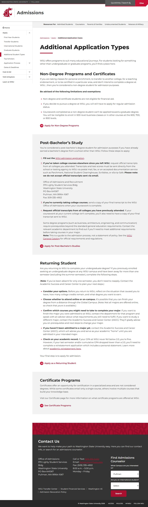
</a>
<br />✅ <code>/apply/additional-application-types/</code>
</td>
</tr>
<tr>
<td align="center" width="33%">
<a href="apply_admissions-dates-deadlines/report.md">
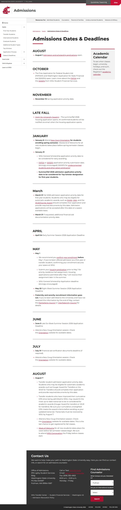
</a>
<br />✅ <code>/apply/admissions-dates-deadlines/</code>
</td>
<td align="center" width="33%">
<a href="apply_application-process/report.md">
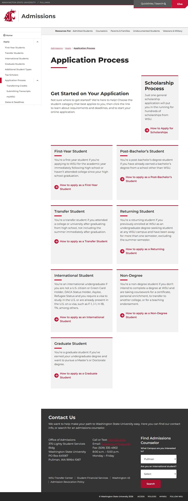
</a>
<br />✅ <code>/apply/application-process/</code>
</td>
<td align="center" width="33%">
<a href="apply_application-process_mywsu/report.md">
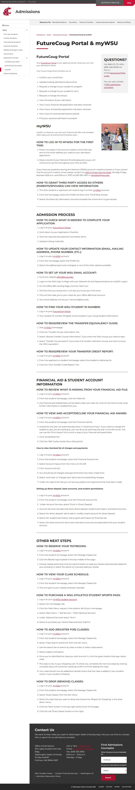
</a>
<br />✅ <code>/apply/application-process/mywsu/</code>
</td>
</tr>
<tr>
<td align="center" width="33%">
<a href="apply_application-process_transcripts/report.md">
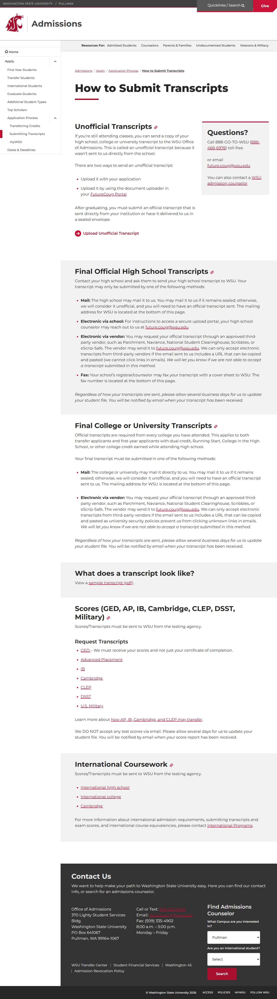
</a>
<br />✅ <code>/apply/application-process/transcripts/</code>
</td>
<td align="center" width="33%">
<a href="apply_application-process_transferring-credits/report.md">
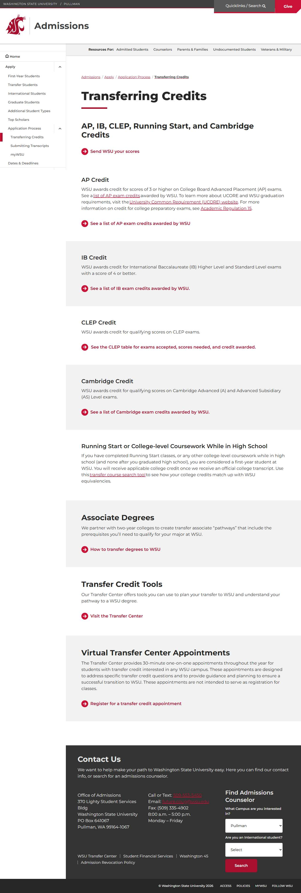
</a>
<br />✅ <code>/apply/application-process/transferring-credits/</code>
</td>
<td align="center" width="33%">
<a href="apply_as_find-your-application/report.md">
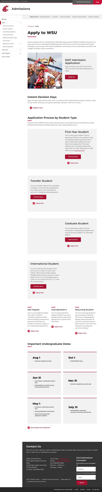
</a>
<br />✅ <code>/apply/as/find-your-application/</code>
</td>
</tr>
<tr>
<td align="center" width="33%">
<a href="apply_first-year-students/report.md">
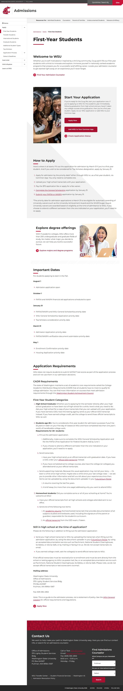
</a>
<br />✅ <code>/apply/first-year-students/</code>
</td>
<td align="center" width="33%">
<a href="apply_international-students/report.md">

</a>
<br />✅ <code>/apply/international-students/</code>
</td>
<td align="center" width="33%">
<a href="apply_transfer-students/report.md">
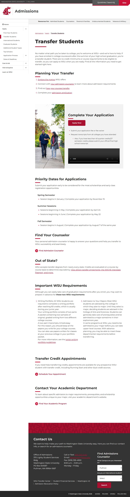
</a>
<br />✅ <code>/apply/transfer-students/</code>
</td>
</tr>
<tr>
<td align="center" width="33%">
<a href="contact/report.md">
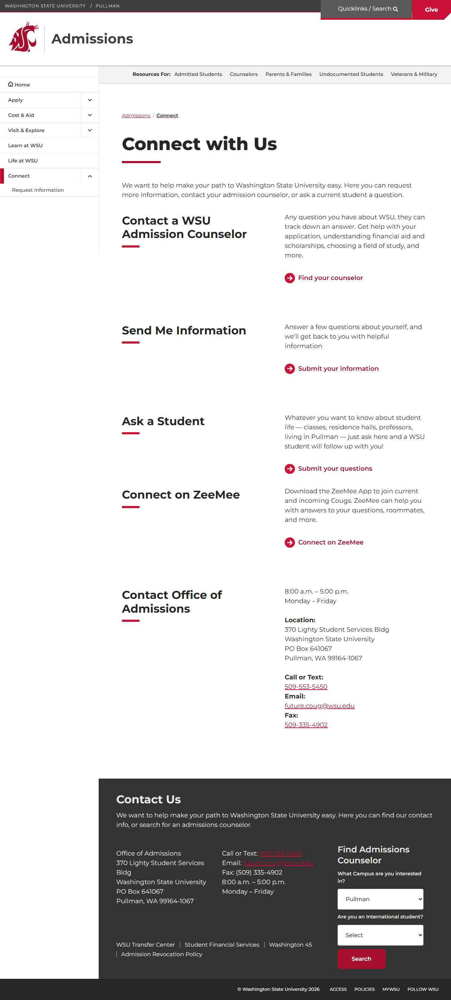
</a>
<br />✅ <code>/contact/</code>
</td>
<td align="center" width="33%">
<a href="cost/report.md">
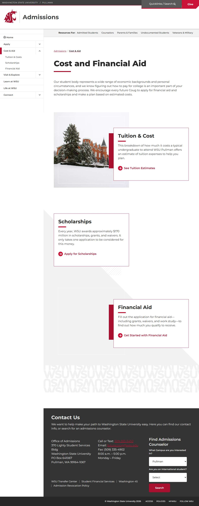
</a>
<br />✅ <code>/cost/</code>
</td>
<td align="center" width="33%">
<a href="cost_financial-aid/report.md">
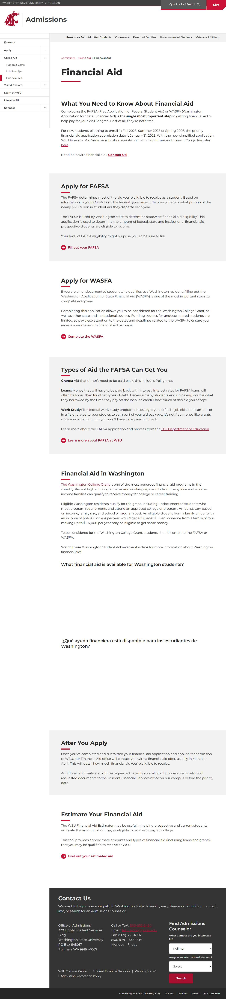
</a>
<br />✅ <code>/cost/financial-aid/</code>
</td>
</tr>
<tr>
<td align="center" width="33%">
<a href="cost_scholarships/report.md">
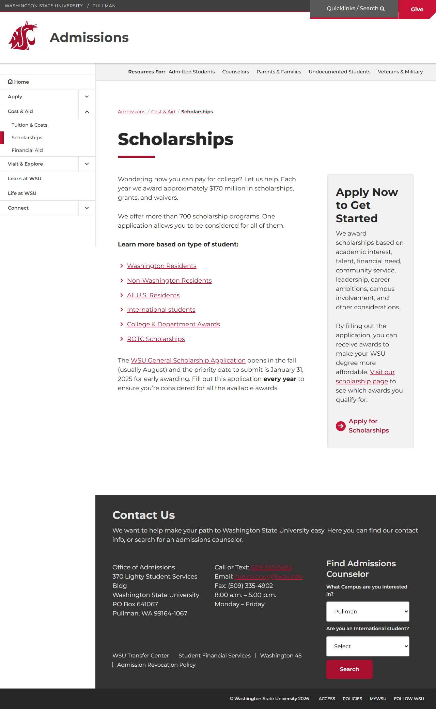
</a>
<br />✅ <code>/cost/scholarships/</code>
</td>
<td align="center" width="33%">
<a href="cost_tuition/report.md">
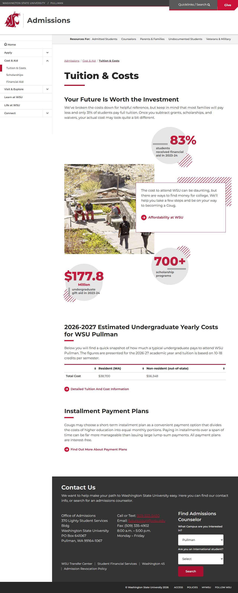
</a>
<br />✅ <code>/cost/tuition/</code>
</td>
<td align="center" width="33%">
<a href="international/report.md">
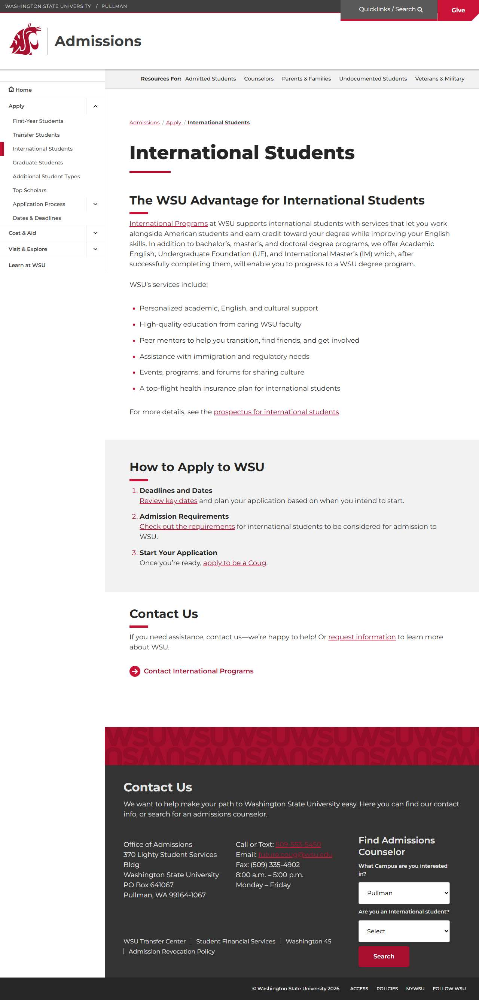
</a>
<br />✅ <code>/international/</code>
</td>
</tr>
<tr>
<td align="center" width="33%">
<a href="top-scholars/report.md">
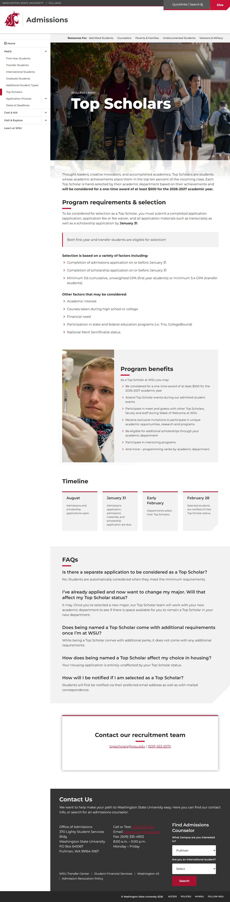
</a>
<br />✅ <code>/top-scholars/</code>
</td>
<td align="center" width="33%">
<a href="transfer/report.md">

</a>
<br />✅ <code>/transfer/</code>
</td>
<td align="center" width="33%">
<a href="visit/report.md">

</a>
<br />✅ <code>/visit/</code>
</td>
</tr>
</table>

## 🔴 JavaScript Errors

<details>
<summary><strong>6 error(s) across 2 page(s)</strong></summary>

**/** (5 errors)

```
Failed to load resource: net::ERR_TOO_MANY_REDIRECTS
Access to XMLHttpRequest at 'https://cdn.curator.io/5.0/curator.embed.css' from origin 'https://admission.wsu.edu' has been blocked by CORS policy: No 'Access-Control-Allow-Origin' header is present o...
Failed to load resource: net::ERR_FAILED
Access to XMLHttpRequest at 'https://cdn.curator.io/published-css/bb776265-563a-4123-a3a3-801c974cd238.css' from origin 'https://admission.wsu.edu' has been blocked by CORS policy: No 'Access-Control-...
Failed to load resource: net::ERR_FAILED
```

**/transfer/** (1 errors)

```
Failed to load resource: net::ERR_CONNECTION_FAILED
```

</details>

## ♿ Accessibility Summary

| Metric | Value |
|--------|-------|
| Pages with violations | 21/21 |
| Total violations | 199 |
| 🔴 Critical | 21 |
| 🟠 Serious | 174 |
| 🟡 Moderate | 4 |
| 🔵 Minor | 0 |

### Top 8 Issues

| # | Rule | Sev | Pages | Instances |
|--:|------|:---:|:-----:|:---------:|
| 1 | aria-allowed-attr | 🔴 | 21/21 | 21 |
| 2 | color-contrast | 🟠 | 21/21 | 42 |
| 3 | image-alt | 🟠 | 21/21 | 65 |
| 4 | label | 🟠 | 21/21 | 21 |
| 5 | link-name | 🟠 | 21/21 | 21 |
| 6 | button-name | 🟠 | 21/21 | 21 |
| 7 | frame-title | 🟠 | 2/21 | 4 |
| 8 | heading-order | 🟡 | 4/21 | 4 |

---

*Generated by AccessibilityScanner (FreeTools) v1.0*
