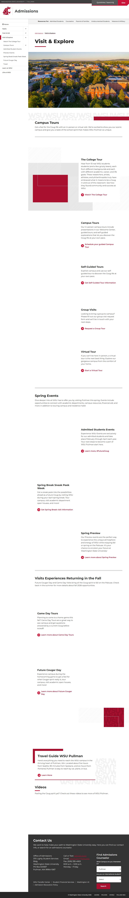

# 📄 Page Scan Report

> **URL:** https://admission.wsu.edu/visit/  
> **Captured:** 2026-02-18 18:37:50 UTC  
> **Status:** ✅ 200  

---

## 📑 Contents

- [Summary](#-summary)
- [Screenshots](#-screenshots)
- [Page Images](#-page-images)
- [Accessibility](#-accessibility)
- [Actions](#-actions)
- [Files](#-files)

---

## 📋 Summary

| Field | Value |
|-------|-------|
| URL | https://admission.wsu.edu/visit/ |
| Title | Visit & Explore | Admissions | Washington State University |
| Status | ✅ 200 |
| HTML Size | 109.4 KB |
| Screenshots | 1 (492.7 KB) |
| Images | 12 (referenced by URL) |
| Images Missing Alt | ⚠️ 3 |
| JS Errors | ✅ 0 |
| JS Warnings | 4 |
| A11y Violations | ⚠️ 11 |
| 🔴 Critical | 1 |
| 🟠 Serious | 10 |
| 🟡 Moderate | 0 |
| 🔵 Minor | 0 |
| Tools Run | axe, htmlcheck |
| Auth | none |
| Captured | 2026-02-18T18:37:50.6832127Z |

## 🔧 Actions

<strong>4 action(s) performed</strong>

- Screenshot #1: page-loaded (492.7 KB)
- Cataloged 12 images by URL (no download)
- axe-core: 5 violations (584ms)
- htmlcheck: 6 violations (0ms)

## 📸 Screenshots

<table>
<tr>
<td align="center" width="50%">

 <strong>1. page-loaded</strong>
 492.7 KB
</td>
<td></td>
</tr>
</table>

## 🖼️ Page Images (12)

<strong>📋 Image Index</strong> — 12 images (referenced by URL)

| # | Source URL | Alt Text |
|--:|-----------|----------|
| 1 | https://wpcdn.web.wsu.edu/wp-admission/uploads/sites/3144/2022/11/Summer2020D... | Summer aerials with a drone on the ca... |
| 2 | https://wpcdn.web.wsu.edu/wp-admission/uploads/sites/3144/2024/08/vlcsnap-202... | ⚠️ *(missing)* |
| 3 | https://wpcdn.web.wsu.edu/wp-admission/uploads/sites/3144/2024/08/Group-tour-... | Future WSU students and their familie... |
| 4 | https://wpcdn.web.wsu.edu/wp-admission/uploads/sites/3144/2024/08/Map-edited-... | Close up of two students looking at a... |
| 5 | https://wpcdn.web.wsu.edu/wp-admission/uploads/sites/3144/2023/11/tour-for-we... | campus tour in spring |
| 6 | https://wpcdn.web.wsu.edu/wp-admission/uploads/sites/3144/2024/08/computer-ed... | ⚠️ *(missing)* |
| 7 | https://wpcdn.web.wsu.edu/wp-admission/uploads/sites/3144/2024/08/FutureCoug-... | ⚠️ *(missing)* |
| 8 | https://wpcdn.web.wsu.edu/wp-admission/uploads/sites/3144/2024/09/Spring_2059... | Students take photos by the Cherry Tr... |
| 9 | https://wpcdn.web.wsu.edu/wp-admission/uploads/sites/3144/2025/07/Spring-Prev... | Visitors on tour on Glenn Terrell Mal... |
| 10 | https://wpcdn.web.wsu.edu/wp-admission/uploads/sites/3144/2025/07/FootballCro... | Crowd cheering in Martin Stadium |
| 11 | https://wpcdn.web.wsu.edu/wp-admission/uploads/sites/3144/2025/07/Cougs-Run-O... | Aerial view of Gesa field with firewo... |
| 12 | https://wpcdn.web.wsu.edu/wp-admission/uploads/sites/3144/2024/10/Pullman-Roa... | Sign pointing to turn for Pullman on ... |

<strong>🖼️ Gallery</strong>

<table>
<tr>
<td align="center" width="33%">

 https://wpcdn.web.wsu.edu/wp-admission/uploads/...
</td>
<td align="center" width="33%">

 https://wpcdn.web.wsu.edu/wp-admission/uploads/... ⚠️
</td>
<td align="center" width="33%">

 https://wpcdn.web.wsu.edu/wp-admission/uploads/...
</td>
</tr>
<tr>
<td align="center" width="33%">

 https://wpcdn.web.wsu.edu/wp-admission/uploads/...
</td>
<td align="center" width="33%">

 https://wpcdn.web.wsu.edu/wp-admission/uploads/...
</td>
<td align="center" width="33%">

 https://wpcdn.web.wsu.edu/wp-admission/uploads/... ⚠️
</td>
</tr>
<tr>
<td align="center" width="33%">

 https://wpcdn.web.wsu.edu/wp-admission/uploads/... ⚠️
</td>
<td align="center" width="33%">

 https://wpcdn.web.wsu.edu/wp-admission/uploads/...
</td>
<td align="center" width="33%">

 https://wpcdn.web.wsu.edu/wp-admission/uploads/...
</td>
</tr>
<tr>
<td align="center" width="33%">

 https://wpcdn.web.wsu.edu/wp-admission/uploads/...
</td>
<td align="center" width="33%">

 https://wpcdn.web.wsu.edu/wp-admission/uploads/...
</td>
<td align="center" width="33%">

 https://wpcdn.web.wsu.edu/wp-admission/uploads/...
</td>
</tr>
</table>

⚠️ <strong>Images Missing Alt Text</strong> (3)

| # | Source URL |
|--:|-----------|
| 1 | https://wpcdn.web.wsu.edu/wp-admission/uploads/sites/3144/2024/08/vlcsnap-202... |
| 2 | https://wpcdn.web.wsu.edu/wp-admission/uploads/sites/3144/2024/08/computer-ed... |
| 3 | https://wpcdn.web.wsu.edu/wp-admission/uploads/sites/3144/2024/08/FutureCoug-... |

## ♿ Accessibility

### Summary

| Severity | axe | htmlcheck |
|----------|:---:|:---:|
| 🔴 critical | 1 | 0 |
| 🟠 serious | 4 | 6 |
| 🟡 moderate | 0 | 0 |
| 🔵 minor | 0 | 0 |
| **Total** | **5** | **6** |

### Violations by Confidence

<strong>7 rule(s) violated</strong>

| # | Rule | Sev | Confidence | axe | htmlcheck | Example |
|--:|------|:---:|:----------:|:---:|:---:|---------|
| 1 | aria-allowed-attr | 🔴 | 🟢 1/1 | ⚠️ | — | `
509-553-5450</a>` |
| 3 | image-alt | 🟠 | 🟡 1/2 | ✅ | ⚠️ | `

> **Note:** Automated scanning catches ~30-60% of WCAG issues. Manual keyboard and screen reader testing is still required for full compliance.

## 📁 Files

| File | Description |
|------|-------------|
| `01-page-loaded.jpg` | page-loaded (492.7 KB) |
| `page.html` | Rendered HTML content |
| `metadata.json` | Machine-readable scan data |
| `errors.log` | JavaScript console errors |
| `warnings.log` | JavaScript console warnings |
| `info.log` | Navigation and timing details |
| `actions.log` | Interactions performed |
| `a11y-axe.json` | axe accessibility results |
| `a11y-htmlcheck.json` | htmlcheck accessibility results |
| `a11y-summary.json` | Merged cross-tool accessibility summary |

---

*Generated by AccessibilityScanner (FreeTools) v1.0*
