# 📄 Page Scan Report

> **URL:** https://admission.wsu.edu/visit/  
> **Captured:** 2026-02-16 22:10:36 UTC  
> **Status:** ✅ 200  

---

## 📑 Contents

- [Summary](#-summary)
- [Screenshots](#-screenshots)
- [Page Images](#-page-images)
- [Actions](#-actions)
- [Files](#-files)

---

## 📋 Summary

| Field | Value |
|-------|-------|
| URL | https://admission.wsu.edu/visit/ |
| Title | Visit & Explore | Admissions | Washington State University |
| Status | ✅ 200 |
| HTML Size | 109.4 KB |
| Screenshots | 1 (1.5 MB) |
| Images | 12 (3.3 MB) |
| Images Missing Alt | ⚠️ 3 |
| JS Errors | ✅ 0 |
| JS Warnings | 2 |
| Auth | none |
| Captured | 2026-02-16T22:10:36.2790476Z |

## 🔧 Actions

<strong>2 action(s) performed</strong>

- Screenshot #1: page-loaded (1.5 MB)
- Downloaded 12 images to /images/

## 📸 Screenshots

<table>
<tr>
<td align="center" width="50%">

 <strong>1. page-loaded</strong>
 1.5 MB
</td>
<td></td>
</tr>
</table>

## 🖼️ Page Images (12)

<strong>📋 Image Index</strong> — 12 images, 3.3 MB

| # | Image | Alt Text | Size |
|--:|-------|----------|-----:|
| 1 | [Summer2020DroneAerialThompsonCore_0920-1900x1068-1.jpg](images/Summer2020DroneAerialThompsonCore_0920-1900x1068-1.jpg) | Summer aerials with a drone on the ca... | 604.8 KB |
| 2 | [vlcsnap-2024-08-14-08h45m34s225-edited-1.png](images/vlcsnap-2024-08-14-08h45m34s225-edited-1.png) | ⚠️ *(missing)* | 698.7 KB |
| 3 | [Group-tour-cut-edited-792x594.jpg](images/Group-tour-cut-edited-792x594.jpg) | Future WSU students and their familie... | 120.7 KB |
| 4 | [Map-edited-792x594.jpg](images/Map-edited-792x594.jpg) | Close up of two students looking at a... | 124.8 KB |
| 5 | [tour-for-web.jpg](images/tour-for-web.jpg) | campus tour in spring | 111.1 KB |
| 6 | [computer-edited-792x594.jpg](images/computer-edited-792x594.jpg) | ⚠️ *(missing)* | 85.2 KB |
| 7 | [FutureCoug-Square-edited-792x594.jpg](images/FutureCoug-Square-edited-792x594.jpg) | ⚠️ *(missing)* | 98.1 KB |
| 8 | [Spring_2059-792x528.jpg](images/Spring_2059-792x528.jpg) | Students take photos by the Cherry Tr... | 141.6 KB |
| 9 | [Spring-Preview-Tour.jpg](images/Spring-Preview-Tour.jpg) | Visitors on tour on Glenn Terrell Mal... | 197.2 KB |
| 10 | [FootballCrowd.jpg](images/FootballCrowd.jpg) | Crowd cheering in Martin Stadium | 274.3 KB |
| 11 | [Cougs-Run-On_8846-792x529.jpg](images/Cougs-Run-On_8846-792x529.jpg) | Aerial view of Gesa field with firewo... | 188.4 KB |
| 12 | [Pullman-Road-Sign_4981-scaled.jpg](images/Pullman-Road-Sign_4981-scaled.jpg) | Sign pointing to turn for Pullman on ... | 703.1 KB |

<strong>🖼️ Gallery</strong>

<table>
<tr>
<td align="center" width="33%">
<a href="images/Summer2020DroneAerialThompsonCore_0920-1900x1068-1.jpg">
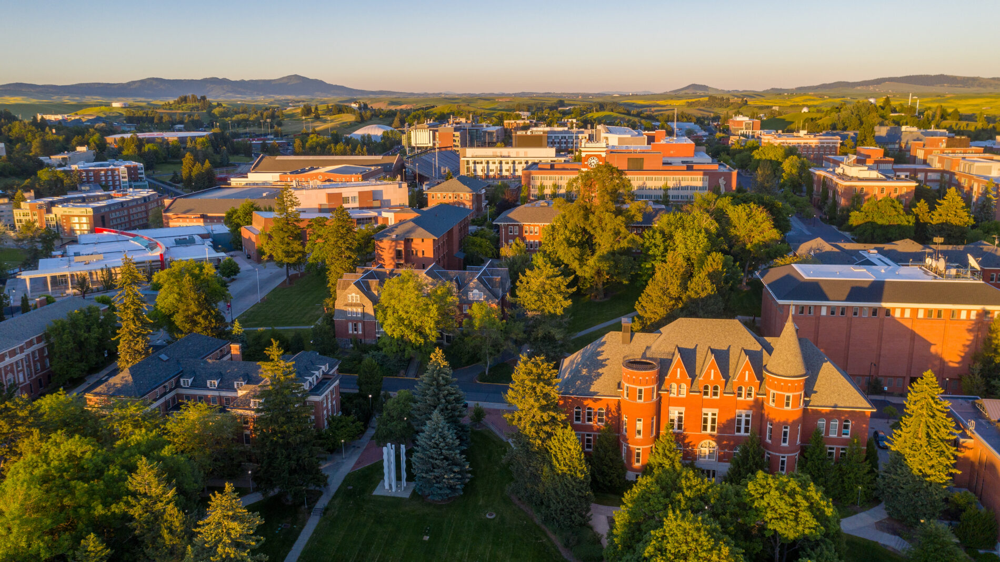
</a>
 Summer2020DroneAerialThompsonCore_0920-1900x1068-1.jpg
</td>
<td align="center" width="33%">
<a href="images/vlcsnap-2024-08-14-08h45m34s225-edited-1.png">
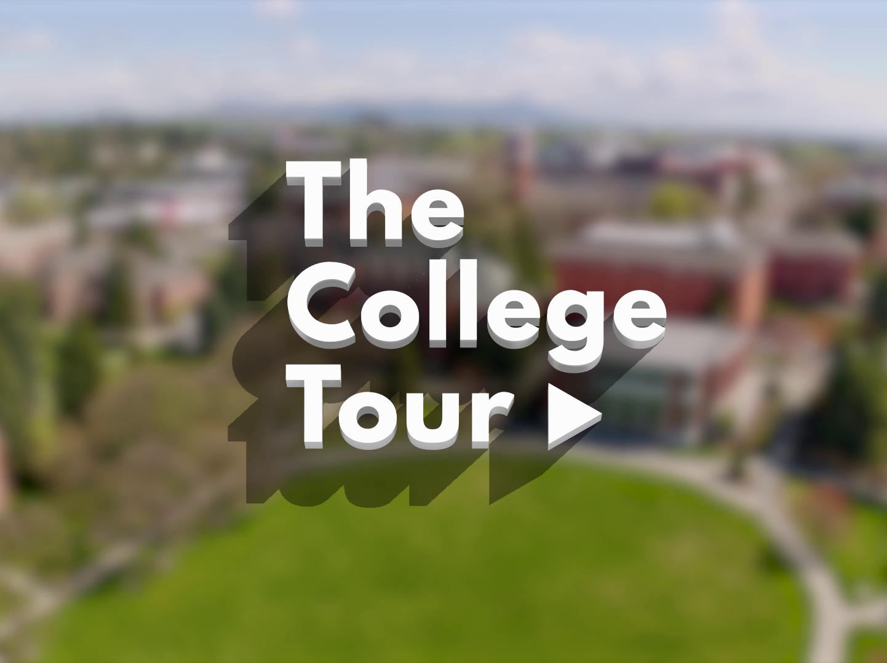
</a>
 vlcsnap-2024-08-14-08h45m34s225-edited-1.png ⚠️
</td>
<td align="center" width="33%">
<a href="images/Group-tour-cut-edited-792x594.jpg">
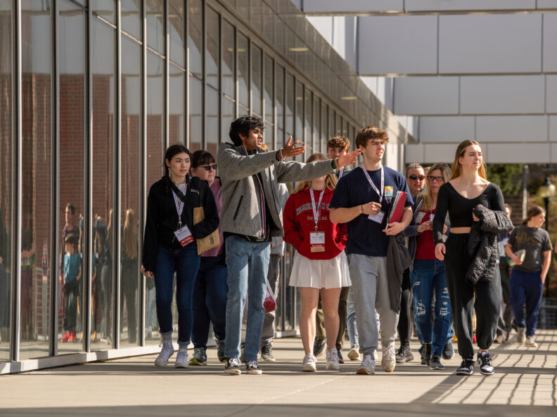
</a>
 Group-tour-cut-edited-792x594.jpg
</td>
</tr>
<tr>
<td align="center" width="33%">
<a href="images/Map-edited-792x594.jpg">
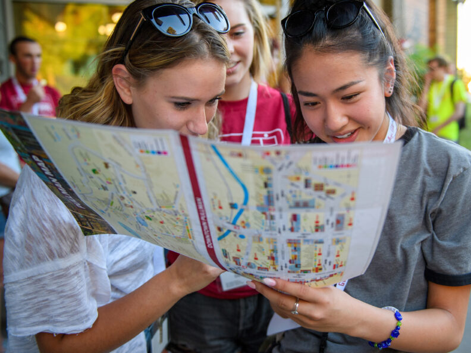
</a>
 Map-edited-792x594.jpg
</td>
<td align="center" width="33%">
<a href="images/tour-for-web.jpg">
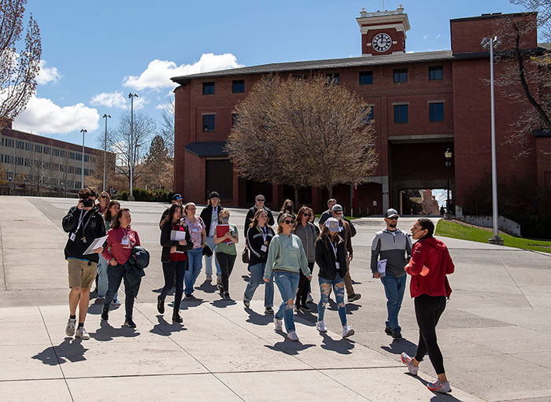
</a>
 tour-for-web.jpg
</td>
<td align="center" width="33%">
<a href="images/computer-edited-792x594.jpg">
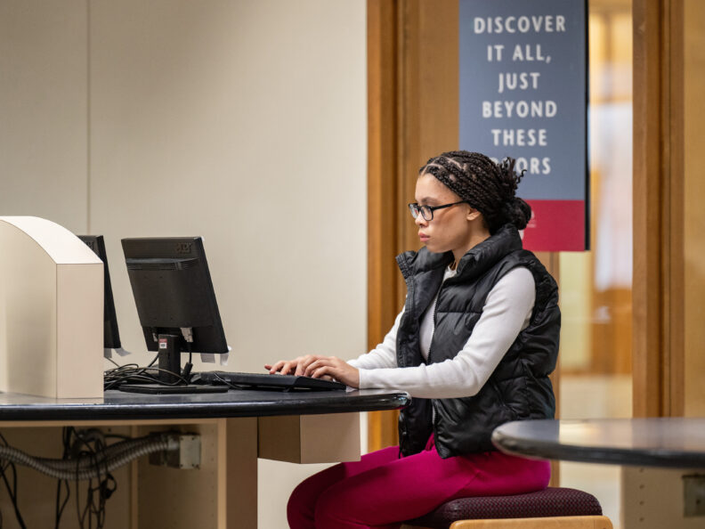
</a>
 computer-edited-792x594.jpg ⚠️
</td>
</tr>
<tr>
<td align="center" width="33%">
<a href="images/FutureCoug-Square-edited-792x594.jpg">
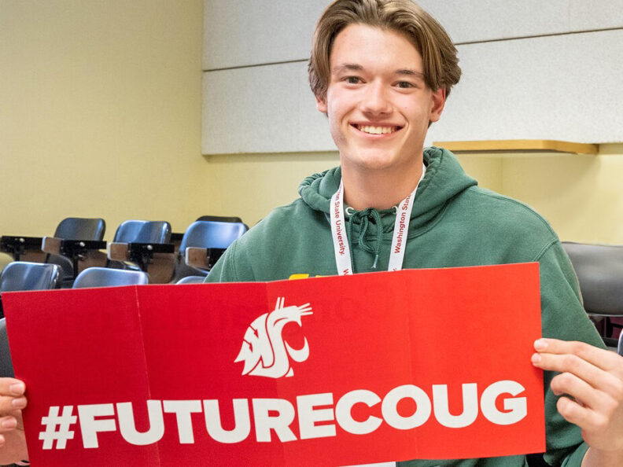
</a>
 FutureCoug-Square-edited-792x594.jpg ⚠️
</td>
<td align="center" width="33%">
<a href="images/Spring_2059-792x528.jpg">
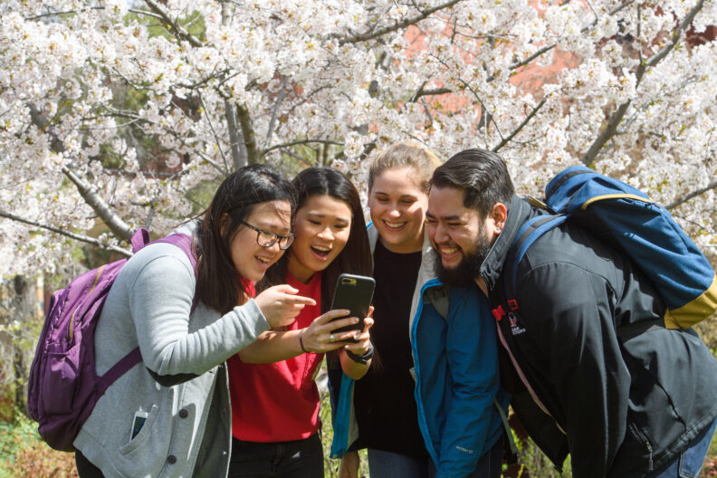
</a>
 Spring_2059-792x528.jpg
</td>
<td align="center" width="33%">
<a href="images/Spring-Preview-Tour.jpg">
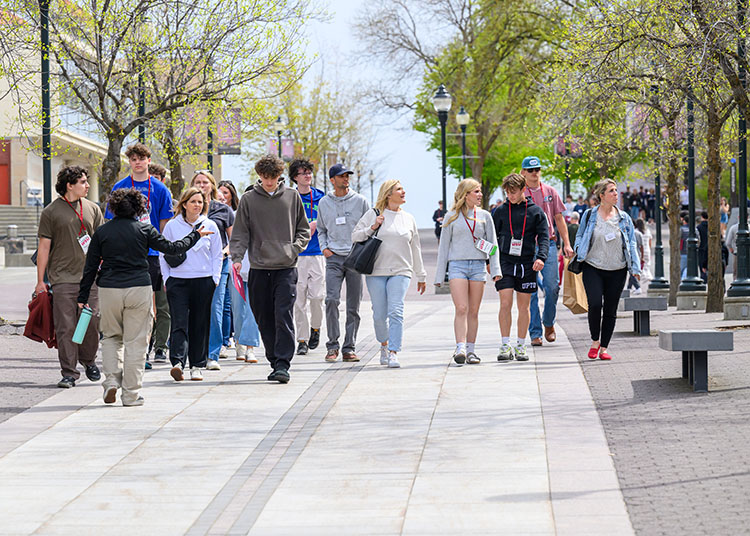
</a>
 Spring-Preview-Tour.jpg
</td>
</tr>
<tr>
<td align="center" width="33%">
<a href="images/FootballCrowd.jpg">
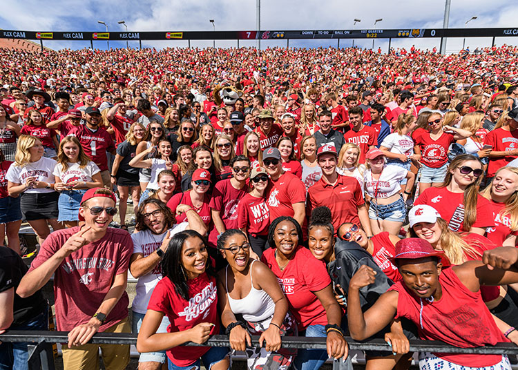
</a>
 FootballCrowd.jpg
</td>
<td align="center" width="33%">
<a href="images/Cougs-Run-On_8846-792x529.jpg">
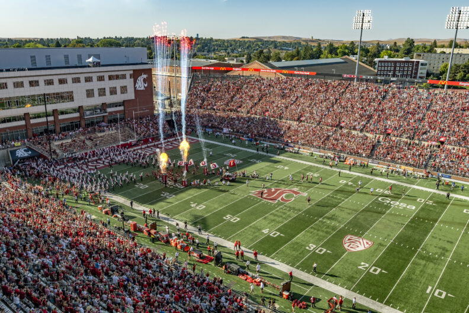
</a>
 Cougs-Run-On_8846-792x529.jpg
</td>
<td align="center" width="33%">
<a href="images/Pullman-Road-Sign_4981-scaled.jpg">
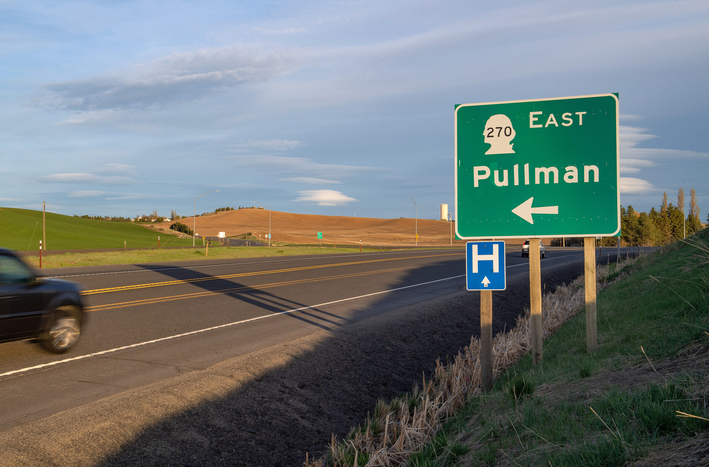
</a>
 Pullman-Road-Sign_4981-scaled.jpg
</td>
</tr>
</table>

⚠️ <strong>Images Missing Alt Text</strong> (3)

| Image | Source URL |
|-------|-----------|
| `vlcsnap-2024-08-14-08h45m34s225-edited-1.png` | https://wpcdn.web.wsu.edu/wp-admission/uploads/sites/3144/2024/08/vlcsnap-202... |
| `computer-edited-792x594.jpg` | https://wpcdn.web.wsu.edu/wp-admission/uploads/sites/3144/2024/08/computer-ed... |
| `FutureCoug-Square-edited-792x594.jpg` | https://wpcdn.web.wsu.edu/wp-admission/uploads/sites/3144/2024/08/FutureCoug-... |

## 📁 Files

| File | Description |
|------|-------------|
| `01-page-loaded.png` | page-loaded (1.5 MB) |
| `page.html` | Rendered HTML content |
| `metadata.json` | Machine-readable scan data |
| `errors.log` | JavaScript console errors |
| `warnings.log` | JavaScript console warnings |
| `info.log` | Navigation and timing details |
| `actions.log` | Interactions performed |
| `images/` | 12 page images (3.3 MB) |

---

*Generated by AccessibilityScanner (FreeTools) v1.0*
