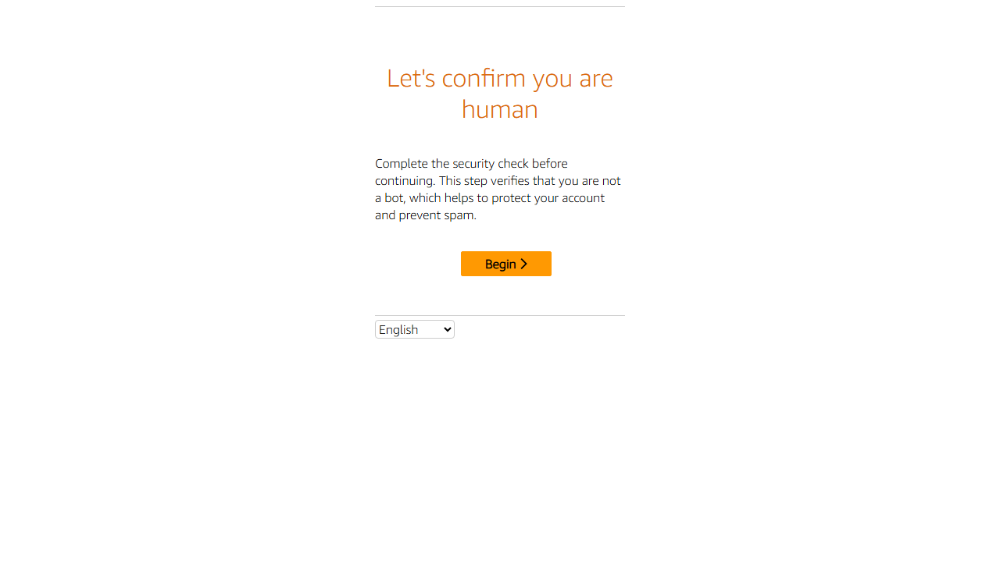
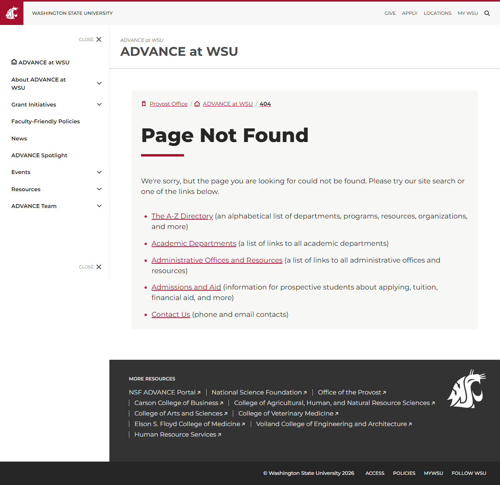

# Site Report: https://advance.wsu.edu/

| Metric | Value |
|--------|-------|
| Status | ⚠️ 0/6 pages OK |
| Pages Scanned | 6 |
| Pages Passed | 0 |
| Pages Failed | 6 |
| Total JS Errors | 6 |
| Total JS Warnings | 1 |
| Total HTML | 302.7 KB |
| Total Screenshots | 1.8 MB |
| Total Images | 5 (146.0 KB) |
| Images Missing Alt | 3 |
| Folder | `advance-wsu-edu/` |

## Pages

| Status | Page | HTTP | Title | JS Errors | Images | Missing Alt |
|--------|------|------|-------|-----------|--------|-------------|
| ❌ | [/](_root/report.md) | 0 | ADVANCE at WSU \| Washington State Un... | 2 | 1 | 0 |
| ❌ | [/about/](about/report.md) | 0 | About the Program \| ADVANCE at WSU \... | 0 | 1 | 1 |
| ❌ | [/data/](data/report.md) | 0 | Page not found \| ADVANCE at WSU \| W... | 1 | 0 | 0 |
| ❌ | [/events/](events/report.md) | 0 | Human Verification | 1 | 0 | 0 |
| ❌ | [/programs/](programs/report.md) | 0 | Page not found \| ADVANCE at WSU \| W... | 2 | 0 | 0 |
| ❌ | [/resources/](resources/report.md) | 0 | Resources \| ADVANCE at WSU \| Washin... | 0 | 3 | 2 |

## Page Screenshots

### [/](_root/report.md)

### [/about/](about/report.md)

### [/data/](data/report.md)

### [/events/](events/report.md)

### [/programs/](programs/report.md)

### [/resources/](resources/report.md)

## Failed Pages

### /

- **URL:** https://advance.wsu.edu/
- **Status:** 0

### /about/

- **URL:** https://advance.wsu.edu/about/
- **Status:** 0

### /programs/

- **URL:** https://advance.wsu.edu/programs/
- **Status:** 0

### /resources/

- **URL:** https://advance.wsu.edu/resources/
- **Status:** 0

### /events/

- **URL:** https://advance.wsu.edu/events/
- **Status:** 0

### /data/

- **URL:** https://advance.wsu.edu/data/
- **Status:** 0

## Pages with JavaScript Errors

### / (2 errors)

- `Failed to load resource: net::ERR_SOCKET_NOT_CONNECTED`
- `Failed to load resource: net::ERR_SOCKET_NOT_CONNECTED`

### /programs/ (2 errors)

- `Failed to load resource: the server responded with a status of 404 ()`
- `Failed to load resource: net::ERR_SOCKET_NOT_CONNECTED`

### /events/ (1 errors)

- `Failed to load resource: the server responded with a status of 405 ()`

### /data/ (1 errors)

- `Failed to load resource: the server responded with a status of 404 ()`

---

*Generated by AccessibilityScanner (FreeTools) v1.0*
