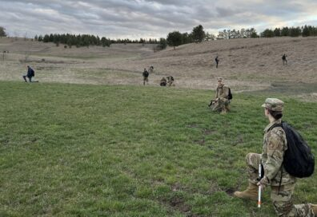
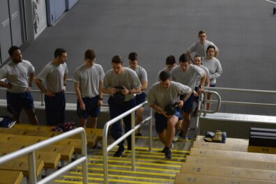

# Page Scan Report

| Field | Value |
|-------|-------|
| URL | https://afrotc.wsu.edu/about/ |
| Title | About AFROTC | Air Force ROTC | Washington State University |
| Status | ❌ 0 |
| HTML Size | 61.9 KB |
| Screenshots | 1 (1.2 MB) |
| Images | 2 (46.1 KB) |
| Images Missing Alt | 2 |
| JS Errors | 0 |
| JS Warnings | 0 |
| Auth | none |
| Captured | 2026-02-16T20:37:42.7047586Z |

## Actions

- Screenshot #1: page-loaded (1.2 MB)
- Downloaded 2 images to /images/

## Screenshots

### 1. page-loaded

## Page Images (2)

| # | Image | Alt Text | Size |
|---|-------|----------|------|
| 1 | [llab4-edit-1-396x272.jpg](images/llab4-edit-1-396x272.jpg) | *(none)* | 26.1 KB |
| 2 | [PT-1-396x264.jpeg](images/PT-1-396x264.jpeg) | *(none)* | 20.0 KB |

### Gallery

### ⚠️ Images Missing Alt Text (2)

- `llab4-edit-1-396x272.jpg` — https://wpcdn.web.wsu.edu/wp-wpsites/uploads/sites/1823/2025/03/llab4-edit-1-396x272.jpg
- `PT-1-396x264.jpeg` — https://wpcdn.web.wsu.edu/wp-wpsites/uploads/sites/1823/2025/03/PT-1-396x264.jpeg

## Files

- `01-page-loaded.png` — page-loaded (1.2 MB)
- `page.html` — rendered HTML content
- `metadata.json` — machine-readable scan data
- `errors.log` — JavaScript console errors
- `warnings.log` — JavaScript console warnings
- `info.log` — navigation and timing details
- `actions.log` — interactions performed on the page
- `images/` — 2 page images (46.1 KB)
