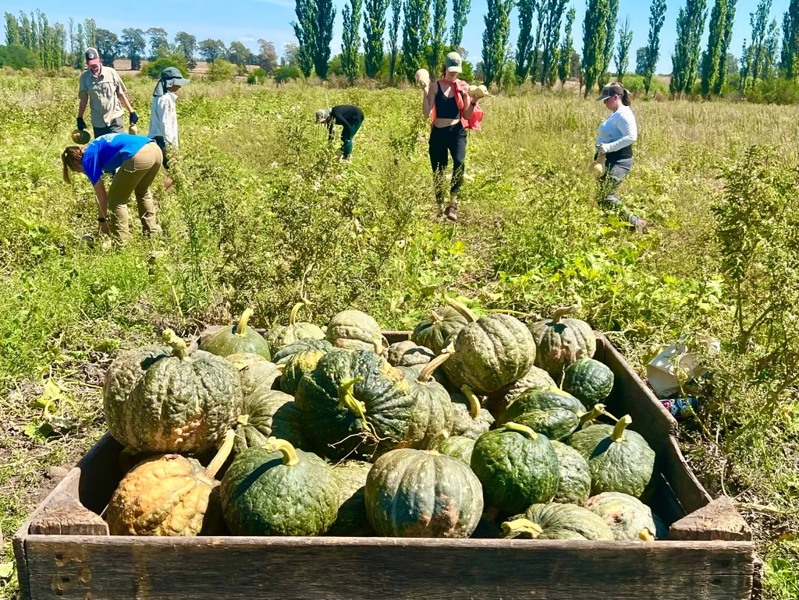
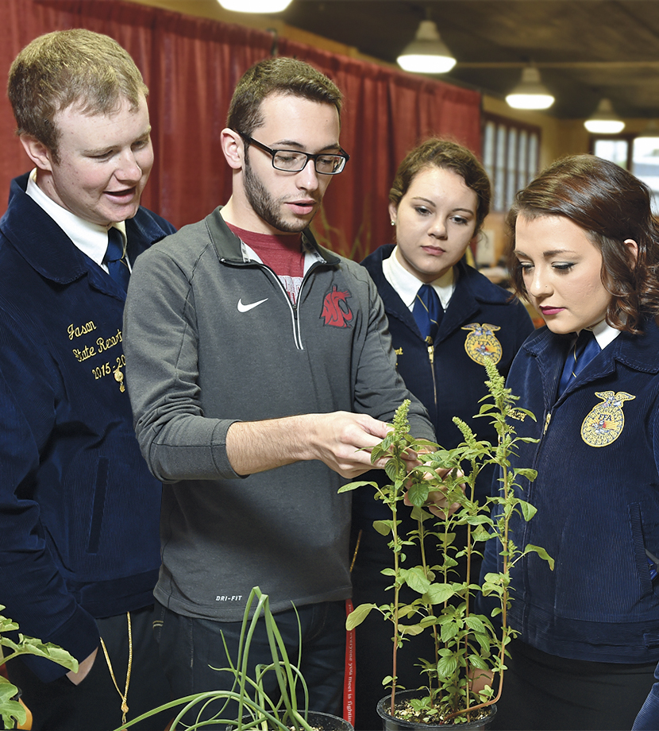
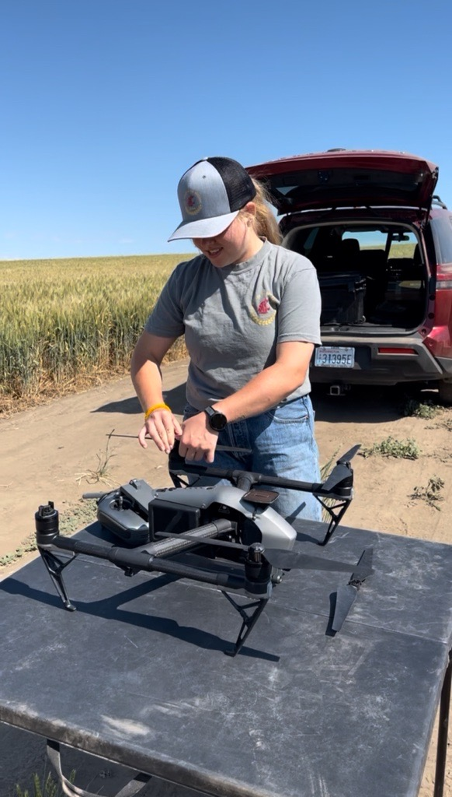
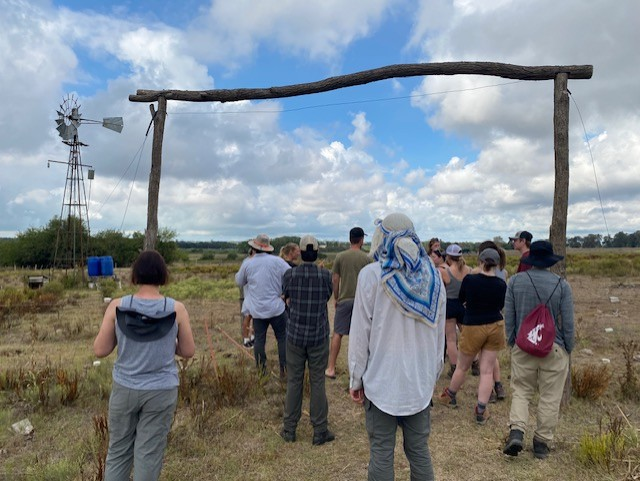
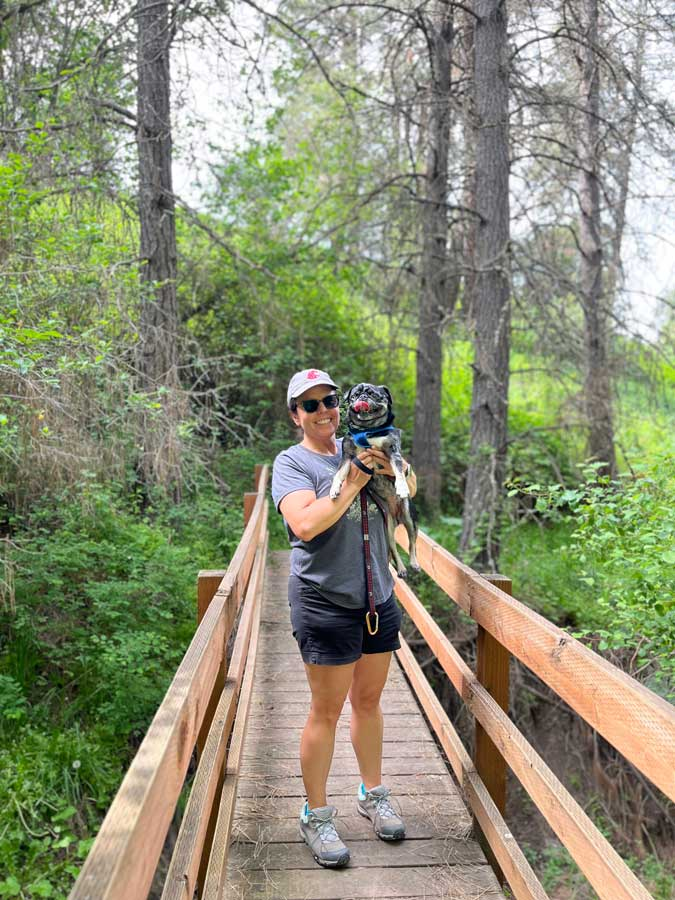

# Page Scan Report

| Field | Value |
|-------|-------|
| URL | https://afs.wsu.edu/ |
| Title | Agricultural and Food Systems | Washington State University |
| Status | ❌ 0 |
| HTML Size | 61.6 KB |
| Screenshots | 1 (980.1 KB) |
| Images | 9 (2.0 MB) |
| Images Missing Alt | 9 |
| JS Errors | 0 |
| JS Warnings | 0 |
| Auth | none |
| Captured | 2026-02-16T20:58:42.4241867Z |

## Actions

- Screenshot #1: page-loaded (980.1 KB)
- Downloaded 9 images to /images/

## Screenshots

### 1. page-loaded

## Page Images (9)

| # | Image | Alt Text | Size |
|---|-------|----------|------|
| 1 | [20230415_124327_7C2260.jpg](images/20230415_124327_7C2260.jpg) | *(none)* | 507.4 KB |
| 2 | [Ag-ed-cover.jpg](images/Ag-ed-cover.jpg) | *(none)* | 723.4 KB |
| 3 | [Image-24.jpg](images/Image-24.jpg) | *(none)* | 149.0 KB |
| 4 | [thumbnail_IMG_6181.jpg](images/thumbnail_IMG_6181.jpg) | *(none)* | 90.8 KB |
| 5 | [Colette-Casavant.jpg](images/Colette-Casavant.jpg) | *(none)* | 111.7 KB |
| 6 | [Shanna-Hiscock-1-768x768-1.jpg](images/Shanna-Hiscock-1-768x768-1.jpg) | *(none)* | 49.9 KB |
| 7 | [Tadd-Wheeler-300x281-1.jpg](images/Tadd-Wheeler-300x281-1.jpg) | *(none)* | 12.6 KB |
| 8 | [Image-12.jpg](images/Image-12.jpg) | *(none)* | 345.4 KB |
| 9 | [Warner-Headshot-259x300-1.jpg](images/Warner-Headshot-259x300-1.jpg) | *(none)* | 13.1 KB |

### Gallery

### ⚠️ Images Missing Alt Text (9)

- `20230415_124327_7C2260.jpg` — https://wpcdn.web.wsu.edu/cahnrs/uploads/sites/23/20230415_124327_7C2260.jpg
- `Ag-ed-cover.jpg` — https://wpcdn.web.wsu.edu/cahnrs/uploads/sites/23/Ag-ed-cover.jpg
- `Image-24.jpg` — https://wpcdn.web.wsu.edu/cahnrs/uploads/sites/23/2025/10/Image-24.jpg
- `thumbnail_IMG_6181.jpg` — https://wpcdn.web.wsu.edu/cahnrs/uploads/sites/23/2025/10/thumbnail_IMG_6181.jpg
- `Colette-Casavant.jpg` — https://wpcdn.web.wsu.edu/cahnrs/uploads/sites/23/2025/10/Colette-Casavant.jpg
- `Shanna-Hiscock-1-768x768-1.jpg` — https://wpcdn.web.wsu.edu/cahnrs/uploads/sites/23/2025/10/Shanna-Hiscock-1-768x768-1.jpg
- `Tadd-Wheeler-300x281-1.jpg` — https://wpcdn.web.wsu.edu/cahnrs/uploads/sites/23/2025/10/Tadd-Wheeler-300x281-1.jpg
- `Image-12.jpg` — https://wpcdn.web.wsu.edu/cahnrs/uploads/sites/23/2025/10/Image-12.jpg
- `Warner-Headshot-259x300-1.jpg` — https://wpcdn.web.wsu.edu/cahnrs/uploads/sites/23/2025/10/Warner-Headshot-259x300-1.jpg

## Files

- `01-page-loaded.png` — page-loaded (980.1 KB)
- `page.html` — rendered HTML content
- `metadata.json` — machine-readable scan data
- `errors.log` — JavaScript console errors
- `warnings.log` — JavaScript console warnings
- `info.log` — navigation and timing details
- `actions.log` — interactions performed on the page
- `images/` — 9 page images (2.0 MB)
