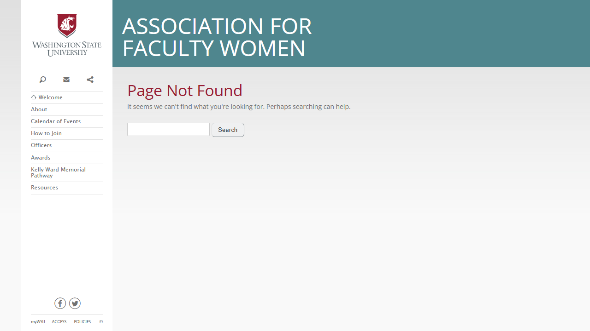
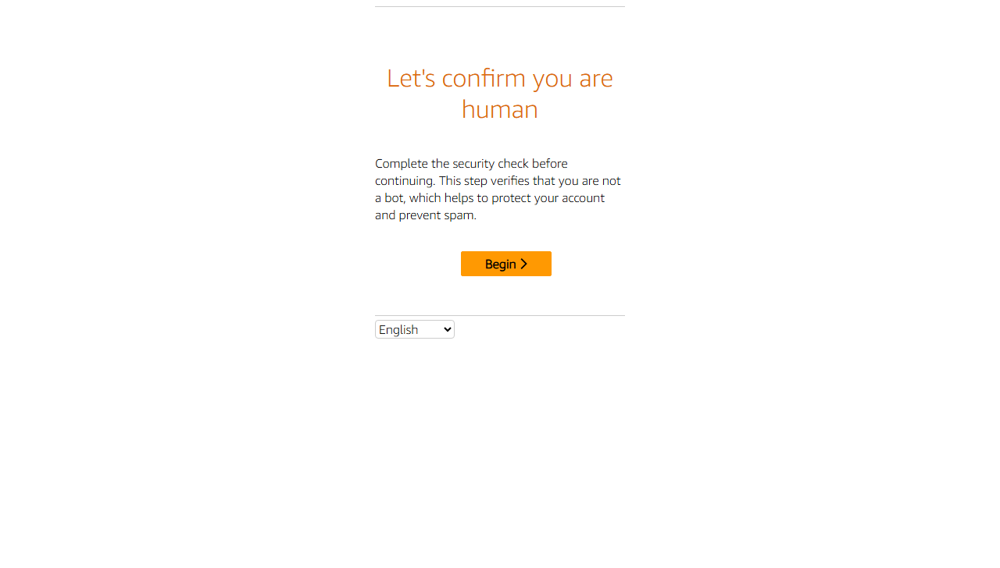
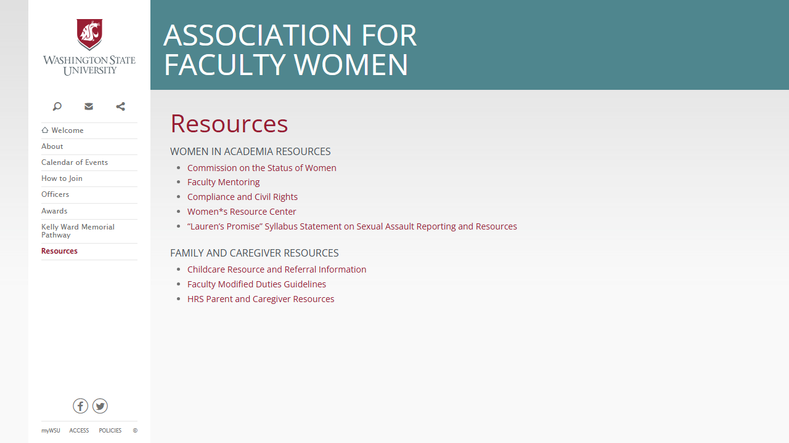

# Site Report: https://afw.wsu.edu/

| Metric | Value |
|--------|-------|
| Status | ⚠️ 0/6 pages OK |
| Pages Scanned | 6 |
| Pages Passed | 0 |
| Pages Failed | 6 |
| Total JS Errors | 4 |
| Total JS Warnings | 2 |
| Total HTML | 209.6 KB |
| Total Screenshots | 403.5 KB |
| Total Images | 0 (0 bytes) |
| Images Missing Alt | 0 |
| Folder | `afw-wsu-edu/` |

## Pages

| Status | Page | HTTP | Title | JS Errors | Images | Missing Alt |
|--------|------|------|-------|-----------|--------|-------------|
| ❌ | [/](_root/report.md) | 0 | Association for Faculty Women \| Wash... | 0 | 0 | 0 |
| ❌ | [/about/](about/report.md) | 0 | Page not found \| Association for Fac... | 1 | 0 | 0 |
| ❌ | [/contact/](contact/report.md) | 0 | Page not found \| Association for Fac... | 1 | 0 | 0 |
| ❌ | [/events/](events/report.md) | 405 | Human Verification | 1 | 0 | 0 |
| ❌ | [/membership/](membership/report.md) | 0 | Human Verification | 1 | 0 | 0 |
| ❌ | [/resources/](resources/report.md) | 0 | Resources \| Association for Faculty ... | 0 | 0 | 0 |

## Page Screenshots

### [/](_root/report.md)

### [/about/](about/report.md)

### [/contact/](contact/report.md)

### [/events/](events/report.md)

### [/membership/](membership/report.md)

### [/resources/](resources/report.md)

## Failed Pages

### /

- **URL:** https://afw.wsu.edu/
- **Status:** 0

### /about/

- **URL:** https://afw.wsu.edu/about/
- **Status:** 0

### /membership/

- **URL:** https://afw.wsu.edu/membership/
- **Status:** 0

### /events/

- **URL:** https://afw.wsu.edu/events/
- **Status:** 405

### /resources/

- **URL:** https://afw.wsu.edu/resources/
- **Status:** 0

### /contact/

- **URL:** https://afw.wsu.edu/contact/
- **Status:** 0

## Pages with JavaScript Errors

### /about/ (1 errors)

- `Failed to load resource: the server responded with a status of 404 ()`

### /membership/ (1 errors)

- `Failed to load resource: the server responded with a status of 405 ()`

### /events/ (1 errors)

- `Failed to load resource: the server responded with a status of 405 ()`

### /contact/ (1 errors)

- `Failed to load resource: the server responded with a status of 404 ()`

---

*Generated by AccessibilityScanner (FreeTools) v1.0*
