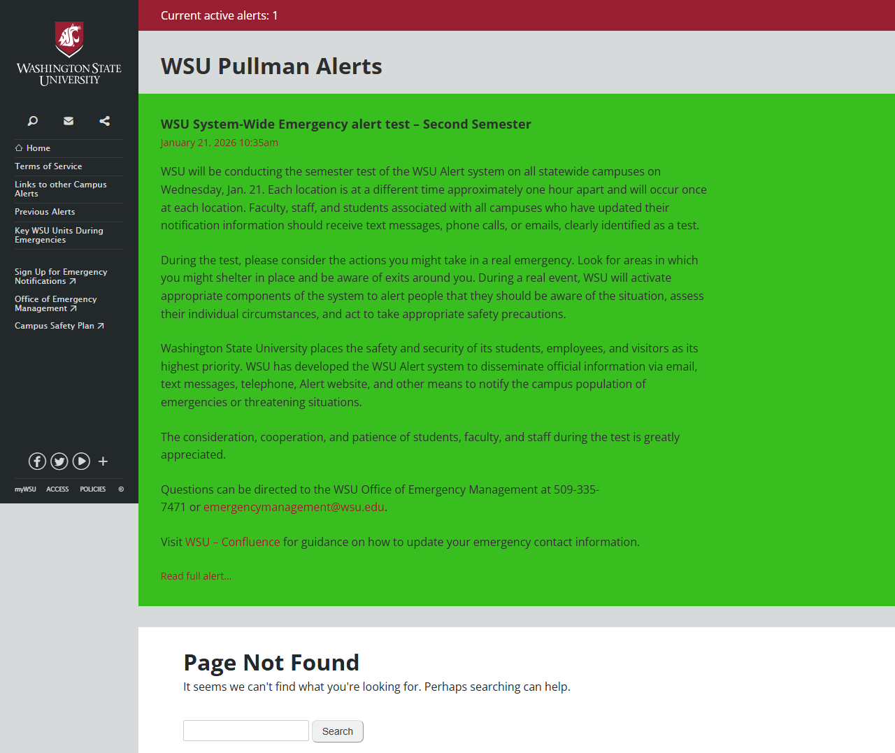

# Site Report: https://alert.wsu.edu/

| Metric | Value |
|--------|-------|
| Status | ⚠️ 1/5 pages OK |
| Pages Scanned | 5 |
| Pages Passed | 1 |
| Pages Failed | 4 |
| Total JS Errors | 5 |
| Total JS Warnings | 0 |
| Total HTML | 317.1 KB |
| Total Screenshots | 1004.9 KB |
| Folder | `alert-wsu-edu/` |

## Pages

| Status | Page | HTTP | Title | JS Errors | JS Warnings | Screenshots |
|--------|------|------|-------|-----------|-------------|-------------|
| ✅ | [/](_root/report.md) | 200 | Alert \| Washington State University | 1 | 0 | 1 |
| ❌ | [/emergency-info/](emergency-info/report.md) | 404 | Page not found \| Alert \| Washington... | 1 | 0 | 1 |
| ❌ | [/procedures/](procedures/report.md) | 404 | Page not found \| Alert \| Washington... | 1 | 0 | 1 |
| ❌ | [/resources/](resources/report.md) | 404 | Page not found \| Alert \| Washington... | 1 | 0 | 1 |
| ❌ | [/signup/](signup/report.md) | 404 | Page not found \| Alert \| Washington... | 1 | 0 | 1 |

## Page Screenshots

### [/](_root/report.md)

### [/emergency-info/](emergency-info/report.md)

### [/procedures/](procedures/report.md)

### [/resources/](resources/report.md)

### [/signup/](signup/report.md)

## Failed Pages

### /emergency-info/

- **URL:** https://alert.wsu.edu/emergency-info/
- **Status:** 404

### /signup/

- **URL:** https://alert.wsu.edu/signup/
- **Status:** 404

### /procedures/

- **URL:** https://alert.wsu.edu/procedures/
- **Status:** 404

### /resources/

- **URL:** https://alert.wsu.edu/resources/
- **Status:** 404

## Pages with JavaScript Errors

### / (1 errors)

- `Failed to load resource: net::ERR_SOCKET_NOT_CONNECTED`

### /emergency-info/ (1 errors)

- `Failed to load resource: the server responded with a status of 404 ()`

### /signup/ (1 errors)

- `Failed to load resource: the server responded with a status of 404 ()`

### /procedures/ (1 errors)

- `Failed to load resource: the server responded with a status of 404 ()`

### /resources/ (1 errors)

- `Failed to load resource: the server responded with a status of 404 ()`

---

*Generated by AccessibilityScanner (FreeTools) v1.0*
