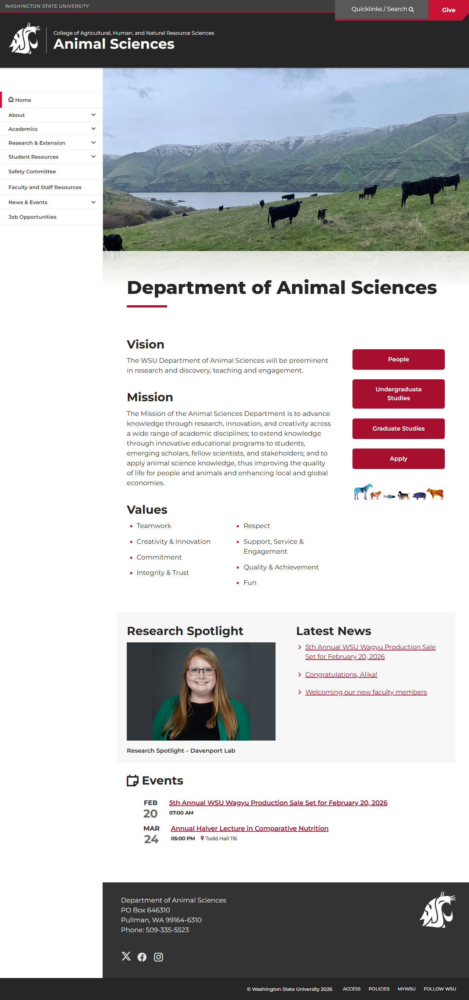
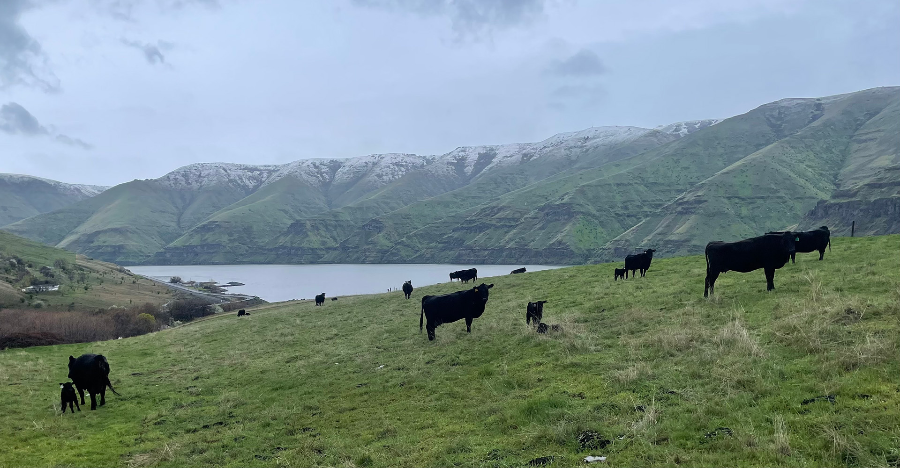
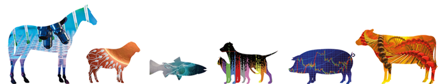

# Page Scan Report

| Field | Value |
|-------|-------|
| URL | https://ansci.wsu.edu/ |
| Title | Animal Sciences | Washington State University |
| Status | ❌ 0 |
| HTML Size | 205.8 KB |
| Screenshots | 1 (1.0 MB) |
| Images | 3 (657.9 KB) |
| Images Missing Alt | 1 |
| JS Errors | 0 |
| JS Warnings | 0 |
| Auth | none |
| Captured | 2026-02-16T20:58:42.4427779Z |

## Actions

- Screenshot #1: page-loaded (1.0 MB)
- Downloaded 3 images to /images/

## Screenshots

### 1. page-loaded

## Page Images (3)

| # | Image | Alt Text | Size |
|---|-------|----------|------|
| 1 | [IMG_5086_1920x1001.jpg](images/IMG_5086_1920x1001.jpg) | *(none)* | 519.1 KB |
| 2 | [Animal_logo_729px-1.png](images/Animal_logo_729px-1.png) | Animal icons | 104.8 KB |
| 3 | [Kimberly_Davenport-16x9-1-792x445.jpg](images/Kimberly_Davenport-16x9-1-792x445.jpg) | Kimberly Davenport | 34.0 KB |

### Gallery

### ⚠️ Images Missing Alt Text (1)

- `IMG_5086_1920x1001.jpg` — https://wpcdn.web.wsu.edu/wp-wpsites/uploads/sites/3004/2024/04/IMG_5086_1920x1001.jpg

## Files

- `01-page-loaded.png` — page-loaded (1.0 MB)
- `page.html` — rendered HTML content
- `metadata.json` — machine-readable scan data
- `errors.log` — JavaScript console errors
- `warnings.log` — JavaScript console warnings
- `info.log` — navigation and timing details
- `actions.log` — interactions performed on the page
- `images/` — 3 page images (657.9 KB)
