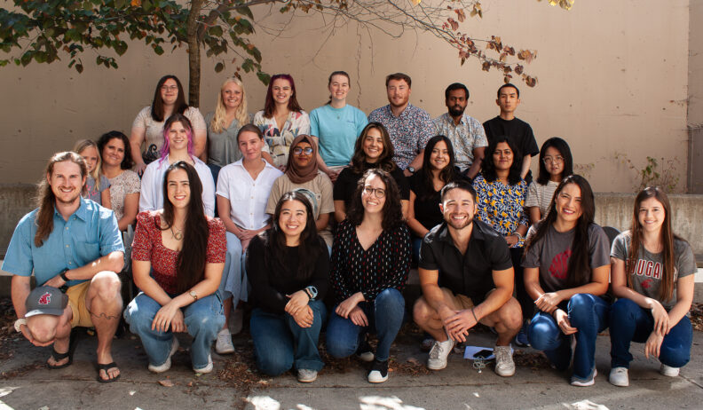

# Page Scan Report

| Field | Value |
|-------|-------|
| URL | https://ansci.wsu.edu/graduate/ |
| Title | Graduate Studies | Animal Sciences | Washington State University |
| Status | ❌ 0 |
| HTML Size | 212.1 KB |
| Screenshots | 1 (534.6 KB) |
| Images | 1 (140.0 KB) |
| Images Missing Alt | 1 |
| JS Errors | 3 |
| JS Warnings | 0 |
| Auth | none |
| Captured | 2026-02-16T20:38:29.0832415Z |

## JavaScript Errors

- `Failed to load resource: the server responded with a status of 405 ()`
- `Failed to load resource: net::ERR_SOCKET_NOT_CONNECTED`
- `Failed to load resource: net::ERR_CONNECTION_RESET`

## Actions

- Screenshot #1: page-loaded (534.6 KB)
- Downloaded 1 images to /images/

## Screenshots

### 1. page-loaded

## Page Images (1)

| # | Image | Alt Text | Size |
|---|-------|----------|------|
| 1 | [AS-Grad_Students_Fall_2023-792x462.jpg](images/AS-Grad_Students_Fall_2023-792x462.jpg) | *(none)* | 140.0 KB |

### Gallery

### ⚠️ Images Missing Alt Text (1)

- `AS-Grad_Students_Fall_2023-792x462.jpg` — https://wpcdn.web.wsu.edu/wp-wpsites/uploads/sites/3004/2023/08/AS-Grad_Students_Fall_2023-792x462.jpg

## Files

- `01-page-loaded.png` — page-loaded (534.6 KB)
- `page.html` — rendered HTML content
- `metadata.json` — machine-readable scan data
- `errors.log` — JavaScript console errors
- `warnings.log` — JavaScript console warnings
- `info.log` — navigation and timing details
- `actions.log` — interactions performed on the page
- `images/` — 1 page images (140.0 KB)
