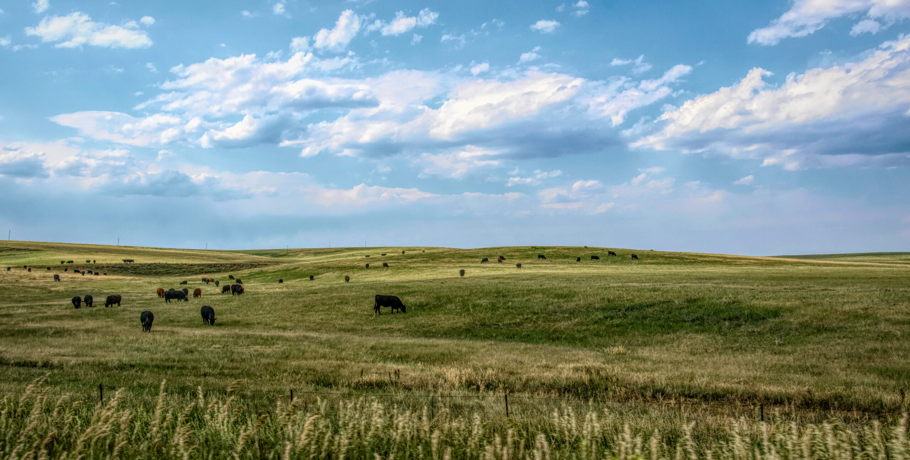
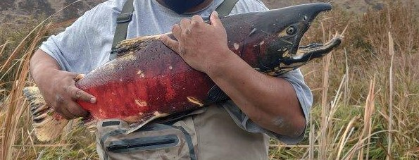
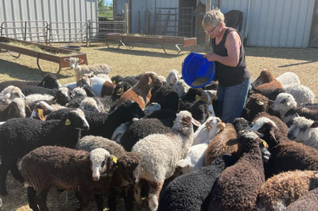
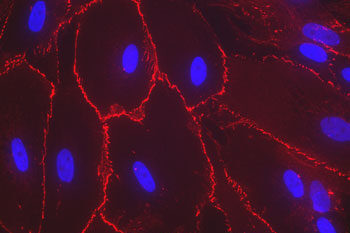
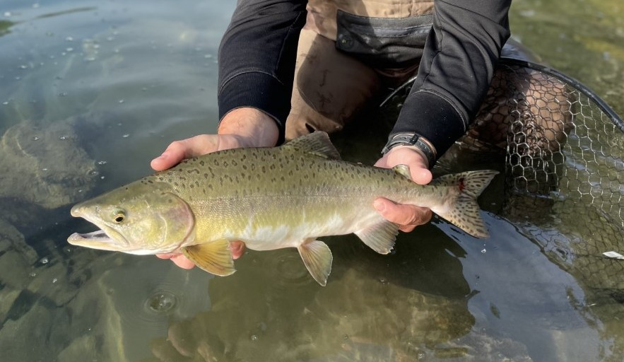

# 📄 Page Scan Report

> **URL:** https://ansci.wsu.edu/research/  
> **Captured:** 2026-02-16 22:11:58 UTC  
> **Status:** ✅ 200  

---

## 📑 Contents

- [Summary](#-summary)
- [Screenshots](#-screenshots)
- [Page Images](#-page-images)
- [Actions](#-actions)
- [Files](#-files)

---

## 📋 Summary

| Field | Value |
|-------|-------|
| URL | https://ansci.wsu.edu/research/ |
| Title | Research | Animal Sciences | Washington State University |
| Status | ✅ 200 |
| HTML Size | 225.5 KB |
| Screenshots | 1 (1.1 MB) |
| Images | 7 (1.2 MB) |
| Images Missing Alt | ⚠️ 1 |
| JS Errors | ✅ 0 |
| JS Warnings | 0 |
| Auth | none |
| Captured | 2026-02-16T22:11:58.2479706Z |

## 🔧 Actions

<strong>2 action(s) performed</strong>

- Screenshot #1: page-loaded (1.1 MB)
- Downloaded 7 images to /images/

## 📸 Screenshots

<table>
<tr>
<td align="center" width="50%">

 <strong>1. page-loaded</strong>
 1.1 MB
</td>
<td></td>
</tr>
</table>

## 🖼️ Page Images (7)

<strong>📋 Image Index</strong> — 7 images, 1.2 MB

| # | Image | Alt Text | Size |
|--:|-------|----------|-----:|
| 1 | [Research-scaled.jpeg](images/Research-scaled.jpeg) | Masked worker in lab with microscope ... | 195.9 KB |
| 2 | [CattleEnvironment-scaled.jpeg](images/CattleEnvironment-scaled.jpeg) | Fields and grazing herds of cattle | 581.1 KB |
| 3 | [AdobeStock_237602801-scaled.jpeg](images/AdobeStock_237602801-scaled.jpeg) | 3d render of dna structure, abstract ... | 191.8 KB |
| 4 | [Chinook-Male.jpeg](images/Chinook-Male.jpeg) | Chinook male | 83.0 KB |
| 5 | [Nancy_Irlbeck_with_sheep447x297.jpg](images/Nancy_Irlbeck_with_sheep447x297.jpg) | Nancy Irlbeck feeding sheep | 45.2 KB |
| 6 | [human_uterine_cells-e1612564734119.jpg](images/human_uterine_cells-e1612564734119.jpg) | human uterine cells | 20.3 KB |
| 7 | [Field-Sampling-Phelps-Lab-4b.jpg](images/Field-Sampling-Phelps-Lab-4b.jpg) | ⚠️ *(missing)* | 103.2 KB |

<strong>🖼️ Gallery</strong>

<table>
<tr>
<td align="center" width="33%">

 Research-scaled.jpeg
</td>
<td align="center" width="33%">

 CattleEnvironment-scaled.jpeg
</td>
<td align="center" width="33%">

 AdobeStock_237602801-scaled.jpeg
</td>
</tr>
<tr>
<td align="center" width="33%">

 Chinook-Male.jpeg
</td>
<td align="center" width="33%">

 Nancy_Irlbeck_with_sheep447x297.jpg
</td>
<td align="center" width="33%">

 human_uterine_cells-e1612564734119.jpg
</td>
</tr>
<tr>
<td align="center" width="33%">

 Field-Sampling-Phelps-Lab-4b.jpg ⚠️
</td>
<td></td>
<td></td>
</tr>
</table>

⚠️ <strong>Images Missing Alt Text</strong> (1)

| Image | Source URL |
|-------|-----------|
| `Field-Sampling-Phelps-Lab-4b.jpg` | https://wpcdn.web.wsu.edu/wp-wpsites/uploads/sites/3004/2025/05/Field-Samplin... |

## 📁 Files

| File | Description |
|------|-------------|
| `01-page-loaded.png` | page-loaded (1.1 MB) |
| `page.html` | Rendered HTML content |
| `metadata.json` | Machine-readable scan data |
| `errors.log` | JavaScript console errors |
| `warnings.log` | JavaScript console warnings |
| `info.log` | Navigation and timing details |
| `actions.log` | Interactions performed |
| `images/` | 7 page images (1.2 MB) |

---

*Generated by AccessibilityScanner (FreeTools) v1.0*
