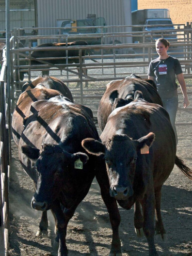
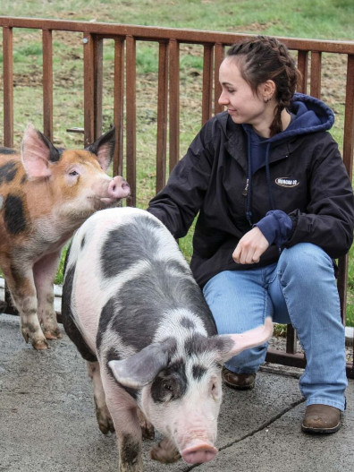
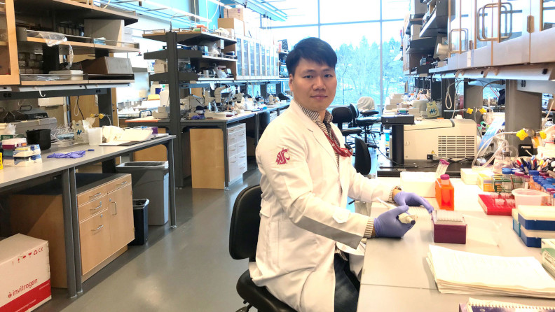

# Page Scan Report

| Field | Value |
|-------|-------|
| URL | https://ansci.wsu.edu/undergraduate/ |
| Title | Undergraduate Studies | Animal Sciences | Washington State University |
| Status | ❌ 0 |
| HTML Size | 216.2 KB |
| Screenshots | 1 (1.8 MB) |
| Images | 5 (458.1 KB) |
| Images Missing Alt | 2 |
| JS Errors | 1 |
| JS Warnings | 0 |
| Auth | none |
| Captured | 2026-02-16T20:38:04.0710156Z |

## JavaScript Errors

- `Failed to load resource: the server responded with a status of 405 ()`

## Actions

- Screenshot #1: page-loaded (1.8 MB)
- Downloaded 5 images to /images/

## Screenshots

### 1. page-loaded

## Page Images (5)

| # | Image | Alt Text | Size |
|---|-------|----------|------|
| 1 | [Hernandez_Square.jpg](images/Hernandez_Square.jpg) | *(none)* | 39.0 KB |
| 2 | [HunterLisaSquare.jpg](images/HunterLisaSquare.jpg) | *(none)* | 58.7 KB |
| 3 | [Student_with_cattle-396x528-2.jpg](images/Student_with_cattle-396x528-2.jpg) | Student with cattle | 102.4 KB |
| 4 | [Student_with_pigs-396x527-2.jpg](images/Student_with_pigs-396x527-2.jpg) | Student with pigs | 100.2 KB |
| 5 | [Junseok_in_Lab_792x446.jpg](images/Junseok_in_Lab_792x446.jpg) | Student in the lab | 157.8 KB |

### Gallery

### ⚠️ Images Missing Alt Text (2)

- `Hernandez_Square.jpg` — https://wpcdn.web.wsu.edu/wp-wpsites/uploads/sites/3004/2025/10/Hernandez_Square.jpg
- `HunterLisaSquare.jpg` — https://wpcdn.web.wsu.edu/wp-wpsites/uploads/sites/3004/2025/10/HunterLisaSquare.jpg

## Files

- `01-page-loaded.png` — page-loaded (1.8 MB)
- `page.html` — rendered HTML content
- `metadata.json` — machine-readable scan data
- `errors.log` — JavaScript console errors
- `warnings.log` — JavaScript console warnings
- `info.log` — navigation and timing details
- `actions.log` — interactions performed on the page
- `images/` — 5 page images (458.1 KB)
