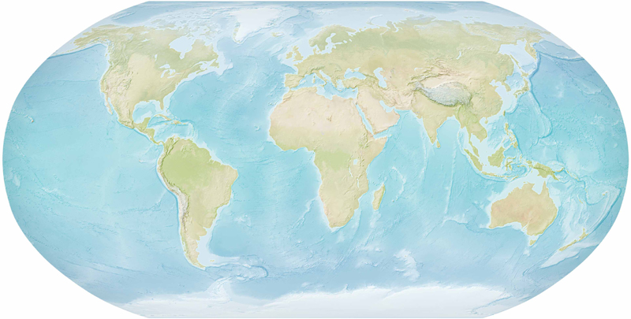
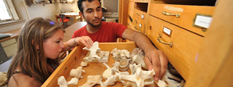
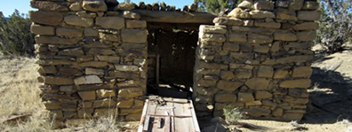

# Page Scan Report

| Field | Value |
|-------|-------|
| URL | https://anthro.wsu.edu/ |
| Title | Department of Anthropology | Washington State University |
| Status | ❌ 0 |
| HTML Size | 208.2 KB |
| Screenshots | 1 (1.2 MB) |
| Images | 3 (431.3 KB) |
| Images Missing Alt | 0 |
| JS Errors | 5 |
| JS Warnings | 0 |
| Auth | none |
| Captured | 2026-02-16T20:37:05.0035883Z |

## JavaScript Errors

- `Failed to load resource: net::ERR_SOCKET_NOT_CONNECTED`
- `Failed to load resource: net::ERR_SOCKET_NOT_CONNECTED`
- `Failed to load resource: net::ERR_SOCKET_NOT_CONNECTED`
- `Failed to load resource: net::ERR_SOCKET_NOT_CONNECTED`
- `Failed to load resource: net::ERR_SOCKET_NOT_CONNECTED`

## Actions

- Screenshot #1: page-loaded (1.2 MB)
- Downloaded 3 images to /images/

## Screenshots

### 1. page-loaded

## Page Images (3)

| # | Image | Alt Text | Size |
|---|-------|----------|------|
| 1 | [world_physical_2013.jpg](images/world_physical_2013.jpg) | World map of the Earth | 241.2 KB |
| 2 | [zooarcheaology_396x149.jpg](images/zooarcheaology_396x149.jpg) | anthropology students reviewing bones... | 92.2 KB |
| 3 | [historic-homestead_396x149.jpg](images/historic-homestead_396x149.jpg) | Homestead constructed of rocks and bo... | 98.0 KB |

### Gallery

## Files

- `01-page-loaded.png` — page-loaded (1.2 MB)
- `page.html` — rendered HTML content
- `metadata.json` — machine-readable scan data
- `errors.log` — JavaScript console errors
- `warnings.log` — JavaScript console warnings
- `info.log` — navigation and timing details
- `actions.log` — interactions performed on the page
- `images/` — 3 page images (431.3 KB)
