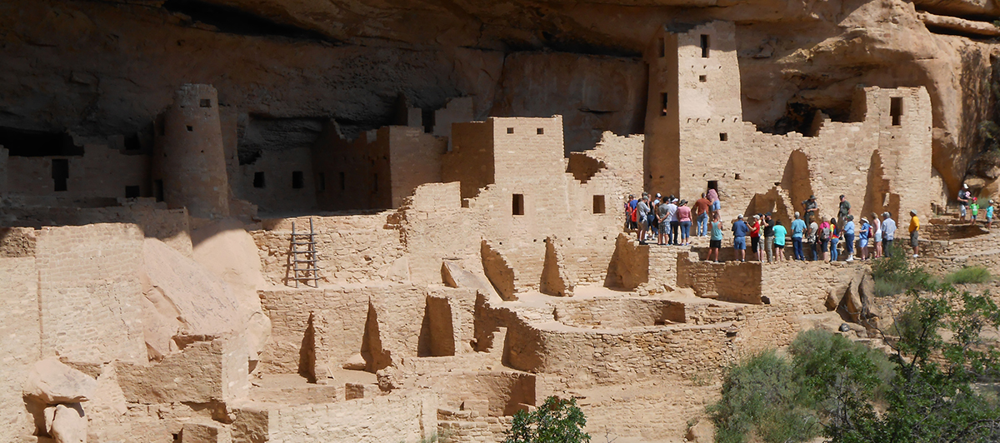
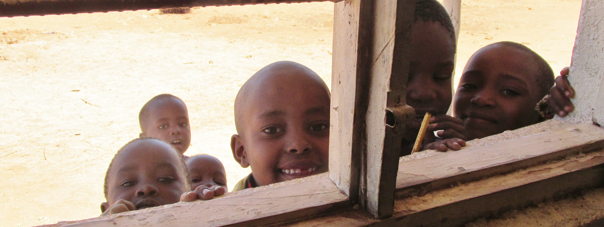

# 📄 Page Scan Report

> **URL:** https://anthro.wsu.edu/  
> **Captured:** 2026-02-16 22:13:22 UTC  
> **Status:** ✅ 200  

---

## 📑 Contents

- [Summary](#-summary)
- [Screenshots](#-screenshots)
- [Page Images](#-page-images)
- [Actions](#-actions)
- [Files](#-files)

---

## 📋 Summary

| Field | Value |
|-------|-------|
| URL | https://anthro.wsu.edu/ |
| Title | Department of Anthropology | Washington State University |
| Status | ✅ 200 |
| HTML Size | 225.3 KB |
| Screenshots | 1 (1.5 MB) |
| Images | 5 (3.6 MB) |
| Images Missing Alt | ✅ 0 |
| JS Errors | ✅ 0 |
| JS Warnings | 0 |
| Auth | none |
| Captured | 2026-02-16T22:13:22.6955472Z |

## 🔧 Actions

<strong>2 action(s) performed</strong>

- Screenshot #1: page-loaded (1.5 MB)
- Downloaded 5 images to /images/

## 📸 Screenshots

<table>
<tr>
<td align="center" width="50%">

 <strong>1. page-loaded</strong>
 1.5 MB
</td>
<td></td>
</tr>
</table>

## 🖼️ Page Images (5)

<strong>📋 Image Index</strong> — 5 images, 3.6 MB

| # | Image | Alt Text | Size |
|--:|-------|----------|-----:|
| 1 | [ranger-cliff-palace_1200x532.jpg](images/ranger-cliff-palace_1200x532.jpg) | Cliff palace with tourists | 689.9 KB |
| 2 | [world_physical_2013.jpg](images/world_physical_2013.jpg) | World map of the Earth | 241.2 KB |
| 3 | [zooarcheaology_396x149.jpg](images/zooarcheaology_396x149.jpg) | anthropology students reviewing bones... | 92.2 KB |
| 4 | [AtWindow1.jpg](images/AtWindow1.jpg) | children looking though window frame | 2.5 MB |
| 5 | [historic-homestead_396x149.jpg](images/historic-homestead_396x149.jpg) | Homestead constructed of rocks and bo... | 98.0 KB |

<strong>🖼️ Gallery</strong>

<table>
<tr>
<td align="center" width="33%">

 ranger-cliff-palace_1200x532.jpg
</td>
<td align="center" width="33%">

 world_physical_2013.jpg
</td>
<td align="center" width="33%">

 zooarcheaology_396x149.jpg
</td>
</tr>
<tr>
<td align="center" width="33%">

 AtWindow1.jpg
</td>
<td align="center" width="33%">

 historic-homestead_396x149.jpg
</td>
<td></td>
</tr>
</table>

## 📁 Files

| File | Description |
|------|-------------|
| `01-page-loaded.png` | page-loaded (1.5 MB) |
| `page.html` | Rendered HTML content |
| `metadata.json` | Machine-readable scan data |
| `errors.log` | JavaScript console errors |
| `warnings.log` | JavaScript console warnings |
| `info.log` | Navigation and timing details |
| `actions.log` | Interactions performed |
| `images/` | 5 page images (3.6 MB) |

---

*Generated by AccessibilityScanner (FreeTools) v1.0*
