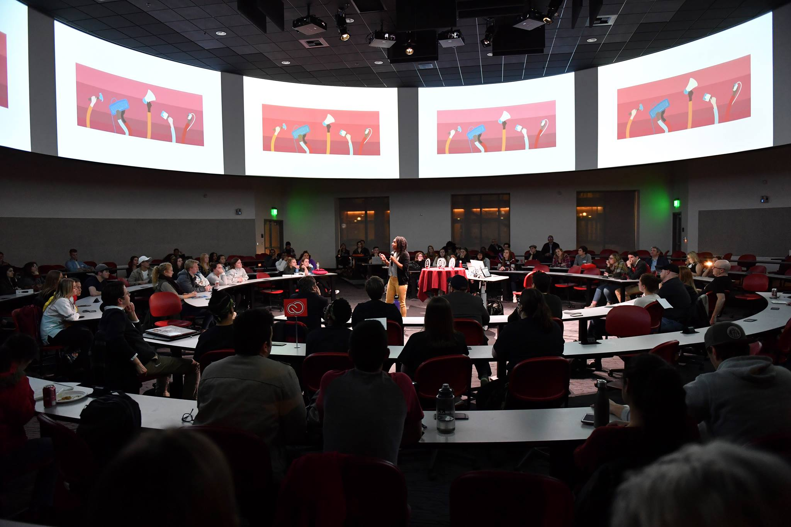

# Page Scan Report

| Field | Value |
|-------|-------|
| URL | https://aoi.wsu.edu/ |
| Title | Academic Outreach and Innovation | Washington State University |
| Status | ❌ 0 |
| HTML Size | 52.6 KB |
| Screenshots | 1 (619.9 KB) |
| Images | 1 (200.2 KB) |
| Images Missing Alt | 0 |
| JS Errors | 5 |
| JS Warnings | 0 |
| Auth | none |
| Captured | 2026-02-16T20:37:04.9973622Z |

## JavaScript Errors

- `Failed to load resource: net::ERR_SOCKET_NOT_CONNECTED`
- `Failed to load resource: net::ERR_SOCKET_NOT_CONNECTED`
- `Failed to load resource: net::ERR_SOCKET_NOT_CONNECTED`
- `Failed to load resource: net::ERR_SOCKET_NOT_CONNECTED`
- `Failed to load resource: net::ERR_SOCKET_NOT_CONNECTED`

## Actions

- Screenshot #1: page-loaded (619.9 KB)
- Downloaded 1 images to /images/

## Screenshots

### 1. page-loaded

## Page Images (1)

| # | Image | Alt Text | Size |
|---|-------|----------|------|
| 1 | [3-1-58420056_387523588644670_7080231189201551360_o.jpg](images/3-1-58420056_387523588644670_7080231189201551360_o.jpg) | Photo: Teaching in the round in Spark... | 200.2 KB |

### Gallery

## Files

- `01-page-loaded.png` — page-loaded (619.9 KB)
- `page.html` — rendered HTML content
- `metadata.json` — machine-readable scan data
- `errors.log` — JavaScript console errors
- `warnings.log` — JavaScript console warnings
- `info.log` — navigation and timing details
- `actions.log` — interactions performed on the page
- `images/` — 1 page images (200.2 KB)
