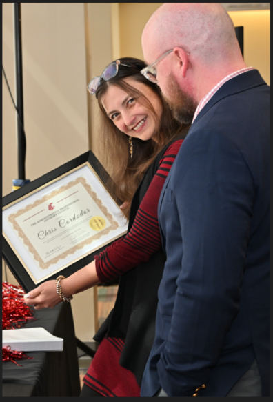
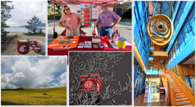
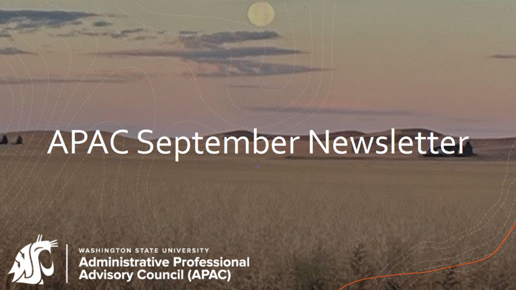
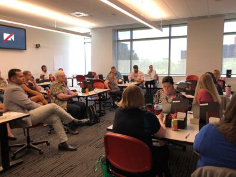
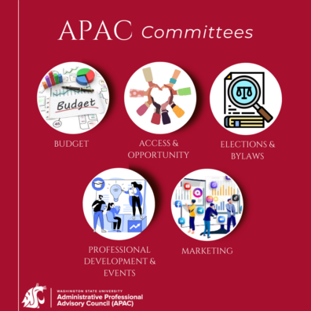

# 📄 Page Scan Report

> **URL:** https://apac.wsu.edu/  
> **Captured:** 2026-02-16 22:11:52 UTC  
> **Status:** ✅ 200  

---

## 📑 Contents

- [Summary](#-summary)
- [Screenshots](#-screenshots)
- [Page Images](#-page-images)
- [JavaScript Errors](#-javascript-errors)
- [Actions](#-actions)
- [Files](#-files)

---

## 📋 Summary

| Field | Value |
|-------|-------|
| URL | https://apac.wsu.edu/ |
| Title | Administrative Professional Advisory Council | Washington State University |
| Status | ✅ 200 |
| HTML Size | 82.2 KB |
| Screenshots | 1 (1.8 MB) |
| Images | 6 (805.8 KB) |
| Images Missing Alt | ⚠️ 3 |
| JS Errors | 🔴 2 |
| JS Warnings | 0 |
| Auth | none |
| Captured | 2026-02-16T22:11:52.7799140Z |

## 🔴 JavaScript Errors

<details>
<summary><strong>2 error(s) detected</strong></summary>

```
Failed to load resource: the server responded with a status of 404 ()
Failed to load resource: the server responded with a status of 404 ()
```

</details>

## 🔧 Actions

<details>
<summary><strong>2 action(s) performed</strong></summary>

- Screenshot #1: page-loaded (1.8 MB)
- Downloaded 6 images to /images/

</details>

## 📸 Screenshots

<table>
<tr>
<td align="center" width="50%">
<a href="01-page-loaded.png">

</a>
<br /><strong>1. page-loaded</strong>
<br /><sub>1.8 MB</sub>
</td>
<td></td>
</tr>
</table>

## 🖼️ Page Images (6)

<details open>
<summary><strong>📋 Image Index</strong> — 6 images, 805.8 KB</summary>

| # | Image | Alt Text | Size |
|--:|-------|----------|-----:|
| 1 | [wsu_2021_apac_logos_lrg_logo_reverse_rgb-396x82.png](images/wsu_2021_apac_logos_lrg_logo_reverse_rgb-396x82.png) | ⚠️ *(missing)* | 13.1 KB |
| 2 | [AP-Appreciation-Border-396x583.png](images/AP-Appreciation-Border-396x583.png) | Photo of 2023 APAC Chair Angie Senter... | 322.6 KB |
| 3 | [2023-Photo-Contest-396x217.png](images/2023-Photo-Contest-396x217.png) | 2023 APAC Photo Contest collage of wi... | 185.5 KB |
| 4 | [APAC-September-Newsletter-Image-2.gif](images/APAC-September-Newsletter-Image-2.gif) | ⚠️ *(missing)* | 164.4 KB |
| 5 | [Retreat-1-396x297.jpg](images/Retreat-1-396x297.jpg) | ⚠️ *(missing)* | 31.3 KB |
| 6 | [Committies-Image-396x396.png](images/Committies-Image-396x396.png) | APAC Standing Committees | 88.8 KB |

</details>

<details open>
<summary><strong>🖼️ Gallery</strong></summary>

<table>
<tr>
<td align="center" width="33%">
<a href="images/wsu_2021_apac_logos_lrg_logo_reverse_rgb-396x82.png">

</a>
<br /><sub>wsu_2021_apac_logos_lrg_logo_reverse_rgb-396x82.png ⚠️</sub>
</td>
<td align="center" width="33%">
<a href="images/AP-Appreciation-Border-396x583.png">

</a>
<br /><sub>AP-Appreciation-Border-396x583.png</sub>
</td>
<td align="center" width="33%">
<a href="images/2023-Photo-Contest-396x217.png">

</a>
<br /><sub>2023-Photo-Contest-396x217.png</sub>
</td>
</tr>
<tr>
<td align="center" width="33%">
<a href="images/APAC-September-Newsletter-Image-2.gif">

</a>
<br /><sub>APAC-September-Newsletter-Image-2.gif ⚠️</sub>
</td>
<td align="center" width="33%">
<a href="images/Retreat-1-396x297.jpg">

</a>
<br /><sub>Retreat-1-396x297.jpg ⚠️</sub>
</td>
<td align="center" width="33%">
<a href="images/Committies-Image-396x396.png">

</a>
<br /><sub>Committies-Image-396x396.png</sub>
</td>
</tr>
</table>

</details>

<details>
<summary>⚠️ <strong>Images Missing Alt Text</strong> (3)</summary>

| Image | Source URL |
|-------|-----------|
| `wsu_2021_apac_logos_lrg_logo_reverse_rgb-396x82.png` | https://s3.wp.wsu.edu/uploads/sites/899/2021/12/wsu_2021_apac_logos_lrg_logo_... |
| `APAC-September-Newsletter-Image-2.gif` | https://s3.wp.wsu.edu/uploads/sites/899/2024/09/APAC-September-Newsletter-Ima... |
| `Retreat-1-396x297.jpg` | https://s3.wp.wsu.edu/uploads/sites/899/2021/12/Retreat-1-396x297.jpg |

</details>

## 📁 Files

| File | Description |
|------|-------------|
| `01-page-loaded.png` | page-loaded (1.8 MB) |
| `page.html` | Rendered HTML content |
| `metadata.json` | Machine-readable scan data |
| `errors.log` | JavaScript console errors |
| `warnings.log` | JavaScript console warnings |
| `info.log` | Navigation and timing details |
| `actions.log` | Interactions performed |
| `images/` | 6 page images (805.8 KB) |

---

*Generated by AccessibilityScanner (FreeTools) v1.0*
