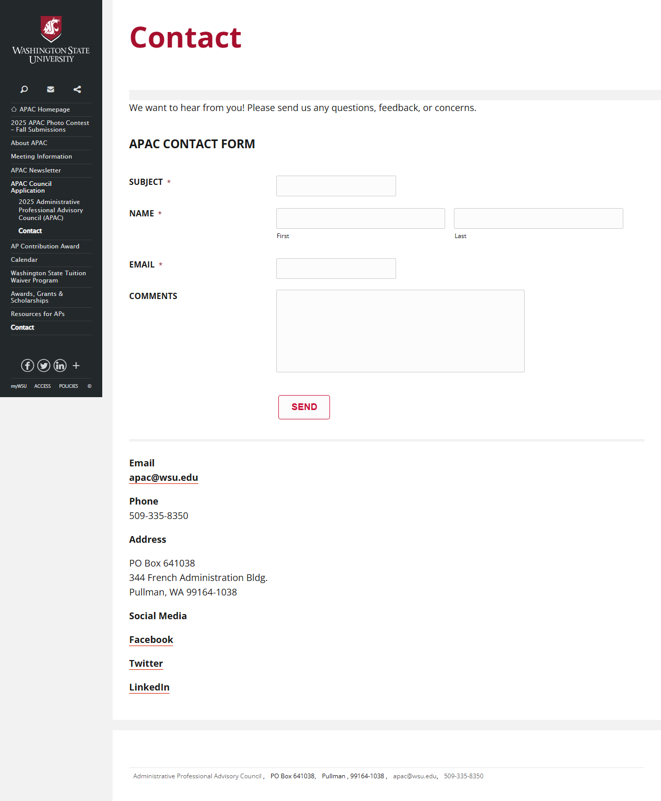
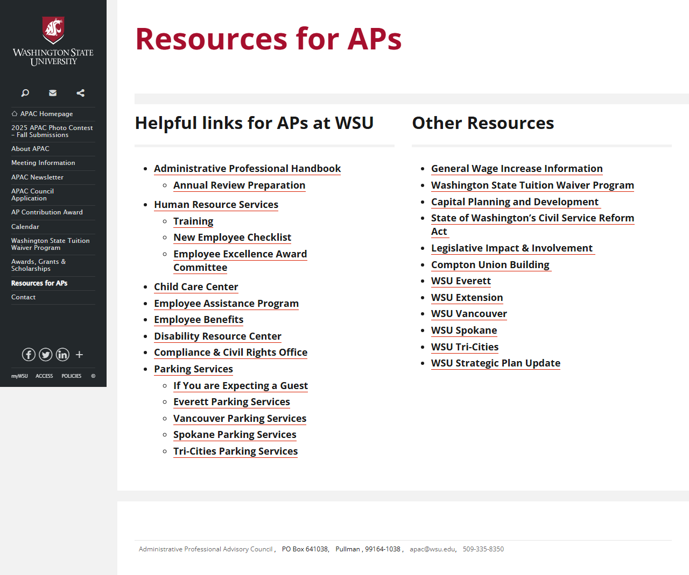

# 🌐 Site Report: https://apac.wsu.edu/

> **Status:** ✅ 3/3 pages OK  
> **Folder:** `apac-wsu-edu/`  

---

## 📋 Summary

```
Success Rate:  [██████████████████████████████] 100%
```

| Metric | Value |
|--------|-------|
| Pages Scanned | 3 |
| Pages Passed | ✅ 3 |
| Pages Failed | 0 |
| Total JS Errors | 🔴 4 |
| Total JS Warnings | 0 |
| Total Images | 6 (805.8 KB) |
| Images Missing Alt | ⚠️ 3 |
| Total HTML | 222.5 KB |
| Total Screenshots | 2.0 MB |

## 📑 Pages

| Status | Page | HTTP | Title | JS Errors | Images | Missing Alt |
|:------:|------|:----:|-------|:---------:|:------:|:-----------:|
| ✅ | [/](_root/report.md) | 200 | Administrative Professional Advisory ... | 🔴 2 | 6 | ⚠️ 3 |
| ✅ | [/contact/](contact/report.md) | 200 | Contact \| Administrative Professiona... | 🔴 1 | 0 | 0 |
| ✅ | [/resources/](resources/report.md) | 200 | Resources for APs \| Administrative P... | 🔴 1 | 0 | 0 |

## 📸 Page Screenshots

Click any thumbnail to view the full page report.

<table>
<tr>
<td align="center" width="33%">
<a href="_root/report.md">

</a>
<br />✅ <code>/</code>
</td>
<td align="center" width="33%">
<a href="contact/report.md">

</a>
<br />✅ <code>/contact/</code>
</td>
<td align="center" width="33%">
<a href="resources/report.md">

</a>
<br />✅ <code>/resources/</code>
</td>
</tr>
</table>

## 🔴 JavaScript Errors

<details>
<summary><strong>4 error(s) across 3 page(s)</strong></summary>

**/** (2 errors)

```
Failed to load resource: the server responded with a status of 404 ()
Failed to load resource: the server responded with a status of 404 ()
```

**/resources/** (1 errors)

```
Failed to load resource: the server responded with a status of 404 ()
```

**/contact/** (1 errors)

```
Failed to load resource: the server responded with a status of 404 ()
```

</details>

---

*Generated by AccessibilityScanner (FreeTools) v1.0*
