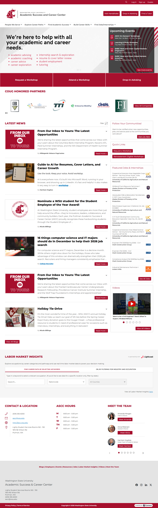

# 🌐 Site Report: https://ascc.wsu.edu/

> **Status:** ✅ 2/2 pages OK  
> **Folder:** `ascc-wsu-edu/`  

---

## 📋 Summary

```
Success Rate:  [██████████████████████████████] 100%
```

| Metric | Value |
|--------|-------|
| Pages Scanned | 2 |
| Pages Passed | ✅ 2 |
| Pages Failed | 0 |
| Total JS Errors | 0 |
| Total JS Warnings | 0 |
| Total Images | 80 (1.2 MB) |
| Images Missing Alt | ⚠️ 56 |
| Total HTML | 4.0 MB |
| Total Screenshots | 2.0 MB |

## 📑 Pages

| Status | Page | HTTP | Title | JS Errors | Images | Missing Alt |
|:------:|------|:----:|-------|:---------:|:------:|:-----------:|
| ✅ | [/](_root/report.md) | 200 | Academic Success & Career Center – Wa... | 0 | 40 | ⚠️ 28 |
| ✅ | [/career-services/](career-services/report.md) | 200 | Academic Success & Career Center – Wa... | 0 | 40 | ⚠️ 28 |

## 📸 Page Screenshots

Click any thumbnail to view the full page report.

<table>
<tr>
<td align="center" width="33%">
<a href="_root/report.md">

</a>
<br />✅ <code>/</code>
</td>
<td align="center" width="33%">
<a href="career-services/report.md">

</a>
<br />✅ <code>/career-services/</code>
</td>
<td></td>
</tr>
</table>

---

*Generated by AccessibilityScanner (FreeTools) v1.0*
