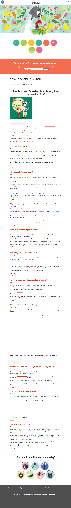
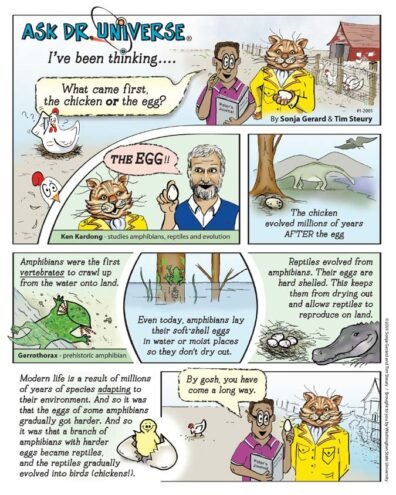
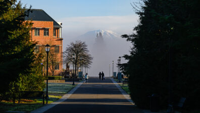

# 📄 Page Scan Report

> **URL:** https://askdruniverse.wsu.edu/  
> **Captured:** 2026-02-16 22:12:26 UTC  
> **Status:** ✅ 200  

---

## 📑 Contents

- [Summary](#-summary)
- [Screenshots](#-screenshots)
- [Page Images](#-page-images)
- [Actions](#-actions)
- [Files](#-files)

---

## 📋 Summary

| Field | Value |
|-------|-------|
| URL | https://askdruniverse.wsu.edu/ |
| Title | Ask Dr. Universe | Washington State University |
| Status | ✅ 200 |
| HTML Size | 70.6 KB |
| Screenshots | 1 (1.2 MB) |
| Images | 10 (252.6 KB) |
| Images Missing Alt | ⚠️ 5 |
| JS Errors | ✅ 0 |
| JS Warnings | 0 |
| Auth | none |
| Captured | 2026-02-16T22:12:26.9577876Z |

## 🔧 Actions

<strong>2 action(s) performed</strong>

- Screenshot #1: page-loaded (1.2 MB)
- Downloaded 10 images to /images/

## 📸 Screenshots

<table>
<tr>
<td align="center" width="50%">

 <strong>1. page-loaded</strong>
 1.2 MB
</td>
<td></td>
</tr>
</table>

## 🖼️ Page Images (10)

<strong>📋 Image Index</strong> — 10 images, 252.6 KB

| # | Image | Alt Text | Size |
|--:|-------|----------|-----:|
| 1 | [Dr-U-Microscope-web-396x527.png](images/Dr-U-Microscope-web-396x527.png) | Dr. Universe looking through a micros... | 66.0 KB |
| 2 | [Dr-U-Cosmo-Podcast-1-396x396.jpg](images/Dr-U-Cosmo-Podcast-1-396x396.jpg) | ⚠️ *(missing)* | 47.9 KB |
| 3 | [Apple_Podcasts_Badge.svg](images/Apple_Podcasts_Badge.svg) | Apple podcast badge | 2.9 KB |
| 4 | [Spotify-podcast-badge.svg](images/Spotify-podcast-badge.svg) | Spotify podcast badge | 1.2 KB |
| 5 | [Stitcher-podcast-badge.svg](images/Stitcher-podcast-badge.svg) | Stitcher podcast badge | 784 bytes |
| 6 | [2001Winter_AskDrUniverse_chicken_egg-396x495.jpg](images/2001Winter_AskDrUniverse_chicken_egg-396x495.jpg) | ⚠️ *(missing)* | 62.5 KB |
| 7 | [Vancouver-Saint-Helens_7125-396x223.jpg](images/Vancouver-Saint-Helens_7125-396x223.jpg) | Students walk down a pathway at WSU V... | 49.8 KB |
| 8 | [5296516_tweet_twitter_twitter-logo_icon.png](images/5296516_tweet_twitter_twitter-logo_icon.png) | ⚠️ *(missing)* | 843 bytes |
| 9 | [5365678_fb_facebook_facebook-logo_icon-792x792.png](images/5365678_fb_facebook_facebook-logo_icon-792x792.png) | ⚠️ *(missing)* | 12.2 KB |
| 10 | [WSU-lockup-horz-rev-396x78.png](images/WSU-lockup-horz-rev-396x78.png) | ⚠️ *(missing)* | 8.6 KB |

<strong>🖼️ Gallery</strong>

<table>
<tr>
<td align="center" width="33%">

 Dr-U-Microscope-web-396x527.png
</td>
<td align="center" width="33%">

 Dr-U-Cosmo-Podcast-1-396x396.jpg ⚠️
</td>
<td align="center" width="33%">

 Apple_Podcasts_Badge.svg
</td>
</tr>
<tr>
<td align="center" width="33%">

 Spotify-podcast-badge.svg
</td>
<td align="center" width="33%">

 Stitcher-podcast-badge.svg
</td>
<td align="center" width="33%">

 2001Winter_AskDrUniverse_chicken_egg-396x495.jpg ⚠️
</td>
</tr>
<tr>
<td align="center" width="33%">

 Vancouver-Saint-Helens_7125-396x223.jpg
</td>
<td align="center" width="33%">

 5296516_tweet_twitter_twitter-logo_icon.png ⚠️
</td>
<td align="center" width="33%">

 5365678_fb_facebook_facebook-logo_icon-792x792.png ⚠️
</td>
</tr>
<tr>
<td align="center" width="33%">

 WSU-lockup-horz-rev-396x78.png ⚠️
</td>
<td></td>
<td></td>
</tr>
</table>

⚠️ <strong>Images Missing Alt Text</strong> (5)

| Image | Source URL |
|-------|-----------|
| `Dr-U-Cosmo-Podcast-1-396x396.jpg` | https://s3.wp.wsu.edu/uploads/sites/2332/2024/10/Dr-U-Cosmo-Podcast-1-396x396... |
| `2001Winter_AskDrUniverse_chicken_egg-396x495.jpg` | https://s3.wp.wsu.edu/uploads/sites/2332/2025/12/2001Winter_AskDrUniverse_chi... |
| `5296516_tweet_twitter_twitter-logo_icon.png` | https://s3.wp.wsu.edu/uploads/sites/2332/2021/10/5296516_tweet_twitter_twitte... |
| `5365678_fb_facebook_facebook-logo_icon-792x792.png` | https://s3.wp.wsu.edu/uploads/sites/2332/2021/10/5365678_fb_facebook_facebook... |
| `WSU-lockup-horz-rev-396x78.png` | https://s3.wp.wsu.edu/uploads/sites/2332/2021/09/WSU-lockup-horz-rev-396x78.png |

## 📁 Files

| File | Description |
|------|-------------|
| `01-page-loaded.png` | page-loaded (1.2 MB) |
| `page.html` | Rendered HTML content |
| `metadata.json` | Machine-readable scan data |
| `errors.log` | JavaScript console errors |
| `warnings.log` | JavaScript console warnings |
| `info.log` | Navigation and timing details |
| `actions.log` | Interactions performed |
| `images/` | 10 page images (252.6 KB) |

---

*Generated by AccessibilityScanner (FreeTools) v1.0*
