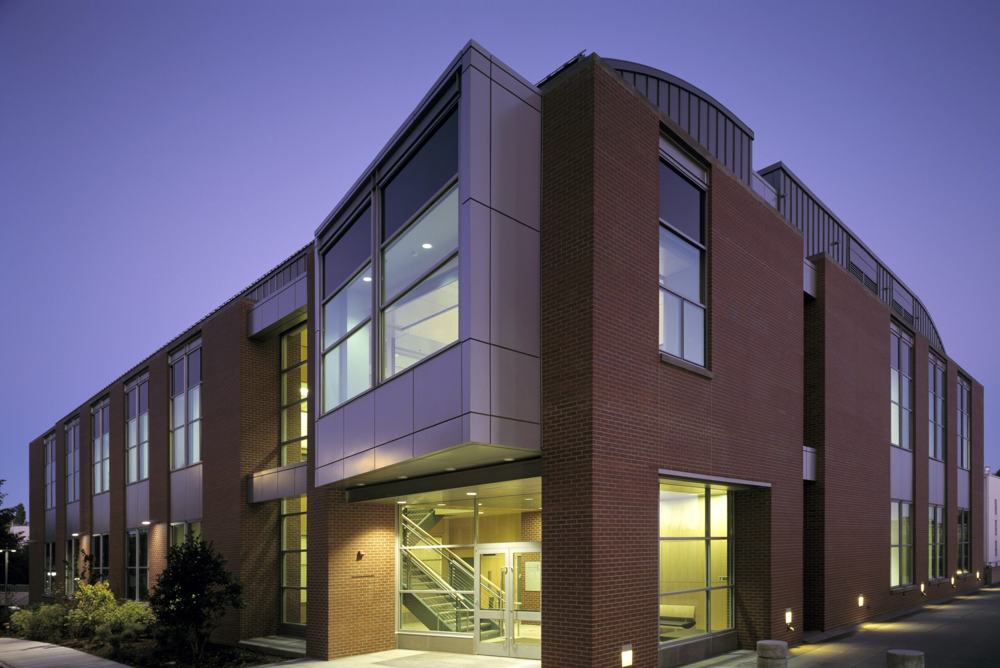
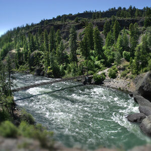
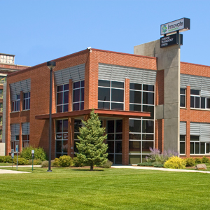

# Page Scan Report

| Field | Value |
|-------|-------|
| URL | https://asl.wsu.edu/ |
| Title | Applied Sciences Laboratory | Washington State University |
| Status | ❌ 0 |
| HTML Size | 58.3 KB |
| Screenshots | 1 (848.9 KB) |
| Images | 4 (750.7 KB) |
| Images Missing Alt | 4 |
| JS Errors | 1 |
| JS Warnings | 0 |
| Auth | none |
| Captured | 2026-02-16T20:37:05.0332968Z |

## JavaScript Errors

- `Failed to load resource: net::ERR_SOCKET_NOT_CONNECTED`

## Actions

- Screenshot #1: page-loaded (848.9 KB)
- Downloaded 4 images to /images/

## Screenshots

### 1. page-loaded

## Page Images (4)

| # | Image | Alt Text | Size |
|---|-------|----------|------|
| 1 | [ISP-Building-at-Night-1-scaled.jpg](images/ISP-Building-at-Night-1-scaled.jpg) | *(none)* | 456.1 KB |
| 2 | [RIVER2-e1666038606692.jpg](images/RIVER2-e1666038606692.jpg) | *(none)* | 58.8 KB |
| 3 | [us_gov_in_nut_shell.jpg](images/us_gov_in_nut_shell.jpg) | *(none)* | 120.2 KB |
| 4 | [contact_bubble.jpg](images/contact_bubble.jpg) | *(none)* | 115.5 KB |

### Gallery

### ⚠️ Images Missing Alt Text (4)

- `ISP-Building-at-Night-1-scaled.jpg` — https://wpcdn.web.wsu.edu/wp-cas/uploads/sites/3002/2026/01/ISP-Building-at-Night-1-scaled.jpg
- `RIVER2-e1666038606692.jpg` — https://wpcdn.web.wsu.edu/wp-cas/uploads/sites/3002/2016/12/RIVER2-e1666038606692.jpg
- `us_gov_in_nut_shell.jpg` — https://wpcdn.web.wsu.edu/wp-cas/uploads/sites/3002/2016/12/us_gov_in_nut_shell.jpg
- `contact_bubble.jpg` — https://wpcdn.web.wsu.edu/wp-cas/uploads/sites/3002/2016/12/contact_bubble.jpg

## Files

- `01-page-loaded.png` — page-loaded (848.9 KB)
- `page.html` — rendered HTML content
- `metadata.json` — machine-readable scan data
- `errors.log` — JavaScript console errors
- `warnings.log` — JavaScript console warnings
- `info.log` — navigation and timing details
- `actions.log` — interactions performed on the page
- `images/` — 4 page images (750.7 KB)
