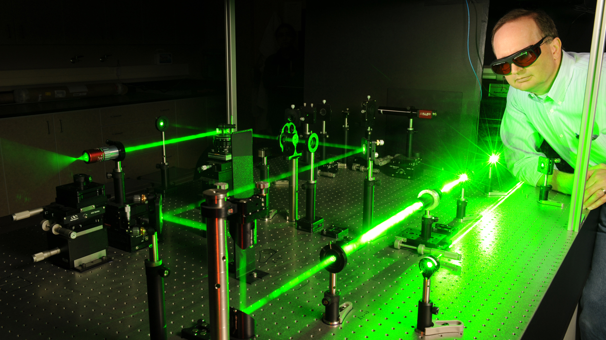
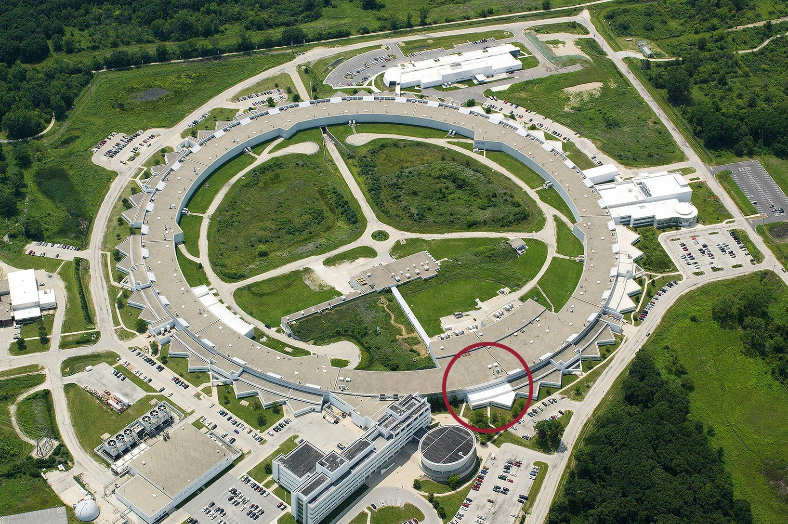

# 📄 Page Scan Report

> **URL:** https://asl.wsu.edu/  
> **Captured:** 2026-02-16 22:12:38 UTC  
> **Status:** ✅ 200  

---

## 📑 Contents

- [Summary](#-summary)
- [Screenshots](#-screenshots)
- [Page Images](#-page-images)
- [Actions](#-actions)
- [Files](#-files)

---

## 📋 Summary

| Field | Value |
|-------|-------|
| URL | https://asl.wsu.edu/ |
| Title | Applied Sciences Laboratory | Washington State University |
| Status | ✅ 200 |
| HTML Size | 68.2 KB |
| Screenshots | 1 (1.2 MB) |
| Images | 6 (2.4 MB) |
| Images Missing Alt | ⚠️ 5 |
| JS Errors | ✅ 0 |
| JS Warnings | 0 |
| Auth | none |
| Captured | 2026-02-16T22:12:38.8820641Z |

## 🔧 Actions

<strong>2 action(s) performed</strong>

- Screenshot #1: page-loaded (1.2 MB)
- Downloaded 6 images to /images/

## 📸 Screenshots

<table>
<tr>
<td align="center" width="50%">

 <strong>1. page-loaded</strong>
 1.2 MB
</td>
<td></td>
</tr>
</table>

## 🖼️ Page Images (6)

<strong>📋 Image Index</strong> — 6 images, 2.4 MB

| # | Image | Alt Text | Size |
|--:|-------|----------|-----:|
| 1 | [DSC_9095.jpg](images/DSC_9095.jpg) | Scientist working with laser | 783.8 KB |
| 2 | [ISP-Building-at-Night-1-scaled.jpg](images/ISP-Building-at-Night-1-scaled.jpg) | ⚠️ *(missing)* | 456.1 KB |
| 3 | [APS-Aerial-DCS-Circled.jpg](images/APS-Aerial-DCS-Circled.jpg) | ⚠️ *(missing)* | 887.0 KB |
| 4 | [RIVER2-e1666038606692.jpg](images/RIVER2-e1666038606692.jpg) | ⚠️ *(missing)* | 58.8 KB |
| 5 | [us_gov_in_nut_shell.jpg](images/us_gov_in_nut_shell.jpg) | ⚠️ *(missing)* | 120.2 KB |
| 6 | [contact_bubble.jpg](images/contact_bubble.jpg) | ⚠️ *(missing)* | 115.5 KB |

<strong>🖼️ Gallery</strong>

<table>
<tr>
<td align="center" width="33%">

 DSC_9095.jpg
</td>
<td align="center" width="33%">

 ISP-Building-at-Night-1-scaled.jpg ⚠️
</td>
<td align="center" width="33%">

 APS-Aerial-DCS-Circled.jpg ⚠️
</td>
</tr>
<tr>
<td align="center" width="33%">

 RIVER2-e1666038606692.jpg ⚠️
</td>
<td align="center" width="33%">

 us_gov_in_nut_shell.jpg ⚠️
</td>
<td align="center" width="33%">

 contact_bubble.jpg ⚠️
</td>
</tr>
</table>

⚠️ <strong>Images Missing Alt Text</strong> (5)

| Image | Source URL |
|-------|-----------|
| `ISP-Building-at-Night-1-scaled.jpg` | https://wpcdn.web.wsu.edu/wp-cas/uploads/sites/3002/2026/01/ISP-Building-at-N... |
| `APS-Aerial-DCS-Circled.jpg` | https://wpcdn.web.wsu.edu/wp-cas/uploads/sites/3002/2026/01/APS-Aerial-DCS-Ci... |
| `RIVER2-e1666038606692.jpg` | https://wpcdn.web.wsu.edu/wp-cas/uploads/sites/3002/2016/12/RIVER2-e166603860... |
| `us_gov_in_nut_shell.jpg` | https://wpcdn.web.wsu.edu/wp-cas/uploads/sites/3002/2016/12/us_gov_in_nut_she... |
| `contact_bubble.jpg` | https://wpcdn.web.wsu.edu/wp-cas/uploads/sites/3002/2016/12/contact_bubble.jpg |

## 📁 Files

| File | Description |
|------|-------------|
| `01-page-loaded.png` | page-loaded (1.2 MB) |
| `page.html` | Rendered HTML content |
| `metadata.json` | Machine-readable scan data |
| `errors.log` | JavaScript console errors |
| `warnings.log` | JavaScript console warnings |
| `info.log` | Navigation and timing details |
| `actions.log` | Interactions performed |
| `images/` | 6 page images (2.4 MB) |

---

*Generated by AccessibilityScanner (FreeTools) v1.0*
