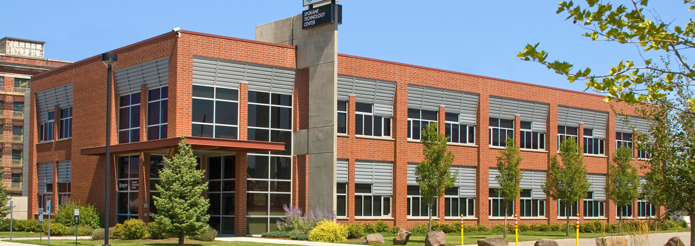

# Page Scan Report

| Field | Value |
|-------|-------|
| URL | https://asl.wsu.edu/contact/ |
| Title | Contact | Applied Sciences Laboratory | Washington State University |
| Status | ❌ 0 |
| HTML Size | 64.3 KB |
| Screenshots | 1 (988.3 KB) |
| Images | 1 (596.7 KB) |
| Images Missing Alt | 0 |
| JS Errors | 0 |
| JS Warnings | 0 |
| Auth | none |
| Captured | 2026-02-16T21:00:53.0984884Z |

## Actions

- Screenshot #1: page-loaded (988.3 KB)
- Downloaded 1 images to /images/

## Screenshots

### 1. page-loaded

## Page Images (1)

| # | Image | Alt Text | Size |
|---|-------|----------|------|
| 1 | [cont_norm.jpg](images/cont_norm.jpg) | Exterior of ASL building. | 596.7 KB |

### Gallery

## Files

- `01-page-loaded.png` — page-loaded (988.3 KB)
- `page.html` — rendered HTML content
- `metadata.json` — machine-readable scan data
- `errors.log` — JavaScript console errors
- `warnings.log` — JavaScript console warnings
- `info.log` — navigation and timing details
- `actions.log` — interactions performed on the page
- `images/` — 1 page images (596.7 KB)
