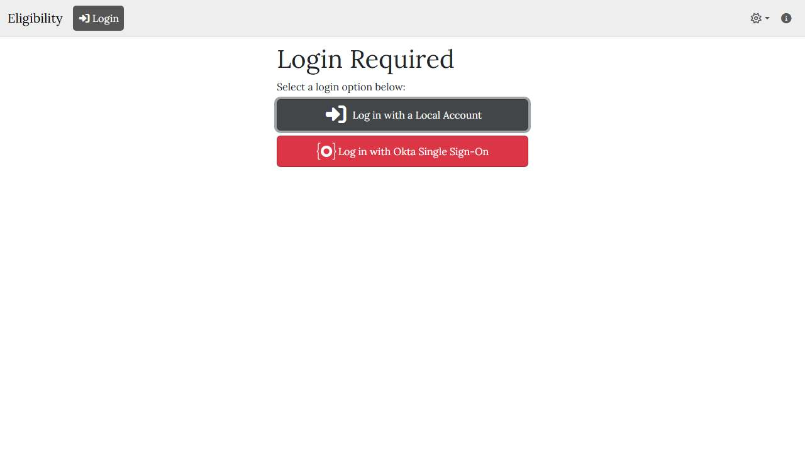

# 🌐 Site Report: https://athleticeligibility.wsu.edu/

> **Status:** ✅ 1/1 pages OK  
> **Folder:** `athleticeligibility-wsu-edu/`  

---

## 📋 Summary

```
Success Rate:  [██████████████████████████████] 100%
```

| Metric | Value |
|--------|-------|
| Pages Scanned | 1 |
| Pages Passed | ✅ 1 |
| Pages Failed | 0 |
| Total JS Errors | 0 |
| Total JS Warnings | 3 |
| Total Images | 1 (by URL) |
| Images Missing Alt | ⚠️ 1 |
| A11y Violations | ⚠️ 8 |
| 🔴 Critical | 1 |
| 🟠 Serious | 5 |
| 🟡 Moderate | 2 |
| 🔵 Minor | 0 |
| Total HTML | 155.5 KB |
| Total Screenshots | 20.0 KB |

## 🔒 SSL Certificate

| Field | Value |
|-------|-------|
| Subject | `CN=athleticeligibility.wsu.edu, O=Washington State University, S=Washington, C=US` |
| Issuer | `CN=InCommon RSA Server CA 2, O=Internet2, C=US` |
| Valid From | 2026-01-11 |
| Expires | 🟢 2027-01-12 (327 days) |
| Algorithm | sha256RSA |
| Key Size | 2048 bits |
| Thumbprint | `D5E0DBA671CAE9AA30D4D959D48810270DBF427B` |
| SANs | 1 domain(s) |

<details>
<summary><strong>Subject Alternative Names (1)</strong></summary>

| Domain | Type |
|--------|------|
| `athleticeligibility.wsu.edu` | 🏫 WSU |

</details>

## 📑 Pages

| Status | Page | HTTP | Title | 🔴 | 🟠 | 🟡 | 🔵 | A11y |
|:------:|------|:----:|-------|:--:|:--:|:--:|:--:|:----:|
| ✅ | [/](_root/report.md) | 200 | Eligibility | 1 | 5 | 2 |  | ⚠️ 8 |

## 📸 Page Screenshots

Click any thumbnail to view the full page report.

<table>
<tr>
<td align="center" width="33%">
<a href="_root/report.md">

</a>
<br />✅ <code>/</code>
</td>
<td></td>
<td></td>
</tr>
</table>

## ♿ Accessibility Summary

| Metric | Value |
|--------|-------|
| Pages with violations | 1/1 |
| Total violations | 8 |
| 🔴 Critical | 1 |
| 🟠 Serious | 5 |
| 🟡 Moderate | 2 |
| 🔵 Minor | 0 |

### Top 4 Issues

| # | Rule | Sev | Pages | Instances |
|--:|------|:---:|:-----:|:---------:|
| 1 | [image-alt](../a11y-rules.md#image-alt) | 🔴 | 1/1 | 2 |
| 2 | [link-name](../a11y-rules.md#link-name) | 🟠 | 1/1 | 4 |
| 3 | [skip-link](../a11y-rules.md#skip-link) | 🟡 | 1/1 | 1 |
| 4 | [landmark-one-main](../a11y-rules.md#landmark-one-main) | 🟡 | 1/1 | 1 |

---

*Generated by AccessibilityScanner (FreeTools) v1.0*
