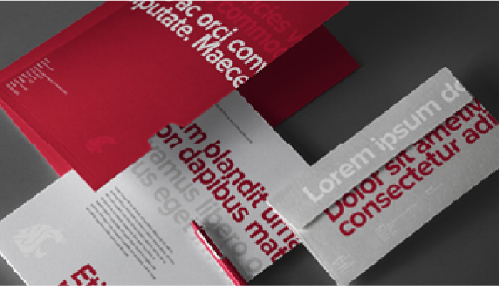
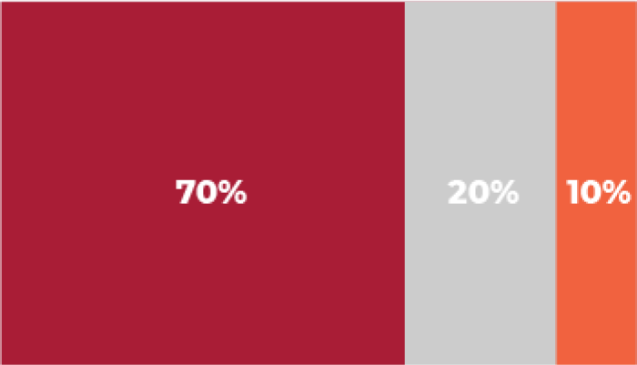
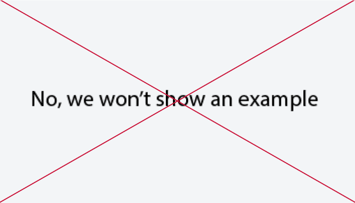

# Page Scan Report

| Field | Value |
|-------|-------|
| URL | https://brand.wsu.edu/colors/ |
| Title | Colors – Washington State University |
| Status | ❌ 0 |
| HTML Size | 59.2 KB |
| Screenshots | 1 (712.2 KB) |
| Images | 6 (500.5 KB) |
| Images Missing Alt | 6 |
| JS Errors | 0 |
| JS Warnings | 0 |
| Auth | none |
| Captured | 2026-02-16T20:38:38.2396858Z |

## Actions

- Screenshot #1: page-loaded (712.2 KB)
- Downloaded 6 images to /images/

## Screenshots

### 1. page-loaded

## Page Images (6)

| # | Image | Alt Text | Size |
|---|-------|----------|------|
| 1 | [Do-Use-crimson-and-gray.jpg](images/Do-Use-crimson-and-gray.jpg) | *(none)* | 204.2 KB |
| 2 | [Do-Apply-the-pallet-in-accordance-to-the-percentages.png](images/Do-Apply-the-pallet-in-accordance-to-the-percentages.png) | *(none)* | 10.4 KB |
| 3 | [Do-Use-gray-variations-for-maximum-legibility.jpg](images/Do-Use-gray-variations-for-maximum-legibility.jpg) | *(none)* | 146.1 KB |
| 4 | [Dont-Use-accent-colors-as-primary.png](images/Dont-Use-accent-colors-as-primary.png) | *(none)* | 19.9 KB |
| 5 | [Dont-Use-another-schools-colors.png](images/Dont-Use-another-schools-colors.png) | *(none)* | 21.6 KB |
| 6 | [Dont-Screen-or-use-as-gradient.jpg](images/Dont-Screen-or-use-as-gradient.jpg) | *(none)* | 98.3 KB |

### Gallery

### ⚠️ Images Missing Alt Text (6)

- `Do-Use-crimson-and-gray.jpg` — https://wpcdn.web.wsu.edu/wp-ucomm/uploads/sites/2793/2021/08/Do-Use-crimson-and-gray.jpg
- `Do-Apply-the-pallet-in-accordance-to-the-percentages.png` — https://wpcdn.web.wsu.edu/wp-ucomm/uploads/sites/2793/2021/08/Do-Apply-the-pallet-in-accordance-to-the-percentages.png
- `Do-Use-gray-variations-for-maximum-legibility.jpg` — https://wpcdn.web.wsu.edu/wp-ucomm/uploads/sites/2793/2021/08/Do-Use-gray-variations-for-maximum-legibility.jpg
- `Dont-Use-accent-colors-as-primary.png` — https://wpcdn.web.wsu.edu/wp-ucomm/uploads/sites/2793/2021/08/Dont-Use-accent-colors-as-primary.png
- `Dont-Use-another-schools-colors.png` — https://wpcdn.web.wsu.edu/wp-ucomm/uploads/sites/2793/2021/08/Dont-Use-another-schools-colors.png
- `Dont-Screen-or-use-as-gradient.jpg` — https://wpcdn.web.wsu.edu/wp-ucomm/uploads/sites/2793/2021/08/Dont-Screen-or-use-as-gradient.jpg

## Files

- `01-page-loaded.png` — page-loaded (712.2 KB)
- `page.html` — rendered HTML content
- `metadata.json` — machine-readable scan data
- `errors.log` — JavaScript console errors
- `warnings.log` — JavaScript console warnings
- `info.log` — navigation and timing details
- `actions.log` — interactions performed on the page
- `images/` — 6 page images (500.5 KB)
