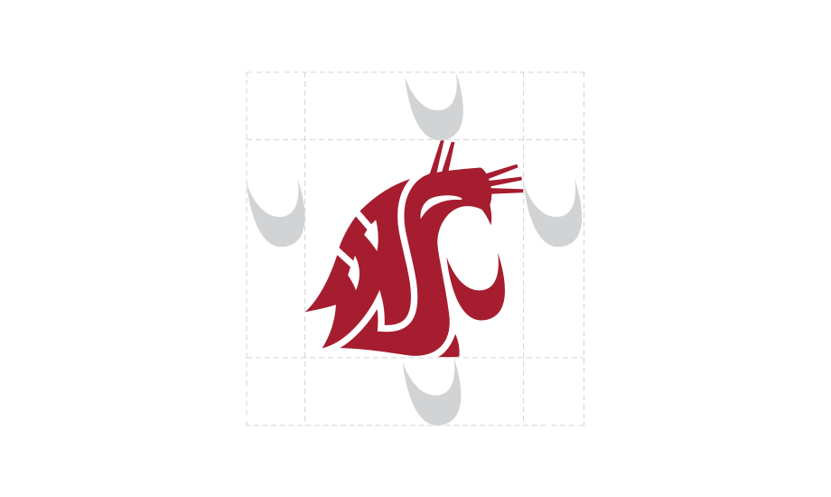
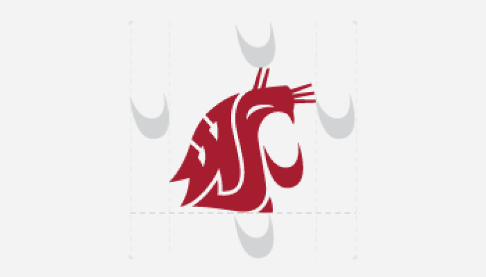
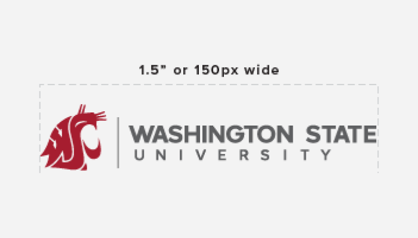
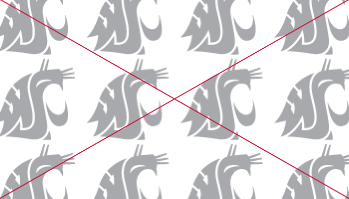
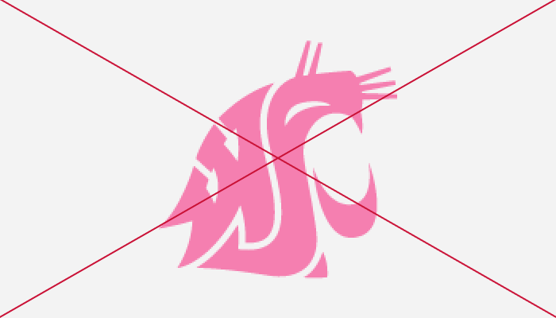
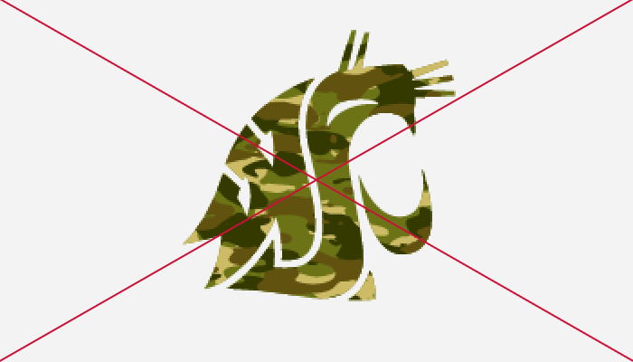
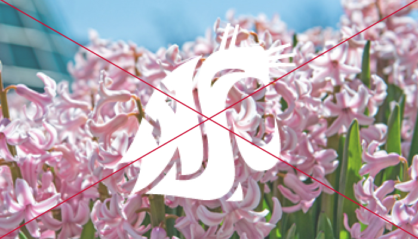
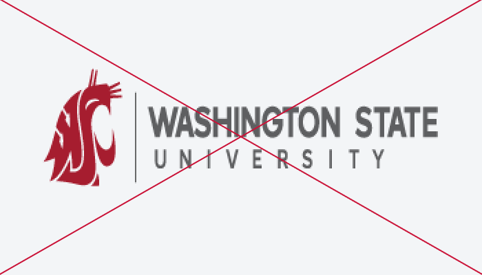
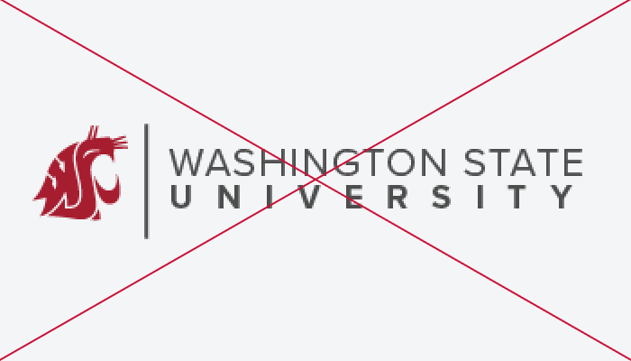

# Page Scan Report

| Field | Value |
|-------|-------|
| URL | https://brand.wsu.edu/logos/ |
| Title | Logos – Washington State University |
| Status | ❌ 0 |
| HTML Size | 95.2 KB |
| Screenshots | 1 (1.1 MB) |
| Images | 17 (671.0 KB) |
| Images Missing Alt | 17 |
| JS Errors | 0 |
| JS Warnings | 0 |
| Auth | none |
| Captured | 2026-02-16T20:59:24.3500349Z |

## Actions

- Screenshot #1: page-loaded (1.1 MB)
- Downloaded 17 images to /images/

## Screenshots

### 1. page-loaded

## Page Images (17)

| # | Image | Alt Text | Size |
|---|-------|----------|------|
| 1 | [clear-space.svg](images/clear-space.svg) | *(none)* | 15.8 KB |
| 2 | [campus-locks-vancouver-1.svg](images/campus-locks-vancouver-1.svg) | *(none)* | 7.0 KB |
| 3 | [campus-lockup-spokane-1.svg](images/campus-lockup-spokane-1.svg) | *(none)* | 6.9 KB |
| 4 | [wsu-state-white.svg](images/wsu-state-white.svg) | *(none)* | 1.6 KB |
| 5 | [wsu-state-crimson.svg](images/wsu-state-crimson.svg) | *(none)* | 1.6 KB |
| 6 | [Do-Use-appropriate-spacing.png](images/Do-Use-appropriate-spacing.png) | *(none)* | 25.3 KB |
| 7 | [Do-Follow-minimum-size-requirements.png](images/Do-Follow-minimum-size-requirements.png) | *(none)* | 27.2 KB |
| 8 | [Do-Use-approved-Logos.png](images/Do-Use-approved-Logos.png) | *(none)* | 20.6 KB |
| 9 | [Dont-Streach-or-modify.png](images/Dont-Streach-or-modify.png) | *(none)* | 30.4 KB |
| 10 | [Dont-Use-to-in-background.png](images/Dont-Use-to-in-background.png) | *(none)* | 36.6 KB |
| 11 | [Dont-Crop.png](images/Dont-Crop.png) | *(none)* | 16.3 KB |
| 12 | [Dont-Use-non-primary-colors.png](images/Dont-Use-non-primary-colors.png) | *(none)* | 14.8 KB |
| 13 | [Dont-Fill-with-pattern-or-gradient.png](images/Dont-Fill-with-pattern-or-gradient.png) | *(none)* | 27.0 KB |
| 14 | [Dont-Use-colors-outside-of-primary-or-secondary.jpg](images/Dont-Use-colors-outside-of-primary-or-secondary.jpg) | *(none)* | 368.8 KB |
| 15 | [Dont-Streach-or-squish.png](images/Dont-Streach-or-squish.png) | *(none)* | 17.1 KB |
| 16 | [Dont-Recreate-the-logo.png](images/Dont-Recreate-the-logo.png) | *(none)* | 14.7 KB |
| 17 | [Dont-Incorporate-or-combine-logos.png](images/Dont-Incorporate-or-combine-logos.png) | *(none)* | 39.3 KB |

### Gallery

### ⚠️ Images Missing Alt Text (17)

- `clear-space.svg` — https://wpcdn.web.wsu.edu/wp-ucomm/uploads/sites/2793/2021/08/clear-space.svg
- `campus-locks-vancouver-1.svg` — https://wpcdn.web.wsu.edu/wp-ucomm/uploads/sites/2793/2021/09/campus-locks-vancouver-1.svg
- `campus-lockup-spokane-1.svg` — https://wpcdn.web.wsu.edu/wp-ucomm/uploads/sites/2793/2021/09/campus-lockup-spokane-1.svg
- `wsu-state-white.svg` — https://wpcdn.web.wsu.edu/wp-ucomm/uploads/sites/2793/2021/08/wsu-state-white.svg
- `wsu-state-crimson.svg` — https://wpcdn.web.wsu.edu/wp-ucomm/uploads/sites/2793/2021/08/wsu-state-crimson.svg
- `Do-Use-appropriate-spacing.png` — https://wpcdn.web.wsu.edu/wp-ucomm/uploads/sites/2793/2021/08/Do-Use-appropriate-spacing.png
- `Do-Follow-minimum-size-requirements.png` — https://wpcdn.web.wsu.edu/wp-ucomm/uploads/sites/2793/2021/08/Do-Follow-minimum-size-requirements.png
- `Do-Use-approved-Logos.png` — https://wpcdn.web.wsu.edu/wp-ucomm/uploads/sites/2793/2021/08/Do-Use-approved-Logos.png
- `Dont-Streach-or-modify.png` — https://wpcdn.web.wsu.edu/wp-ucomm/uploads/sites/2793/2021/08/Dont-Streach-or-modify.png
- `Dont-Use-to-in-background.png` — https://wpcdn.web.wsu.edu/wp-ucomm/uploads/sites/2793/2021/08/Dont-Use-to-in-background.png
- `Dont-Crop.png` — https://wpcdn.web.wsu.edu/wp-ucomm/uploads/sites/2793/2021/08/Dont-Crop.png
- `Dont-Use-non-primary-colors.png` — https://wpcdn.web.wsu.edu/wp-ucomm/uploads/sites/2793/2021/08/Dont-Use-non-primary-colors.png
- `Dont-Fill-with-pattern-or-gradient.png` — https://wpcdn.web.wsu.edu/wp-ucomm/uploads/sites/2793/2021/08/Dont-Fill-with-pattern-or-gradient.png
- `Dont-Use-colors-outside-of-primary-or-secondary.jpg` — https://wpcdn.web.wsu.edu/wp-ucomm/uploads/sites/2793/2021/08/Dont-Use-colors-outside-of-primary-or-secondary.jpg
- `Dont-Streach-or-squish.png` — https://wpcdn.web.wsu.edu/wp-ucomm/uploads/sites/2793/2021/08/Dont-Streach-or-squish.png
- `Dont-Recreate-the-logo.png` — https://wpcdn.web.wsu.edu/wp-ucomm/uploads/sites/2793/2021/08/Dont-Recreate-the-logo.png
- `Dont-Incorporate-or-combine-logos.png` — https://wpcdn.web.wsu.edu/wp-ucomm/uploads/sites/2793/2021/08/Dont-Incorporate-or-combine-logos.png

## Files

- `01-page-loaded.png` — page-loaded (1.1 MB)
- `page.html` — rendered HTML content
- `metadata.json` — machine-readable scan data
- `errors.log` — JavaScript console errors
- `warnings.log` — JavaScript console warnings
- `info.log` — navigation and timing details
- `actions.log` — interactions performed on the page
- `images/` — 17 page images (671.0 KB)
