# Page Scan Report

| Field | Value |
|-------|-------|
| URL | https://brand.wsu.edu/typography/ |
| Title | Typography – Washington State University |
| Status | ❌ 0 |
| HTML Size | 79.9 KB |
| Screenshots | 1 (547.9 KB) |
| Images | 12 (532.2 KB) |
| Images Missing Alt | 12 |
| JS Errors | 0 |
| JS Warnings | 0 |
| Auth | none |
| Captured | 2026-02-16T21:00:14.4676997Z |

## Actions

- Screenshot #1: page-loaded (547.9 KB)
- Downloaded 12 images to /images/

## Screenshots

### 1. page-loaded

## Page Images (12)

| # | Image | Alt Text | Size |
|---|-------|----------|------|
| 1 | [Proxima-Nova.svg](images/Proxima-Nova.svg) | *(none)* | 28.6 KB |
| 2 | [Proxima-Nova-Options.svg](images/Proxima-Nova-Options.svg) | *(none)* | 47.7 KB |
| 3 | [FreightBig-Pro.svg](images/FreightBig-Pro.svg) | *(none)* | 50.4 KB |
| 4 | [FreightBig-Pro-Options.svg](images/FreightBig-Pro-Options.svg) | *(none)* | 52.3 KB |
| 5 | [Montserrat.svg](images/Montserrat.svg) | *(none)* | 36.2 KB |
| 6 | [Montserrat-Options.svg](images/Montserrat-Options.svg) | *(none)* | 66.6 KB |
| 7 | [Corbel-Arial.svg](images/Corbel-Arial.svg) | *(none)* | 6.5 KB |
| 8 | [Baskerville-Old-Face.svg](images/Baskerville-Old-Face.svg) | *(none)* | 17.0 KB |
| 9 | [typography-table.svg](images/typography-table.svg) | *(none)* | 75.4 KB |
| 10 | [Do-Use-appropriate-typefaces.png](images/Do-Use-appropriate-typefaces.png) | *(none)* | 21.0 KB |
| 11 | [Do-Use-approved-typeface-versions.png](images/Do-Use-approved-typeface-versions.png) | *(none)* | 101.7 KB |
| 12 | [Dont-Change-the-type.png](images/Dont-Change-the-type.png) | *(none)* | 28.7 KB |

### Gallery

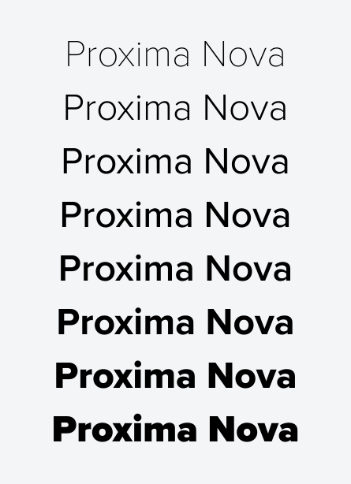

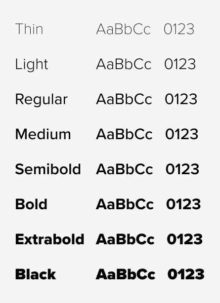

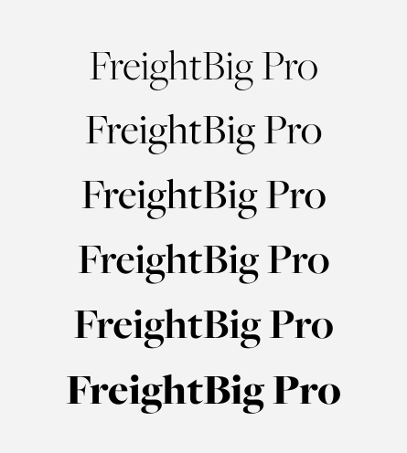

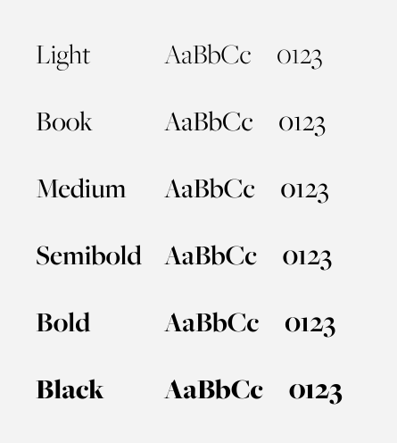

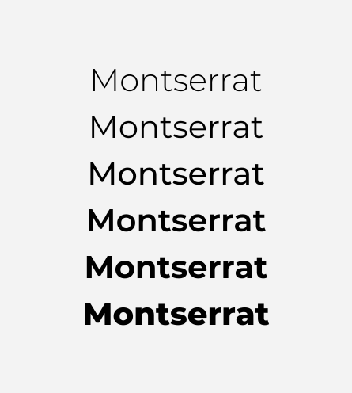

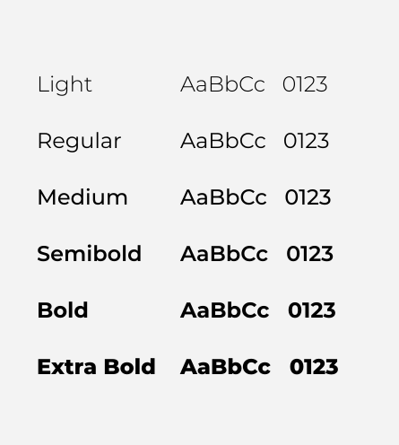

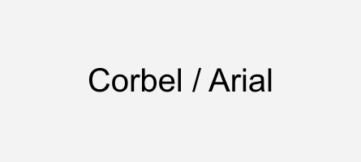

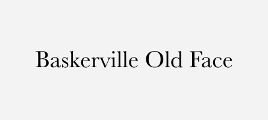

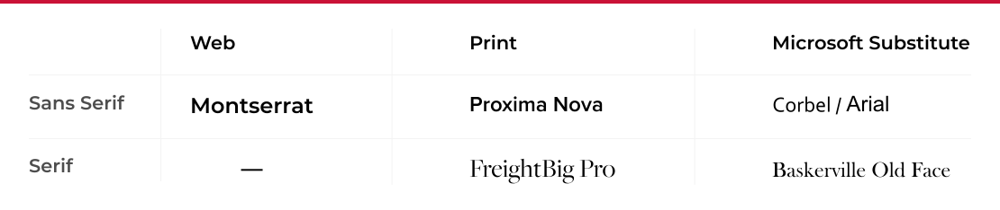

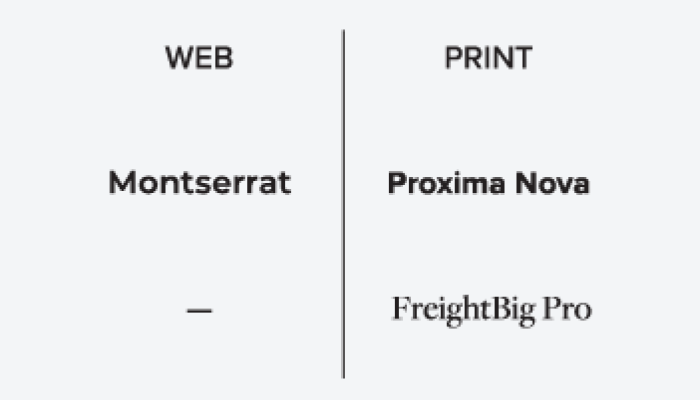

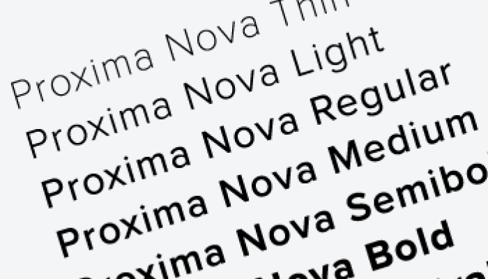

### ⚠️ Images Missing Alt Text (12)

- `Proxima-Nova.svg` — https://wpcdn.web.wsu.edu/wp-ucomm/uploads/sites/2793/2021/08/Proxima-Nova.svg
- `Proxima-Nova-Options.svg` — https://wpcdn.web.wsu.edu/wp-ucomm/uploads/sites/2793/2021/08/Proxima-Nova-Options.svg
- `FreightBig-Pro.svg` — https://wpcdn.web.wsu.edu/wp-ucomm/uploads/sites/2793/2021/08/FreightBig-Pro.svg
- `FreightBig-Pro-Options.svg` — https://wpcdn.web.wsu.edu/wp-ucomm/uploads/sites/2793/2021/08/FreightBig-Pro-Options.svg
- `Montserrat.svg` — https://wpcdn.web.wsu.edu/wp-ucomm/uploads/sites/2793/2021/08/Montserrat.svg
- `Montserrat-Options.svg` — https://wpcdn.web.wsu.edu/wp-ucomm/uploads/sites/2793/2021/08/Montserrat-Options.svg
- `Corbel-Arial.svg` — https://wpcdn.web.wsu.edu/wp-ucomm/uploads/sites/2793/2021/08/Corbel-Arial.svg
- `Baskerville-Old-Face.svg` — https://wpcdn.web.wsu.edu/wp-ucomm/uploads/sites/2793/2021/08/Baskerville-Old-Face.svg
- `typography-table.svg` — https://wpcdn.web.wsu.edu/wp-ucomm/uploads/sites/2793/2021/09/typography-table.svg
- `Do-Use-appropriate-typefaces.png` — https://wpcdn.web.wsu.edu/wp-ucomm/uploads/sites/2793/2021/08/Do-Use-appropriate-typefaces.png
- `Do-Use-approved-typeface-versions.png` — https://wpcdn.web.wsu.edu/wp-ucomm/uploads/sites/2793/2021/08/Do-Use-approved-typeface-versions.png
- `Dont-Change-the-type.png` — https://wpcdn.web.wsu.edu/wp-ucomm/uploads/sites/2793/2021/08/Dont-Change-the-type.png

## Files

- `01-page-loaded.png` — page-loaded (547.9 KB)
- `page.html` — rendered HTML content
- `metadata.json` — machine-readable scan data
- `errors.log` — JavaScript console errors
- `warnings.log` — JavaScript console warnings
- `info.log` — navigation and timing details
- `actions.log` — interactions performed on the page
- `images/` — 12 page images (532.2 KB)
