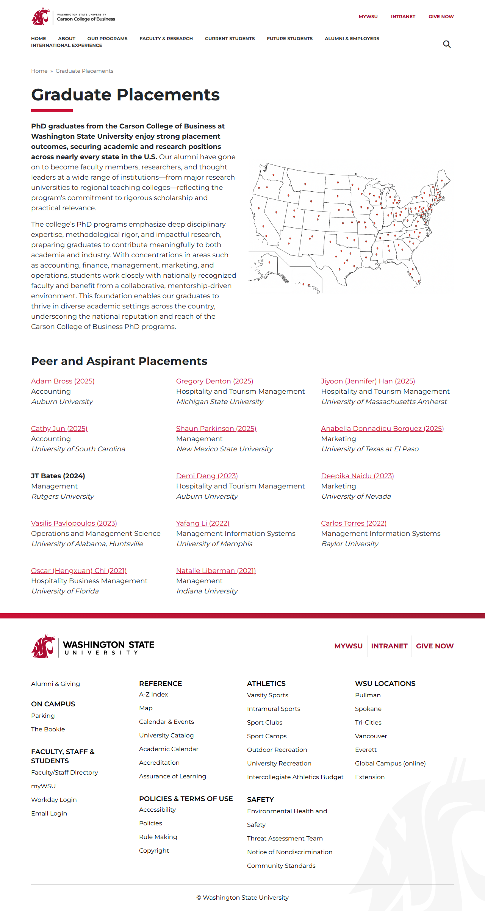
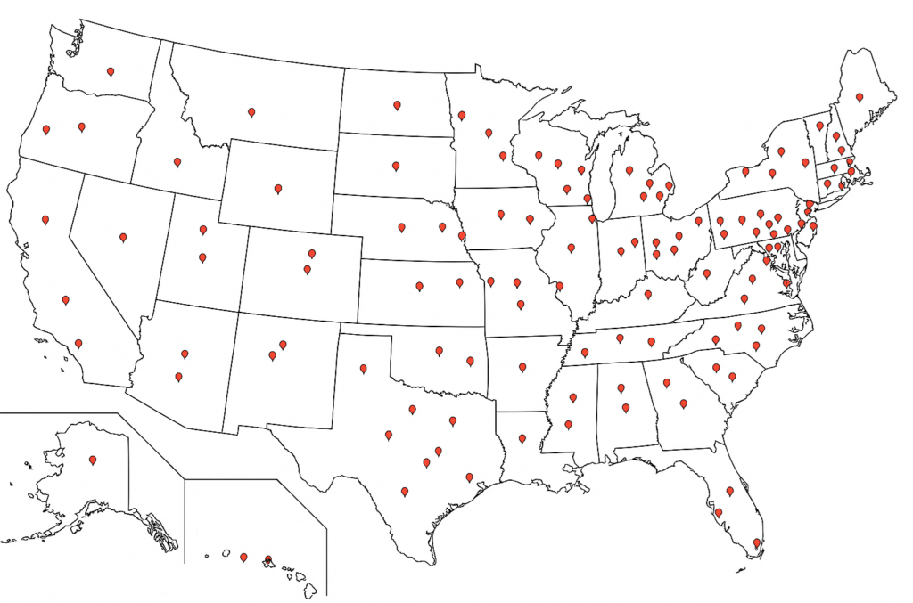

# 📄 Page Scan Report

> **URL:** https://business.wsu.edu/graduate/  
> **Captured:** 2026-02-16 22:13:31 UTC  
> **Status:** ✅ 200  

---

## 📑 Contents

- [Summary](#-summary)
- [Screenshots](#-screenshots)
- [Page Images](#-page-images)
- [JavaScript Errors](#-javascript-errors)
- [Actions](#-actions)
- [Files](#-files)

---

## 📋 Summary

| Field | Value |
|-------|-------|
| URL | https://business.wsu.edu/graduate/ |
| Redirected To | https://business.wsu.edu/graduate-placements/ |
| Title | Graduate Placements - Carson College of Business | Washington State University |
| Status | ✅ 200 |
| HTML Size | 181.2 KB |
| Screenshots | 1 (541.4 KB) |
| Images | 4 (526.2 KB) |
| Images Missing Alt | ⚠️ 1 |
| JS Errors | 🔴 2 |
| JS Warnings | 0 |
| Auth | none |
| Captured | 2026-02-16T22:13:31.5210485Z |

## 🔴 JavaScript Errors

<details>
<summary><strong>2 error(s) detected</strong></summary>

```
Failed to load resource: the server responded with a status of 405 ()
Failed to load resource: the server responded with a status of 404 ()
```

</details>

## 🔧 Actions

<details>
<summary><strong>2 action(s) performed</strong></summary>

- Screenshot #1: page-loaded (541.4 KB)
- Downloaded 4 images to /images/

</details>

## 📸 Screenshots

<table>
<tr>
<td align="center" width="50%">
<a href="01-page-loaded.png">

</a>
<br /><strong>1. page-loaded</strong>
<br /><sub>541.4 KB</sub>
</td>
<td></td>
</tr>
</table>

## 🖼️ Page Images (4)

<details open>
<summary><strong>📋 Image Index</strong> — 4 images, 526.2 KB</summary>

| # | Image | Alt Text | Size |
|--:|-------|----------|-----:|
| 1 | [wsu-logo.svg](images/wsu-logo.svg) | Carson College of Business \| Washing... | 33.8 KB |
| 2 | [Placement-Map-v2-1024x677.png](images/Placement-Map-v2-1024x677.png) | Map of the United States with red mar... | 476.6 KB |
| 3 | [wsu-mascot-logo.svg](images/wsu-mascot-logo.svg) | ⚠️ *(missing)* | 5.3 KB |
| 4 | [wsu-logo-1.svg](images/wsu-logo-1.svg) | drglow-footer-logo | 10.5 KB |

</details>

<details open>
<summary><strong>🖼️ Gallery</strong></summary>

<table>
<tr>
<td align="center" width="33%">
<a href="images/wsu-logo.svg">

</a>
<br /><sub>wsu-logo.svg</sub>
</td>
<td align="center" width="33%">
<a href="images/Placement-Map-v2-1024x677.png">

</a>
<br /><sub>Placement-Map-v2-1024x677.png</sub>
</td>
<td align="center" width="33%">
<a href="images/wsu-mascot-logo.svg">

</a>
<br /><sub>wsu-mascot-logo.svg ⚠️</sub>
</td>
</tr>
<tr>
<td align="center" width="33%">
<a href="images/wsu-logo-1.svg">

</a>
<br /><sub>wsu-logo-1.svg</sub>
</td>
<td></td>
<td></td>
</tr>
</table>

</details>

<details>
<summary>⚠️ <strong>Images Missing Alt Text</strong> (1)</summary>

| Image | Source URL |
|-------|-----------|
| `wsu-mascot-logo.svg` | https://wpcdn.web.wsu.edu/wp-business/uploads/sites/3076/2023/06/wsu-mascot-l... |

</details>

## 📁 Files

| File | Description |
|------|-------------|
| `01-page-loaded.png` | page-loaded (541.4 KB) |
| `page.html` | Rendered HTML content |
| `metadata.json` | Machine-readable scan data |
| `errors.log` | JavaScript console errors |
| `warnings.log` | JavaScript console warnings |
| `info.log` | Navigation and timing details |
| `actions.log` | Interactions performed |
| `images/` | 4 page images (526.2 KB) |

---

*Generated by AccessibilityScanner (FreeTools) v1.0*
