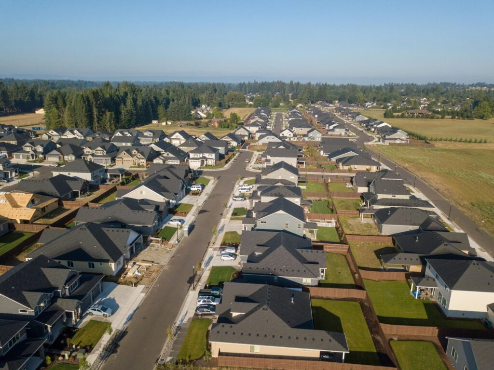

# Page Scan Report

| Field | Value |
|-------|-------|
| URL | https://cahnrs.wsu.edu/ |
| Title | College of Agricultural, Human, and Natural Resource Sciences | Washington State University |
| Status | ❌ 0 |
| HTML Size | 270.9 KB |
| Screenshots | 1 (2.2 MB) |
| Images | 20 (3.3 MB) |
| Images Missing Alt | 0 |
| JS Errors | 0 |
| JS Warnings | 0 |
| Auth | none |
| Captured | 2026-02-16T20:58:42.4465361Z |

## Actions

- Screenshot #1: page-loaded (2.2 MB)
- Downloaded 20 images to /images/

## Screenshots

### 1. page-loaded

## Page Images (20)

| # | Image | Alt Text | Size |
|---|-------|----------|------|
| 1 | [Potatoes.jpg](images/Potatoes.jpg) | Close-up of potatoes in the field. In... | 402.7 KB |
| 2 | [53973329437_f76e3cb4fe_k.jpg](images/53973329437_f76e3cb4fe_k.jpg) | CAHNRS Academic Programs. | 561.5 KB |
| 3 | [researchers-flying-drone-over-orchard-1024x676.jpg](images/researchers-flying-drone-over-orchard-1024x676.jpg) | Drone users at orchard- WSU Photo | 165.0 KB |
| 4 | [AdobeStock_159177904-1024x684.jpeg](images/AdobeStock_159177904-1024x684.jpeg) | Young couple is holding hands backlit... | 79.4 KB |
| 5 | [CAHNRS-Dean-Raj-Khosla-1920-1024x683.jpg](images/CAHNRS-Dean-Raj-Khosla-1920-1024x683.jpg) | Dean Raj Khosla. | 138.2 KB |
| 6 | [image-6.jpg](images/image-6.jpg) | Michelle Moyer holds the Walter Clore... | 143.5 KB |
| 7 | [Ashley-Hall-Instructing-1024x768.jpeg](images/Ashley-Hall-Instructing-1024x768.jpeg) | A person stands at a table, holding a... | 127.5 KB |
| 8 | [Diane-Smith-giving-speech-1024x683.jpg](images/Diane-Smith-giving-speech-1024x683.jpg) | Diane Smith gives talking at podium. ... | 86.9 KB |
| 9 | [Featured-Image-Margaret-1024x609.jpg](images/Featured-Image-Margaret-1024x609.jpg) | Margaret Viebrock sitting at a desk d... | 152.9 KB |
| 10 | [Susie-Craig.jpg](images/Susie-Craig.jpg) | WSU Extension Professor Susie Craig. | 25.0 KB |
| 11 | [897A9233-1024x683.jpg](images/897A9233-1024x683.jpg) | Zhihua Jiang in lab | 187.0 KB |
| 12 | [JD-Baser-1.jpg](images/JD-Baser-1.jpg) | Formal portrait of J.D. Baser. | 64.8 KB |
| 13 | [897A9413-1024x683.jpg](images/897A9413-1024x683.jpg) | Min Du, Baxter Chair | 148.0 KB |
| 14 | [CAHNRS-for-ALL-2025-AOB-2048x1326-1-1024x663.jpg](images/CAHNRS-for-ALL-2025-AOB-2048x1326-1-1024x663.jpg) | CAHNRS For All: Access, Opportunity, ... | 145.4 KB |
| 15 | [Jeff-Wall-Crabapple-tree-1024x768.jpeg](images/Jeff-Wall-Crabapple-tree-1024x768.jpeg) | Jeff Wall, Department of Horticulture | 150.3 KB |
| 16 | [image-16.jpg](images/image-16.jpg) | Aerial view of new Vancouver, Washing... | 142.0 KB |
| 17 | [NancyDeringer_4710-2-copy-1024x683.jpeg](images/NancyDeringer_4710-2-copy-1024x683.jpeg) | Headshot of Nancy Deringer. | 58.6 KB |
| 18 | [IMG_4904-1024x955.jpeg](images/IMG_4904-1024x955.jpeg) | Melissa Hansen pictured in front of m... | 221.8 KB |
| 19 | [AdobeStock_1820532380-1024x683.jpeg](images/AdobeStock_1820532380-1024x683.jpeg) | Forest professional- stock photo | 249.2 KB |
| 20 | [AdobeStock_76098398-1024x683.jpeg](images/AdobeStock_76098398-1024x683.jpeg) | A student in a classroom raises her h... | 83.6 KB |

### Gallery

## Files

- `01-page-loaded.png` — page-loaded (2.2 MB)
- `page.html` — rendered HTML content
- `metadata.json` — machine-readable scan data
- `errors.log` — JavaScript console errors
- `warnings.log` — JavaScript console warnings
- `info.log` — navigation and timing details
- `actions.log` — interactions performed on the page
- `images/` — 20 page images (3.3 MB)
