# 📄 Page Scan Report

> **URL:** https://cahnrs.wsu.edu/  
> **Captured:** 2026-02-16 22:13:39 UTC  
> **Status:** ✅ 200  

---

## 📑 Contents

- [Summary](#-summary)
- [Screenshots](#-screenshots)
- [Page Images](#-page-images)
- [Actions](#-actions)
- [Files](#-files)

---

## 📋 Summary

| Field | Value |
|-------|-------|
| URL | https://cahnrs.wsu.edu/ |
| Title | College of Agricultural, Human, and Natural Resource Sciences | Washington State University |
| Status | ✅ 200 |
| HTML Size | 276.5 KB |
| Screenshots | 1 (1.7 MB) |
| Images | 24 (7.2 MB) |
| Images Missing Alt | ✅ 0 |
| JS Errors | ✅ 0 |
| JS Warnings | 0 |
| Auth | none |
| Captured | 2026-02-16T22:13:39.1178749Z |

## 🔧 Actions

<strong>2 action(s) performed</strong>

- Screenshot #1: page-loaded (1.7 MB)
- Downloaded 24 images to /images/

## 📸 Screenshots

<table>
<tr>
<td align="center" width="50%">

 <strong>1. page-loaded</strong>
 1.7 MB
</td>
<td></td>
</tr>
</table>

## 🖼️ Page Images (24)

<strong>📋 Image Index</strong> — 24 images, 7.2 MB

| # | Image | Alt Text | Size |
|--:|-------|----------|-----:|
| 1 | [Potatoes.jpg](images/Potatoes.jpg) | Close-up of potatoes in the field. In... | 402.7 KB |
| 2 | [53973329437_f76e3cb4fe_k.jpg](images/53973329437_f76e3cb4fe_k.jpg) | CAHNRS Academic Programs. | 561.5 KB |
| 3 | [Wine-barrell-examine-whose-photo_.jpg](images/Wine-barrell-examine-whose-photo_.jpg) | CAHNRS Office of Research. | 804.8 KB |
| 4 | [Lee-TFREC-Hubner-photo.jpg](images/Lee-TFREC-Hubner-photo.jpg) | WSU Extension. | 688.9 KB |
| 5 | [Screenshot-2026-02-09-at-1.49.37%E2%80%AFPM-1024x686.png](images/Screenshot-2026-02-09-at-1.49.37%E2%80%AFPM-1024x686.png) | Cover crop seed mixes | 1.2 MB |
| 6 | [researchers-flying-drone-over-orchard-1024x676.jpg](images/researchers-flying-drone-over-orchard-1024x676.jpg) | Drone users at orchard- WSU Photo | 165.0 KB |
| 7 | [AdobeStock_159177904-1024x684.jpeg](images/AdobeStock_159177904-1024x684.jpeg) | Young couple is holding hands backlit... | 79.4 KB |
| 8 | [CAHNRS-Dean-Raj-Khosla-1920-1024x683.jpg](images/CAHNRS-Dean-Raj-Khosla-1920-1024x683.jpg) | Dean Raj Khosla. | 138.2 KB |
| 9 | [image-9.jpg](images/image-9.jpg) | Michelle Moyer holds the Walter Clore... | 143.5 KB |
| 10 | [Ashley-Hall-Instructing-1024x768.jpeg](images/Ashley-Hall-Instructing-1024x768.jpeg) | A person stands at a table, holding a... | 127.5 KB |
| 11 | [Diane-Smith-giving-speech-1024x683.jpg](images/Diane-Smith-giving-speech-1024x683.jpg) | Diane Smith gives talking at podium. ... | 86.9 KB |
| 12 | [Featured-Image-Margaret-1024x609.jpg](images/Featured-Image-Margaret-1024x609.jpg) | Margaret Viebrock sitting at a desk d... | 152.9 KB |
| 13 | [Susie-Craig.jpg](images/Susie-Craig.jpg) | WSU Extension Professor Susie Craig. | 25.0 KB |
| 14 | [897A9233-1024x683.jpg](images/897A9233-1024x683.jpg) | Zhihua Jiang in lab | 187.0 KB |
| 15 | [JD-Baser-1.jpg](images/JD-Baser-1.jpg) | Formal portrait of J.D. Baser. | 64.8 KB |
| 16 | [897A9413-1024x683.jpg](images/897A9413-1024x683.jpg) | Min Du, Baxter Chair | 148.0 KB |
| 17 | [CAHNRS-for-ALL-2025-AOB-2048x1326-1-1024x663.jpg](images/CAHNRS-for-ALL-2025-AOB-2048x1326-1-1024x663.jpg) | CAHNRS For All: Access, Opportunity, ... | 145.4 KB |
| 18 | [Jeff-Wall-Crabapple-tree-1024x768.jpeg](images/Jeff-Wall-Crabapple-tree-1024x768.jpeg) | Jeff Wall, Department of Horticulture | 150.3 KB |
| 19 | [image-19.jpg](images/image-19.jpg) | Aerial view of new Vancouver, Washing... | 142.0 KB |
| 20 | [NancyDeringer_4710-2-copy-1024x683.jpeg](images/NancyDeringer_4710-2-copy-1024x683.jpeg) | Headshot of Nancy Deringer. | 58.6 KB |
| 21 | [IMG_4904-1024x955.jpeg](images/IMG_4904-1024x955.jpeg) | Melissa Hansen pictured in front of m... | 221.8 KB |
| 22 | [AdobeStock_1820532380-1024x683.jpeg](images/AdobeStock_1820532380-1024x683.jpeg) | Forest professional- stock photo | 249.2 KB |
| 23 | [AdobeStock_76098398-1024x683.jpeg](images/AdobeStock_76098398-1024x683.jpeg) | A student in a classroom raises her h... | 83.6 KB |
| 24 | [elbatansieghead-1024x990.png](images/elbatansieghead-1024x990.png) | Headshot of Sieg Snapp. | 1.3 MB |

<strong>🖼️ Gallery</strong>

<table>
<tr>
<td align="center" width="33%">
<a href="images/Potatoes.jpg">
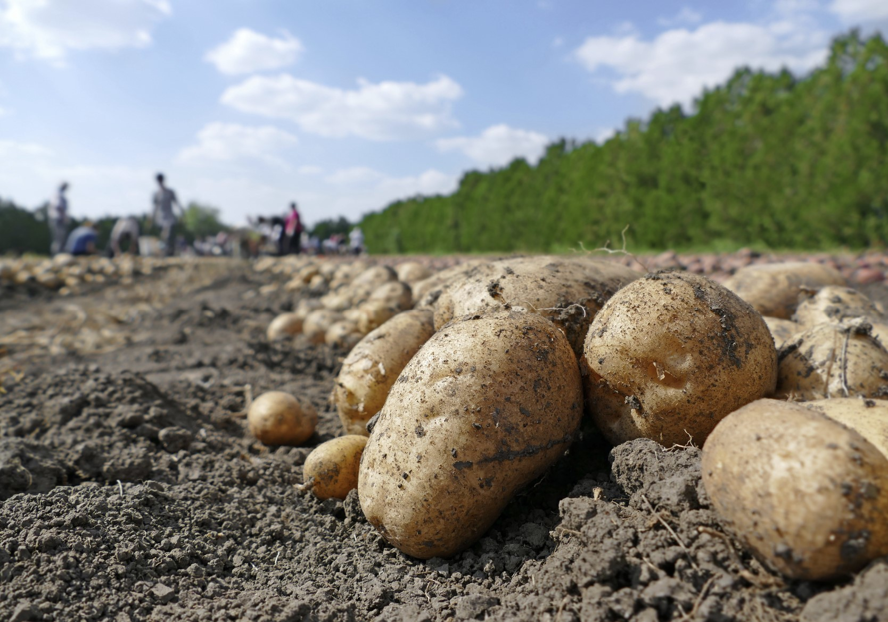
</a>
 Potatoes.jpg
</td>
<td align="center" width="33%">
<a href="images/53973329437_f76e3cb4fe_k.jpg">
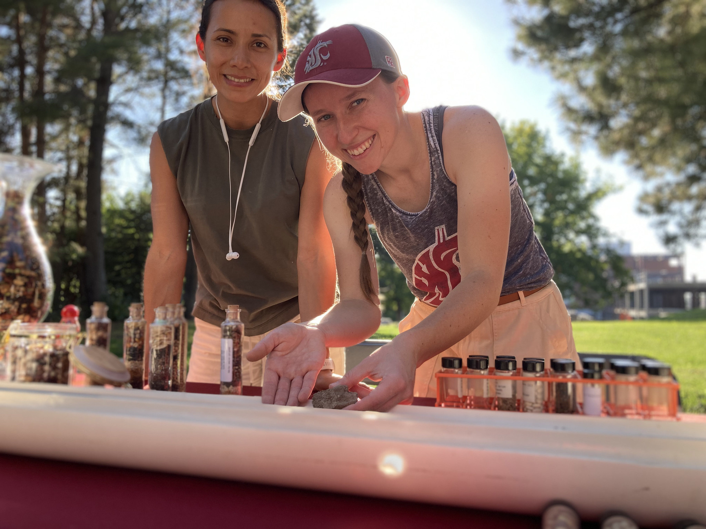
</a>
 53973329437_f76e3cb4fe_k.jpg
</td>
<td align="center" width="33%">
<a href="images/Wine-barrell-examine-whose-photo_.jpg">
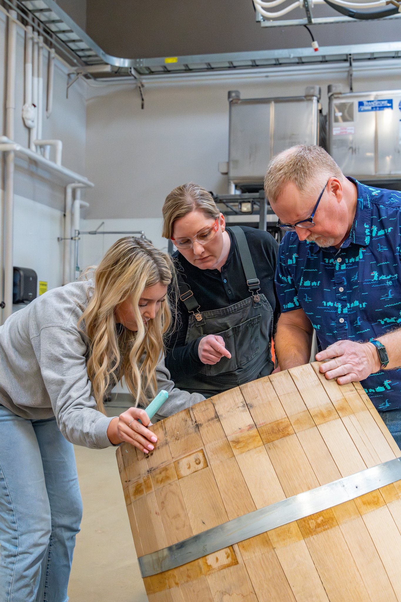
</a>
 Wine-barrell-examine-whose-photo_.jpg
</td>
</tr>
<tr>
<td align="center" width="33%">
<a href="images/Lee-TFREC-Hubner-photo.jpg">
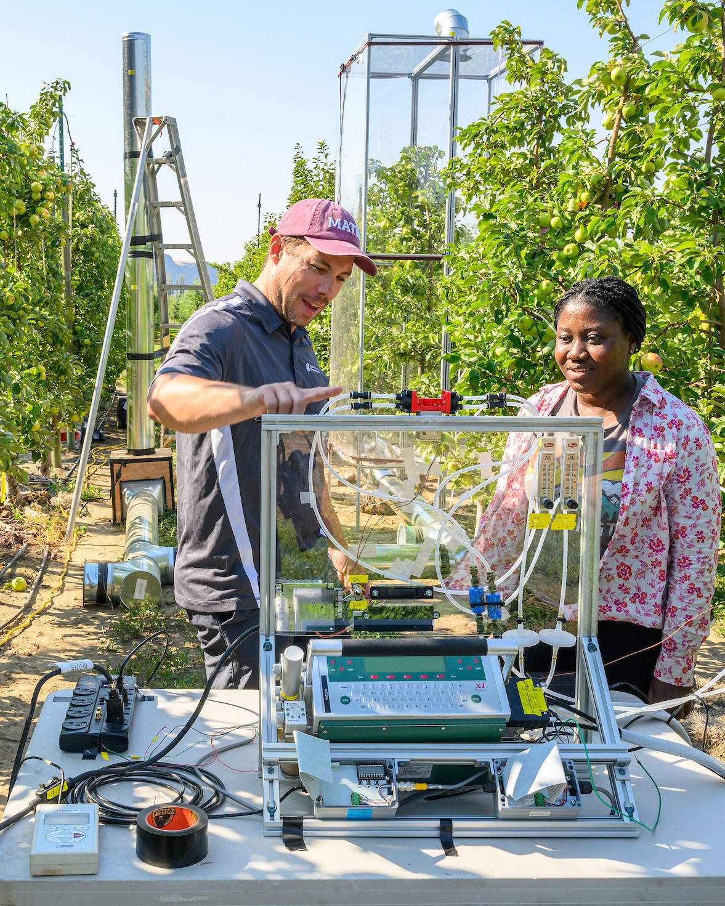
</a>
 Lee-TFREC-Hubner-photo.jpg
</td>
<td align="center" width="33%">

 Screenshot-2026-02-09-at-1.49.37%E2%80%AFPM-1024x686.png
</td>
<td align="center" width="33%">

 researchers-flying-drone-over-orchard-1024x676.jpg
</td>
</tr>
<tr>
<td align="center" width="33%">

 AdobeStock_159177904-1024x684.jpeg
</td>
<td align="center" width="33%">
<a href="images/CAHNRS-Dean-Raj-Khosla-1920-1024x683.jpg">
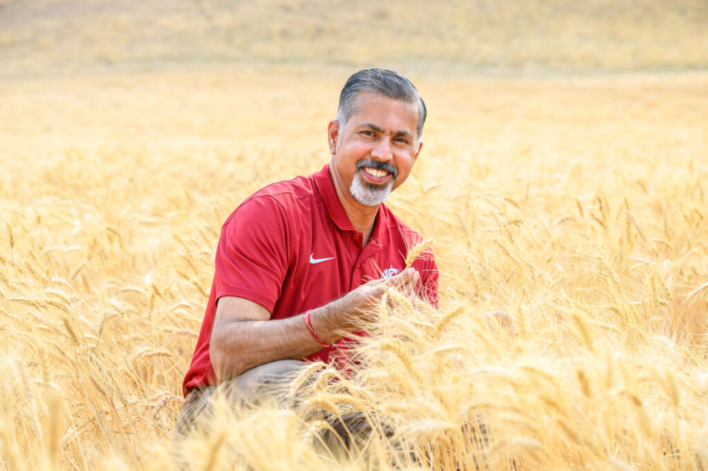
</a>
 CAHNRS-Dean-Raj-Khosla-1920-1024x683.jpg
</td>
<td align="center" width="33%">
<a href="images/image-9.jpg">
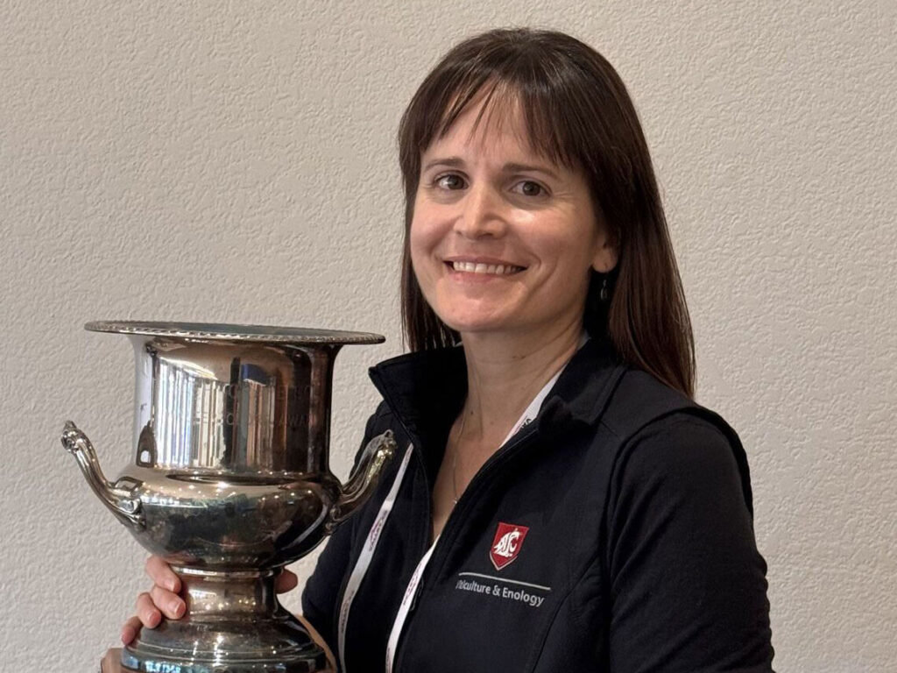
</a>
 image-9.jpg
</td>
</tr>
<tr>
<td align="center" width="33%">
<a href="images/Ashley-Hall-Instructing-1024x768.jpeg">
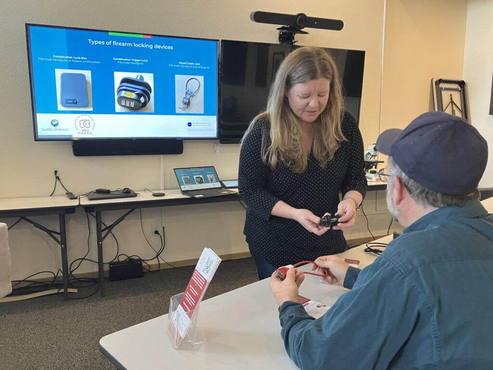
</a>
 Ashley-Hall-Instructing-1024x768.jpeg
</td>
<td align="center" width="33%">
<a href="images/Diane-Smith-giving-speech-1024x683.jpg">
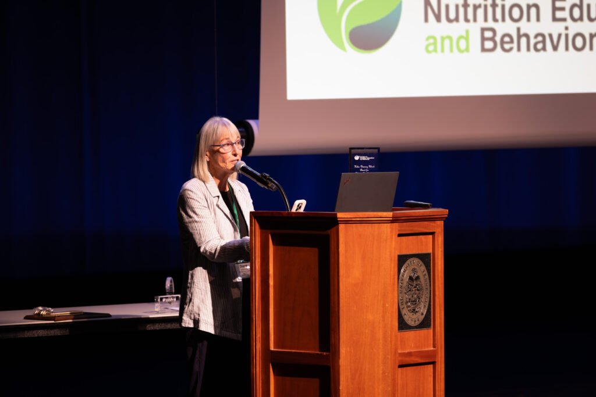
</a>
 Diane-Smith-giving-speech-1024x683.jpg
</td>
<td align="center" width="33%">
<a href="images/Featured-Image-Margaret-1024x609.jpg">
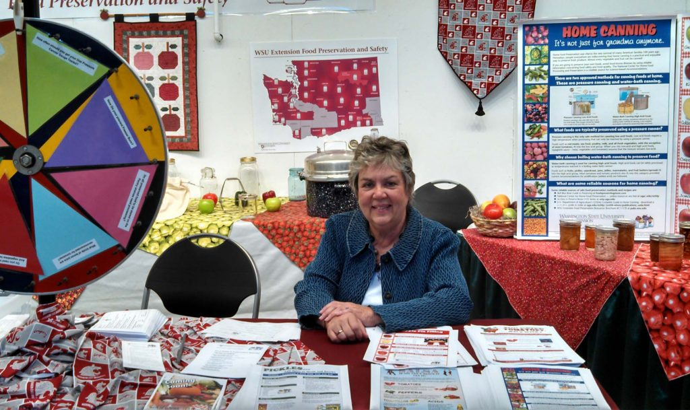
</a>
 Featured-Image-Margaret-1024x609.jpg
</td>
</tr>
<tr>
<td align="center" width="33%">

 Susie-Craig.jpg
</td>
<td align="center" width="33%">
<a href="images/897A9233-1024x683.jpg">
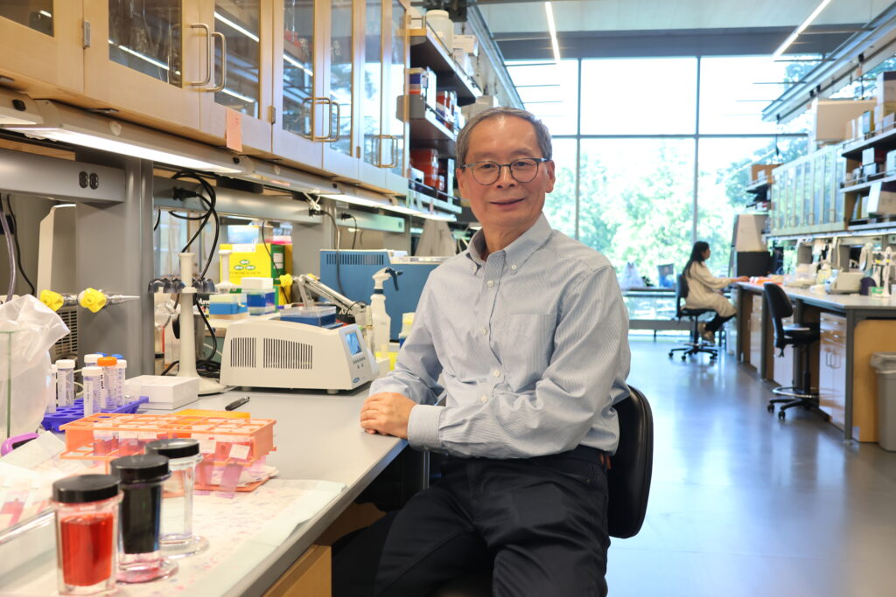
</a>
 897A9233-1024x683.jpg
</td>
<td align="center" width="33%">

 JD-Baser-1.jpg
</td>
</tr>
<tr>
<td align="center" width="33%">
<a href="images/897A9413-1024x683.jpg">
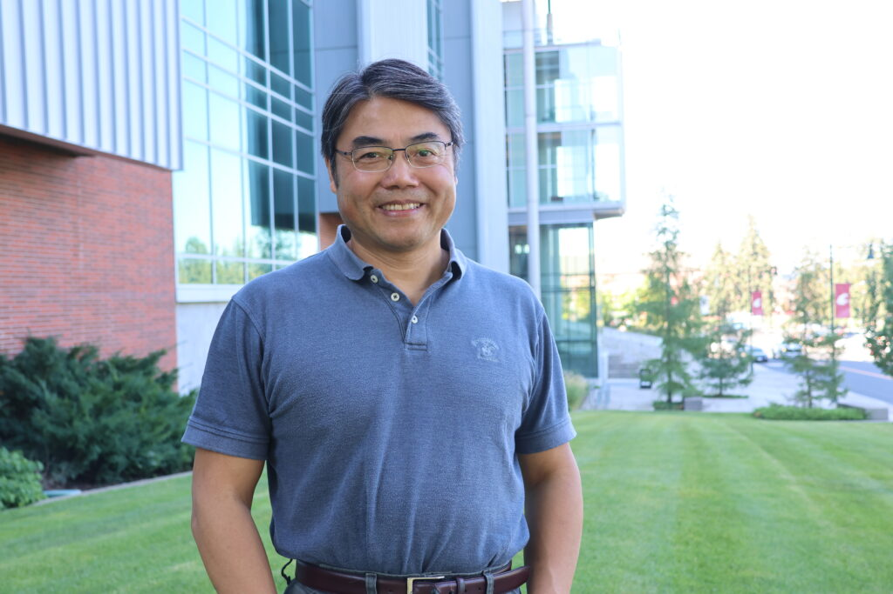
</a>
 897A9413-1024x683.jpg
</td>
<td align="center" width="33%">

 CAHNRS-for-ALL-2025-AOB-2048x1326-1-1024x663.jpg
</td>
<td align="center" width="33%">

 Jeff-Wall-Crabapple-tree-1024x768.jpeg
</td>
</tr>
<tr>
<td align="center" width="33%">

 image-19.jpg
</td>
<td align="center" width="33%">

 NancyDeringer_4710-2-copy-1024x683.jpeg
</td>
<td align="center" width="33%">
<a href="images/IMG_4904-1024x955.jpeg">
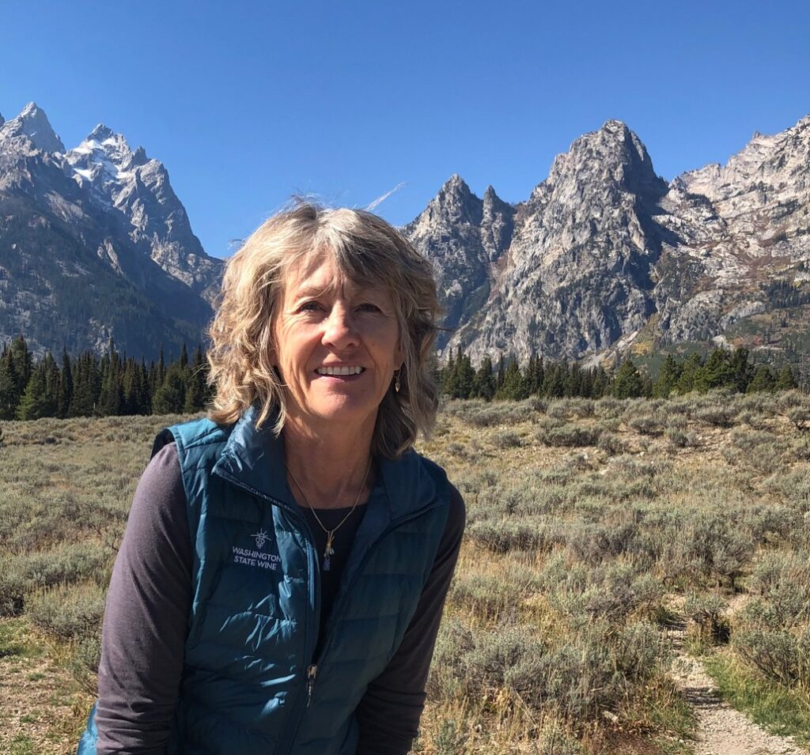
</a>
 IMG_4904-1024x955.jpeg
</td>
</tr>
<tr>
<td align="center" width="33%">

 AdobeStock_1820532380-1024x683.jpeg
</td>
<td align="center" width="33%">

 AdobeStock_76098398-1024x683.jpeg
</td>
<td align="center" width="33%">
<a href="images/elbatansieghead-1024x990.png">
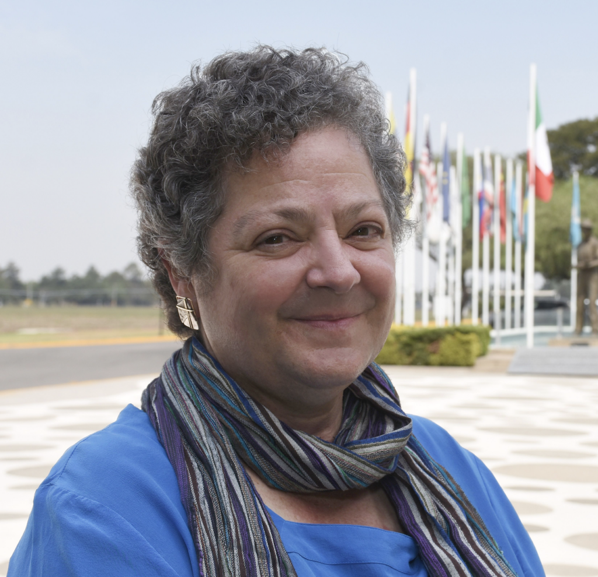
</a>
 elbatansieghead-1024x990.png
</td>
</tr>
</table>

## 📁 Files

| File | Description |
|------|-------------|
| `01-page-loaded.png` | page-loaded (1.7 MB) |
| `page.html` | Rendered HTML content |
| `metadata.json` | Machine-readable scan data |
| `errors.log` | JavaScript console errors |
| `warnings.log` | JavaScript console warnings |
| `info.log` | Navigation and timing details |
| `actions.log` | Interactions performed |
| `images/` | 24 page images (7.2 MB) |

---

*Generated by AccessibilityScanner (FreeTools) v1.0*
