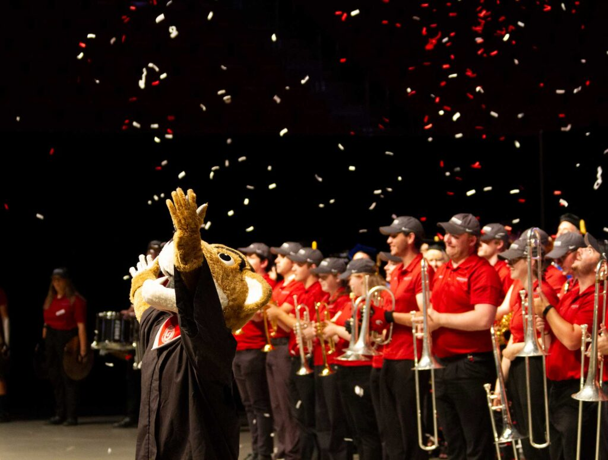
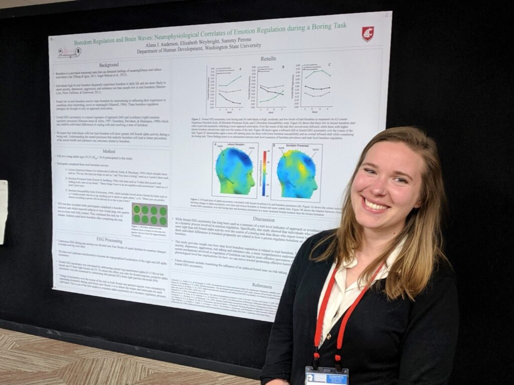
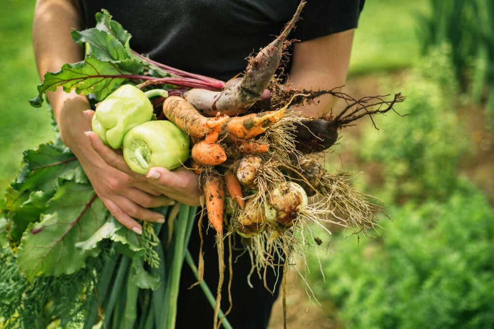

# Page Scan Report

| Field | Value |
|-------|-------|
| URL | https://cahnrs.wsu.edu/about/ |
| Title | About CAHNRS | College of Agricultural, Human, and Natural Resource Sciences | Washington State University |
| Status | ❌ 0 |
| HTML Size | 223.6 KB |
| Screenshots | 1 (1.6 MB) |
| Images | 3 (319.9 KB) |
| Images Missing Alt | 0 |
| JS Errors | 0 |
| JS Warnings | 0 |
| Auth | none |
| Captured | 2026-02-16T20:38:44.0388627Z |

## Actions

- Screenshot #1: page-loaded (1.6 MB)
- Downloaded 3 images to /images/

## Screenshots

### 1. page-loaded

## Page Images (3)

| # | Image | Alt Text | Size |
|---|-------|----------|------|
| 1 | [Butch-with-band-at-graduation-1024x775.jpg](images/Butch-with-band-at-graduation-1024x775.jpg) | Butch with band at graduation. | 94.4 KB |
| 2 | [2019-SPR-Anderson-1024x768.jpg](images/2019-SPR-Anderson-1024x768.jpg) | Female student standing in front of r... | 102.6 KB |
| 3 | [Person-holding-fresh-picked-vegetables-1024x684.jpg](images/Person-holding-fresh-picked-vegetables-1024x684.jpg) | Female student standing in front of r... | 122.9 KB |

### Gallery

## Files

- `01-page-loaded.png` — page-loaded (1.6 MB)
- `page.html` — rendered HTML content
- `metadata.json` — machine-readable scan data
- `errors.log` — JavaScript console errors
- `warnings.log` — JavaScript console warnings
- `info.log` — navigation and timing details
- `actions.log` — interactions performed on the page
- `images/` — 3 page images (319.9 KB)
