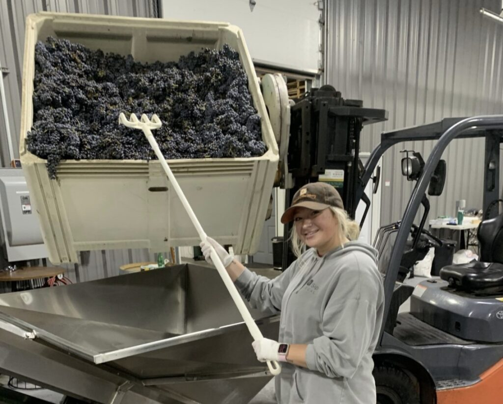
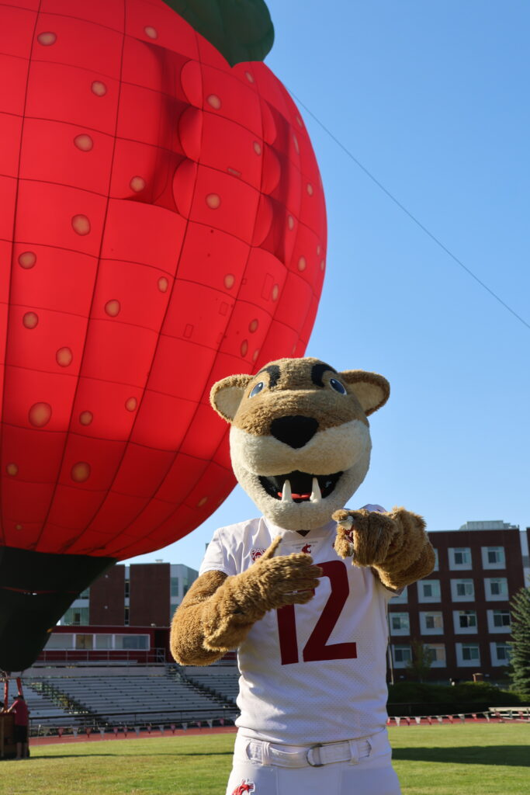
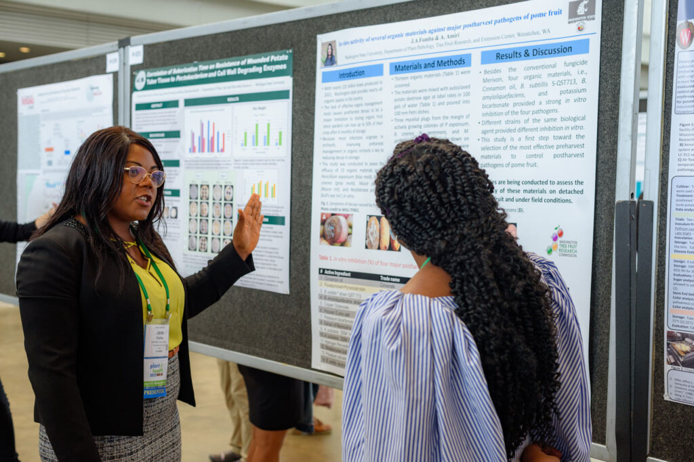
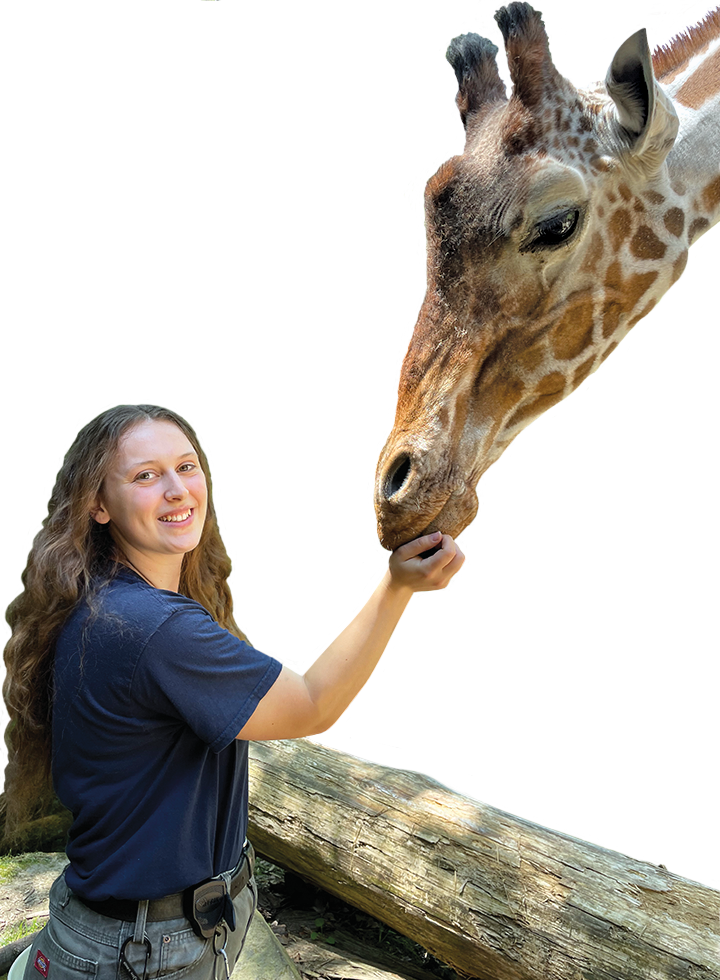
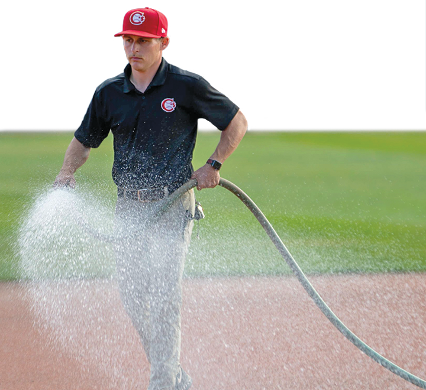
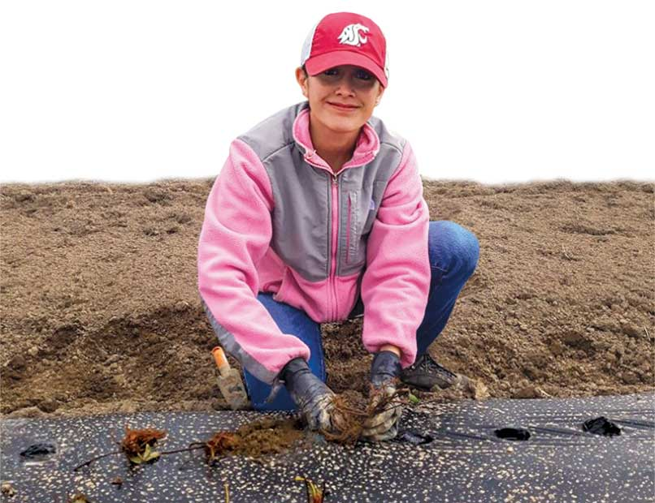
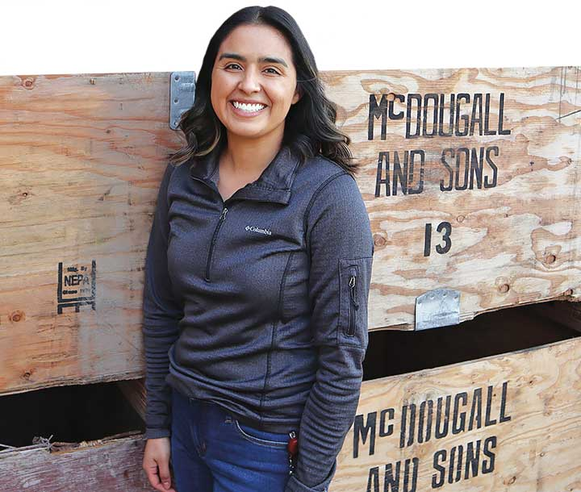
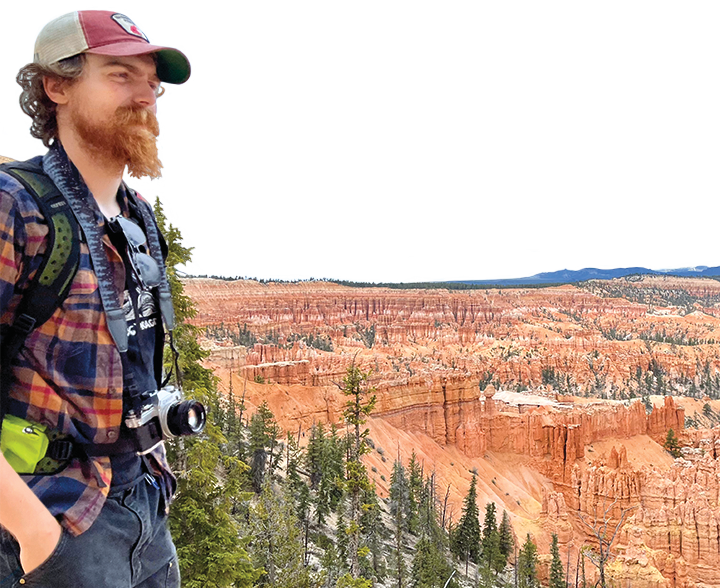
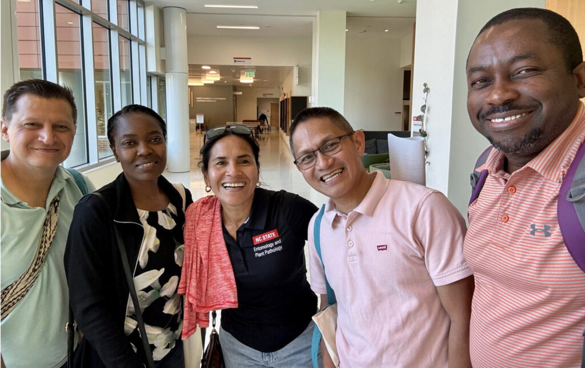

# 📄 Page Scan Report

> **URL:** https://cahnrs.wsu.edu/academics/  
> **Captured:** 2026-02-16 22:13:54 UTC  
> **Status:** ❌ 0  

---

## 📑 Contents

- [Summary](#-summary)
- [Screenshots](#-screenshots)
- [Page Images](#-page-images)
- [Actions](#-actions)
- [Files](#-files)

---

## 📋 Summary

| Field | Value |
|-------|-------|
| URL | https://cahnrs.wsu.edu/academics/ |
| Title | Academics | Washington State University |
| Status | ❌ 0 |
| HTML Size | 256.9 KB |
| Screenshots | 1 (2.5 MB) |
| Images | 11 (3.0 MB) |
| Images Missing Alt | ✅ 0 |
| JS Errors | ✅ 0 |
| JS Warnings | 1 |
| Auth | none |
| Captured | 2026-02-16T22:13:54.4227092Z |

## 🔧 Actions

<strong>2 action(s) performed</strong>

- Screenshot #1: page-loaded (2.5 MB)
- Downloaded 11 images to /images/

## 📸 Screenshots

<table>
<tr>
<td align="center" width="50%">

 <strong>1. page-loaded</strong>
 2.5 MB
</td>
<td></td>
</tr>
</table>

## 🖼️ Page Images (11)

<strong>📋 Image Index</strong> — 11 images, 3.0 MB

| # | Image | Alt Text | Size |
|--:|-------|----------|-----:|
| 1 | [NancyDeringer_4710-2-copy-1024x683.jpeg](images/NancyDeringer_4710-2-copy-1024x683.jpeg) | Headshot of Nancy Deringer. | 58.6 KB |
| 2 | [Elle-Jennings-with-grapes-featured-1024x824.jpg](images/Elle-Jennings-with-grapes-featured-1024x824.jpg) | A person in a warehouse holds a rake ... | 125.3 KB |
| 3 | [54799163289_6a04c12550_o-683x1024.jpg](images/54799163289_6a04c12550_o-683x1024.jpg) | Student in the field holding a salmon. | 132.5 KB |
| 4 | [cropped-APS-2022-61-1024x684.jpg](images/cropped-APS-2022-61-1024x684.jpg) | Female graduate student presenting re... | 160.7 KB |
| 5 | [Giraffe.png](images/Giraffe.png) | Female student with a Giraffe. | 847.2 KB |
| 6 | [Watering.png](images/Watering.png) | Man watering baseball field. | 666.4 KB |
| 7 | [Brenda.jpg](images/Brenda.jpg) | Student weeding in the dirt. | 73.5 KB |
| 8 | [Letty.jpg](images/Letty.jpg) | Student standing in front of wooden c... | 62.1 KB |
| 9 | [Ian-Nickels.png](images/Ian-Nickels.png) | Ian Nickels stands next to a cliff. | 725.2 KB |
| 10 | [Plant-Pathology-alums-group-photo-1024x645.jpg](images/Plant-Pathology-alums-group-photo-1024x645.jpg) | Plant Pathology alumni group photo | 157.5 KB |
| 11 | [JD-Baser-1.jpg](images/JD-Baser-1.jpg) | Formal portrait of J.D. Baser. | 64.8 KB |

<strong>🖼️ Gallery</strong>

<table>
<tr>
<td align="center" width="33%">

 NancyDeringer_4710-2-copy-1024x683.jpeg
</td>
<td align="center" width="33%">

 Elle-Jennings-with-grapes-featured-1024x824.jpg
</td>
<td align="center" width="33%">

 54799163289_6a04c12550_o-683x1024.jpg
</td>
</tr>
<tr>
<td align="center" width="33%">

 cropped-APS-2022-61-1024x684.jpg
</td>
<td align="center" width="33%">

 Giraffe.png
</td>
<td align="center" width="33%">

 Watering.png
</td>
</tr>
<tr>
<td align="center" width="33%">

 Brenda.jpg
</td>
<td align="center" width="33%">

 Letty.jpg
</td>
<td align="center" width="33%">

 Ian-Nickels.png
</td>
</tr>
<tr>
<td align="center" width="33%">

 Plant-Pathology-alums-group-photo-1024x645.jpg
</td>
<td align="center" width="33%">

 JD-Baser-1.jpg
</td>
<td></td>
</tr>
</table>

## 📁 Files

| File | Description |
|------|-------------|
| `01-page-loaded.png` | page-loaded (2.5 MB) |
| `page.html` | Rendered HTML content |
| `metadata.json` | Machine-readable scan data |
| `errors.log` | JavaScript console errors |
| `warnings.log` | JavaScript console warnings |
| `info.log` | Navigation and timing details |
| `actions.log` | Interactions performed |
| `images/` | 11 page images (3.0 MB) |

---

*Generated by AccessibilityScanner (FreeTools) v1.0*
