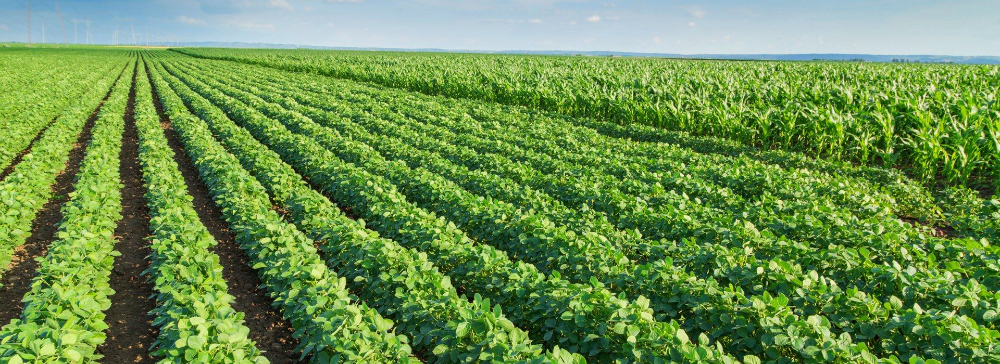
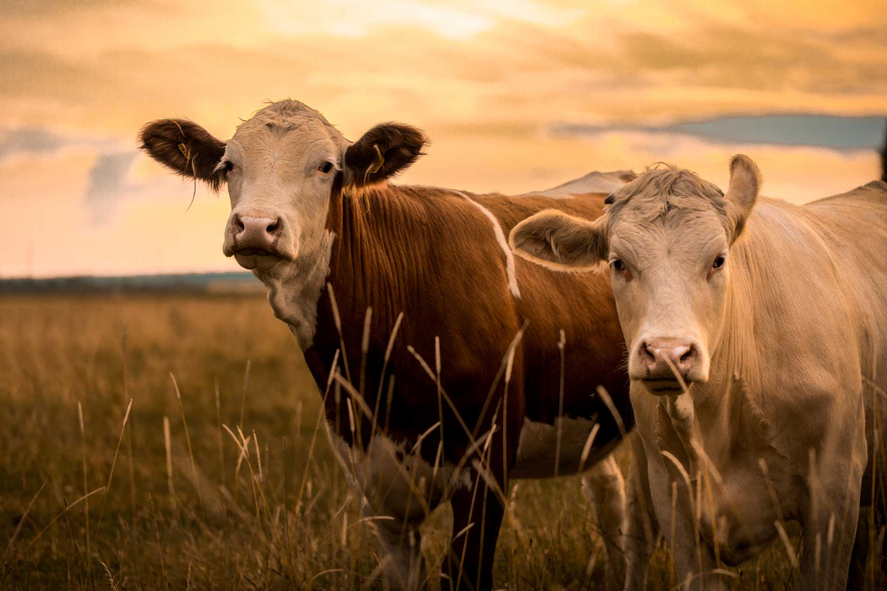
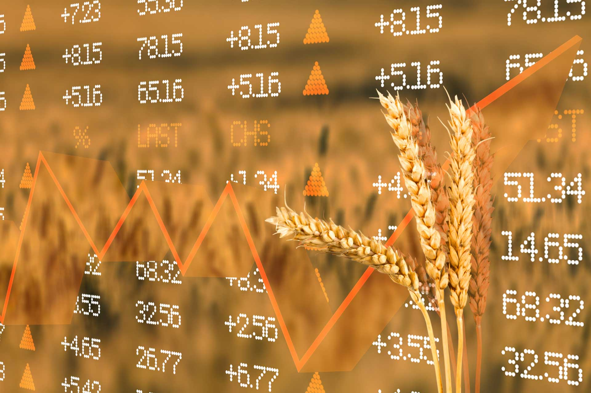
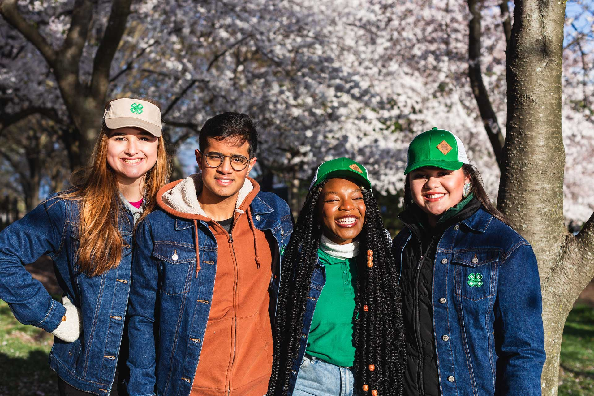
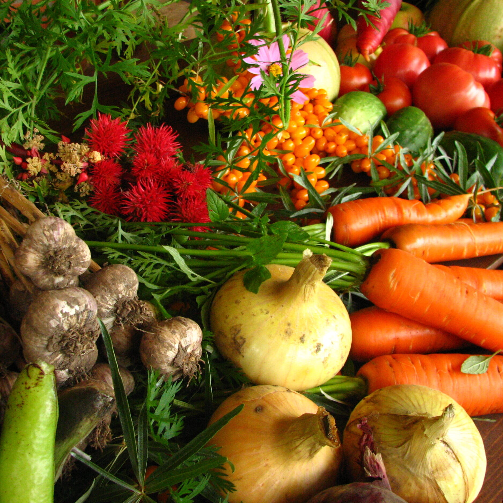
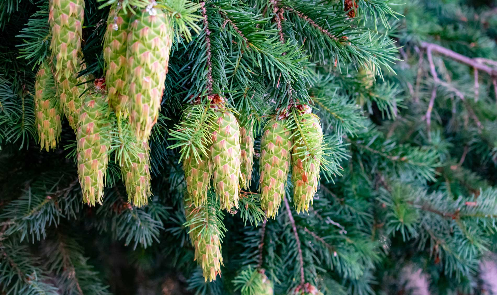
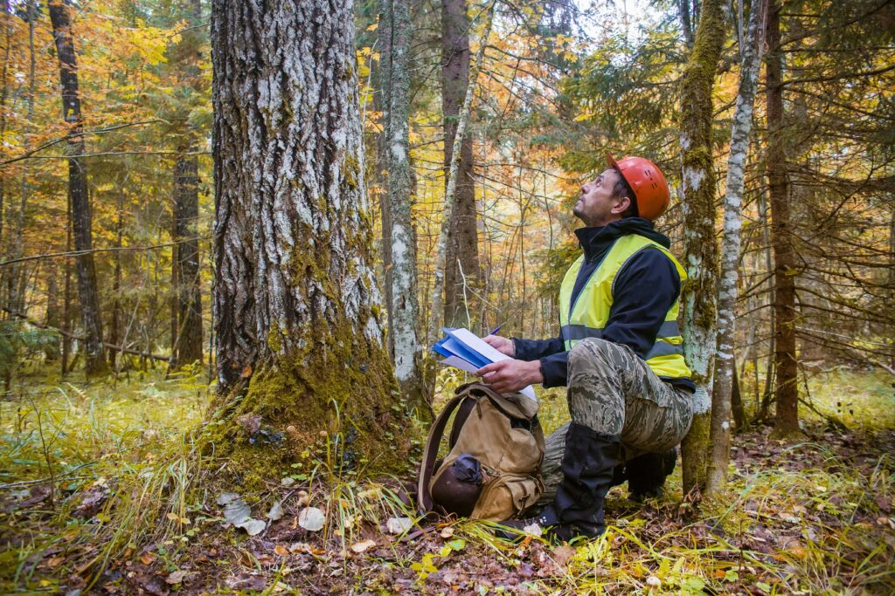

# 📄 Page Scan Report

> **URL:** https://cahnrs.wsu.edu/extension/  
> **Captured:** 2026-02-16 22:14:20 UTC  
> **Status:** ✅ 200  

---

## 📑 Contents

- [Summary](#-summary)
- [Screenshots](#-screenshots)
- [Page Images](#-page-images)
- [Actions](#-actions)
- [Files](#-files)

---

## 📋 Summary

| Field | Value |
|-------|-------|
| URL | https://cahnrs.wsu.edu/extension/ |
| Redirected To | https://extension.wsu.edu/ |
| Title | WSU Extension | Washington State University |
| Status | ✅ 200 |
| HTML Size | 244.1 KB |
| Screenshots | 1 (1.7 MB) |
| Images | 12 (4.1 MB) |
| Images Missing Alt | ✅ 0 |
| JS Errors | ✅ 0 |
| JS Warnings | 0 |
| Auth | none |
| Captured | 2026-02-16T22:14:20.8500393Z |

## 🔧 Actions

<strong>2 action(s) performed</strong>

- Screenshot #1: page-loaded (1.7 MB)
- Downloaded 12 images to /images/

## 📸 Screenshots

<table>
<tr>
<td align="center" width="50%">

 <strong>1. page-loaded</strong>
 1.7 MB
</td>
<td></td>
</tr>
</table>

## 🖼️ Page Images (12)

<strong>📋 Image Index</strong> — 12 images, 4.1 MB

| # | Image | Alt Text | Size |
|--:|-------|----------|-----:|
| 1 | [Screenshot-2026-02-09-at-1.49.37%E2%80%AFPM-1024x686.png](images/Screenshot-2026-02-09-at-1.49.37%E2%80%AFPM-1024x686.png) | Cover crop seed mixes | 1.2 MB |
| 2 | [researchers-flying-drone-over-orchard-1024x676.jpg](images/researchers-flying-drone-over-orchard-1024x676.jpg) | Drone users at orchard- WSU Photo | 165.0 KB |
| 3 | [potato-field.jpg](images/potato-field.jpg) | Potato field. | 402.6 KB |
| 4 | [Two-cows-in-a-field.jpg](images/Two-cows-in-a-field.jpg) | Two cows in a field at sunset. | 138.9 KB |
| 5 | [Agriculture-Economics.jpg](images/Agriculture-Economics.jpg) | Up close wheat with number overlay. | 188.8 KB |
| 6 | [Group-of-4h-teens-1.jpg](images/Group-of-4h-teens-1.jpg) | Group of 4-h teens. | 338.4 KB |
| 7 | [Ecologically_grown_vegetables-scaled-e1629405080192.jpg](images/Ecologically_grown_vegetables-scaled-e1629405080192.jpg) | Variety of colorful vegetables. | 688.1 KB |
| 8 | [Douglas-fir.jpg](images/Douglas-fir.jpg) | Douglas Fir tree. | 269.5 KB |
| 9 | [Man-and-woman-gardening.jpg](images/Man-and-woman-gardening.jpg) | Man and woman harvesting vegetables f... | 237.0 KB |
| 10 | [image-10.jpg](images/image-10.jpg) | Aerial view of new Vancouver, Washing... | 142.0 KB |
| 11 | [Featured-Image-Margaret-1024x609.jpg](images/Featured-Image-Margaret-1024x609.jpg) | Margaret Viebrock sitting at a desk d... | 152.9 KB |
| 12 | [AdobeStock_1820532380-1024x683.jpeg](images/AdobeStock_1820532380-1024x683.jpeg) | Forest professional- stock photo | 249.2 KB |

<strong>🖼️ Gallery</strong>

<table>
<tr>
<td align="center" width="33%">

 Screenshot-2026-02-09-at-1.49.37%E2%80%AFPM-1024x686.png
</td>
<td align="center" width="33%">

 researchers-flying-drone-over-orchard-1024x676.jpg
</td>
<td align="center" width="33%">

 potato-field.jpg
</td>
</tr>
<tr>
<td align="center" width="33%">

 Two-cows-in-a-field.jpg
</td>
<td align="center" width="33%">

 Agriculture-Economics.jpg
</td>
<td align="center" width="33%">

 Group-of-4h-teens-1.jpg
</td>
</tr>
<tr>
<td align="center" width="33%">

 Ecologically_grown_vegetables-scaled-e1629405080192.jpg
</td>
<td align="center" width="33%">

 Douglas-fir.jpg
</td>
<td align="center" width="33%">

 Man-and-woman-gardening.jpg
</td>
</tr>
<tr>
<td align="center" width="33%">

 image-10.jpg
</td>
<td align="center" width="33%">

 Featured-Image-Margaret-1024x609.jpg
</td>
<td align="center" width="33%">

 AdobeStock_1820532380-1024x683.jpeg
</td>
</tr>
</table>

## 📁 Files

| File | Description |
|------|-------------|
| `01-page-loaded.png` | page-loaded (1.7 MB) |
| `page.html` | Rendered HTML content |
| `metadata.json` | Machine-readable scan data |
| `errors.log` | JavaScript console errors |
| `warnings.log` | JavaScript console warnings |
| `info.log` | Navigation and timing details |
| `actions.log` | Interactions performed |
| `images/` | 12 page images (4.1 MB) |

---

*Generated by AccessibilityScanner (FreeTools) v1.0*
